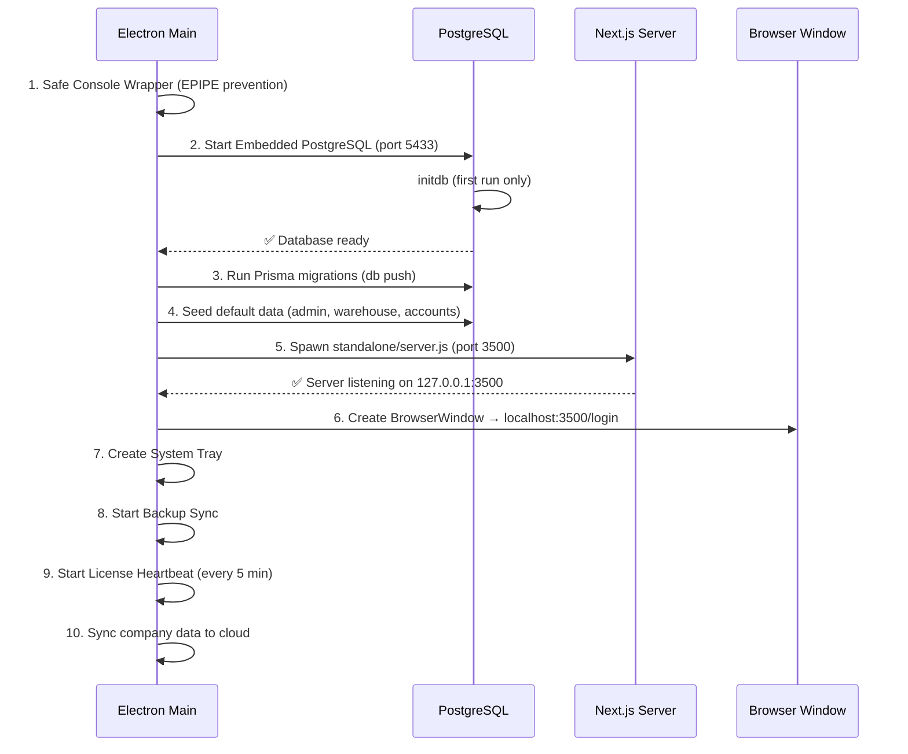

# 🏗️ دليل بناء تطبيق Nama Invest ERP Desktop

> الدليل الكامل والمرجعي لبناء وتثبيت وتشغيل النسخة المكتبية (Desktop) من نظام نما إنفست ERP.
> آخر تحديث: 2026-04-22

---

## 📋 المتطلبات الأساسية

| المتطلب | الإصدار | ملاحظات |
|---------|---------|---------|
| Node.js | 20+ | يُفضل LTS |
| npm | 10+ | يأتي مع Node.js |
| Git | أي إصدار | لإدارة الكود |
| Windows | 10/11 x64 | نظام التشغيل المستهدف |

---

## 🏛️ هيكل الملفات الجوهرية

```
namasoft9-3-main/
├── electron/
│   ├── main.js                  ← العملية الرئيسية (Electron Main Process)
│   ├── preload.js               ← جسر الاتصال بين Renderer و Main
│   ├── backup-sync.js           ← النسخ الاحتياطي التلقائي
│   ├── db/
│   │   └── local-postgres.js    ← مدير قاعدة البيانات المحلية المدمجة
│   └── assets/
│       ├── icon.png             ← أيقونة التطبيق (PNG)
│       └── icon.ico             ← أيقونة التطبيق (ICO لـ Windows)
├── scripts/
│   ├── clean-standalone.js      ← تنظيف مجلد standalone بعد البناء + دمج Prisma CLI
│   ├── protect-code.js          ← تشفير وتشويش كود Electron (Obfuscation)
│   └── after-pack.js            ← Hook بعد التعبئة: نسخ standalone + حماية الكود
├── electron-builder.yml         ← إعدادات electron-builder
├── package.json                 ← تعريف المشروع والسكربتات
├── prisma/
│   └── schema.prisma            ← مخطط قاعدة البيانات
└── dist/                        ← مخرجات البناء (تُنشأ تلقائياً)
    ├── win-unpacked/            ← التطبيق المفكوك (للاختبار)
    └── NamaInvest-Setup-X.X.X.exe  ← ملف التثبيت النهائي
```

---

## 🚀 أمر البناء الكامل (One-liner)

```powershell
npm run electron:build
```

هذا الأمر يُنفّذ 4 مراحل متتالية تلقائياً:

```
next build → clean-standalone.js → protect-code.js → electron-builder --win
```

---

## 📦 المراحل التفصيلية

### المرحلة 1: بناء Next.js (`next build`)

```powershell
npx next build
```

**ما يحدث:**
- يُولّد Prisma Client أولاً (`npx prisma generate`)
- يُترجم كل صفحات Next.js (223+ صفحة) إلى HTML/JS محسّن
- يُنشئ مجلد `.next/standalone/` يحتوي على سيرفر مستقل لا يحتاج npm
- يُنشئ مجلد `.next/static/` يحتوي على الأصول الثابتة (CSS, JS, Images)

**المخرجات:**
```
.next/standalone/server.js       ← السيرفر المستقل
.next/standalone/node_modules/   ← الاعتماديات المطلوبة فقط
.next/static/                    ← الأصول الثابتة
```

**⏱️ المدة:** ~60 ثانية

---

### المرحلة 2: تنظيف Standalone (`clean-standalone.js`)

```powershell
node scripts/clean-standalone.js
```

**ما يحدث:**
1. يحذف الملفات غير الضرورية من `.next/standalone/` (سكربتات، logs، ملفات مؤقتة)
2. يُبقي فقط `server.js` و `package.json` والملفات الأساسية
3. يُثبّت Prisma CLI في sandbox مؤقت ثم يدمجه في `standalone/node_modules/`

**لماذا هذا مهم:**
- Next.js يتتبع (traces) أحياناً ملفات لا علاقة لها بالسيرفر
- Prisma CLI ضروري لتشغيل `db push` عند أول تشغيل (offline migrations)

---

### المرحلة 3: حماية الكود (`protect-code.js`)

```powershell
node scripts/protect-code.js
```

**ما يحدث:**
- يأخذ ملفات `electron/` ويُنشئ نسخة مشوّشة في `electron-protected/`
- يستخدم `javascript-obfuscator` بإعدادات قوية:
  - Control Flow Flattening (تسطيح تدفق التحكم)
  - Dead Code Injection (حقن كود ميت)
  - String Array Encoding (تشفير النصوص)
  - Debug Protection (حماية من التتبع)

**المخرجات:**
```
electron-protected/
├── main.js          (~194 KB مشفر)
├── preload.js       (~37 KB مشفر)
├── backup-sync.js   (~77 KB مشفر)
└── db/
    └── local-postgres.js  (~158 KB مشفر)
```

---

### المرحلة 4: تعبئة Electron (`electron-builder --win`)

```powershell
npx electron-builder --win
```

**ما يحدث بالتسلسل:**
1. **Packaging**: يُجمّع Electron + كود التطبيق في `dist/win-unpacked/`
2. **ASAR**: يُغلّف الكود في ملف `app.asar` مشفر (الطبقة الثانية من الحماية)
3. **asarUnpack**: يستخرج الملفات التنفيذية التي لا تعمل من داخل ASAR:
   - `@embedded-postgres/windows-x64/native/bin/*.exe`
   - `@prisma/engines/*.exe`
   - `*.node` (Native modules)
4. **afterPack Hook** (`scripts/after-pack.js`):
   - ينسخ `.next/standalone/` → `resources/standalone/`
   - ينسخ `.next/static/` → `resources/standalone/.next/static/`
   - ينسخ `public/` → `resources/standalone/public/`
   - ينسخ Prisma CLI → `resources/standalone/node_modules/prisma/`
5. **NSIS Installer**: يبني ملف التثبيت `.exe`
6. **Code Signing**: يوقّع جميع الملفات التنفيذية

**المخرجات:**
```
dist/
├── win-unpacked/                         ← التطبيق الكامل (قابل للتشغيل مباشرة)
│   ├── Nama Invest ERP.exe              ← الملف التنفيذي
│   └── resources/
│       ├── app.asar                     ← الكود المشفر
│       ├── app.asar.unpacked/           ← الملفات المستخرجة
│       │   └── node_modules/
│       │       ├── @embedded-postgres/  ← PostgreSQL المدمج
│       │       └── @prisma/engines/     ← محركات Prisma
│       ├── standalone/                  ← سيرفر Next.js المستقل
│       └── prisma/                      ← مخطط قاعدة البيانات
└── NamaInvest-Setup-2.2.1.exe           ← ملف التثبيت النهائي
```

**⏱️ المدة:** ~7-10 دقائق

---

## 🔧 ما يحدث عند تشغيل التطبيق



---

## 🐛 المشاكل الشائعة وحلولها

### 1. خطأ EPIPE: broken pipe, write
**السبب:** Windows يغلق stdout في التطبيقات بدون نافذة طرفية  
**الحل:** Safe Console Wrapper في أول سطور `main.js`:
```javascript
['log', 'error', 'warn', 'info'].forEach((method) => {
  const original = console[method];
  console[method] = function (...args) {
    try { original.apply(console, args); } catch (err) { }
  };
});

process.on('uncaughtException', (err) => {
  if (err.code === 'EPIPE') return;
});
```

### 2. خطأ "لم يتمكن النظام من التشغيل"
**السبب:** `isPortAvailable` يفحص `0.0.0.0` بدلاً من `127.0.0.1`  
**الحل:** تحديد العنوان المحلي:
```javascript
server.listen(port, '127.0.0.1');  // ← NOT server.listen(port)
```

### 3. خطأ ENOENT لـ initdb.exe / postgres.exe
**السبب:** `embedded-postgres` يستخدم `import.meta.url` الذي يشير داخل `app.asar`  
**الحل:** في الوضع المجمّع، نتجاوز المكتبة ونشغّل الملفات مباشرة من `app.asar.unpacked`:
```javascript
const binDir = path.join(
  process.resourcesPath,
  'app.asar.unpacked', 'node_modules',
  '@embedded-postgres', 'windows-x64', 'native', 'bin'
);
```

### 4. فشل Prisma migrations
**السبب:** عدم وجود Prisma CLI في المجلد المستقل  
**الحل:** `clean-standalone.js` يُثبّت Prisma CLI في sandbox ثم يدمجه

---

## 📌 أوامر مرجعية سريعة

```powershell
# ═══════════════════════════════════════════════
# 🏗️ بناء كامل (من الصفر)
# ═══════════════════════════════════════════════
npm run electron:build

# ═══════════════════════════════════════════════
# ⚡ إعادة بناء سريعة (بدون next build)
# → استخدم عند تعديل كود Electron فقط
# ═══════════════════════════════════════════════
node scripts/protect-code.js; npx electron-builder --win

# ═══════════════════════════════════════════════
# 🧪 تشغيل النسخة المفكوكة (بدون تثبيت)
# ═══════════════════════════════════════════════
Start-Process "dist\win-unpacked\Nama Invest ERP.exe"

# ═══════════════════════════════════════════════
# 📦 تثبيت صامت + تشغيل
# ═══════════════════════════════════════════════
Start-Process "dist\NamaInvest-Setup-2.2.1.exe" -ArgumentList "/S" -Wait
Start-Process "$env:LOCALAPPDATA\Programs\Nama Invest ERP\Nama Invest ERP.exe"

# ═══════════════════════════════════════════════
# 🔪 إيقاف جميع عمليات التطبيق
# ═══════════════════════════════════════════════
taskkill /F /IM "Nama Invest ERP.exe"

# ═══════════════════════════════════════════════
# 🔧 تشغيل وضع التطوير (Electron + Next.js)
# ═══════════════════════════════════════════════
npm run electron:dev

# ═══════════════════════════════════════════════
# 🗃️ إعداد قاعدة البيانات يدوياً
# ═══════════════════════════════════════════════
npm run db:push
npm run db:seed
```

---

## 🔐 طبقات الحماية (3 Layers)

| الطبقة | الأداة | الوصف |
|--------|--------|-------|
| **Layer 1** | `javascript-obfuscator` | تشويش كود Electron (Control Flow + String Encryption) |
| **Layer 2** | ASAR Archive | تغليف جميع الملفات في أرشيف مشفر واحد |
| **Layer 3** | ASAR Integrity | تحقق من سلامة الأرشيف عند التشغيل (anti-tampering) |

---

## 🌐 البنية الداخلية للتطبيق المثبّت

```
C:\Users\{USER}\AppData\Local\Programs\Nama Invest ERP\
├── Nama Invest ERP.exe                          ← Electron executable
├── resources/
│   ├── app.asar                                 ← كود Electron المشفر
│   ├── app.asar.unpacked/
│   │   └── node_modules/
│   │       ├── @embedded-postgres/
│   │       │   └── windows-x64/native/bin/
│   │       │       ├── initdb.exe               ← لتهيئة قاعدة البيانات
│   │       │       ├── postgres.exe             ← سيرفر PostgreSQL
│   │       │       └── pg_ctl.exe
│   │       └── @prisma/engines/
│   │           ├── schema-engine-windows.exe    ← محرك Prisma
│   │           └── query_engine-windows.dll.node
│   ├── standalone/                              ← Next.js Server
│   │   ├── server.js
│   │   ├── .next/static/
│   │   ├── public/
│   │   └── node_modules/
│   │       └── prisma/                          ← Prisma CLI (offline)
│   └── prisma/
│       └── schema.prisma

C:\Users\{USER}\AppData\Roaming\namaweb\
├── pgdata/                                      ← بيانات PostgreSQL
├── nama-config.json                             ← إعدادات الترخيص (مشفرة)
└── backups/                                     ← النسخ الاحتياطية
```

---

## ⚙️ إعدادات electron-builder.yml الأساسية

```yaml
appId: com.namainvest.erp
productName: "Nama Invest ERP"

asar: true
asarUnpack:
  - "**/*.node"
  - "**/sharp/**"
  - "**/embedded-postgres/**"
  - "**/@embedded-postgres/**"

npmRebuild: false

files:
  - "electron/**/*"
  - ".next/static/**/*"
  - "public/**/*"
  - "prisma/**/*"
  - "package.json"

# standalone/ يُنسخ يدوياً عبر after-pack.js
# لتجنب التعبئة المزدوجة التي تستغرق 30+ دقيقة

afterPack: scripts/after-pack.js
```

---

## 📊 المنافذ المستخدمة

| المنفذ | الخدمة | ملاحظات |
|--------|--------|---------|
| **3500** | Next.js Server | سيرفر الويب الداخلي |
| **5433** | PostgreSQL | قاعدة البيانات المدمجة (ليس 5432 لتجنب التعارض) |

---

## 🔑 بيانات قاعدة البيانات الافتراضية

```
Database: nama_local
User:     nama
Password: NamaLocal2026!
Host:     localhost
Port:     5433
```

**المستخدم الافتراضي للنظام:**
```
Username: admin
Password: admin
```

---

> **💡 نصيحة:** عند تعديل كود `electron/` فقط (بدون تغيير صفحات Next.js)، استخدم البناء السريع:
> ```powershell
> node scripts/protect-code.js; npx electron-builder --win
> ```
> هذا يوفّر ~60 ثانية من مرحلة `next build`.
