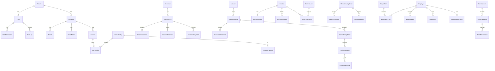
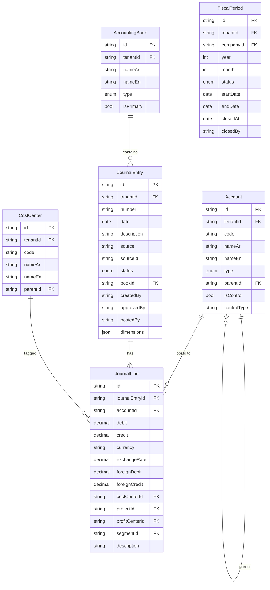
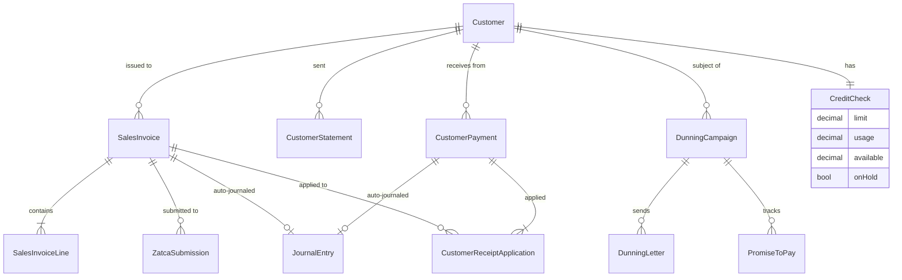
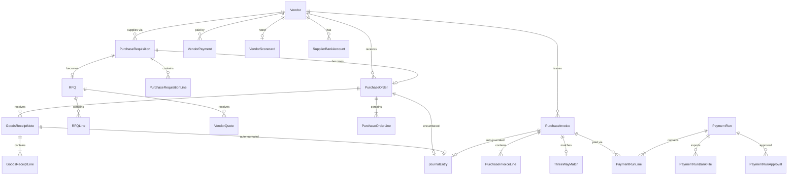
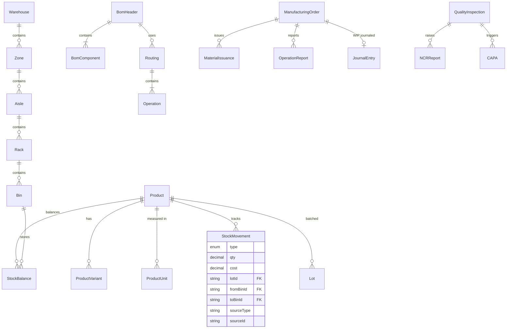
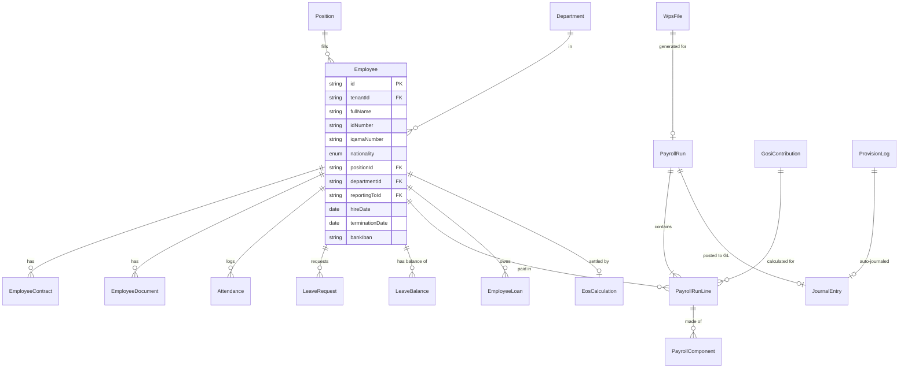
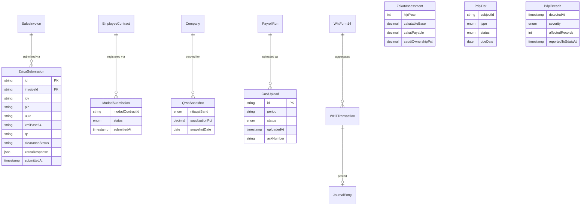
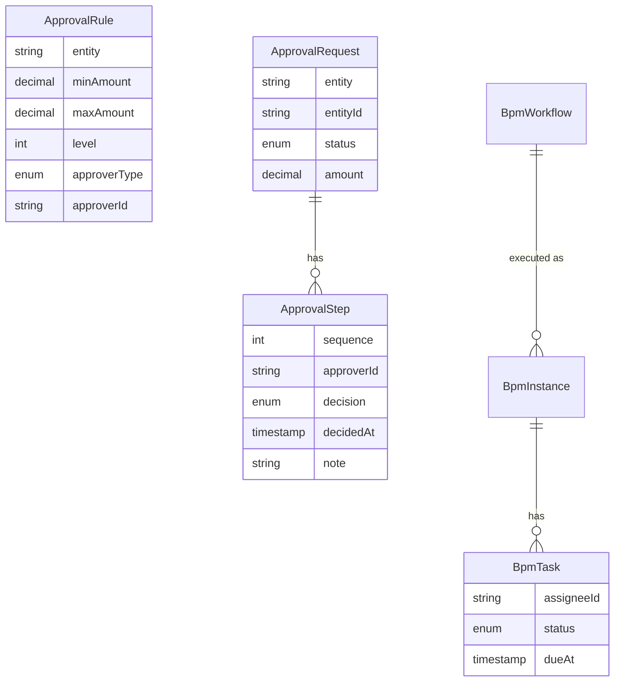

# 05 — Database ERD Guide
**Models:** 489 Prisma models across 18 domains
**Source of Truth:** [`prisma/schema.prisma`](../prisma/schema.prisma)

---

## 1. Entity Distribution by Domain

| Domain | ~Models |
|--------|---------|
| Accounting & GL | 45 |
| AR / AP / Payments | 38 |
| Treasury / Banks | 22 |
| Inventory / Stock | 35 |
| Manufacturing | 30 |
| Procurement | 20 |
| Sales / O2C | 28 |
| CRM | 18 |
| POS / Retail | 14 |
| HR | 25 |
| Payroll | 18 |
| Saudi Compliance (ZATCA, Mudad, Qiwa, GOSI, PDPL, Zakat, WHT) | 30 |
| DMS / Files | 8 |
| Workflow / Approval / BPM | 12 |
| Audit / Logs | 10 |
| Settings / Master Data | 25 |
| AI / Vector / Prompts | 12 |
| Multi-tenant / Master | 8 |
| **Total** | **~489** |

---

## 2. Core Entity Relationships (High-Level ERD)



---

## 3. Domain-Specific ERD

### 3.1 Accounting Core



### 3.2 AR (Accounts Receivable)



### 3.3 AP (Accounts Payable)



### 3.4 Inventory + Manufacturing



### 3.5 HR + Payroll



### 3.6 ZATCA + Saudi Gov



### 3.7 Workflow + Approval



---

## 4. Cross-Cutting Tables (used by every domain)

| Table | Purpose |
|-------|---------|
| `AuditLog` | Field-level + action audit |
| `Notification` | In-app + email + sms outbound |
| `Attachment` (DmsDocument) | File attachments |
| `CustomFieldDefinition` | Per-tenant custom fields |
| `CustomFieldValue` | Values per record |
| `ApprovalRequest` | Approval workflow instances |
| `Comment` (chatter) | Discussions per record |
| `Tag` | Free tagging |
| `Activity` | CRM activities (calls, emails, meetings) |
| `Webhook` | Outbound webhook config |
| `WebhookDelivery` | Delivery log |

---

## 5. Indexing Strategy

### 5.1 Mandatory Indexes
- `tenantId` on every table (composite with primary lookup)
- `(tenantId, createdAt DESC)` for list pagination
- `(tenantId, status)` for filter
- Foreign keys all indexed automatically
- `(tenantId, code)` unique on master data (Account, Product, Customer)
- `(tenantId, year, month)` on FiscalPeriod
- `(tenantId, accountId, date)` on JournalLine for TB

### 5.2 Performance Indexes
- `JournalLine(accountId, postedAt)` for GL inquiry
- `SalesInvoice(customerId, dueDate)` for aging
- `StockMovement(productId, postedAt)` for valuation
- `Attendance(employeeId, date)` for monthly summary
- `AuditLog(tenantId, createdAt DESC)` for log viewer

### 5.3 Full-Text Search Indexes
- `tsvector` on Customer.fullName, Vendor.fullName, Product.name (Arabic + English)
- Use Postgres `simple` config (no language stemmer for Arabic), or pg_trgm for similarity

### 5.4 Partial Indexes
- `WHERE deletedAt IS NULL` on soft-deleted tables
- `WHERE status = 'ACTIVE'` on Customer / Vendor / Employee
- `WHERE status = 'POSTED'` on JournalEntry for TB queries

---

## 6. Decimal Precision Standards

| Field Type | Precision | Scale | Example |
|------------|-----------|-------|---------|
| Money (SAR) | 18 | 4 | 1234567890.1234 |
| Foreign currency | 18 | 6 | for crypto-type |
| Quantity | 18 | 6 | per UoM |
| Percentage | 6 | 4 | 0.1500 = 15% |
| Exchange rate | 12 | 8 | 3.75000000 |

**Never use Float for money.** Linter rule enforced.

---

## 7. Soft Delete Pattern

```prisma
model Customer {
  id        String   @id @default(cuid())
  tenantId  String
  fullName  String
  // ...
  createdAt DateTime @default(now())
  updatedAt DateTime @updatedAt
  deletedAt DateTime?
  deletedBy String?
  
  @@index([tenantId, deletedAt])
}
```

Wrapper in `prisma-soft-delete.ts`:
- `findMany` auto-filters `deletedAt: null`
- `delete` sets `deletedAt + deletedBy` instead of actual delete
- `findManyWithDeleted` for admins

---

## 8. State Machine on Documents

Standard states (varies per doc):
```
DRAFT → PENDING_APPROVAL → APPROVED → POSTED → ?CANCELLED|?REVERSED
                       ↓
                    REJECTED
```

For invoice: + `SENT, PARTIALLY_PAID, PAID, OVERDUE, ZATCA_SUBMITTED, ZATCA_CLEARED`

State transitions enforced by `document-state-machine.ts`. Direct field updates blocked.

---

## 9. Audit Trail Pattern

For every mutation:
1. Capture before & after JSON of changed fields
2. Insert AuditLog: `{ tenantId, userId, action, tableName, recordId, beforeJson, afterJson, ipAddress, userAgent, createdAt }`
3. For financial entities: insert FieldAudit per-field

**Never delete or modify AuditLog rows.**

---

## 10. Multi-Currency Storage

Pattern:
```prisma
model SalesInvoice {
  // local
  totalAmount      Decimal @db.Decimal(18,4)
  currency         String  @default("SAR")
  // foreign (if currency != SAR)
  foreignTotal     Decimal? @db.Decimal(18,4)
  exchangeRate     Decimal? @db.Decimal(12,8)
  exchangeRateType String?  // SPOT|AVG|CLOSING
  rateDate         DateTime?
}
```

JournalLine has both `debit/credit` (in book currency = usually SAR) and `foreignDebit/foreignCredit` (in transaction currency).

---

## 11. Tenant Routing (Master DB Schema)

```prisma
// In Master DB only
model Tenant {
  id               String   @id @default(cuid())
  slug             String   @unique
  name             String
  status           TenantStatus // ACTIVE, SUSPENDED, DELETED
  plan             String
  connectionString String   // encrypted
  createdAt        DateTime @default(now())
  ownerEmail       String
  countryCode      String   @default("SA")
  fiscalYearStart  Int      // 1-12
  defaultCurrency  String   @default("SAR")
  defaultLanguage  String   @default("ar")
  zatcaConfigured  Boolean  @default(false)
}

model TenantUsage {
  id        String   @id @default(cuid())
  tenantId  String
  date      DateTime
  apiCalls  Int
  storageMB Int
  aiTokens  Int
  // ...
}
```

---

## 12. Key Constraints

- `@@unique([tenantId, code])` on master data
- `@@unique([tenantId, year, month])` on FiscalPeriod
- `@@unique([invoiceId, lineNumber])` on lines
- `CHECK (debit >= 0 AND credit >= 0)` on JournalLine
- `CHECK ((debit > 0 AND credit = 0) OR (debit = 0 AND credit > 0))` on JournalLine
- `CHECK (totalAmount >= 0)` on invoices
- `CHECK (qty > 0)` on most movements

Implement via Prisma `@db.Check()` or migration SQL.

---

## 13. ERD Visualization

To generate visual ERD:
```bash
npx prisma generate
npx @softwaretechnik/dbml-renderer prisma/schema.dbml
```

Or use [dbdiagram.io](https://dbdiagram.io) by exporting via `prisma-dbml-generator`.

For documentation site: integrate with `prisma-erd-generator`:
```prisma
generator erd {
  provider = "prisma-erd-generator"
  output   = "../docs/erd.svg"
}
```

---

## 14. Migration Best Practices

1. One change per migration (atomic)
2. Test on staging tenant first
3. Use `prisma migrate diff` to preview
4. For renames: copy → backfill → drop in 3 separate migrations
5. For NOT NULL on existing column: add nullable → backfill → set NOT NULL in 3 steps
6. Index creation: use `CREATE INDEX CONCURRENTLY` to avoid table lock
7. Per-tenant: orchestration script applies migration to all tenant DBs sequentially

---

## 15. Per-Module ERDs

For deep dives, see `modules/<module>/03-erd.md`:
- accounting-coa-socpa/03-erd.md
- accounting-fs-generator/03-erd.md
- accounting-payroll-gl/03-erd.md
- compliance-mudad/03-erd.md
- ... (built in batch 2)
