# دليل الفلوهات (Business Flows) المطلوبة للنظام
# Business Flows & Workflow Diagrams Guide

> **لماذا الفلوهات ضرورية؟**
> البرومنت يقول "ماذا" تبني، الفلو يقول "كيف يعمل". بدون فلو واضح:
> - المطورون يبنون كود غير متناسق
> - المحاسب لا يعرف متى يدخل البيانات
> - العميل لا يعرف الخطوة التالية
> - المراجع لا يستطيع التدقيق

---

## 📋 الفلوهات الـ 18 الأساسية التي تحتاجها

### مجموعة A: العمليات التجارية الرئيسية (Business Processes)
1. **Quote-to-Cash** (دورة المبيعات الكاملة)
2. **Procure-to-Pay** (دورة المشتريات الكاملة)
3. **Hire-to-Retire** (دورة الموظف من التعيين للترك)
4. **Record-to-Report** (دورة المحاسبة من القيد للتقرير)
5. **Plan-to-Produce** (دورة الإنتاج)
6. **Acquire-to-Retire (Assets)** (دورة الأصل من الشراء للتخريد)
7. **Order-to-Cash POS** (دورة بيع نقاط البيع)

### مجموعة B: فلوهات الموافقات (Approval Workflows)
8. **Journal Entry Approval Flow**
9. **Purchase Order Approval Flow**
10. **Vendor Onboarding Approval Flow**
11. **Leave Request Approval Flow**

### مجموعة C: فلوهات الحالات (State Machines)
12. **Invoice Lifecycle States**
13. **Manufacturing Order States**
14. **Check Lifecycle**
15. **Fixed Asset Lifecycle**

### مجموعة D: فلوهات الإقفال والامتثال
16. **Period Close Flow**
17. **ZATCA E-Invoice Submission Flow**
18. **WPS Salary Submission Flow**

---

## 🎨 الفلو رقم 1: Quote-to-Cash (دورة المبيعات)

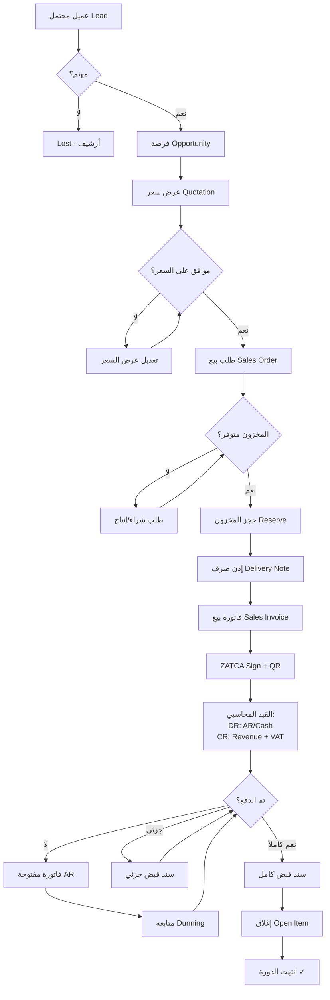

---

## 🎨 الفلو رقم 2: Procure-to-Pay (دورة المشتريات)

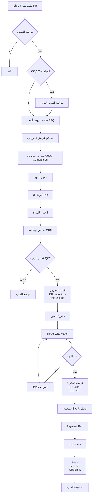

---

## 🎨 الفلو رقم 3: Hire-to-Retire (دورة الموظف)

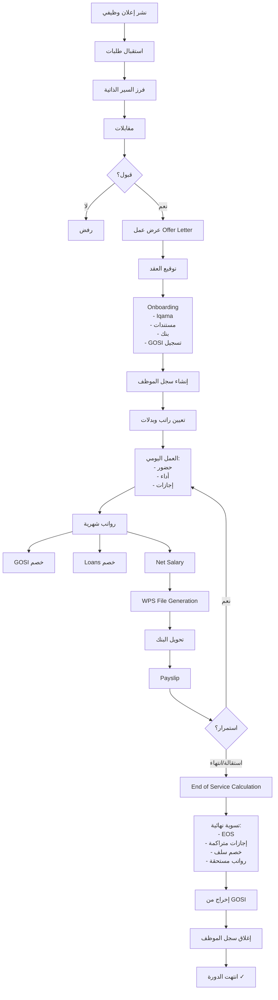

---

## 🎨 الفلو رقم 4: Record-to-Report (المحاسبة)

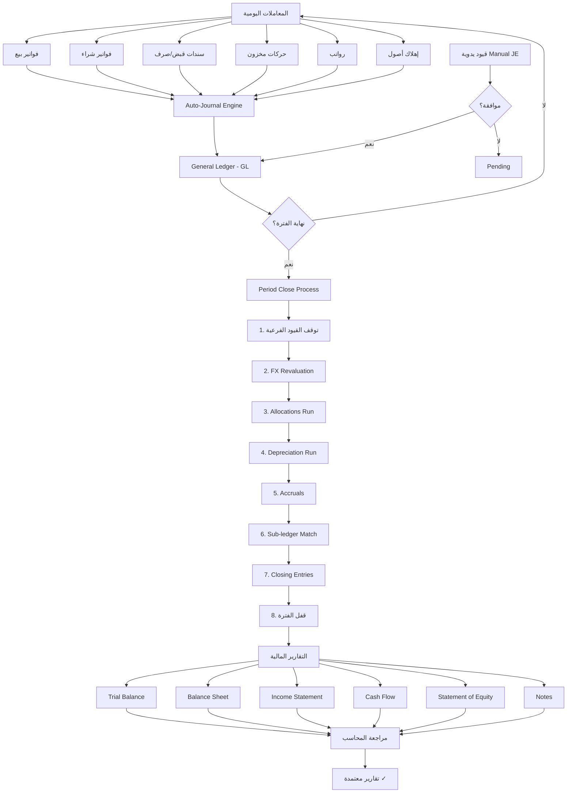

---

## 🎨 الفلو رقم 5: Plan-to-Produce (الإنتاج)

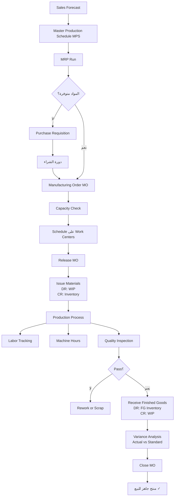

---

## 🎨 الفلو رقم 6: Acquire-to-Retire (الأصول الثابتة)

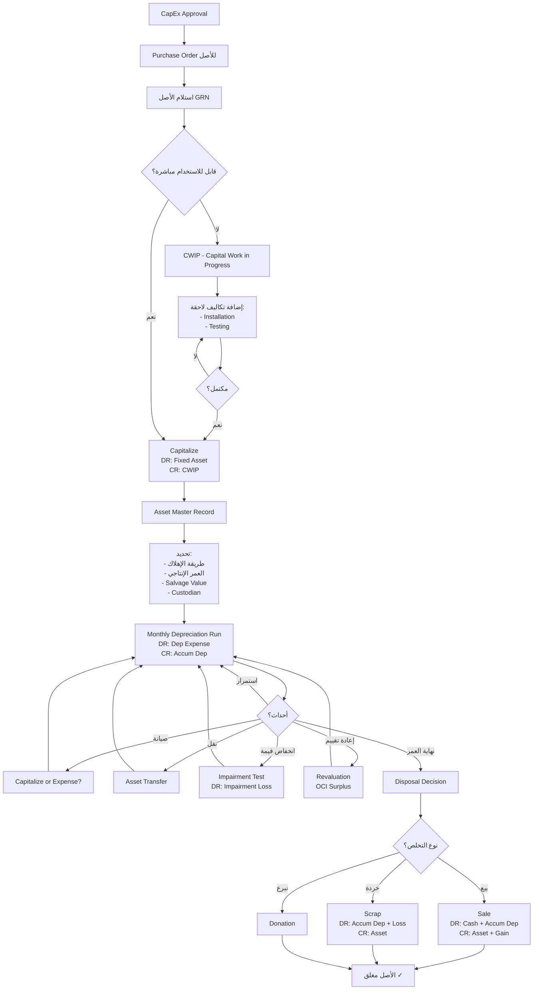

---

## 🎨 الفلو رقم 7: POS (نقاط البيع)

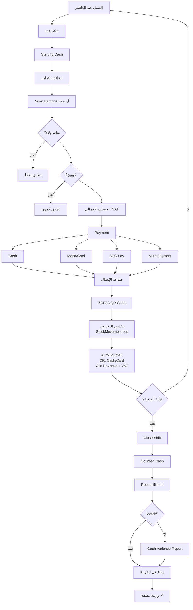

---

## 🎨 الفلو رقم 8: Journal Entry Approval

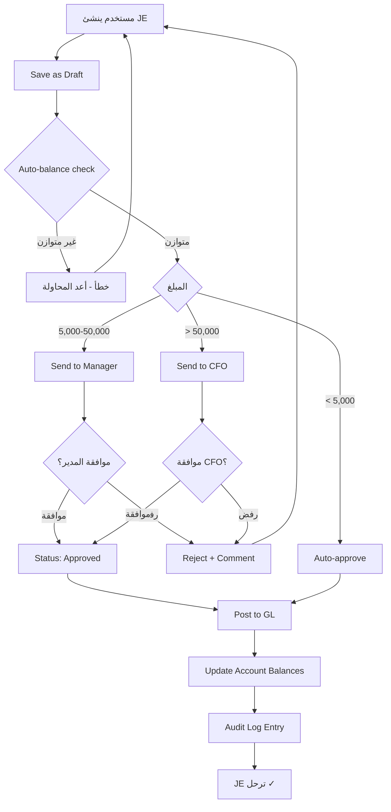

---

## 🎨 الفلو رقم 9: Period Close

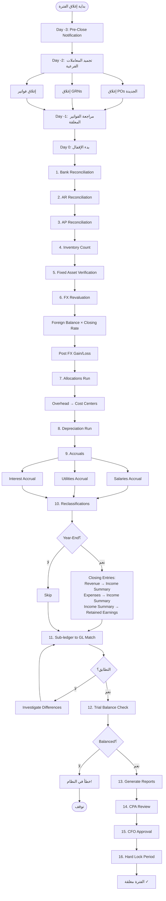

---

## 🎨 الفلو رقم 10: ZATCA E-Invoice

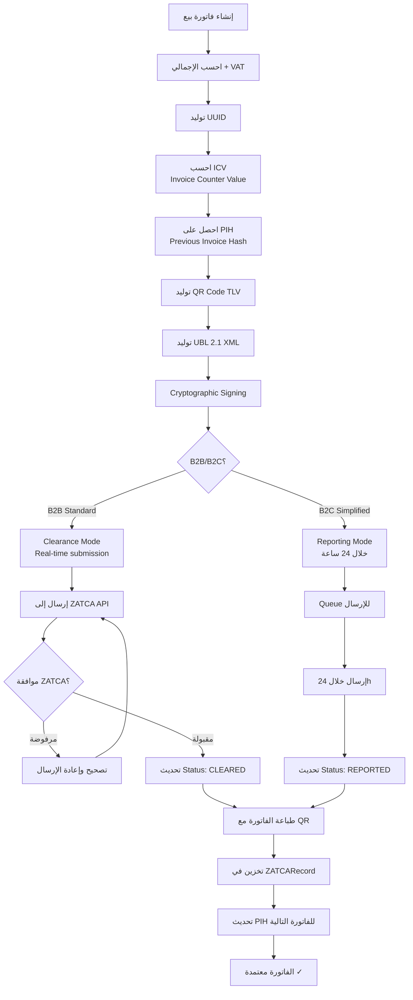

---

## 🎨 الفلو رقم 11: WPS Salary Submission

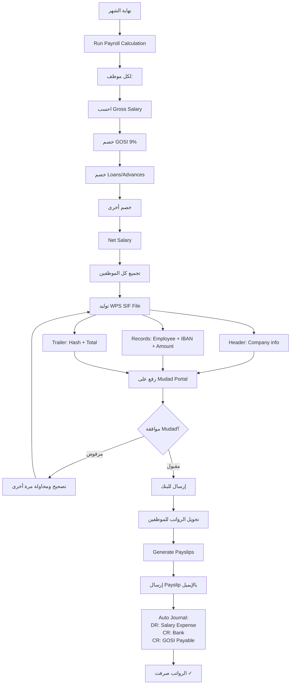

---

## 🎨 الفلو رقم 12: Invoice State Machine

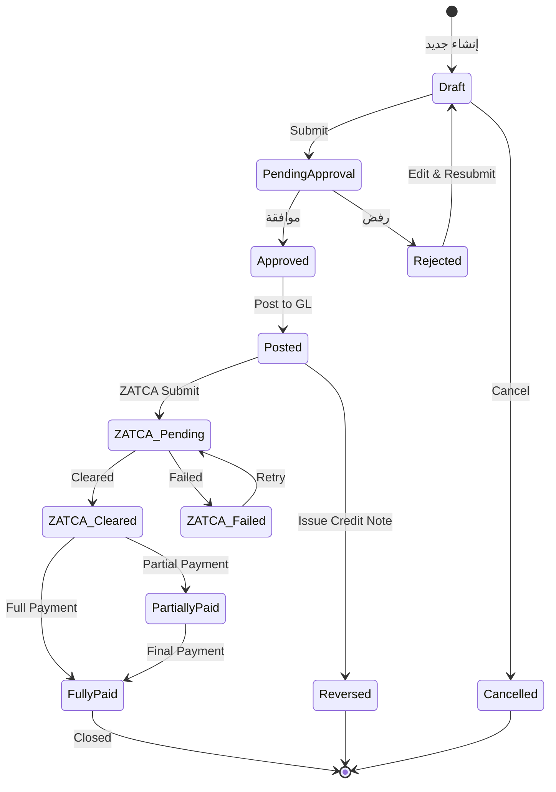

---

## 🎨 الفلو رقم 13: Manufacturing Order States

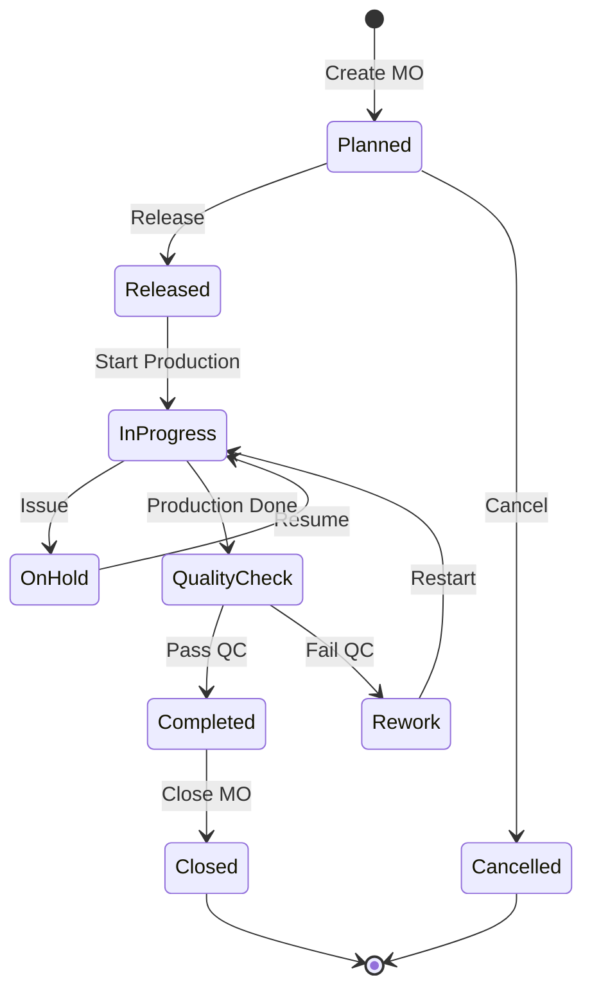

---

## 🎨 الفلو رقم 14: Bank Reconciliation

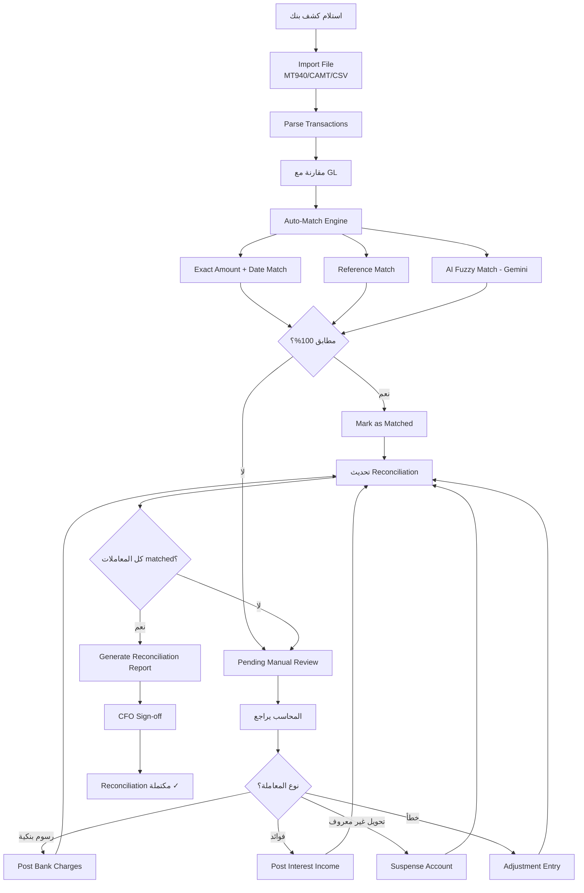

---

## 🎨 الفلو رقم 15: Customer Onboarding

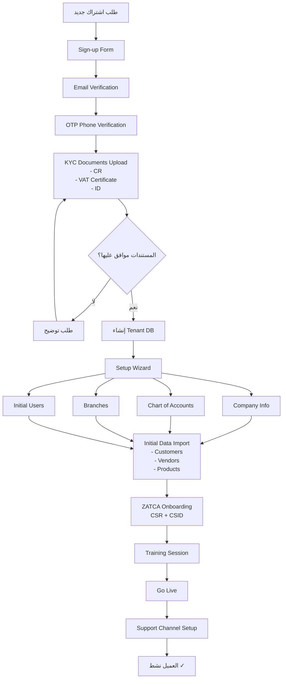

---

## 🎨 الفلو رقم 16: Approval Routing Engine

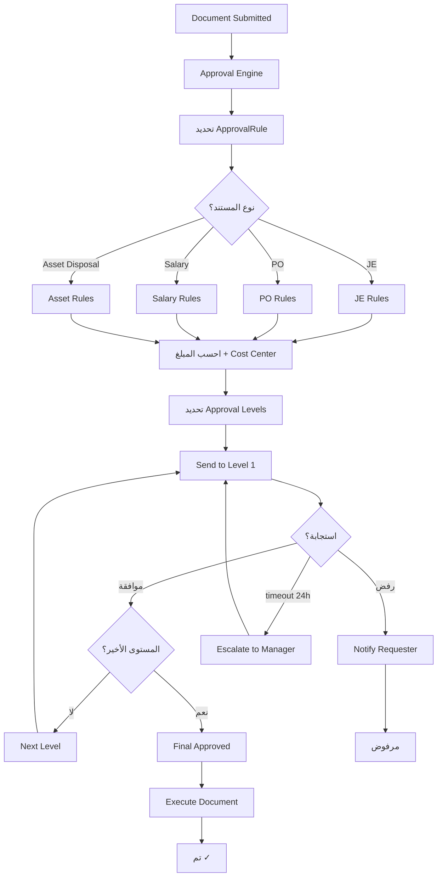

---

## 🎨 الفلو رقم 17: Three-Way Matching

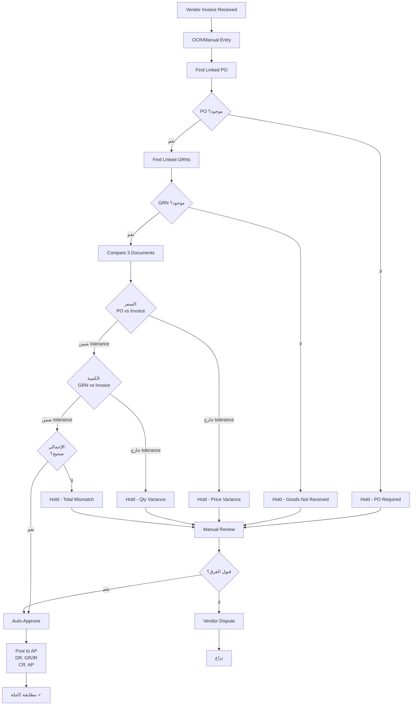

---

## 🎨 الفلو رقم 18: Architecture Flow (نظرة عامة)

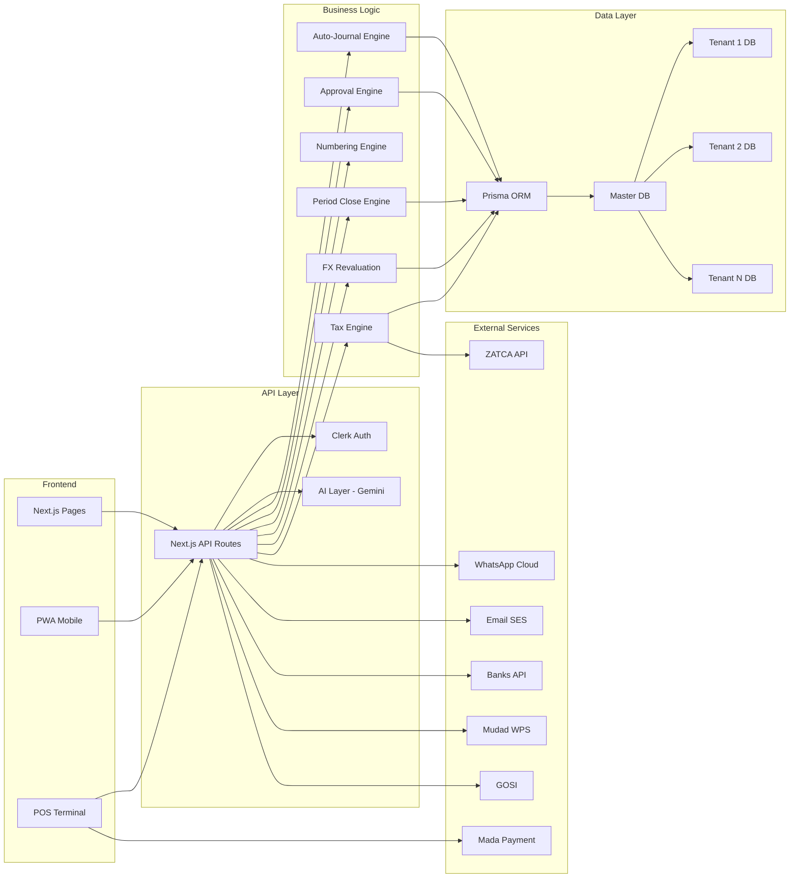

---

## 🛠️ الأدوات لرسم الفلوهات

### 1. Mermaid (مجاني، الأبسط)
- يعمل في GitHub, Notion, ملفات MD
- موقع: mermaid.live
- لا يحتاج تثبيت

### 2. Draw.io / Diagrams.net (مجاني)
- موقع: app.diagrams.net
- للرسم اليدوي والتعديلات الدقيقة
- يصدّر PNG, PDF, SVG
- **الأفضل لـ ERD ومخططات معمارية معقدة**

### 3. Lucidchart (مدفوع)
- احترافي
- تعاون فريق
- BPMN templates جاهزة

### 4. Whimsical (مدفوع، 10$/شهر)
- جميل وسريع
- للرسم التخطيطي السريع

### 5. Figma (مجاني للمستخدم الواحد)
- للـ user flows والـ mockups معاً

---

## 📐 معايير الرسم التي يجب اتباعها

### BPMN 2.0 Notation (المعيار الرسمي)

| الرمز | المعنى |
|-------|--------|
| ⬭ Circle | Start / End event |
| 🟦 Rectangle | Task / Activity |
| 🔷 Diamond | Decision / Gateway |
| ➡️ Arrow | Flow direction |
| 📄 Document | يدل على وثيقة منتجة |
| 👤 Person/Pool | الفاعل (المستخدم/النظام) |
| 🔁 Loop | تكرار |

### Best Practices
1. **اتجاه واحد:** يبدأ من الأعلى/اليسار، ينتهي بالأسفل/اليمين
2. **لا تتعدى 15 خطوة في فلو واحد** — قسم لفلوهات أصغر
3. **الفروع (decisions) يجب أن تكون واضحة** بسؤال واحد
4. **اللون:** أخضر = مسار سعيد، أحمر = خطأ، أصفر = استثناء
5. **swim lanes:** قسم بأدوار (محاسب، مدير، نظام)

---

## 📦 ماذا تفعل الآن؟

### الترتيب الأمثل لاستخدام كل الوثائق:

```
1. WHAT_YOU_STILL_NEED.pdf
   → فهم ما تحتاجه إجمالاً (فريق، ميزانية، أدوات)

2. BUSINESS_FLOWS_GUIDE.pdf (هذا الملف)
   → ارسم/راجع الفلوهات قبل البرمجة
   → اعرضها على CPA للتحقق من المنطق المحاسبي
   → اعرضها على 3-5 عملاء حاليين للتأكد أن الفلو يطابق عملهم

3. GLOBAL_ERP_GAP_ANALYSIS.pdf
   → بعد تأكيد الفلوهات، استخدم البرومنت لبناء الكود

4. التطبيق
   - كل ميزة جديدة = فلو + برومنت + كود + اختبار
```

### ❌ الخطأ الشائع
أن تبدأ بكتابة الكود **قبل** رسم الفلو. النتيجة:
- إعادة كتابة 70% من الكود لاحقاً
- العميل يقول "ليس هذا ما طلبت"
- المحاسب يقول "هذا منطق خاطئ"

### ✅ التسلسل الصحيح
```
عميل/متطلب → فلو ورسم → موافقة → برومنت → كود → اختبار → نشر
```

---

## 🎯 أولوية الفلوهات حسب الأهمية

### يجب رسمها قبل البرمجة (Critical):
1. ✅ Quote-to-Cash
2. ✅ Procure-to-Pay
3. ✅ Period Close
4. ✅ ZATCA E-Invoice
5. ✅ Approval Routing

### يجب رسمها قبل المرحلة 1:
6. ✅ Record-to-Report
7. ✅ Three-Way Matching
8. ✅ Bank Reconciliation
9. ✅ JE Approval
10. ✅ Invoice State Machine

### يجب رسمها قبل المرحلة 4-7:
11. ✅ Acquire-to-Retire (Assets)
12. ✅ Plan-to-Produce
13. ✅ Hire-to-Retire
14. ✅ WPS Salary
15. ✅ Manufacturing Order States

### يمكن تأجيلها:
16. POS Flow
17. Customer Onboarding
18. Architecture Diagram

---

## 💡 نصيحة ذهبية

**اطبع كل فلو على A3 وعلقه على جدار المكتب.**

كل مطور، كل محاسب، كل عميل عندما يدخل المكتب يرى **كيف يفترض أن يعمل النظام**.

عندما يقترح أحد تغييراً، يقول: "بدل هذه الخطوة بهذه" — ليس "غير الكود".

هذا يجبر الفريق على التفكير في **العملية أولاً**، وليس الكود.

---

**انتهى الدليل**
