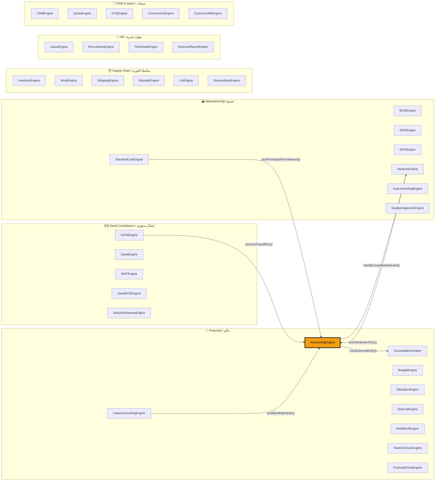
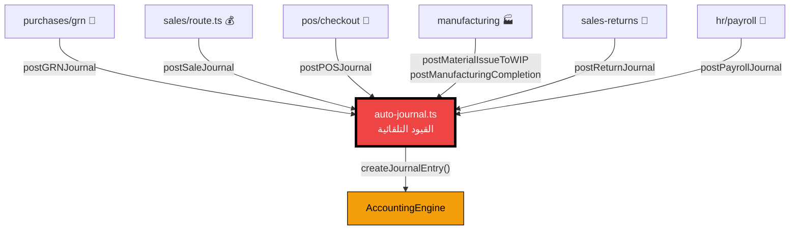

# 🔬 NamaSoft ERP — Deep Graph Relationships
# العلاقات المعمّقة في الكود — تحليل الرسم البياني

> **8,044 nodes · 13,312 edges · 2,110 communities**
> تحليل شامل لكل العلاقات المهمة المكتشفة في الكود

---

## 1. 🏗️ Engine Interdependencies / ترابط المحركات

**EN:** Your system has **70+ business engines** in `src/lib/`, each a self-contained class. The graph reveals their full method maps and how they connect.

**AR:** نظامك يحتوي على **+70 محرك أعمال** في `src/lib/`، كل واحد class مستقل. الرسم البياني يكشف كل الـ methods وطريقة ترابطها.



### Key Engine Discovery / اكتشاف رئيسي

| Engine / المحرك | Methods / الدوال | Domain / المجال |
|------|---------|--------|
| `LeaveEngine` | 12 methods | الإجازات — أكبر محرك HR |
| `ConsolidationEngine` | 9 methods | التجميع المالي — أعقد محرك |
| `BOMEngine` | 5 methods | قوائم المواد — عمود التصنيع |
| `BankReconEngine` | 5 methods | مطابقة بنكية — 3 أنواع مطابقة |
| `MfaEngine` | 8 methods | المصادقة الثنائية — أمان |
| `WHTEngine` | 6 methods | ضريبة الاستقطاع — امتثال سعودي |

---

## 2. 🔮 AI-Discovered Hidden Connections / علاقات خفية اكتشفها الذكاء الاصطناعي

**EN:** These connections were **INFERRED** by the AST analyzer — they cross file boundaries in ways you might not expect.

**AR:** هذه العلاقات **مُستنتجة** بواسطة محلل الكود — تعبر حدود الملفات بطرق غير متوقعة.

| From / من | → | To / إلى | Why it matters / أهميتها |
|-----------|---|----------|------------------------|
| `register()` in `instrumentation.ts` | calls | `startWorkers()` in `queue/index.ts` | 🔥 Sentry يشغّل Workers تلقائياً — إذا فشل Sentry يتوقف الطابور |
| `searchDocuments()` in `document-embeddings.ts` | calls | `searchVectorMine()` in `vector-store.ts` | 🧠 محرك البحث الذكي يعتمد على Vector Store |
| `invokeChain()` in `langchain-orchestrator.ts` | calls | `logPromptUsage()` in `registry.ts` | 📊 كل استدعاء AI يُسجّل — مهم للتكلفة |
| `callLLM()` in `llm-client.ts` | calls | `getPrompt()` + `renderPrompt()` in `registry.ts` | 🎯 3 اتصالات: LLM client يعتمد كلياً على Prompt Registry |
| `PUT()` in `warehouses/route.ts` | calls | `assertEditable()` in `document-state-machine.ts` | 📋 المستودعات تستخدم State Machine — لا يمكن تعديل مستند مؤكد |
| `POST()` in `qiwa/sync/route.ts` | calls | `syncWorkforce()` in `qiwa-engine.ts` | 🇸🇦 مزامنة قوى العمل مع منصة قوى |
| `POST()` in `vat/route.ts` | calls | `seedVatCategories()` in `vat-classifier.ts` | 💰 تصنيف ضريبة القيمة المضافة تلقائي |
| `fetchProducts()` in POS `page.tsx` | calls | `.cacheProducts()` in `pos-db.js` | ⚡ نقطة البيع تستخدم Cache محلي للمنتجات |

---

## 3. 🌉 Cross-Domain Bridges / الجسور بين الأقسام

**EN:** These are the files/functions that connect the most business domains. They are your **critical infrastructure** — changing them affects everything.

**AR:** هذه الملفات/الدوال التي تربط أكبر عدد من الأقسام. هي **البنية التحتية الحرجة** — تغييرها يؤثر على كل شيء.

| Bridge / الجسر | Domains / الأقسام | Impact / التأثير |
|-------|---------|--------|
| `prisma.ts` | **14 قسم** 🏆 | يربط كل شيء: محاسبة، AI، بنوك، CRM، HR، مخزون، تصنيع، MFA، POS، مشتريات، مبيعات، خزينة، زاتكا |
| `auth.ts` + `getUserFromRequest()` | **13 قسم** | كل API route يمر عبر هذا الملف |
| `useTranslation()` + `i18n.tsx` | **13 قسم** | كل صفحة UI تستخدم الترجمة |
| `Toast.tsx` | **12 قسم** | إشعارات المستخدم في كل مكان |
| `card.tsx` + `button.tsx` | **10 أقسام** | UI components أساسية |
| `apiError()` | **8 أقسام** | معالجة أخطاء موحدة |
| `auto-journal.ts` | **6 أقسام** | 🔥 **اكتشاف مهم!** القيود المحاسبية التلقائية تربط: المشتريات، المبيعات، POS، HR، التصنيع، المحاسبة |

### 🔥 Critical Finding / اكتشاف حرج



> **`auto-journal.ts`** هو الملف الأخطر في النظام — 21 API route يعتمد عليه. أي خطأ فيه يؤدي لقيود محاسبية خاطئة في كل الأقسام.

---

## 4. 🔴 Refactoring Candidates / مرشحات إعادة الهيكلة

**EN:** These communities have **low cohesion** — their nodes are loosely connected. They're likely grab-bags that should be split.

**AR:** هذه المجتمعات لديها **تماسك ضعيف** — عقدها مترابطة بشكل ضعيف. غالباً يجب تقسيمها.

| Community / المجتمع | Nodes | Cohesion | Recommendation / التوصية |
|---------|-------|----------|--------------------------|
| Advanced API Routes | 312 | 0.01 ❌ | تقسيم حسب القسم: accounting API, HR API, etc. |
| UI Page Components | 267 | 0.01 ❌ | تقسيم حسب الوحدة: AccountingPages, HRPages |
| Core API Routes | 201 | 0.01 ❌ | نفس المشكلة — كيس كبير من Routes |
| Business API Endpoints | 203 | 0.02 ❌ | تجميع حسب المجال |
| Page Event Handlers | 164 | 0.02 ❌ | ربط كل handler بصفحته |

> **Interpretation / التفسير:** Cohesion 0.01 يعني أن الـ nodes داخل المجتمع بالكاد مترابطة. هذا طبيعي في Next.js App Router لأن كل route مستقل — لكنه يكشف أن الـ routing layer ليس لديه shared patterns.

---

## 5. 📋 Duplicate Code / الكود المكرر

**EN:** Same function name, implemented in multiple files. These are either intentional (shared patterns) or drift (copy-paste debt).

**AR:** نفس اسم الدالة مكتوب في ملفات متعددة. إما مقصود أو ديون تقنية (نسخ ولصق).

| Function / الدالة | Copies / النسخ | Risk / المخاطرة |
|----------|--------|------|
| `handleResize()` | 10 | ⚠️ 10 نسخ من Sidebar — أيها الرسمي؟ |
| `updateItem()` | 10 | ⚠️ في المشتريات، عروض الأسعار، GRN — يجب توحيد |
| `removeItem()` | 10 | ⚠️ نفس المشكلة — نفس الحل |
| `openEdit()` | 10 | في البنوك، الدفعات، الفروع، العملاء |
| `getStatusColor()` | 10 | 🔸 في CRM, Projects, Fraud, MRP — كل واحد بألوان مختلفة؟ |
| `addToCart()` | 7 | في المشتريات والمبيعات و B2B — يجب توحيد |
| `handleLogin()` | 7 | في Admin, SaaS, Login, ICE — **خطر أمني!** |
| `useTranslation()` | 6 | ⚠️ 6 نسخ من i18n — drift risk |
| `I18nProvider()` | 6 | نفس المشكلة — ملفات قديمة |
| `fixFile()` | 6 | سكربتات إصلاح متعددة |

### ⚠️ Security Alert / تنبيه أمني

> **`handleLogin()` في 7 ملفات مختلفة** — إذا تم تحديث منطق تسجيل الدخول في واحد فقط، الباقي يبقى بالنسخة القديمة (ثغرة أمنية محتملة).

---

## 6. 🔗 Critical Call Chains / سلاسل الاستدعاء الحرجة

**EN:** The longest dependency chains in your code. If any link breaks, everything downstream fails.

**AR:** أطول سلاسل الاعتماد في الكود. إذا انكسرت أي حلقة، كل شيء بعدها يتعطل.

```
1. 📱 Telegram Bot Chain (4 hops):
   processMessage() → processVoice() → sendMessage() → getAPI()
   
2. 🏪 POS Checkout Chain (6 hops):
   ._ensureDB() → .cacheProducts() → fetchProducts() → handleCheckout() → removeCoupon() → handleHoldOrder()
   
3. 🏭 Manufacturing → Accounting (3 hops):
   createJournalEntry() → postMaterialIssueToWIP() → PUT()
```

> **The POS chain (6 hops)** is the longest — from DB initialization to order hold. Any failure in caching crashes checkout.
>
> **سلسلة POS (6 حلقات)** هي الأطول — من تهيئة قاعدة البيانات إلى تعليق الطلب. أي فشل في الـ Cache يعطل الدفع.

---

## 7. 🏝️ Isolated Subgraphs / المجموعات المعزولة

**EN:** 42.3% of your code is in disconnected islands, not connected to the main graph.

**AR:** **42.3%** من الكود في جزر معزولة، غير متصلة بالرسم البياني الرئيسي.

| Component / المكون | Nodes | Description / الوصف |
|-----------|-------|---------------------|
| **Main Graph** | 4,644 (57.7%) | الرسم الرئيسي — كل شيء متصل |
| Electron Protected Main | 114 | ⚫ كود مشفر — لا يمكن ربطه |
| Electron DB + Modules | 67 | Local PostgreSQL + modules |
| Electron Backup Sync | 45 | مزامنة النسخ الاحتياطية |
| Electron Offline DB | 43 | قاعدة البيانات غير متصلة |
| ZATCA Offline | 31 | الفوترة بدون إنترنت |
| **1,743 micro-islands** | 1-10 each | ملفات/سكربتات مستقلة |

> **Why?** The Electron code is obfuscated (`_0x...` function names), so the graph can't trace its connections. The real coupling exists but is hidden.
>
> **لماذا؟** كود Electron مشفر (أسماء دوال `_0x...`)، فالرسم لا يستطيع تتبع اتصالاته. الترابط الحقيقي موجود لكنه مخفي.

---

## 8. 🗺️ API → Engine Dependency Map / خريطة اعتماد API على المحركات

**EN:** Which lib files are consumed by the most API routes? This is your **blast radius map**.

**AR:** أي ملفات lib يعتمد عليها أكبر عدد من الـ API routes؟ هذه **خريطة نطاق الانفجار**.

| Library / المكتبة | API Routes | Examples / أمثلة |
|---------|------------|---------|
| `prisma.ts` | **427** 🏆 | كل شيء |
| `auth.ts` | **350** | كل شيء تقريباً |
| `api-error.ts` | **74** | معالجة الأخطاء |
| `auto-journal.ts` | **21** | القيود المحاسبية |
| `money.ts` | **9** | POS, مبيعات, مشتريات, خزينة, مصروفات |
| `api-handler.ts` | **9** | معالج API موحد |
| `field-audit.ts` | **6** | تدقيق التغييرات: منتجات, موظفين, مشتريات, مستودعات, مبيعات |
| `numbering.ts` | **6** | ترقيم تلقائي: GRN, POS, رواتب, أوامر تصنيع |
| `qiwa-engine.ts` | **4** | 🇸🇦 خزينة, قوى, نطاقات, سعودة |
| `document-state-machine.ts` | **4** | أوامر تصنيع, عكس قيود, قيود يومية, مستودعات |

---

## 9. 📊 Summary Matrix / مصفوفة الملخص

| Metric / المقياس | Value / القيمة | Assessment / التقييم |
|--------|-------|------------|
| Total Engines | 70+ | ✅ Excellent modular design / تصميم وحداتي ممتاز |
| Inferred Connections | 77 | ⚠️ Hidden couplings to document / ترابطات خفية يجب توثيقها |
| Cross-Domain Bridges | 20+ | 🔴 High risk concentration in 4 files / تركز مخاطر عالي في 4 ملفات |
| Duplicate Functions | 20+ | ⚠️ Copy-paste debt / ديون نسخ ولصق |
| Isolated Components | 42.3% | 🔸 Mostly Electron (obfuscated) / غالباً Electron مشفر |
| Max Call Chain | 6 hops | ⚠️ POS chain is fragile / سلسلة POS هشة |

### 🎯 Top 3 Action Items / أهم 3 إجراءات

1. **🔴 Protect `auto-journal.ts`** — Add comprehensive tests. 21 routes depend on it for correct accounting entries.
   — أضف اختبارات شاملة. 21 route يعتمد عليه للقيود المحاسبية الصحيحة.

2. **⚠️ Consolidate `handleLogin()`** — 7 copies is a security risk. Unify into one shared auth flow.
   — 7 نسخ = خطر أمني. وحّدها في flow مصادقة واحد.

3. **🔸 Document Inferred Connections** — Especially `instrumentation.ts → queue workers` and `LLM client → Prompt Registry`.
   — خاصة `instrumentation.ts → queue workers` و `LLM client → Prompt Registry`.

