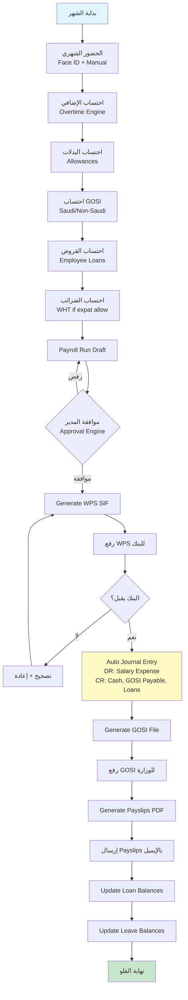
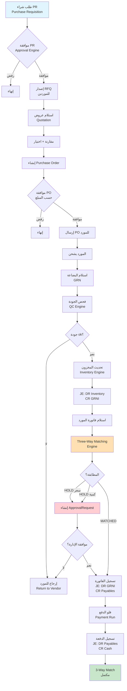
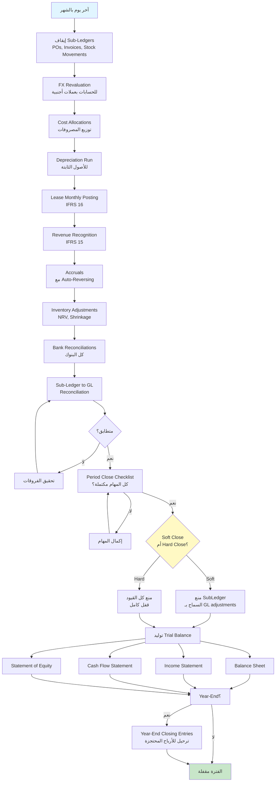
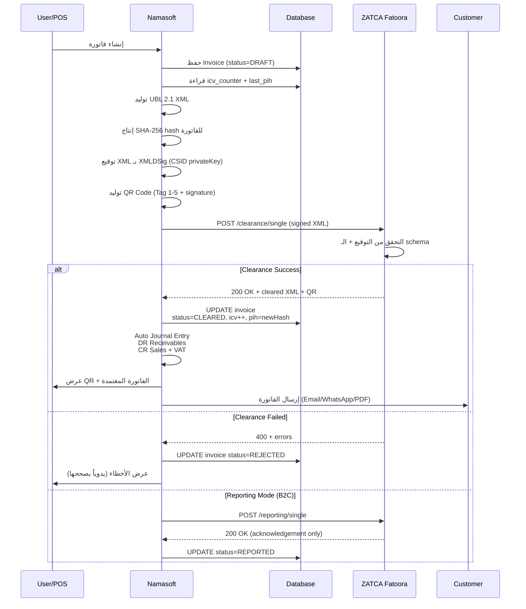
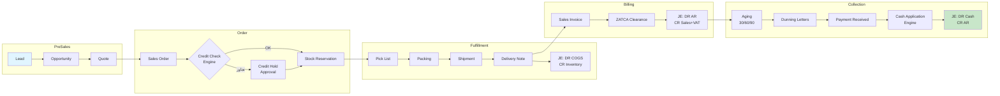
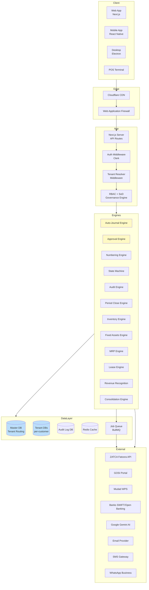
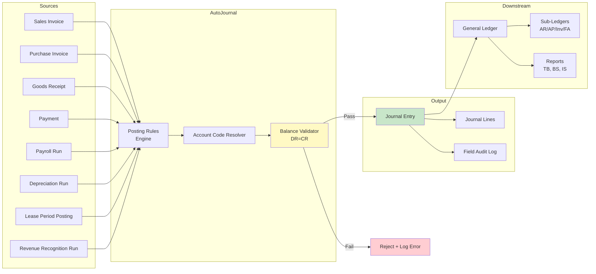
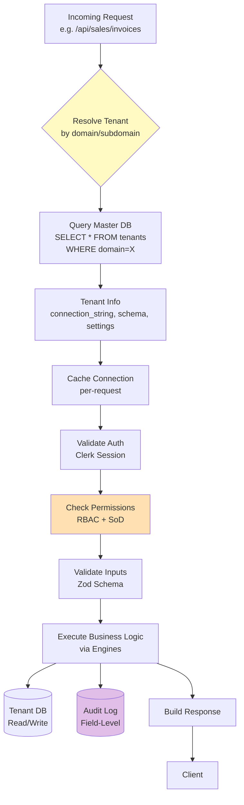
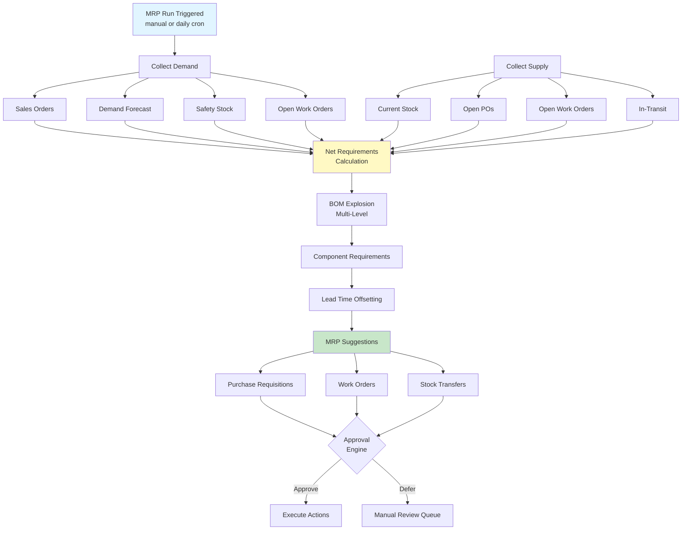
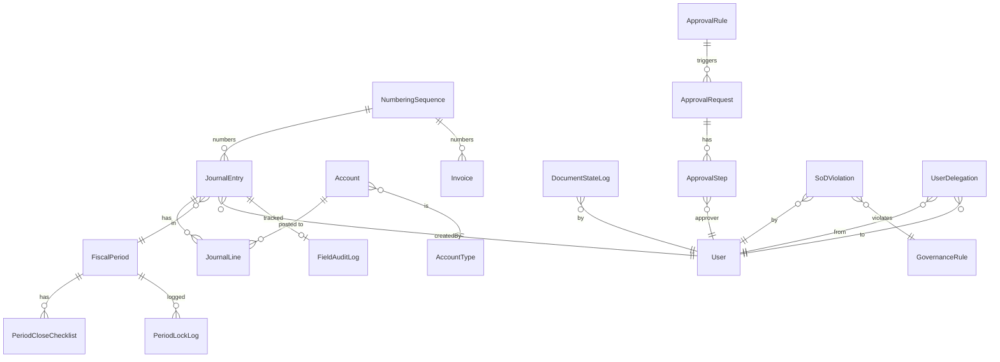

# 🚀 خارطة الطريق الجبارة: من Namasoft إلى المستوى العالمي
# Master Roadmap to Global ERP Excellence

> **النسخة:** 1.0
> **التاريخ:** 2026-05-02
> **الهدف:** الوصول لمستوى SAP S/4HANA / Oracle Fusion / NetSuite في 12-18 شهراً
> **المرجع الأساسي:** [GLOBAL_ERP_GAP_ANALYSIS.md](GLOBAL_ERP_GAP_ANALYSIS.md) · [BUSINESS_FLOWS_GUIDE.md](BUSINESS_FLOWS_GUIDE.md) · [CLAUDE.md](CLAUDE.md)

---

## 📑 الفهرس

| القسم | المحتوى |
|-------|---------|
| [الجزء 1](#الجزء-1-الرؤية-الاستراتيجية) | الرؤية والمبادئ الحاكمة |
| [الجزء 2](#الجزء-2-الوضع-الحالي-البصمة-الكاملة) | البصمة الحالية للنظام |
| [الجزء 3](#الجزء-3-الخارطة-السداسية-6-مراحل-في-12-18-شهر) | الـ 6 مراحل الكبرى |
| [الجزء 4](#الجزء-4-البرومنت-الكامل-للذكاء-الاصطناعي) | البرومنت الجاهز للنسخ |
| [الجزء 5](#الجزء-5-فلوهات-العمل-business-workflows) | فلوهات الأعمال (Mermaid) |
| [الجزء 6](#الجزء-6-فلوهات-البيانات-data-flows) | فلوهات البيانات والتكامل |
| [الجزء 7](#الجزء-7-معايير-النجاح-kpis) | KPIs والقياس |
| [الجزء 8](#الجزء-8-سجل-المخاطر) | المخاطر وإدارتها |
| [الجزء 9](#الجزء-9-جاهزية-الإطلاق-launch-checklist) | قائمة الإطلاق |

---

## الجزء 1: الرؤية الاستراتيجية

### 🎯 الرؤية
> **بناء نظام ERP عربي عالمي المستوى يجمع بين قوة SAP وسهولة QuickBooks وتميّز السعودية في الامتثال.**

### المبادئ الحاكمة (Non-Negotiables)
1. **القيد المتوازن دائماً** — Tolerance ≤ 0.01 SAR
2. **تتبع كل تغيير** — Field-level audit on every financial mutation
3. **الفصل بين المهام** — SoD enforced at API level
4. **Multi-tenant strict isolation** — لا تسرب بين العملاء
5. **Test-first للمنطق المحاسبي** — لا commit بدون test
6. **الامتثال السعودي أولوية أولى** — ZATCA, GOSI, WPS, SOCPA, PDPL
7. **معيار الكود: Production-grade** — TypeScript strict, no `any`

### الجمهور المستهدف (Target Personas)
| Persona | الحجم | الميزات الحرجة |
|---------|-------|------------------|
| **شركة ناشئة سعودية** | 1-50 موظف | POS, ZATCA, GOSI, تقارير بسيطة |
| **متوسطة (SMB)** | 50-500 موظف | كل ما سبق + WPS, MRP, BI, Budget |
| **مؤسسة كبيرة** | 500-5000 | + Multi-company, IFRS 16/15, Consolidation, Multi-book |
| **شركة قابضة** | 5000+ | + Group Reporting, Inter-company, Treasury, GTS |

---

## الجزء 2: الوضع الحالي — البصمة الكاملة

### 2.1 ما تم إنجازه (الأصول الجاهزة)

```
✅ البنية التحتية
   ├── 157+ Prisma Model
   ├── ~320 API Endpoint
   ├── ~60 Dashboard Page
   ├── Multi-tenant (Master DB + per-tenant DBs)
   └── Auth (Clerk + 2FA TOTP fields)

✅ Foundation Layer (المرحلة 0 — مكتملة 2026-05-02)
   ├── Numbering Sequences Engine    [src/lib/numbering.ts]
   ├── Document State Machine         [src/lib/document-state-machine.ts]
   ├── Field-Level Audit Trail        [src/lib/field-audit.ts]
   ├── Period Close Engine            [src/lib/period-close.ts]
   ├── Approval Workflow Engine       [src/lib/approval-engine.ts]
   ├── Governance Engine (SoD)        [src/lib/governance-engine.ts]
   ├── Inventory Engine               [src/lib/inventory-engine.ts]
   ├── Fixed Assets Engine            [src/lib/fixed-assets-engine.ts]
   ├── MRP Engine                     [src/lib/mrp-engine.ts]
   ├── FX Revaluation                 [src/lib/fx-revaluation.ts]
   ├── Revenue Recognition            [src/lib/revenue-recognition.ts]
   └── Consolidation Engine           [src/lib/consolidation-engine.ts]

✅ المحاسبة الأساسية (100%)
   ├── Auto-Journal (8 سيناريوهات)    [src/lib/auto-journal.ts]
   ├── Costing FIFO/LIFO/Avg          [src/lib/costing.ts]
   ├── Bank Reconciliation            [src/lib/bank-reconciliation.ts + bank-recon-engine.ts]
   ├── Cash Flow Forecasting          [src/lib/cash-flow-forecasting.ts]
   └── Open Items framework           [src/lib/open-items.ts]

✅ ZATCA Phase 2 (100%)
   ├── CSR / CSID generation
   ├── ICV/PIH chain
   ├── UBL 2.1 XML
   ├── Sandbox/Production switch
   ├── Java SDK integration
   └── VAT Return Report              [src/app/api/reports/zatca-vat/route.ts]

✅ AI Layer
   ├── AI CFO (Gemini)
   ├── AI Auditor
   ├── OCR Invoice Capture
   └── Bank Statement Analysis

✅ المرحلة A — Saudi Compliance Sprint (مكتملة 2026-05-11)
   ├── EOS Engine (Art.84-88)         [src/lib/eos-engine.ts]
   │   └── API                        [src/app/api/hr/eos/route.ts]
   ├── Leave Engine                   [src/lib/leave-engine.ts]
   │   └── API                        [src/app/api/hr/leaves/route.ts]
   ├── WPS Generator (SIF v2)         [src/lib/wps-generator.ts]
   │   └── API                        [src/app/api/payroll/wps/route.ts]
   ├── GOSI Engine (9%+9%+2%)         [src/lib/gosi-engine.ts]
   │   └── API                        [src/app/api/hr/gosi/route.ts]
   ├── Document Expiry (Iqama/Visa)   [src/lib/document-expiry.ts]
   │   └── API                        [src/app/api/hr/documents/expiry/route.ts]
   ├── Mudad API Client               [src/lib/mudad-api.ts]
   │   └── API                        [src/app/api/integrations/mudad/route.ts]
   ├── WHT Engine (5/15/20%)          [src/lib/wht-engine.ts]
   │   └── API                        [src/app/api/tax/wht/route.ts]
   └── ZATCA VAT Return (fixed)       [src/app/api/reports/zatca-vat/route.ts]

✅ المرحلة B — Treasury & Bank Excellence (مكتملة 2026-05-11)
   ├── Bank Statement Parser (MT940/CAMT053/OFX/CSV)  [src/lib/bank-statement-parser.ts]
   ├── Bank Statements Import API     [src/app/api/treasury/bank-statements/route.ts]
   ├── Bank Recon Engine              [src/lib/bank-recon-engine.ts]
   └── Bank Recon API                 [src/app/api/treasury/bank-recon/route.ts]

✅ المرحلة C — AR/AP Mastery (مكتملة 2026-05-11)
   ├── Three-Way Match Engine (PO↔GRN↔Invoice)  [src/lib/three-way-match-engine.ts]
   │   └── API                        [src/app/api/ap/three-way-match/route.ts]
   ├── Payment Run Engine             [src/lib/payment-run-engine.ts]
   │   └── API                        [src/app/api/finance/payment-run/route.ts]
   ├── Dunning Route                  [src/app/api/finance/dunning/route.ts]
   └── ECL Engine (IFRS 9)            [src/lib/ecl-engine.ts]
       └── API                        [src/app/api/finance/ecl/route.ts]

✅ المرحلة D — Inventory & Reorder (مكتملة 2026-05-11)
   ├── Reorder Engine (EOQ/ROP)       [src/lib/reorder-engine.ts]
   └── Reorder API (+ draft PO)       [src/app/api/inventory/reorder/route.ts]

✅ المرحلة E — Advanced Accounting (مكتملة 2026-05-11)
   ├── IFRS 16 Lease Engine (ROU+Liability)  [src/lib/ifrs16-lease-engine.ts]
   │   └── API                        [src/app/api/finance/ifrs16-lease/route.ts]
   ├── Asset Lifecycle Engine (IAS36) [src/lib/asset-lifecycle-engine.ts]
   │   └── API (4 depreciation methods + impairment + disposal)
   │                                  [src/app/api/finance/asset-lifecycle/route.ts]
   └── ECL Engine (IFRS 9 simplified approach — see Phase C above)
```


### 2.2 الفجوات الكبرى (الترتيب حسب الأولوية)

| # | الفجوة | الموديول | الحجم | ROI |
|---|--------|---------|-------|-----|
| 1 | **WPS / EOS / Mudad / Qiwa** | HR | كبير | 🔴 حرج (قانوني) |
| 2 | **Bank Statement Import (MT940/CAMT.053)** | Treasury | متوسط | 🔴 يومي |
| 3 | **Three-Way Matching (PO↔GRN↔Invoice)** | AP | متوسط | 🔴 منع فساد |
| 4 | **Cash Application Engine** | AR | كبير | 🟠 وقت محاسب |
| 5 | **IFRS 16 Lease Accounting** | Accounting | متوسط | 🟠 امتثال IFRS |
| 6 | **Multi-Book / Multi-GAAP** | Accounting | كبير | 🟠 شركات كبيرة |
| 7 | **Multi-Level BOM Explosion + ECO** | MFG | كبير | 🟠 صناعة جادة |
| 8 | **Custom Report Builder** | BI | كبير | 🟡 رضا العميل |
| 9 | **Customer/Vendor Portals** | CRM/SRM | كبير | 🟡 تنافسية |
| 10 | **Lease Accounting + ARO** | Accounting | متوسط | 🟡 IFRS |

---

## الجزء 3: الخارطة السداسية (6 مراحل في 12-18 شهر)

```
┌───────────────────────────────────────────────────────────────────┐
│                    الخارطة الزمنية الكلية                          │
├──────────┬────────────┬───────────────────────────────────────────┤
│ المرحلة  │   المدة     │ المحاور الكبرى                            │
├──────────┼────────────┼───────────────────────────────────────────┤
│   ✅ 0   │ منجزة      │ Foundation Layer (Numbering, State,        │
│          │            │ Audit, Period Close, Approval, SoD)        │
│   🔥 A   │ شهر 1      │ Saudi Compliance Sprint (WPS, EOS, GOSI)   │
│   🟢 B   │ شهر 2-3    │ Treasury & Bank Excellence                 │
│   🟢 C   │ شهر 4-5    │ AR/AP Mastery (Open Items, 3WM, Dunning)   │
│   🟡 D   │ شهر 6-8    │ Manufacturing & Inventory Maturity         │
│   🟡 E   │ شهر 9-11   │ Advanced Accounting (IFRS 15/16, Multi-Book)│
│   🔵 F   │ شهر 12-18  │ Enterprise Features (BI, Portal, BPM, GRC) │
└──────────┴────────────┴───────────────────────────────────────────┘
```

### 🔥 المرحلة A — Saudi Compliance Sprint (شهر 1)
**الهدف:** نظام جاهز للبيع لأي شركة سعودية بدون قلق قانوني.

| Sprint | الميزة | الـ Engine | API | الاختبار |
|--------|---------|-----------|-----|----------|
| A.1 (أسبوع 1) | EOS Calculator | `src/lib/saudi-eos-engine.ts` | `/api/hr/eos/*` | 5+ سيناريو |
| A.2 (أسبوع 1) | Leave Accrual + Carry Forward | `src/lib/leave-engine.ts` | `/api/hr/leaves/*` | اختبار سنوي |
| A.3 (أسبوع 2) | WPS SIF File Generator | `src/lib/wps-generator.ts` | `/api/payroll/wps/*` | بنك تجريبي |
| A.4 (أسبوع 2) | GOSI File + Calculation v2 | `src/lib/gosi-engine.ts` | `/api/hr/gosi/*` | 9% + 9% + 2% |
| A.5 (أسبوع 3) | Iqama/Visa Expiry Alerts (Cron) | `src/lib/document-expiry.ts` | `/api/hr/documents/expiry` | Email + WhatsApp |
| A.6 (أسبوع 3) | Mudad Integration (read API) | `src/lib/mudad-api.ts` | `/api/integrations/mudad/*` | Sandbox |
| A.7 (أسبوع 4) | Saudi VAT Return XML | `src/lib/zatca-vat-return.ts` | `/api/zatca/vat-return` | VAT Form |
| A.8 (أسبوع 4) | Withholding Tax (WHT) | `src/lib/wht-engine.ts` | `/api/tax/wht/*` | 5/15/20% |

**معيار النجاح:** يمر على شركة 50 موظف بدون تدخل يدوي للراتب الشهري.

---

### 🟢 المرحلة B — Treasury & Bank Excellence (شهر 2-3)
**الهدف:** وداعاً لتسويات البنك اليدوية. النظام يستورد ويطابق أوتوماتيكياً.

| Sprint | الميزة | التقنية المرجعية |
|--------|---------|-------------------|
| B.1 | MT940 Parser (SWIFT) | `swift-parser-node` |
| B.2 | CAMT.053 Parser (ISO 20022) | XSD validation |
| B.3 | OFX + CSV Parsers | configurable mapping |
| B.4 | Bank Recon Rules Engine | rule-based + AI fallback |
| B.5 | Auto-Match Engine (exact + fuzzy + AI) | Levenshtein + Gemini |
| B.6 | Cash Position Dashboard (multi-bank) | Recharts |
| B.7 | Cash Flow Forecast (Direct) | open AR/AP + history |
| B.8 | Inter-Bank Transfer + In-House Cash | model + JE |
| B.9 | Outstanding Checks + Deposits in Transit | dashboard |
| B.10 | Petty Cash Imprest System | auto top-up |

**معيار النجاح:** 95% من حركات كشف البنك تُطابَق آلياً.

---

### 🟢 المرحلة C — AR/AP Mastery (شهر 4-5)
**الهدف:** إدارة دائنين/مدينين على مستوى Oracle/SAP.

| Sprint | الميزة | Bench |
|--------|---------|-------|
| C.1 | Payment Terms Engine (Net30, 2/10, EOM, Installments) | كل الأنظمة |
| C.2 | Invoice Due Schedule (مع كل فاتورة) | جميع |
| C.3 | Open Items Model الكامل | SAP FI |
| C.4 | Cash Application (auto-match) | HighRadius |
| C.5 | Customer Statements (PDF + Email) | جميع |
| C.6 | Dunning Letters Multi-Level | SAP F-150 |
| C.7 | Three-Way Matching Engine | SAP MM |
| C.8 | Tolerance Limits (Price/Qty/Total) | Oracle |
| C.9 | Payment Runs (Batch + SEPA/SWIFT/SAR-WPS) | SAP F110 |
| C.10 | Vendor Self-Service Portal | Coupa, Ariba |
| C.11 | Customer Self-Service Portal | NetSuite |
| C.12 | Bad Debt Provision (% Aging) | جميع |

**معيار النجاح:** متوسط DSO يتحسن 30% للمحاسب الذي يستخدم النظام.

---

### 🟡 المرحلة D — Manufacturing & Inventory Maturity (شهر 6-8)
**الهدف:** تصنيع جاد لمنشأة 100-500 موظف.

| Sprint | الميزة | المرجع |
|--------|---------|--------|
| D.1 | Multi-Level BOM Explosion | SAP CS11 |
| D.2 | Phantom BOM | SAP |
| D.3 | BOM Versioning + ECO Workflow | Oracle PLM |
| D.4 | BOM Where-Used Report | SAP CS15 |
| D.5 | Alternative Routings + Capacity | SAP PP |
| D.6 | Material Issuance Engine (Picklist) | SAP MIGO |
| D.7 | Backflushing (Auto-Issue on Confirmation) | SAP CO15 |
| D.8 | Standard Cost + Variance Posting | SAP CO-PC |
| D.9 | Rework Orders | SAP |
| D.10 | Subcontracting Workflow | SAP MM |
| D.11 | Quality Plans + NCR + CAPA | SAP QM |
| D.12 | Product Variants (Size/Color/Style) | Odoo, NetSuite |
| D.13 | Item Attributes Engine | Odoo |
| D.14 | Reorder Point + Safety Stock + EOQ | جميع |
| D.15 | ABC/XYZ Analysis | SAP |
| D.16 | Slow-Moving / Dead Stock Reports | جميع |
| D.17 | Stock Reservation Engine | جميع |
| D.18 | Cycle Count Plans + Tasks | SAP, Oracle |
| D.19 | Putaway/Pick Strategies (FEFO/FIFO/LIFO) | SAP EWM |
| D.20 | OEE + MTBF + MTTR | SAP PM |

**معيار النجاح:** نظام يدير مصنع 500 موظف بـ 1000 صنف و 50 BOM متعدد المستويات.

---

### 🟡 المرحلة E — Advanced Accounting (شهر 9-11)
**الهدف:** الامتثال الكامل لـ IFRS و US GAAP.

| Sprint | الميزة | المعيار |
|--------|---------|---------|
| E.1 | IFRS 16 Lease Accounting (ROU + Liability) | IFRS 16 |
| E.2 | Lease Modifications + Termination | IFRS 16 |
| E.3 | Lessor Accounting (Finance + Operating) | IFRS 16 |
| E.4 | IFRS 15 Revenue Recognition (Full 5-Step) | IFRS 15 |
| E.5 | Performance Obligations + Standalone Selling Price | IFRS 15 |
| E.6 | Variable Consideration + Constraint | IFRS 15 |
| E.7 | Multi-Book Accounting (Tax/Book/IFRS) | NetSuite |
| E.8 | Component Accounting for Fixed Assets | IFRS / SAP AA |
| E.9 | Asset Impairment (IAS 36) | IAS 36 |
| E.10 | Asset Revaluation (IAS 16) | IAS 16 |
| E.11 | ARO (Asset Retirement Obligations) | IFRS / IAS 37 |
| E.12 | Hedge Accounting (IFRS 9) | IFRS 9 |
| E.13 | Inventory NRV Write-Down (IAS 2) | IAS 2 |
| E.14 | Statement of Changes in Equity | IFRS |
| E.15 | Cash Flow Statement (Direct Method) | IAS 7 |
| E.16 | Notes to Financial Statements (auto-generated) | IFRS |
| E.17 | Inter-Company Eliminations | SAP Group |
| E.18 | Minority Interest + Goodwill | IFRS 3 |
| E.19 | Segment Reporting | IFRS 8 |
| E.20 | Allocation Engine (Overhead) | SAP CO |

**معيار النجاح:** يجتاز مراجعة Big 4 لشركة متوسطة.

---

### 🔵 المرحلة F — Enterprise Features (شهر 12-18)
**الهدف:** التنافسية مع NetSuite/Dynamics 365.

| المحور | المكونات |
|--------|----------|
| **BI & Analytics** | Custom Report Builder · Pivot Engine · Drill-Down · Scheduled Reports · Embedded Dashboards |
| **Workflow / BPM** | BPMN 2.0 Engine · Visual Designer · SLA Tracking · Escalation Rules |
| **Customization** | Custom Fields · Custom Entities · Custom Forms · No-Code Page Builder |
| **Integrations** | OpenAPI Catalog · Webhook Manager · iPaaS Connectors · Zapier-like |
| **Mobile** | React Native App · Offline Sync · Push Notifications · Biometric |
| **DevOps** | CI/CD per tenant · Blue/Green Deploy · Canary Releases · Feature Flags |
| **Security** | SAML/OIDC SSO · Field Encryption · Data Masking · SOC 2 Compliance |
| **Procurement** | RFQ Marketplace · Supplier Network · Spend Analytics · Catalog Mgmt |
| **Sales/CRM** | Opportunity Pipeline · Lead Scoring · Email Sequences · NPS |
| **Docs** | Document Generator · DocuSign · ESign Saudi (Etimad) |

**معيار النجاح:** عميل enterprise واحد على الأقل يستبدل NetSuite بـ Namasoft.

---

## الجزء 4: البرومنت الكامل للذكاء الاصطناعي

> **طريقة الاستخدام:** انسخ كل برومنت في جلسة منفصلة مع Claude Code. كل برومنت مكتفٍ ذاتياً.

### 🔵 برومنت ماستر (Master Prompt — استخدمه دائماً في بداية أي جلسة)

```
أنت مهندس ERP خبير تعمل على نظام Namasoft (Next.js 16 + Prisma + TypeScript + PostgreSQL).
الـ stack الأساسي:
- Frontend: Next.js 16 App Router, Tailwind 4, shadcn/ui patterns
- Backend: Next.js API routes, Prisma 5.22
- DB: PostgreSQL (Multi-tenant)
- Auth: Clerk
- AI: Google Gemini

القواعد الإلزامية:
1. اقرأ CLAUDE.md و GLOBAL_ERP_GAP_ANALYSIS.md قبل أي كود.
2. كل قيد محاسبي يجب أن يستخدم src/lib/auto-journal.ts (لا SQL مباشر).
3. كل قيد متوازن (Debit = Credit) tolerance 0.01.
4. لا تكتب على الحسابات الرقابية يدوياً.
5. كل ميزة جديدة: Schema → Engine → API → Tests → UI (بهذا الترتيب).
6. كل API يستخدم tenantId من الـ middleware.
7. كل field رقمي مالي: Decimal (scale 4 على الأقل).
8. Tests إجبارية للمنطق المحاسبي.
9. اللغة: عربي للتواصل، إنجليزي للكود.
10. قبل أي commit: npm run lint && npm run typecheck.

عند إضافة ميزة:
- صمم Prisma schema (مع migration)
- اكتب الـ engine في src/lib/<feature>-engine.ts
- اكتب API endpoints (RESTful)
- اكتب unit tests (.test.ts بجانب الـ engine)
- اكتب صفحة dashboard في src/app/(dashboard)/<feature>/page.tsx
- وثّق في README الموديول

هل أنت جاهز؟ أكد فهمك ثم سأعطيك المهمة.
```

---

### 🔥 المرحلة A — برومنتات الامتثال السعودي

#### Prompt A.1 — End of Service (EOS) Engine
```
ابنِ End of Service (EOS) calculator وفقاً لنظام العمل السعودي (المواد 84-88).

Schema جديد في prisma/schema.prisma:
model EndOfServiceCalculation {
  id              Int      @id @default(autoincrement())
  employeeId      Int
  employee        Employee @relation(fields: [employeeId], references: [id])
  calculationDate DateTime @default(now())
  joinDate        DateTime
  endDate         DateTime
  reasonForLeaving String  // RESIGNATION, TERMINATION, RETIREMENT, DEATH, FORCE_MAJEURE
  yearsOfService  Decimal  @db.Decimal(10, 4)
  lastBasicSalary Decimal  @db.Decimal(15, 2)
  lastFullSalary  Decimal  @db.Decimal(15, 2)
  
  // EOS components
  firstFiveYearsAmount  Decimal @db.Decimal(15, 2) // نصف شهر لكل سنة
  remainingYearsAmount  Decimal @db.Decimal(15, 2) // شهر كامل لكل سنة بعد 5
  resignationFactor     Decimal @db.Decimal(5, 4)  // 0.33 / 0.67 / 1.00
  
  unpaidVacationAmount  Decimal @db.Decimal(15, 2)
  unpaidOvertimeAmount  Decimal @db.Decimal(15, 2)
  outstandingLoanAmount Decimal @db.Decimal(15, 2)
  
  totalEOS              Decimal @db.Decimal(15, 2)
  netSettlement         Decimal @db.Decimal(15, 2)
  
  status                String  @default("DRAFT") // DRAFT, APPROVED, PAID
  journalEntryId        Int?
  approvedBy            Int?
  approvedAt            DateTime?
  paidAt                DateTime?
  
  createdAt             DateTime @default(now())
  updatedAt             DateTime @updatedAt
}

أنشئ src/lib/saudi-eos-engine.ts:
export class SaudiEOSEngine {
  // قاعدة المادة 84:
  // - أول 5 سنوات: نصف شهر عن كل سنة
  // - بعد 5 سنوات: شهر كامل عن كل سنة
  // - الراتب المعتمد: آخر راتب أساسي + البدلات الثابتة
  
  // قاعدة المادة 85 (الاستقالة):
  // - أقل من سنتين: لا شيء
  // - 2-5 سنوات: ثلث المكافأة
  // - 5-10 سنوات: ثلثي المكافأة
  // - أكثر من 10 سنوات: المكافأة كاملة
  
  // قاعدة المادة 87 (الفصل لسبب من العامل): لا مكافأة
  
  static async calculate(employeeId: number, endDate: Date, reason: EOSReason): Promise<EOSResult>
  static async approve(eosId: number, approverId: number): Promise<void>
  static async pay(eosId: number, payerId: number): Promise<void> // creates JE
}

API endpoints:
- POST /api/hr/eos/calculate { employeeId, endDate, reason }
- POST /api/hr/eos/[id]/approve
- POST /api/hr/eos/[id]/pay
- GET /api/hr/eos?employeeId=X
- GET /api/hr/eos/[id]/payslip (PDF)

JE عند الدفع:
DR: 5210 EOS Expense (إذا لم تكن provisioned)
DR: 2150 EOS Provision (إذا كانت provisioned)
DR: 5230 Vacation Liability (للإجازات)
CR: 1110/1120 Cash/Bank (الصافي)
CR: 1240 Employee Loan Receivable (إذا قروض)
CR: 2410 Accrued Salary (للساعات الإضافية)

اكتب tests شاملة:
- موظف 10 سنوات استقالة (مكافأة كاملة)
- موظف 7 سنوات استقالة (ثلثين)
- موظف 3 سنوات استقالة (ثلث)
- موظف سنة واحدة استقالة (صفر)
- موظف 12 سنة فصل لسبب نظامي (كاملة)
- موظف 12 سنة فصل لسبب من العامل (صفر)

UI: src/app/(dashboard)/hr/eos/page.tsx مع:
- Calculator widget (موظف، تاريخ، سبب → نتيجة)
- Approval queue
- Payment workflow
- Payslip preview & print

اقرأ ملف المرجع GLOBAL_ERP_GAP_ANALYSIS.md السطر 378-382 قبل البدء.
استشر الـ saudi-compliance subagent للتحقق.
```

#### Prompt A.2 — WPS (Wage Protection System) Generator
```
ابنِ WPS SIF File Generator لإرسال الرواتب عبر بنوك المملكة.

الخلفية:
- WPS = Wage Protection System (إجباري بأمر من وزارة العمل + ساما)
- الصيغة: SIF (Salary Information File) — text file محدد البنية
- يُرفع شهرياً إلى البنك ليُحول إلى Mudad ثم إلى البنوك المستلمة

Schema:
model WPSBatch {
  id              Int      @id @default(autoincrement())
  payrollRunId    Int
  payrollRun      PayrollRun @relation(fields: [payrollRunId], references: [id])
  bankCode        String   // SAR, NCB, RJHI, etc.
  batchNumber     String   @unique
  totalAmount     Decimal  @db.Decimal(18, 2)
  totalEmployees  Int
  fileFormat      String   @default("SIF_V2")
  fileContent     String?  @db.Text // generated SIF text
  fileGeneratedAt DateTime?
  uploadedAt      DateTime?
  status          String   @default("PENDING") // PENDING, GENERATED, UPLOADED, ACCEPTED, REJECTED
  rejectionReason String?
  items           WPSBatchItem[]
}

model WPSBatchItem {
  id            Int @id @default(autoincrement())
  batchId       Int
  batch         WPSBatch @relation(fields: [batchId], references: [id])
  employeeId    Int
  employee      Employee @relation(fields: [employeeId], references: [id])
  iban          String   // IBAN السعودي
  basicSalary   Decimal  @db.Decimal(15, 2)
  housingAllowance Decimal @db.Decimal(15, 2)
  otherAllowance Decimal @db.Decimal(15, 2)
  totalSalary   Decimal  @db.Decimal(15, 2)
  paymentStatus String   @default("PENDING")
}

أنشئ src/lib/wps-generator.ts:
export class WPSGenerator {
  // SIF Format (per SAMA spec):
  // Line 1 (Header): EmployerID|EmployerName|BankCode|FileDate|TotalRecords|TotalAmount
  // Lines 2..N (Detail): EmployeeID|IBAN|BasicSalary|HousingAllowance|OtherAllowance|Net|MOLNumber
  // Line N+1 (Trailer): END|TotalRecords|TotalAmount
  
  static async generateSIF(payrollRunId: number, bankCode: string): Promise<{ content: string; fileName: string }>
  static async validateIBANs(employees: Employee[]): Promise<ValidationResult>
  static async submitToBank(batchId: number): Promise<void> // upload via bank API or manual
}

API:
- POST /api/payroll/wps/generate { payrollRunId, bankCode }
- GET /api/payroll/wps/[batchId]/download
- POST /api/payroll/wps/[batchId]/mark-uploaded
- GET /api/payroll/wps/history

تحقق من الـ IBAN السعودي:
- 24 حرف
- يبدأ بـ SA
- Mod 97 checksum

UI: src/app/(dashboard)/payroll/wps/page.tsx
- Select payroll run
- Validate (هل كل موظف لديه IBAN؟ صحيح؟)
- Generate SIF
- Download or upload to bank
- Track status

ملاحظات:
- المراجع: https://www.mol.gov.sa (نظام WPS) و https://www.mudad.com.sa
- لكل بنك صيغة SIF خاصة به (تختلف الفواصل أحياناً) - اجعل الـ format قابل للتكوين
- استخدم numbering engine للـ batchNumber
- استشر saudi-compliance subagent
```

#### Prompt A.3 — GOSI Engine v2
```
حسّن GOSI engine ليكون شاملاً (الموظف + المنشأة + SANED + معاش + إصابات عمل).

النسب الحالية (2024+):
- السعوديون: 9% موظف + 9% منشأة (تأمينات) + 1% منشأة (إصابات عمل) = 19%
- غير السعوديين: 2% منشأة فقط (إصابات عمل)
- SANED (نظام التأمين ضد التعطل): 1% موظف + 1% منشأة (للسعوديين فقط) = 2%
- الحد الأدنى للأجر الخاضع: 1500 ريال
- الحد الأقصى للأجر الخاضع: 45,000 ريال

Schema:
model GOSIContribution {
  id              Int @id @default(autoincrement())
  employeeId      Int
  payrollRunId    Int
  contributionMonth DateTime
  isSaudi         Boolean
  basicSalary     Decimal @db.Decimal(15, 2)
  housingAllowance Decimal @db.Decimal(15, 2)
  subjectWage     Decimal @db.Decimal(15, 2) // bounded by min/max
  
  // Saudis
  employeePensionAmount    Decimal @default(0) @db.Decimal(15, 2) // 9%
  employerPensionAmount    Decimal @default(0) @db.Decimal(15, 2) // 9%
  employeeSANEDAmount      Decimal @default(0) @db.Decimal(15, 2) // 1%
  employerSANEDAmount      Decimal @default(0) @db.Decimal(15, 2) // 1%
  
  // All
  occupationalHazardsAmount Decimal @default(0) @db.Decimal(15, 2) // 1% or 2%
  
  totalEmployeeDeduction   Decimal @db.Decimal(15, 2)
  totalEmployerContribution Decimal @db.Decimal(15, 2)
  totalAmount              Decimal @db.Decimal(15, 2)
  
  status        String @default("PENDING") // PENDING, GENERATED, SUBMITTED, PAID
  journalEntryId Int?
}

model GOSIMonthlyFile {
  id            Int @id @default(autoincrement())
  month         DateTime @unique
  totalEmployees Int
  totalEmployeeContribution Decimal
  totalEmployerContribution Decimal
  totalAmount   Decimal
  fileContent   String @db.Text
  generatedAt   DateTime
  submittedAt   DateTime?
  paidAt        DateTime?
  receiptNumber String?
}

أنشئ src/lib/gosi-engine.ts:
export class GOSIEngine {
  static MIN_SUBJECT_WAGE = 1500
  static MAX_SUBJECT_WAGE = 45000
  
  static calculateSubjectWage(basic: number, housing: number): number {
    const wage = basic + housing
    return Math.max(this.MIN_SUBJECT_WAGE, Math.min(this.MAX_SUBJECT_WAGE, wage))
  }
  
  static calculateForEmployee(employee: Employee, payrollRun: PayrollRun): GOSIContribution
  static async generateMonthlyFile(month: Date): Promise<{ content: string; fileName: string }>
  static async submitToGOSI(fileId: number): Promise<void> // via GOSI API or manual
}

JE شهري:
DR: 5220 GOSI Expense (الجزء المنشأة)
DR: 2410 Accrued Salary (الجزء الموظف، مخصوم من الراتب)
CR: 2160 GOSI Payable

API:
- POST /api/hr/gosi/calculate { payrollRunId }
- GET /api/hr/gosi/file?month=2026-05
- POST /api/hr/gosi/file/submit
- POST /api/hr/gosi/file/mark-paid

اكتب tests:
- سعودي براتب 5000 (ضمن النطاق)
- سعودي براتب 50000 (يتجاوز الحد الأقصى)
- سعودي براتب 1000 (يقل عن الحد الأدنى)
- غير سعودي براتب 10000

UI: src/app/(dashboard)/hr/gosi/page.tsx
استشر saudi-compliance subagent للتحقق من النسب الحالية.
```

---

### 🟢 المرحلة B — برومنتات الخزينة

#### Prompt B.1 — MT940 Bank Statement Parser
```
ابنِ parser لكشوفات البنك بصيغة MT940 (SWIFT) و CAMT.053 (ISO 20022) و OFX.

Schema:
model BankStatement {
  id              Int @id @default(autoincrement())
  bankAccountId   Int
  bankAccount     BankAccount @relation(fields: [bankAccountId], references: [id])
  statementNumber String
  statementDate   DateTime
  openingBalance  Decimal @db.Decimal(18, 2)
  closingBalance  Decimal @db.Decimal(18, 2)
  currency        String  @default("SAR")
  fileFormat      String  // MT940, CAMT_053, OFX, CSV
  fileName        String
  fileContent     String  @db.Text
  importedBy      Int
  importedAt      DateTime @default(now())
  reconciledAt    DateTime?
  lines           BankStatementLine[]
  
  @@unique([bankAccountId, statementNumber])
}

model BankStatementLine {
  id              Int @id @default(autoincrement())
  statementId     Int
  statement       BankStatement @relation(fields: [statementId], references: [id])
  lineNumber      Int
  valueDate       DateTime
  bookingDate     DateTime
  description     String  @db.Text
  reference       String?
  counterpartyName String?
  counterpartyIBAN String?
  debit           Decimal @default(0) @db.Decimal(18, 2)
  credit          Decimal @default(0) @db.Decimal(18, 2)
  balance         Decimal @db.Decimal(18, 2)
  matchedTransactionId Int? // FK to JournalEntry or Payment
  matchedTransactionType String? // JE, PAYMENT, RECEIPT
  matchStatus     String  @default("UNMATCHED") // UNMATCHED, AUTO_MATCHED, MANUAL_MATCHED, IGNORED
  matchedBy       Int?
  matchedAt       DateTime?
  matchConfidence Decimal? @db.Decimal(5, 2) // 0-100%
}

أنشئ:
- src/lib/bank-parsers/mt940.ts
- src/lib/bank-parsers/camt053.ts
- src/lib/bank-parsers/ofx.ts
- src/lib/bank-parsers/csv.ts (configurable mapping)
- src/lib/bank-statement-importer.ts (orchestrator)

MT940 Structure:
{1:F01...}{2:O940...}{4:
:20:STMT2026050001
:25:SA0312345678901234567890
:28C:00001/00001
:60F:C260501SAR1000000,00
:61:2605020502DR1500,00NTRFREF1
:86:Payment to vendor ABC
:62F:C260502SAR998500,00
-}

CAMT.053: XML schema حسب ISO 20022 (استخدم xml2js أو fast-xml-parser).

API:
- POST /api/treasury/bank-statements/import (multipart file)
- GET /api/treasury/bank-statements?bankAccountId=X
- GET /api/treasury/bank-statements/[id]/lines

UI: src/app/(dashboard)/treasury/bank-statements/page.tsx
- Upload widget
- Preview parsed lines
- Show matched/unmatched count

اختبر بـ 5+ ملفات حقيقية من بنوك سعودية مختلفة.
```

#### Prompt B.2 — Auto Bank Reconciliation Engine
```
ابنِ Auto-Reconciliation Engine يطابق آلياً سطور كشف البنك بقيود النظام.

Schema:
model BankReconRule {
  id              Int @id @default(autoincrement())
  bankAccountId   Int?
  name            String
  priority        Int
  // Match conditions (JSON)
  conditions      Json // { descriptionContains, amountRange, counterpartyContains, valueDateRange }
  // Actions
  postToAccountCode String? // post to this GL account
  costCenterId    Int?
  description     String?
  isActive        Boolean @default(true)
  matchedCount    Int @default(0)
  lastMatchedAt   DateTime?
}

model BankReconMatch {
  id              Int @id @default(autoincrement())
  bankLineId      Int
  bankLine        BankStatementLine @relation(fields: [bankLineId], references: [id])
  matchType       String // EXACT, FUZZY, RULE, AI, MANUAL
  matchedTo       String // JE_ID, PAYMENT_ID, RECEIPT_ID, NEW_JE
  confidence      Decimal @db.Decimal(5, 2)
  ruleId          Int?
  journalEntryId  Int?
  matchedBy       Int
  matchedAt       DateTime @default(now())
}

أنشئ src/lib/bank-recon-engine.ts:
export class BankReconEngine {
  // Step 1: Exact match (amount + date ± 3 days + reference)
  static async findExactMatch(line: BankStatementLine): Promise<MatchCandidate | null>
  
  // Step 2: Fuzzy match (amount exact + date ± 7 days + description Levenshtein > 0.8)
  static async findFuzzyMatch(line: BankStatementLine): Promise<MatchCandidate[]>
  
  // Step 3: Rule-based (apply BankReconRule)
  static async findRuleMatch(line: BankStatementLine): Promise<MatchCandidate | null>
  
  // Step 4: AI fallback (Gemini)
  static async findAIMatch(line: BankStatementLine, candidates: any[]): Promise<MatchCandidate | null>
  
  // Orchestrator
  static async autoMatch(statementId: number): Promise<{
    autoMatched: number
    needsReview: number
    unmatched: number
  }>
  
  // Manual match
  static async manualMatch(lineId: number, targetType: string, targetId: number, userId: number): Promise<void>
  
  // Create new JE from line (when no match found, just post)
  static async postLineAsNewJE(lineId: number, accountCode: string, userId: number): Promise<JournalEntry>
}

قواعد عامة (افتراضية يجب seed):
- "BANK CHARGE" → 5800 (مصروفات بنكية)
- "STC" / "MOBILY" / "ZAIN" → 5500 (اتصالات)
- "SEC" / "كهرباء" → 5510 (كهرباء)
- "TASNEEF" → 5550 (تأمين)
- "ZAKAT" → 2500 (زكاة)

API:
- POST /api/treasury/bank-recon/auto-match { statementId }
- POST /api/treasury/bank-recon/manual-match { lineId, targetType, targetId }
- POST /api/treasury/bank-recon/post-as-je { lineId, accountCode }
- POST /api/treasury/bank-recon/rules (CRUD)

UI: src/app/(dashboard)/treasury/bank-recon/page.tsx
- Split view: bank lines (left) | matched/candidates (right)
- Bulk actions
- Confidence indicator (green/yellow/red)
- Filter: matched/unmatched/review needed

استشر accounting-validator subagent للتحقق من JE generation.
```

---

### 🟢 المرحلة C — برومنتات AR/AP

#### Prompt C.1 — Three-Way Matching Engine
```
ابنِ Three-Way Matching Engine يطابق PO ↔ GRN ↔ Invoice قبل السماح بالدفع.

Schema:
model ThreeWayMatch {
  id              Int @id @default(autoincrement())
  invoiceId       Int @unique
  invoice         PurchaseInvoice @relation(fields: [invoiceId], references: [id])
  purchaseOrderId Int
  purchaseOrder   PurchaseOrder @relation(fields: [purchaseOrderId], references: [id])
  
  // Calculated values
  poTotalAmount        Decimal @db.Decimal(18, 2)
  poTotalQuantity      Decimal @db.Decimal(18, 4)
  grnTotalAmount       Decimal @db.Decimal(18, 2)
  grnTotalQuantity     Decimal @db.Decimal(18, 4)
  invoiceTotalAmount   Decimal @db.Decimal(18, 2)
  invoiceTotalQuantity Decimal @db.Decimal(18, 4)
  
  // Variances
  priceVariance        Decimal @db.Decimal(18, 2)
  priceVariancePercent Decimal @db.Decimal(8, 4)
  quantityVariance     Decimal @db.Decimal(18, 4)
  quantityVariancePercent Decimal @db.Decimal(8, 4)
  
  // Tolerances (from settings)
  priceTolerancePercent  Decimal @db.Decimal(8, 4)
  quantityTolerancePercent Decimal @db.Decimal(8, 4)
  
  // Result
  matchStatus     String // MATCHED, PRICE_HOLD, QTY_HOLD, BOTH_HOLD, MANUAL_REVIEW
  isWithinTolerance Boolean
  paymentBlocked  Boolean @default(false)
  approvalRequestId Int?
  
  matchedAt       DateTime @default(now())
  resolvedBy      Int?
  resolvedAt      DateTime?
  resolutionNotes String?
  lines           ThreeWayMatchLine[]
}

model ThreeWayMatchLine {
  id              Int @id @default(autoincrement())
  matchId         Int
  match           ThreeWayMatch @relation(fields: [matchId], references: [id])
  productId       Int
  poQuantity      Decimal @db.Decimal(18, 4)
  poUnitPrice     Decimal @db.Decimal(18, 4)
  grnQuantity     Decimal @db.Decimal(18, 4)
  invoiceQuantity Decimal @db.Decimal(18, 4)
  invoiceUnitPrice Decimal @db.Decimal(18, 4)
  priceMatched    Boolean
  qtyMatched      Boolean
}

model TolerancePolicy {
  id Int @id @default(autoincrement())
  name String
  appliesTo String // VENDOR_CATEGORY, PRODUCT_CATEGORY, AMOUNT_RANGE
  priceTolerancePercent Decimal @db.Decimal(8, 4)
  quantityTolerancePercent Decimal @db.Decimal(8, 4)
  amountToleranceAbs Decimal @db.Decimal(18, 2)
  isActive Boolean @default(true)
}

أنشئ src/lib/three-way-match.ts:
export class ThreeWayMatchEngine {
  static async match(invoiceId: number): Promise<ThreeWayMatch> {
    // 1. Find PO via invoice.purchaseOrderId
    // 2. Find all GRNs for this PO
    // 3. For each line, compare:
    //    - PO.unitPrice vs Invoice.unitPrice (within priceTolerance)
    //    - SUM(GRN.qty) vs Invoice.qty (within qtyTolerance)
    //    - PO.totalAmount vs Invoice.totalAmount
    // 4. Determine status:
    //    MATCHED → release for payment
    //    HOLD → block payment + create ApprovalRequest
    //    MANUAL_REVIEW → notify accountant
  }
  
  static async resolveHold(matchId: number, action: 'APPROVE' | 'REJECT', userId: number, notes: string): Promise<void>
  
  static async getApplicableTolerance(vendor: Vendor, amount: number): Promise<TolerancePolicy>
}

Hook في API:
- POST /api/purchases/invoices لما تحفظ فاتورة → نادِ ThreeWayMatchEngine.match() تلقائياً
- لو HOLD: ضع invoice.paymentBlocked = true
- payment workflow يفحص paymentBlocked قبل السماح بالدفع

API:
- POST /api/purchases/three-way-match/[invoiceId]/run
- POST /api/purchases/three-way-match/[matchId]/resolve
- GET /api/purchases/three-way-match?status=HOLD
- POST /api/purchases/tolerance-policies (CRUD)

UI: src/app/(dashboard)/purchases/matching/page.tsx
- Dashboard: total invoices / matched / on hold / pending review
- Drill-down: per invoice match details (3 columns: PO | GRN | Invoice)
- Resolution workflow

استشر accounting-validator + erp-architect subagents.
```

#### Prompt C.2 — Cash Application Engine (Auto-Match Customer Payments)
```
ابنِ Cash Application Engine يطابق آلياً المدفوعات الواردة بفواتير العميل.

Schema:
model CashApplicationBatch {
  id            Int @id @default(autoincrement())
  customerId    Int
  paymentId     Int
  payment       CustomerPayment @relation(fields: [paymentId], references: [id])
  totalReceived Decimal @db.Decimal(18, 2)
  totalApplied  Decimal @db.Decimal(18, 2)
  unappliedAmount Decimal @db.Decimal(18, 2) // becomes credit on account
  applicationMethod String // AUTO, MANUAL, AI
  appliedBy     Int
  appliedAt     DateTime @default(now())
  applications  CashApplication[]
}

model CashApplication {
  id            Int @id @default(autoincrement())
  batchId       Int
  batch         CashApplicationBatch @relation(fields: [batchId], references: [id])
  invoiceId     Int
  invoice       SalesInvoice @relation(fields: [invoiceId], references: [id])
  appliedAmount Decimal @db.Decimal(18, 2)
  discountTaken Decimal @default(0) @db.Decimal(18, 2)
  writeOffAmount Decimal @default(0) @db.Decimal(18, 2)
  remainingInvoiceBalance Decimal @db.Decimal(18, 2)
}

أنشئ src/lib/cash-application.ts:
export class CashApplicationEngine {
  // Auto-apply rules (priority order):
  // 1. Match by reference number (payment.reference == invoice.invoiceNumber)
  // 2. Match by exact amount (single open invoice with same amount)
  // 3. FIFO (oldest invoice first)
  // 4. Largest invoice first (configurable)
  // 5. AI suggestion (for ambiguous cases)
  
  static async autoApply(paymentId: number, strategy: 'FIFO' | 'LIFO' | 'LARGEST_FIRST' | 'BY_REFERENCE'): Promise<CashApplicationBatch>
  
  static async manualApply(paymentId: number, applications: { invoiceId: number, amount: number }[]): Promise<CashApplicationBatch>
  
  // Handle short payments
  static async handleShortPayment(invoiceId: number, action: 'WRITE_OFF' | 'CREATE_DEBIT_NOTE' | 'KEEP_OPEN', amount: number): Promise<void>
  
  // Handle overpayments
  static async handleOverpayment(paymentId: number, action: 'CREDIT_ACCOUNT' | 'REFUND' | 'APPLY_TO_NEXT'): Promise<void>
  
  // Discount taken
  static async applyEarlyPaymentDiscount(invoiceId: number, paymentDate: Date): Promise<{ discountAmount: number, eligible: boolean }>
}

JE عند Cash Application:
DR: 1110 Cash (المستلم)
DR: 4120 Sales Discount (إن وُجد)
DR: 5900 Bad Debt (إن كُتب جزء)
CR: 1200 Receivables / Customer Sub-ledger (الفاتورة المسددة)

API:
- POST /api/sales/cash-application/auto/[paymentId] { strategy }
- POST /api/sales/cash-application/manual/[paymentId] { applications }
- POST /api/sales/cash-application/[batchId]/reverse
- GET /api/sales/customer/[customerId]/open-items

UI: src/app/(dashboard)/sales/cash-application/page.tsx
Workbench style:
- Top: payment details
- Left: open invoices for customer
- Right: applied invoices (drag-drop)
- Bottom: unapplied amount + actions

اربط مع Open Items model الموجود.
استشر accounting-validator.
```

---

### 🟡 المرحلة E — برومنتات IFRS

#### Prompt E.1 — IFRS 16 Lease Accounting
```
ابنِ IFRS 16 Lease Accounting كاملاً (للمستأجر = Lessee).

Schema:
model LeaseContract {
  id              Int @id @default(autoincrement())
  contractNumber  String @unique
  lessor          String // اسم المؤجر
  description     String
  leaseStartDate  DateTime
  leaseEndDate    DateTime
  leaseTermMonths Int
  
  // Payment details
  paymentFrequency String // MONTHLY, QUARTERLY, SEMI_ANNUAL, ANNUAL
  fixedPayment    Decimal @db.Decimal(18, 2)
  paymentAtBeginning Boolean @default(true)
  variablePaymentFormula Json? // { type: 'CPI', baseIndex, currentIndex }
  
  // Discount rate
  incrementalBorrowingRate Decimal @db.Decimal(8, 4) // IBR %
  rateImplicit    Decimal? @db.Decimal(8, 4) // if known
  
  // Initial recognition amounts (calculated)
  initialLiability Decimal @db.Decimal(18, 2)
  initialROUAsset  Decimal @db.Decimal(18, 2)
  
  // Asset details
  assetCategory   String // VEHICLE, BUILDING, EQUIPMENT, IT
  rouAssetAccountCode String // GL account for ROU asset
  liabilityAccountCode String // GL account for lease liability
  
  // Modification tracking
  status          String @default("ACTIVE") // ACTIVE, MODIFIED, TERMINATED, EXPIRED
  modifiedAt      DateTime?
  terminatedAt    DateTime?
  
  // Exemptions
  isShortTerm     Boolean @default(false) // < 12 months
  isLowValue      Boolean @default(false) // < $5000 USD
  
  schedules       LeaseAmortizationSchedule[]
  modifications   LeaseModification[]
}

model LeaseAmortizationSchedule {
  id              Int @id @default(autoincrement())
  contractId      Int
  contract        LeaseContract @relation(fields: [contractId], references: [id])
  periodNumber    Int
  paymentDate     DateTime
  payment         Decimal @db.Decimal(18, 2)
  interestExpense Decimal @db.Decimal(18, 2)
  principalReduction Decimal @db.Decimal(18, 2)
  liabilityBalance Decimal @db.Decimal(18, 2)
  rouDepreciation Decimal @db.Decimal(18, 2)
  rouBalance      Decimal @db.Decimal(18, 2)
  status          String @default("PENDING") // PENDING, POSTED
  journalEntryId  Int?
}

model LeaseModification {
  id Int @id @default(autoincrement())
  contractId Int
  modificationDate DateTime
  modificationType String // EXTENSION, REDUCTION, RATE_CHANGE, PAYMENT_CHANGE
  oldLiability Decimal @db.Decimal(18, 2)
  newLiability Decimal @db.Decimal(18, 2)
  remeasurementAmount Decimal @db.Decimal(18, 2)
  newDiscountRate Decimal? @db.Decimal(8, 4)
  journalEntryId Int?
}

أنشئ src/lib/lease-accounting-engine.ts:
export class LeaseAccountingEngine {
  // Step 1: Calculate Present Value of lease payments
  static calculatePV(payments: number[], rate: number, paymentAtBeginning: boolean): number
  
  // Step 2: Generate amortization schedule
  static generateSchedule(contract: LeaseContract): LeaseAmortizationSchedule[]
  
  // Step 3: Initial recognition JE
  // DR: ROU Asset (initialLiability + prepayments + initial direct costs)
  // CR: Lease Liability (PV of payments)
  static async createInitialRecognition(contractId: number): Promise<JournalEntry>
  
  // Step 4: Monthly posting (cron)
  // DR: Interest Expense (liability * rate / 12)
  // CR: Lease Liability (interest accrued)
  // DR: Lease Liability (payment - interest)
  // CR: Cash (payment)
  // DR: Depreciation Expense (ROU / months)
  // CR: Accumulated ROU Depreciation
  static async postMonthlyEntries(month: Date): Promise<{ processed: number, errors: string[] }>
  
  // Step 5: Modification (remeasurement)
  static async modifyLease(contractId: number, modificationType: string, params: any): Promise<LeaseModification>
  
  // Step 6: Termination
  static async terminateLease(contractId: number, terminationDate: Date, terminationFee: number): Promise<{ gainOrLoss: number, journalEntryId: number }>
  
  // Reports
  static async getLiabilityMaturityProfile(asOfDate: Date): Promise<MaturityProfile>
  static async getROUDisclosure(periodId: number): Promise<ROUDisclosure>
}

API:
- POST /api/accounting/leases (CRUD)
- POST /api/accounting/leases/[id]/recognize
- POST /api/accounting/leases/post-monthly { month }
- POST /api/accounting/leases/[id]/modify
- POST /api/accounting/leases/[id]/terminate
- GET /api/accounting/leases/disclosures?periodId=X

UI: src/app/(dashboard)/accounting/leases/page.tsx
- Lease registry
- Amortization schedule viewer
- Modification workflow
- Disclosure reports (maturity, total, by category)

اكتب tests شاملة:
- Lease 5 سنوات بـ rate 5% وقسط 10000 شهري
- Modification (تمديد سنتين)
- Termination مبكر مع غرامة
- Short-term exemption
- Low-value exemption

استشر accounting-validator + erp-architect.
```

---

> **ملاحظة:** هناك المزيد من البرومنتات في [GLOBAL_ERP_GAP_ANALYSIS.md](GLOBAL_ERP_GAP_ANALYSIS.md) (الأقسام 5.1 إلى 5.6). الجزء الحالي يُكمّل ولا يُكرر.

---

## الجزء 5: فلوهات العمل (Business Workflows)

### 5.1 فلو الراتب الشهري السعودي (End-to-End)



### 5.2 فلو Three-Way Matching (P2P)



### 5.3 فلو الإقفال الشهري (Period Close)



### 5.4 فلو ZATCA E-Invoicing (Phase 2 Clearance)



### 5.5 فلو Order-to-Cash (O2C) الكامل



---

## الجزء 6: فلوهات البيانات (Data Flows)

### 6.1 المعمارية الكلية للنظام



### 6.2 فلو البيانات لـ Auto-Journal



### 6.3 فلو البيانات Multi-Tenant



### 6.4 فلو البيانات للـ MRP Engine



### 6.5 ERD مبسّط للـ Foundation Layer



---

## الجزء 7: معايير النجاح (KPIs)

### 7.1 KPIs بحسب المرحلة

| المرحلة | المؤشر | الهدف | كيف نقيس؟ |
|---------|--------|-------|-----------|
| **A** | شركة سعودية تطلق راتب شهري بدون تدخل يدوي | 100% | Time-to-payroll-completion < 30min |
| **A** | WPS file مقبول من البنك من المرة الأولى | 100% | Bank rejection rate = 0% |
| **B** | تسوية بنكية آلية | ≥95% | Auto-matched lines / Total lines |
| **B** | وقت إقفال البنك الشهري | < 2 ساعة | من فتح الكشف إلى التسوية |
| **C** | DSO (Days Sales Outstanding) | تحسن 30% | Avg AR / Daily Sales |
| **C** | فواتير معلقة بسبب 3-Way Mismatch | < 5% | Hold count / Total invoices |
| **D** | OEE للمصانع | ≥85% | (Availability × Performance × Quality) |
| **D** | دقة جرد المخزون | ≥99% | Cycle count accuracy |
| **E** | امتثال IFRS 100% | Pass Big-4 audit | External audit report |
| **F** | NPS العملاء | ≥50 | Quarterly survey |

### 7.2 KPIs تقنية مستمرة

| المؤشر | الهدف | المراقبة |
|--------|-------|----------|
| API Response p95 | < 500ms | Datadog |
| Database Query p95 | < 100ms | Prisma Pulse |
| Test Coverage | ≥80% | Jest |
| TypeScript Errors | 0 | tsc --noEmit |
| Lint Errors | 0 | eslint |
| Bundle Size | < 500KB | next-bundle-analyzer |
| Time to Interactive | < 3s | Lighthouse |
| Uptime | ≥99.9% | UptimeRobot |
| Audit Log Coverage | 100% on financial entities | Grep test |
| ZATCA Acceptance Rate | 100% | Production logs |

### 7.3 KPIs الأعمال

| المؤشر | الهدف 6 أشهر | الهدف 12 شهر | الهدف 18 شهر |
|--------|---------------|---------------|---------------|
| عدد العملاء (Tenants) | 10 | 50 | 200 |
| MRR (Monthly Recurring Revenue) | 50K SAR | 500K SAR | 2M SAR |
| Churn Rate | < 5% | < 3% | < 2% |
| متوسط حجم العميل | 20 موظف | 50 موظف | 100 موظف |
| عملاء enterprise (>500 موظف) | 0 | 1 | 5 |

---

## الجزء 8: سجل المخاطر

| # | المخاطرة | الاحتمال | التأثير | الاستجابة |
|---|----------|----------|---------|-----------|
| 1 | تغيير ZATCA لـ API | متوسط | عالي | متابعة API versioning + sandbox testing شهرياً |
| 2 | تغيير قانون GOSI/WPS | متوسط | عالي | Subscription لإشعارات الوزارة + اختبار سنوي |
| 3 | فشل نقل بيانات من نظام آخر | عالي | متوسط | Migration toolkit + dry runs + rollback plan |
| 4 | تسرب بيانات بين tenants | منخفض | حرج | Database isolation tests + penetration testing |
| 5 | فشل deployment على tenant واحد | متوسط | متوسط | Blue/Green deploy + automated rollback |
| 6 | عجز في الفريق التقني | عالي | حرج | استراتيجية توثيق صارمة + AI-assisted dev |
| 7 | منافسة Odoo Enterprise بسعر منخفض | عالي | متوسط | تركيز على الامتثال السعودي كميزة فارقة |
| 8 | تأخر مرحلة لأكثر من شهر | عالي | متوسط | Buffer 20% في كل sprint + scope cuts |
| 9 | فشل أداء عند 100+ tenant | متوسط | عالي | Load testing مبكر + horizontal scaling plan |
| 10 | اختراق أمني | منخفض | حرج | SOC 2 audit + bug bounty + WAF |

---

## الجزء 9: جاهزية الإطلاق (Launch Checklist)

### قبل إطلاق أي مرحلة

```
[ ] الكود يمر TypeScript strict mode
[ ] الكود يمر ESLint بدون warnings
[ ] Test coverage ≥ 80% للـ engine الجديد
[ ] Integration tests على API endpoints
[ ] E2E tests على workflows الحرجة
[ ] Security review (saudi-compliance + accounting-validator subagents)
[ ] Performance test (Load, Spike, Soak)
[ ] Database migrations مختبرة على staging
[ ] Rollback plan موثق
[ ] Documentation محدثة (README + API docs)
[ ] Translation عربي/إنجليزي مكتمل
[ ] Mobile responsive
[ ] Accessibility (WCAG 2.1 AA)
[ ] Audit log يعمل على كل العمليات الحرجة
[ ] Approval workflows مربوطة
[ ] SoD rules مطبقة
[ ] Monitoring + alerting مُعد
[ ] Backup strategy مُختبر
[ ] User training material جاهز
[ ] Customer communication جاهز
[ ] Support team مدرب
```

### معايير "Definition of Done" لكل ميزة

```
✅ Schema migration applied + rolled back successfully
✅ Engine has unit tests with all edge cases
✅ API has Zod validation
✅ API has authentication + authorization
✅ API has rate limiting (where applicable)
✅ UI has loading + error states
✅ UI has empty state
✅ UI has translations
✅ Auto-journal integration verified (if accounting feature)
✅ Field audit captures all changes
✅ Approval workflow integrated (if needed)
✅ Saudi compliance verified (if applicable)
✅ Documentation in module README
✅ User-facing help text
✅ Demo video / screenshots
```

---

## 🎯 الخلاصة والخطوة التالية

### الوضع الآن (2026-05-02):
- ✅ Foundation Layer مكتمل (5 محركات أساسية)
- ✅ المحاسبة الأساسية على 78%
- ✅ ZATCA Phase 2 على 84%
- 🟡 محتاج Saudi Compliance Sprint عاجلاً

### خطة الـ 30 يوم القادمة (المرحلة A):
| الأسبوع | المهمة الرئيسية | المحرك |
|---------|------------------|--------|
| 1 | EOS Engine + Leave Accrual | `saudi-eos-engine.ts` |
| 2 | WPS SIF Generator + GOSI v2 | `wps-generator.ts`, `gosi-engine.ts` |
| 3 | Document Expiry + Mudad Read API | `document-expiry.ts` |
| 4 | VAT Return XML + WHT Engine | `zatca-vat-return.ts`, `wht-engine.ts` |

### القرارات المطلوبة منك (المالك):
1. هل نبدأ المرحلة A بترتيبها أم تحب البدء بميزة محددة؟
2. هل لديك بيانات اختبار حقيقية لشركة سعودية (موظفين، رواتب، GOSI)؟
3. هل لديك حساب sandbox مع GOSI/Mudad/ZATCA للاختبار؟
4. هل توافق على cadence: sprint أسبوعي + demo نهاية الأسبوع؟
5. هل تريد agent يعمل تلقائياً على الـ backlog أم تفضل الموافقة قبل كل ميزة؟

---

## 📚 الملفات المرجعية المتصلة

| الملف | الغرض |
|-------|-------|
| [CLAUDE.md](CLAUDE.md) | القواعد الإلزامية و conventions |
| [GLOBAL_ERP_GAP_ANALYSIS.md](GLOBAL_ERP_GAP_ANALYSIS.md) | التحليل التفصيلي والبرومنتات الأصلية |
| [BUSINESS_FLOWS_GUIDE.md](BUSINESS_FLOWS_GUIDE.md) | 18 فلو رسومي للأعمال |
| [104_modules_checklist.md](104_modules_checklist.md) | قائمة كاملة بالموديولات |
| [SYSTEM_MASTER_GUIDE.md](SYSTEM_MASTER_GUIDE.md) | دليل التشغيل |
| [WHAT_YOU_STILL_NEED.md](WHAT_YOU_STILL_NEED.md) | قرارات الفريق والميزانية |

---

**النسخة:** 1.0
**آخر تحديث:** 2026-05-02
**المؤلف:** Claude Code (بناءً على Gap Analysis + الكود الفعلي)
**يُحدث:** عند إكمال كل مرحلة كبيرة
