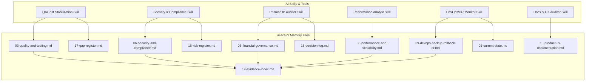

# MCP AND SKILLS ACCELERATION PLAN WITH AI-BRAIN GOVERNANCE

## 1. Executive Summary
تأسست هذه الوثيقة كخطة عمل معتمدة لتسريع التطوير ورفع جودة وأمان أنظمة **Nama Invest ERP** بالاعتماد على تكامل خوادم بروتوكول التحكم بالنموذج (**MCP Servers**)، وتصميم مهارات الذكاء الاصطناعي المخصصة (**AI Skills**)، وتركيب أدوات الجودة والأمان التكميلية (**Add-ons & Tools**). 

يرتكز هذا المخطط على فلسفة **الحوكمة الشاملة لذاكرة المشروع الموحدة** ومبدأ **التقييد التام للقراءة فقط أولاً (Read-Only First)** لحماية العمليات المحاسبية وعزل فضاء المستأجرين، مع ربط كل أداة أو مهارة بمسؤولية التغذية والتحديث التلقائي والمدعوم بالأدلة لملفات `.ai-brain/` المركزية.

---

## 2. Current Baseline
حسب أحدث تقييم حقيقي للفحوصات الحية ومطابقة هياكل المشروع في قاعدة الأدلة المؤقتة (`TEMPORARY_EVIDENCE_BASELINE`):

| المجال الفني والتشغيلي | المقاييس الحالية والحالة المعتمدة | الفجوات البرمجية والأخطاء المرصودة | ملف `.ai-brain` المستهدف |
| --------------------- | --------------------------------- | ---------------------------------- | ------------------------- |
| **Testing & Runners** | `FAIL` (Jest & Vitest) | تداخل بيئات التشغيل، تعطل Jest بسبب خطأ `TS5011` وتوقف Vitest لخلط الموكس. | `03-quality-and-testing.md` |
| **Test Coverage** | `COVERAGE_NOT_GENERATED` | تعذر سحب تقرير التغطية الموحد لتعارض إعدادات التجميع والمترجمين. | `03-quality-and-testing.md` |
| **ESLint & Linting** | `FAIL` (12,174 مشكلة نشطة) | تتركز المشاكل في استخدام `any` والـ unused variables بملفات الاختبارات. | `03-quality-and-testing.md` |
| **API Protection** | `PARTIAL` | احتمال وجود مسارات فرعية مستحدثة تستدعي Prisma Client مباشرة دون غلاف. | `04-api-and-tenant-isolation.md`|
| **Tenant Isolation** | `PARTIAL_TEST_VERIFIED` | نجاح 4 اختبارات عزل أمني مسجلة دون إثبات التغطية الشاملة لكافة المسارات. | `04-api-and-tenant-isolation.md`|
| **Database Audit** | `COMPLETE_BY_SCHEMA` | خلو بعض نماذج الجداول الكبيرة في المخطط من الفهارس المخصصة لـ `tenantId`. | `05-financial-governance.md` |
| **Saudi Compliance** | `PARTIAL` | عدم إثبات الربط الفعلي للإنتاج لـ ZATCA والشهادات الحية للمستأجرين الجدد. | `07-saudi-compliance.md` |
| **Security & Secrets**| `NEEDS_EVIDENCE` | غياب تقارير فحص gitleaks أو trufflehog المعتمدة في السجل التاريخي لـ Git. | `06-security-and-compliance.md` |
| **DevOps & DR** | `PRODUCTION_NOT_VERIFIED` | تجميد الإنتاج بالكامل وعدم توفر أدلة اختبار حية لتمرين استعادة البيانات. | `09-devops-backup-rollback-dr.md`|
| **Performance Budget**| `UNKNOWN` | غياب تقارير فحص الأداء أو قياس RPS للمحركات المالية تحت الضغط. | `08-performance-and-scalability.md`|

---

## 3. Objectives
1. **تأمين بيئة الفحوصات والاعتماديات**: حل مشكلات تجميع TypeScript وتوليد الـ Coverage التراكمي الموحد.
2. **أتمتة حوكمة `.ai-brain`**: حظر الادعاءات الإنشائية وإلزام ربط كل قرار أو تعديل بدليل مبرهن بالرمز والتاريخ.
3. **تطبيق سياسة عزل الأسرار والأمان**: حظر وصول خوادم MCP ووكلاء الذكاء للملفات الحساسة وبيانات الإنتاج الحية.
4. **توطيد أدوات القياس والمراقبة**: تركيب أدوات قياس الأداء والأمن والامتثال ضريبياً وقانونياً بشكل متسلسل وآمن.

---

## 4. Strict Safety Rules
- **القراءة فقط أولاً (Read-Only First)**: تحظر كافة صلاحيات الكتابة أو ترحيل القيود أو تعديل الكود التشغيلي أو المخططات على الإنتاج الفعلي.
- **عزل قواعد البيانات والإنتاج**: يمنع منعاً باتاً تشغيل استعلامات تعديل (`UPDATE`, `DROP`, `DELETE`) أو prisma db push.
- **حظر ترحيل المعاملات الحية**: يمنع تشغيل معاملات ZATCA أو البنوك أو قيود التوحيد على بيئة الإنتاج للعملاء.
- **منع استخلاص أو طباعة الأسرار والرموز**: تصفية وحجب ملفات `.env` وشهادات ومفاتيح SSH من ذاكرة الـ MCP.

---

## 5. AI-Brain Governance Requirement
- **مصدر الحقيقة الوحيد**: كل قرار برمجي أو معماري، فجوة مكتشفة، خطر نشط، أو خطوة تالية يجب كتابتها وتوثيقها في مسارها المحدد داخل مجلد `.ai-brain/`.
- **التصنيف الإلزامي للأدلة**: يمنع استخدام كلمات "مكتمل" أو "آمن" دون إلحاق تصنيفات القوة الرسمية:
  - `VERIFIED_BY_CODE` (مثبت في الكود).
  - `VERIFIED_BY_SCHEMA` (مطابق لمخطط قاعدة البيانات).
  - `VERIFIED_BY_TEST` (ناجح بموجب فحص آلي).
  - `VERIFIED_BY_COMMAND` (مثبت بسجل أوامر الخادم).
  - `NEEDS_EVIDENCE` / `NOT_VERIFIED` (معلومات غير مبرهنة تتطلب تدقيقاً).

---

## 6. Required Skills

يتم تصميم وتفعيل مهارات الذكاء الاصطناعي (AI Skills) المخصصة للتأهيل والحوكمة وفقاً للمخطط التالي:

| اسم المهارة (Skill Name) | الغرض الفني والتشغيلي | المدخلات الأساسية | المخرجات الموثقة | صلاحيات المهارة البرمجية | ملفات `.ai-brain` المستهدفة بالتحديث | المخاطر المحتملة للمهارة | الأولوية | عبارة الموافقة المطلوبة |
| ------------------------ | --------------------- | ----------------- | ---------------- | ------------------------- | ------------------------------------- | ------------------------ | -------- | ----------------------- |
| **QA/Test Stabilization** | معالجة تعارضات TypeScript وتجميع Jest وإصلاح موكس Vitest وتوليد التغطية. | ملفات `jest.config.ts`, `vitest.config.ts`, `package.json`. | `TEST_INFRA_STABILIZATION_REPORT.md` | `READ_ONLY`, `REPORT_WRITE`. | `03-quality-and-testing.md`, `17-gap-register.md`. | تعديل إعدادات المترجم الرئيسي مما يكسر بناء الويب. | `P0_BLOCKER` | `GO_FOR_TEST_RUNNER_MCP_ONLY` |
| **Brain Governance** | حوكمة وتحديث ذاكرة المشروع ومنع الادعاءات غير المثبتة وتكامل الفهارس. | تقارير الجلسات الحية وسجل المعاملات والـ commits. | `BRAIN_CONSISTENCY_REPORT.md` ومستندات الذاكرة المحدثة. | `READ_ONLY`, `AI_BRAIN_WRITE`. | كافة ملفات `.ai-brain` الـ 20 بالكامل. | حذف تاريخ قديم أو خلط التحديثات غير المدعومة بالدليل. | `P0_BLOCKER` | `GO_FOR_BRAIN_GOVERNANCE_AUTOMATION_ONLY` |
| **API & Tenant Guard** | مراجعة حراس الصلاحيات وتدقيق الـ RBAC وعزل مسارات المستأجرين وحظر raw SQL. | مسارات `src/app/api` وكود غلاف `withRoute` المركزي. | `API_ROUTE_PROTECTION_MATRIX.csv` وتدقيق استدعاءات Prisma. | `READ_ONLY`, `REPORT_WRITE`. | `04-api-and-tenant-isolation.md`, `16-risk-register.md`. | إغفال مسار API أو السماح بالاتصال المباشر بقاعدة البيانات. | `P1_HIGH` | `GO_FOR_API_TENANT_ISOLATION_AUDIT_ONLY` |
| **Database Auditor** | مطابقة فهارس الجداول لـ `tenantId` والتحقق من pool والبيانات الحساسة. | مخطط `prisma/schema.prisma` وهجرات قاعدة البيانات. | `DATABASE_INDEX_REVIEW.md` وتقرير تدقيق العلاقات. | `READ_ONLY`, `REPORT_WRITE`. | `05-financial-governance.md`, `17-gap-register.md`. | تطبيق migration هدامة أو db push قسري. | `P1_HIGH` | `GO_FOR_PRISMA_SCHEMA_AUDIT_TOOLING_ONLY` |
| **Security & Compliance** | تشغيل gitleaks و trufflehog وفحص أمان الجلسات وحماية المرفقات والملفات. | مستودع Git التاريخي وإعدادات التوثيق والكوكيز. | `SECURITY_HARDENING_REPORT.md` وتقرير فحص الثغرات الحيوية. | `READ_ONLY`, `REPORT_WRITE`. | `06-security-and-compliance.md`, `16-risk-register.md`. | تسريب أو قراءة مفاتيح سرية وعرضها بالـ logs. | `P1_HIGH` | `GO_FOR_SECURITY_SCANNERS_SETUP_ONLY` |
| **Saudi Localization** | تدقيق توقيع XML وحسابات الـ SIF ومطابقة الفاتورة ومستحقات GOSI. | كود محرك ZATCA وكود توليد ملفات حماية الأجور. | `SAUDI_COMPLIANCE_EVIDENCE_PACK.md` ومصفوفة التدقيق الضريبي. | `READ_ONLY`, `REPORT_WRITE`. | `07-saudi-compliance.md`, `19-evidence-index.md`. | تجربة إرسال مباشر لخادم الإنتاج الضريبي لـ ZATCA. | `P1_HIGH` | `GO_FOR_SAUDI_COMPLIANCE_CERTIFICATION_TRACK_ONLY`|
| **DevOps & DR Monitor** | مراجعة سلامة النشر وملفات PM2 واستعادة النسخ الاحتياطية وتتبع التراجع. | ملفات النشر ومخططات الـ backups واستعادة الاستمرارية RTO. | `DEVOPS_READINESS_REPORT.md` ودليل التراجع والـ rollback. | `READ_ONLY`, `REPORT_WRITE`. | `09-devops-backup-rollback-dr.md`, `18-decision-log.md`.| التعديل على ملفات PM2 الحية أو خوادم الإنتاج المفتوحة. | `P2_MEDIUM` | `GO_FOR_CI_READ_ONLY_INTEGRATION_ONLY` |
| **Performance Analyst** | مراقبة سرعة استجابة العمليات الـ 20 وحساب p95 وحظر N+1 queries. | كود العمليات الحساسة وملفات فحوص الضغط k6. | `PERFORMANCE_BASELINE_REPORT.md` وموازين الاستجابة للضغط. | `READ_ONLY`, `REPORT_WRITE`. | `08-performance-and-scalability.md`, `16-risk-register.md`.| توليد حمل ضغط عالٍ يؤثر على عمل خوادم Staging أو الإنتاج. | `P2_MEDIUM` | `GO_FOR_PERFORMANCE_AND_SCALABILITY_BASELINE_ONLY`|
| **Docs & UX auditor** | حظر البليس هولدرز والتحقق من تعريب RTL وتكامل كتيبات المستخدمين. | صفحات الواجهة `page.tsx` وملفات ar.json وصور التصميم. | `PRODUCT_UX_READINESS_REPORT.md` والأدلة التدريبية. | `READ_ONLY`, `REPORT_WRITE`. | `10-product-ux-documentation.md`, `20-next-actions.md`. | تعديل كود الواجهات العميل أو كسر اتساق التصاميم. | `P3_LOW` | `GO_FOR_PRODUCT_UX_DOCUMENTATION_READINESS_ONLY` |

---

## 7. Recommended MCP Servers

يتم تحديد وتأمين خوادم بروتوكول التحكم بالنموذج (MCP Servers) المقترحة وصلاحياتها وفقاً للضوابط الأمنية التالية:

| كود الخادم | اسم خادم الـ MCP | الغرض والهدف والمهام المصرحة | حدود الصلاحية والأمان (Permissions) | الممنوعات البرمجية والتشغيلية (Deny List) | ملفات `.ai-brain` المسؤولة عن تحديثها | ظروف وتوقيت الاستخدام | الأولوية |
| ---------- | ---------------- | ---------------------------- | ---------------------------------- | ----------------------------------------- | ------------------------------------- | --------------------- | -------- |
| **MCP-01** | **Repository / GitHub Read** | فحص ملفات workflows وفروع Git وسجل التغييرات الحيوية للمشروع. | `READ_REPO`, `READ_BRANCHES`, `READ_WORKFLOWS`. | `NO_PUSH`, `NO_MERGE`, `NO_DELETE`. | `19-evidence-index.md`, `20-next-actions.md`. | عند رصد تغييرات تكوين البناء البرمي وفحوص CI. | `P1_HIGH` |
| **MCP-02** | **Filesystem MCP Limited** | قراءة كود المشروع وكتابة تقارير الفحص والتدقيق وتحديث ملفات الذاكرة. | `READ_PROJECT`, `WRITE_REPORTS`, `WRITE_AI_BRAIN`. | `NO_RUNTIME_CODE_WRITE`, `NO_ENV_READ`, `NO_SECRET_READ`. | كافة ملفات `.ai-brain` المصرح بها فقط. | مستخدم باستمرار لكتابة التقارير والذاكرة السليمة. | `P0_BLOCKER`|
| **MCP-03** | **Safe Shell MCP** | تشغيل الفحوص الآمنة وصحة الأنواع وصياغة الكود والملفات المحدثة. | `git status`, `npm run typecheck`, `npm run lint`. | `rm`, `del`, `git reset --hard`, `git push`, `deploy`. | `01-current-state.md`, `19-evidence-index.md`. | تشغيل فحوصات الجودة والتحقق من صحة الأنواع برمجياً. | `P0_BLOCKER`|
| **MCP-04** | **Test Runner MCP** | تشغيل وحصر فحوص Jest و Vitest وسحب مخرجات نجاح الاختبارات محلياً. | `npx jest --listTests`, `npx vitest run tests/`. | `npm run test:e2e` (على الإنتاج), `npm install`. | `03-quality-and-testing.md`, `17-gap-register.md`. | تشغيل وإصلاح دورة الاختبارات مع تجميد الإنتاج. | `P0_BLOCKER`|
| **MCP-05** | **Prisma Schema Audit** | مطابقة فهارس جداول قاعدة البيانات والتحقق من متانة العلاقات. | `npx prisma validate`, `npx prisma format`. | `npx prisma db push`, `npx prisma db seed`. | `05-financial-governance.md`, `16-risk-register.md`. | تدقيق جداول قاعدة البيانات وعزل المستأجرين. | `P1_HIGH` |
| **MCP-06** | **PostgreSQL Read-Only** | قراءة عينات بيانات معزولة للـ Tenants على بيئة Staging فقط. | `SELECT` فقط، عزل الاتصالات مع Staging DB. | `INSERT`, `UPDATE`, `DROP`, `DELETE`, `production connection`.| `05-financial-governance.md`, `19-evidence-index.md`. | التحقق من مطابقة الحسابات والقيود التجريبية. | `P2_MEDIUM` |
| **MCP-07** | **Security Scanner** | تشغيل gitleaks و trufflehog وفحص حزم الاعتماديات. | تشغيل أدوات الفحص المكتبي والمسح المعزول للمستودع. | `NO_EXTERNAL_PUSH`, `NO_EXPOSING_SECRETS`. | `06-security-and-compliance.md`, `16-risk-register.md`. | تشغيل دورة فحص الأمان وتصفير المفاتيح الحساسة. | `P1_HIGH` |
| **MCP-08** | **CI/CD Read-Only** | فحص مسارات النشر وحالة السيرفر والتحقق من سلامة البناء بالـ staging. | قراءة ملفات workflows ومراجعة سجلات نجاح الـ build. | `NO_MODITY_WORKFLOW`, `NO_AUTO_DEPLOY`. | `09-devops-backup-rollback-dr.md`, `19-evidence-index.md`.| مراجعة كفاءة واستقرار خطوط النشر الآلية. | `P2_MEDIUM` |
| **MCP-09** | **Production Health Read-Only**| مراقبة حالة توفر الخوادم واستدعاء كود المراقبة المعزول خارجياً. | قراءة سجلات Sentry العامة ومقاييس الاستجابة الحية. | `PM2 restart/reload`, `SSH write`, `NO_DB_WRITE`. | `01-current-state.md`, `09-devops-backup-rollback-dr.md`.| لا يستخدم إلا بظروف طوارئ وبموافقة منفصلة. | `P2_MEDIUM` |
| **MCP-10** | **Documentation / Brain** | الفهرسة الآلية للذاكرة البرمجية والتأكد من اتساق الشجرة المعرفية. | قراءة وكتابة ملفات الـ markdown لـ `.ai-brain/`. | `NO_RUNTIME_CODE_WRITE`, `NO_DELETE_BRAIN_FILES`. | كامل ملفات `.ai-brain` بالتوافق والربط. | فحص وتصحيح روابط الذاكرة ومنع التضارب للملفات. | `P0_BLOCKER`|

---

## 8. Recommended Add-ons and Tools

يتم تحديد وتصنيف الأدوات والمكتبات البرمجية التكميلية (Add-ons & Tools) لتأهيل جودة وتكامل الأنظمة وفقاً للجدول التالي:

| اسم الأداة (Tool) | المجال الفني والوظيفي | الهدف ولماذا نحتاجها برمجياً؟ | مرحلة التركيب والتهيئة | تأثير القراءة/الكتابة | ملف `.ai-brain` المستهدف | المخاطر والتهديدات |
| ----------------- | --------------------- | ---------------------------- | --------------------- | --------------------- | ------------------------ | ------------------ |
| **jest / ts-jest** | Quality / Testing | تجميع وتشغيل اختبارات التكامل ومسارات الـ APIs المحمية بنجاح. | `Phase 1` (عاجل) | Read-only للإنتاج، كتابة ملفات التكوين محلياً. | `03-quality-and-testing.md` | تداخل إعدادات ts-jest مع المترجم الرئيسي للمشروع. |
| **vitest** | Quality / Testing | تشغيل اختبارات الـ Unit السريعة والمحركات المعزولة بمرونة وحل خطأ الموكس. | `Phase 1` (عاجل) | Read-only للإنتاج، كتابة وتحديث ملفات التهيئة. | `03-quality-and-testing.md` | تعارض مكتبات الموك مع Jest في المجلد العام للاختبارات. |
| **eslint-plugin-security**| Code Quality | فحص وحظر الممارسات البرمجية الهشة وثغرات استخدام جافا سكريبت غير الآمن. | `Phase 2` | Read-only للكود، كتابة تحذيرات الفحص. | `03-quality-and-testing.md` | توليد عدد كبير جداً من التنبيهات مما يربك المطورين. |
| **gitleaks / trufflehog**| Security Scan | الفحص التاريخي لمستودع الكود ومنع ترحيل كلمات المرور أو المفاتيح السرية. | `Phase 5` | Read-only لكود Git، كتابة تقارير الفحص. | `06-security-and-compliance.md` | تعثر سحب الكود في حال وجود شهادة حقيقية تاريخية. |
| **semgrep / CodeQL**| Security Scan | الفحص المعمق لمسارات تدفق البيانات البرمجية ومنع SQL Injection والأمن الهش. | `Phase 5` | Read-only للكود، توليد مصفوفة الأمان. | `06-security-and-compliance.md` | طول زمن تشغيل الفحص البرمجي في خوادم الـ CI. |
| **prisma validate / format**| Database Audit | التحقق من صحة صياغة مخطط قاعدة البيانات وتناسق الحقول وتكامل العلاقات. | `Phase 3` | Read-only للمخطط، تنسيق هيكلي صامت. | `05-financial-governance.md` | إجراء db push بالخطأ في حال خلط الأوامر لقاعدة البيانات. |
| **dependency-cruiser**| Architecture Audit | تتبع ورسم مسارات ومخططات تدفق الاتصالات البرمجية وحظر استدعاء Prisma المباشر. | `Phase 3` | Read-only للكود، توليد شجرة العلاقات. | `04-api-and-tenant-isolation.md`| زيادة زمن تشغيل البناء لتعقيد تتبع الروابط البرمجية. |
| **k6 / autocannon** | Performance | محاكاة فحوص الضغط العالي والتحقق من مرونة وسرعة استجابة العمليات الـ 20 الكبرى.| `Phase 7` | Read-only للـ APIs، توليد مخرجات الأداء. | `08-performance-and-scalability.md`| حدوث بطء في خوادم Staging أثناء محاكاة الحمل المتزامن. |
| **lighthouse** | UX / Performance | قياس سرعة تحميل الشاشات وتجاوب RTL وسهولة استخدام واجهات الكاشير والـ POS. | `Phase 9` | Read-only للشاشات، توليد مقاييس UX. | `10-product-ux-documentation.md` | تباين المقاييس بناءً على مواصفات وسرعة خادم الفحص. |
| **redocly / typedoc**| Documentation | التوليد الآلي لوثائق الـ APIs وأدلة المطورين المعزولة وهياكل الـ SDK. | `Phase 9` | Read-only للكود، توليد مستندات الويب. | `10-product-ux-documentation.md` | كشف بعض مسارات الـ APIs الحساسة غير الموثقة للعامة. |

---

## 9. Brain Governance Automation Design

تأسيس نظام أتمتة حوكمة ذاكرة المشروع لضمان دقة وتكامل السجلات وتحديثها تلقائياً بالاعتماد على الفحوصات الحية للأدوات:

### ⚙️ السكربتات المبرمجة لحوكمة الذاكرة (Automation Scripts)

| اسم السكربت البرمجي (Script) | الغرض الفني والتشغيلي للسكربت | المدخلات الأساسية | المخرجات البرمجية المتوقعة | صلاحيات الكتابة المحددة | ملفات `.ai-brain` المستهدفة بالتحديث |
| ---------------------------- | ----------------------------- | ----------------- | -------------------------- | ----------------------- | ------------------------------------- |
| `scripts/brain/update-current-state.ts` | تحديث الالتزام النشط (HEAD) وإحصائيات الكود الفعلية (عدد الملفات والمسارات والجداول). | مخرجات أوامر Git وسطر الأوامر المباشرة. | تحديث مستند الحالة الحالي. | `AI_BRAIN_WRITE` | [01-current-state.md](./01-current-state.md) |
| `scripts/brain/update-quality-status.ts` | سحب وتحديث حالة صحة الأنواع ونتائج Jest و Vitest ونسب التغطية التراكمية الموحدة. | ملفات `coverage-summary.json` ومخرجات الفحوص. | جدول مقاييس الجودة الحية. | `AI_BRAIN_WRITE` | [03-quality-and-testing.md](./03-quality-and-testing.md) |
| `scripts/brain/update-gap-register.ts` | مزامنة سجل الفجوات الحيوية وتعديل حالة إغلاق الفجوات الـ 4 برمجياً. | ملف تقرير الفجوات المحدث وسجل التدقيق. | تحديث وحصر جدول الفجوات. | `AI_BRAIN_WRITE` | [17-gap-register.md](./17-gap-register.md) |
| `scripts/brain/update-risk-register.ts` | تحديث سجل المخاطر الـ 20 وتعديل مستويات الشدة وقوة الأدلة بناءً على فحوص الأمان. | تقارير Trufflehog و Semgrep. | جدول المخاطر والمحاكاة الحية. | `AI_BRAIN_WRITE` | [16-risk-register.md](./16-risk-register.md) |
| `scripts/brain/update-decision-log.ts` | تسجيل القرارات المعمارية الجديدة (ADR) وتثبيت صياغتها وتصنيف حالتها. | ملفات ADR المقترحة في الجلسة. | إدراج القرار في سجل القرارات. | `AI_BRAIN_WRITE` | [18-decision-log.md](./18-decision-log.md) |
| `scripts/brain/update-evidence-index.ts`| فهرسة وتدوين كافة تقارير الجلسات المعتمدة الحالية وربطها بالكامل. | مسارات التقارير البرمجية المستحدثة. | تحديث جدول فهارس الأدلة. | `AI_BRAIN_WRITE` | [19-evidence-index.md](./19-evidence-index.md) |
| `scripts/brain/check-brain-consistency.ts`| فحص سلامة اتساق روابط الذاكرة البرمجية ومنع التضارب بين التقارير وملفات الـ Brain. | كامل مجلد `.ai-brain/` والتقارير. | تقرير اتساق الذاكرة وتنبيه الأخطاء.| `READ_ONLY` | لا يحدث، فحص ومراقبة فقط. |
| `scripts/brain/validate-evidence-tags.ts`| فحص وتدقيق تصنيفات القوة البرمجية للأدلة المضافة ومنع الادعاءات غير المثبتة. | نصوص التحديثات الممررة للذاكرة. | حظر الكتابة في حال غياب الأدلة. | `READ_ONLY` | لا يحدث، فلترة ومراقبة صامتة. |

### ⛔ القواعد الذهبية لسكربتات حوكمة الذاكرة
1. **حظر الإلغاء والحذف**: يمنع السكربت حذف التاريخ والبيانات القديمة للذاكرة، ويقوم بنقل التقارير المؤرشفة لقسم مخصص للـ Archival.
2. **منع الترقية غير المثبتة لـ Status**: يمنع السكربت ترقية حالة أي فجوة أو خطر إلى "VERIFIED" أو "MITIGATED" ما لم يمرر له معامل الدليل والقرينة الحية الموثقة.
3. **توليد سجل التغيير الموحد**: ينتج عن كل تشغيل لأي سكربت حوكمة تحديث فوري لملف `BRAIN_UPDATE_LOG.md` يوضح التغير الفعلي والمستخدم والسبب.

---

## 10. MCP Security Model
يتم صياغة وتطبيق نظام حماية صارم ومنيع لخوادم MCP يمنع حدوث أي وصول غير مصرح أو خروقات أمنية للأنظمة:

### 🛡️ فئات الصلاحيات المعتمدة (Permission Classes)
- **`READ_ONLY`**: صلاحية قراءة الملفات البرمجية وفحص الإعدادات وهياكل قاعدة البيانات صامتاً.
- **`REPORT_WRITE`**: صلاحية كتابة التقارير والمستندات التوضيحية بصيغة markdown حصراً.
- **`AI_BRAIN_WRITE`**: صلاحية تحديث ملفات ذاكرة المشروع لـ `.ai-brain/` بموجب التحقق من الأدلة.
- **`TEST_RUN`**: صلاحية استدعاء تشغيل وتجميع الاختبارات للحصول على مخرجات النجاح والـ Coverage.
- **`SECURITY_SCAN`**: صلاحية تشغيل أدوات الفحص المحلي gitleaks و Semgrep للمستودع الكود.
- **`DB_READ_ONLY`**: صلاحية الاتصال وقراءة قواعد بيانات معزولة للـ Tenants على بيئة Staging فقط.

---

## 11. Permission Matrix

يوضح الجدول التالي توزيع الصلاحيات المسموحة والمحجوبة لكل خادم MCP بدقة وتفصيل:

| كود الخادم | **READ_ONLY** | **REPORT_WRITE** | **AI_BRAIN_WRITE** | **TEST_RUN** | **SECURITY_SCAN** | **DB_READ_ONLY** | **الموافقة المطلوبة** |
| ---------- | :-----------: | :--------------: | :----------------: | :----------: | :---------------: | :--------------: | --------------------- |
| **MCP-01** | `ALLOWED` | `DENIED` | `DENIED` | `DENIED` | `DENIED` | `DENIED` | موافقة مسبقة للنظام. |
| **MCP-02** | `ALLOWED` | `ALLOWED` | `ALLOWED` | `DENIED` | `DENIED` | `DENIED` | موافقة مسبقة لكتابة الذاكرة. |
| **MCP-03** | `ALLOWED` | `DENIED` | `DENIED` | `ALLOWED` | `DENIED` | `DENIED` | موافقة مسبقة لتشغيل أوامر tsc. |
| **MCP-04** | `ALLOWED` | `DENIED` | `DENIED` | `ALLOWED` | `DENIED` | `DENIED` | موافقة لتشغيل اختبارات Jest. |
| **MCP-05** | `ALLOWED` | `DENIED` | `DENIED` | `DENIED` | `DENIED` | `DENIED` | موافقة لفحص مخطط قاعدة البيانات. |
| **MCP-06** | `DENIED` | `DENIED` | `DENIED` | `DENIED` | `DENIED` | `ALLOWED` | موافقة صريحة ومنفصلة لـ Staging. |
| **MCP-07** | `ALLOWED` | `DENIED` | `DENIED` | `DENIED` | `ALLOWED` | `DENIED` | موافقة لتشغيل gitleaks المحلي. |
| **MCP-08** | `ALLOWED` | `DENIED` | `DENIED` | `DENIED` | `DENIED` | `DENIED` | موافقة لقراءة workflows. |
| **MCP-09** | `DENIED` | `DENIED` | `DENIED` | `DENIED` | `DENIED` | `DENIED` | حظر تام، لا يستخدم إلا للطوارئ. |
| **MCP-10** | `ALLOWED` | `ALLOWED` | `ALLOWED` | `DENIED` | `DENIED` | `DENIED` | موافقة مسبقة وتكامل صامت للـ Brain.|

---

## 12. Deny List
يحظر تماماً ويمنع حظراً فيزيائياً ومباشراً على كافة خوادم الـ MCP ووكلاء الذكاء ما يلي:

### 🔒 الملفات والأسرار المحجوبة تماماً (Forbidden Paths)
- **ملفات المتغيرات البيئية السرية**: `.env`, `.env.local`, `.env.production`.
- **شهادات ومفاتيح الاتصال المشفرة**: مفاتيح SSH (`id_rsa`, `id_ed25519`), شهادات HTTPS والمفاتيح الخاصة للعملاء.
- **قواعد بيانات الإنتاج الحية**: كلمات مرور قواعد البيانات الحية للإنتاج وعناوين الاتصال بخدمات المجموعات.

### 🚫 الأوامر والعمليات المحظورة كلياً (Forbidden Commands)
- **تعديل مخططات وهجرات قاعدة البيانات**: `npx prisma db push --force-reset`, `npx prisma migrate dev`, `DROP`, `ALTER`.
- **العمليات الهدامة وتغيير الكود التشغيلي**: `rm -rf`, `del /s`, `mv`, `git reset --hard`, `git clean -fd`.
- **عمليات النشر والتحكم بالخوادم الحية**: `pm2 restart`, `pm2 reload`, `deploy.js`, `SSH write`.
- **عمليات الدفع والتعديل على Git**: `git push`, `git merge`, `git delete`.

---

## 13. Installation and Activation Waves

يتم تقسيم تركيب وتهيئة خوادم MCP والأدوات التكميلية لـ 5 موجات متسلسلة لضمان الأمان وعدم تعارض الأنظمة:

| موجة التركيب (Wave) | الأدوات والخوادم المستهدفة | الهدف الفني للتركيب | فئات الصلاحية المفعلة | ملف `.ai-brain` المستهدف بالتحديث | شروط البدء وبوابات الموافقات | بوابات النجاح للموجة (Success Gate) |
| ------------------ | ------------------------- | ------------------- | --------------------- | --------------------------------- | ---------------------------- | ----------------------------------- |
| **Wave 1** | MCP-01, MCP-02, MCP-03, MCP-04, scripts/brain/ | تأسيس بيئة الفحص الآمنة صامتاً وحل تجميع اختبارات TypeScript. | `READ_ONLY`, `REPORT_WRITE`, `AI_BRAIN_WRITE`, `TEST_RUN`. | `01-current-state.md`, `03-quality-and-testing.md`. | موافقة صريحة: `GO_FOR_SAFE_READ_ONLY_MCP_FOUNDATION_ONLY` | نجاح تجميع كافة الاختبارات بـ 0 خطأ تحت Jest و Vitest محلياً. |
| **Wave 2** | gitleaks, Semgrep, eslint-plugin-security, MCP-07 | تشغيل فحوص الأمان ومطابقة الكود وتصفير المفاتيح الحساسة برمجياً. | `READ_ONLY`, `SECURITY_SCAN`. | `06-security-and-compliance.md`, `16-risk-register.md`. | موافقة صريحة: `GO_FOR_SECURITY_SCANNERS_SETUP_ONLY` | خلو مستودع الكود بالكامل من الثغرات العالية وصفر مفاتيح حساسة. |
| **Wave 3** | MCP-05, prisma-dbml-generator, redocly, typedoc | تدقيق جداول قاعدة البيانات وتوليد المخططات الهيكلية ووثائق المطورين. | `READ_ONLY`. | `05-financial-governance.md`, `10-product-ux-documentation.md`.| موافقة صريحة: `GO_FOR_PRISMA_SCHEMA_AUDIT_TOOLING_ONLY` | صحة صياغة مخطط قاعدة البيانات وتوليد مستندات الـ APIs وتوثيقها. |
| **Wave 4** | MCP-06, MCP-08, k6, autocannon | محاكاة فحوص الضغط العالي ومراجعة بيئة Staging وتكامل workflows. | `READ_ONLY`, `DB_READ_ONLY` (معزول). | `08-performance-and-scalability.md`, `09-devops-backup-rollback-dr.md`.| موافقة صريحة: `GO_FOR_DB_READ_ONLY_MCP_TEST_ONLY` | تسجيل مقاييس الاستجابة لـ k6 وتأمين مسارات النشر الآلية للـ CI. |
| **Wave 5** | MCP-09, PM2 metrics, backup restore playbooks | مراقبة خوادم الإنتاج صامتاً واختبار خطط الطوارئ DR واستعادة البيانات. | `READ_ONLY`, `PRODUCTION_HEALTH_READ_ONLY`. | `01-current-state.md`, `09-devops-backup-rollback-dr.md`.| موافقة صريحة: `GO_FOR_PRODUCTION_HEALTH_READ_ONLY_MCP_ONLY`| نجاح تمرين محاكاة استعادة قواعد البيانات والتأكد من Uptime الخادم. |

---

## 14. Risk Register

تتم مراجعة وحصر المخاطر التقنية والتشغيلية المترتبة على تكامل خوادم الـ MCP وتفعيل المهارات وفقاً للمصفوفة التالية:

| كود الخطر | تفاصيل خطر تكامل الأدوات والـ MCP | شدة الخطر | احتمالية الخطر | الأثر الفني والتشغيلي المتوقع | إجراءات التخفيف والوقاية من الخطر | ملف `.ai-brain` المستهدف |
| --------- | ---------------------------------- | --------- | -------------- | ----------------------------- | --------------------------------- | ------------------------ |
| **RK-MCP-01**| محاولة خادم MCP قراءة أسرار أو كلمات مرور من ملف `.env` وعرضها بالـ logs. | **HIGH** | `MEDIUM` | تسريب شهادات ومفاتيح اتصال العملاء وهوياتها. | فرض حظر فيزيائي مشدد بـ Deny list يمنع قراءة أو سحب ملف `.env` كلياً. | `06-security-and-compliance.md` |
| **RK-MCP-02**| قيام وكيل الذكاء بتعديل كود المحركات البرمجية أو المخططات دون مراجعة أو موافقة مسبقة. | **HIGH** | `LOW` | كسر بناء الكود التشغيلي أو إحداث أخطاء تراجعية بالمعادلات المالية. | حظر صلاحيات الكتابة للكود كلياً للـ MCP وقصرها على التقارير والذاكرة فقط. | `03-quality-and-testing.md` |
| **RK-MCP-03**| تشغيل أوامر هدامة لقواعد البيانات أو مسح الملفات بقواعد الإنتاج بالخطأ. | **CRITICAL**| `LOW` | فقدان البيانات الحساسة وتعطل كامل لخدمات المنصة السحابية للعملاء. | الحظر التام بالـ Deny list لأوامر rm, del, drop, db push وعزل خوادم Staging. | `09-devops-backup-rollback-dr.md`|
| **RK-MCP-04**| انحراف ذاكرة المشروع وكتابة وتحديث `.ai-brain` ببيانات إنشائية غير مبرهنة بدليل. | **MEDIUM**| `HIGH` | فقدان موثوقية الذاكرة والتلبيس على الوكلاء اللاحقين بمعلومات غير صحيحة. | فرض سكربت فلترة وتدقيق الأدلة `validate-evidence-tags.ts` تلقائياً. | `01-current-state.md` |

---

## 15. Approval Gates
يتم حظر وإخضاع كافة خطوات تفعيل الـ MCP والمهام التشغيلية لبوابات وموافقات صريحة وموثقة في سجل الموافقات الحرة:

- **عبارة تفعيل الخطة التخطيطية الكلية**:
  ```text
  GO_FOR_MCP_AND_SKILLS_ACCELERATION_PLAN_ONLY
  ```
- **عبارة تفعيل الموجة الأولى (المحلي المعزول وصيانة تجميع الاختبارات)**:
  ```text
  GO_FOR_SAFE_READ_ONLY_MCP_FOUNDATION_ONLY
  ```
- **عبارة تفعيل حوكمة الذاكرة وأتمتتها**:
  ```text
  GO_FOR_BRAIN_GOVERNANCE_AUTOMATION_ONLY
  ```
- **عبارة تفعيل مهارة وأدوات تشغيل الفحوصات**:
  ```text
  GO_FOR_TEST_RUNNER_MCP_ONLY
  ```
- **عبارة تفعيل أدوات الفحص الأمني gitleaks/trufflehog**:
  ```text
  GO_FOR_SECURITY_SCANNERS_SETUP_ONLY
  ```
- **عبارة تفعيل فحص مخططات قاعدة البيانات وعلاقات الجداول**:
  ```text
  GO_FOR_PRISMA_SCHEMA_AUDIT_TOOLING_ONLY
  ```
- **عبارة تفعيل مراجعةworkflows وسلامة النشر الآلي**:
  ```text
  GO_FOR_CI_READ_ONLY_INTEGRATION_ONLY
  ```
- **عبارة تفعيل قراءة قواعد بيانات Staging المعزولة**:
  ```text
  GO_FOR_DB_READ_ONLY_MCP_TEST_ONLY
  ```
- **عبارة تفعيل فحوص استقرار الإنتاج صامتاً**:
  ```text
  GO_FOR_PRODUCTION_HEALTH_READ_ONLY_MCP_ONLY
  ```
- **عبارة تفعيل بوابات الموافقة البرمجية للمراحل اللاحقة**:
  ```text
  GO_FOR_CONTROLLED_WRITE_AUTOMATION_DESIGN_ONLY
  ```

---

## 16. .ai-brain Update Matrix

تلتزم الأدوات والمهارات بتوجيه مخرجاتها وفحوصاتها لتغذية وتحديث ملفات ذاكرة المشروع وفقاً للمخطط التالي:



---

## 17. Recommended First Step
تخلص التوصية الهندسية والمعمارية للمشروع إلى البدء الفوري لاحقاً بتهيئة خوادم وأدوات الموجة الأولى المحددة صامتاً ومعزولاً بشكل كامل، وبموجب التوقيع والموافقة الصريحة لـ:
`GO_FOR_SAFE_READ_ONLY_MCP_FOUNDATION_ONLY`
لحل تعارض تجميع TypeScript وحظر أخطاء تجميع Jest وتعارض Vitest، مما يمثل حجر الأساس لكافة الخطوات اللاحقة.

---

## 18. No-Go Areas
- يمنع منعاً باتاً تثبيت أي ميزة أو أداة أو منح صلاحية كتابة دون الحصول على موافقة منفصلة واعتماد بوابة الإطلاق الخاصة بالمرحلة.
- يمنع تشغيل أي أداة أو MCP لها اتصال بقواعد بيانات الإنتاج الحية أو شهادات ربط ZATCA الحقيقية للعملاء لتجنب كسر الأنظمة.
- أي إضافة للمعلومات في ملفات الذاكرة تفتقد للقرينة الحية والدليل البرمجي تعتبر باطلة ويجب حظرها وتصفيتها فوراً.

---

## 19. Final Recommendation
> **نوصي باعتماد هذا المخطط الشامل والبدء الفوري لاحقاً في الموجة الأولى لحل وتوطيد البنية التحتية للفحوصات بعد الحصول على موافقة الإدارة والمسؤولين التقنيين المحددة بعبارة:**
> ```text
> GO_FOR_SAFE_READ_ONLY_MCP_FOUNDATION_ONLY
> ```
