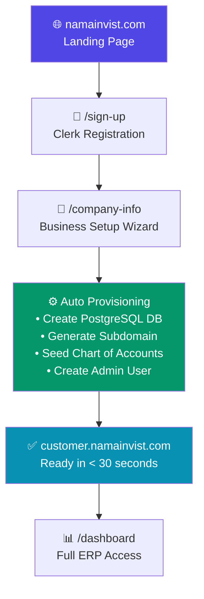

<![CDATA[# 🏛️ Nama Invest — System Master Guide

> **Version**: 2.2.1 — **Last Updated**: April 2026
> **Confidentiality**: Internal & Stakeholder Distribution

---

## 📋 Quick Start Summary

| Dimension | Details |
|-----------|---------|
| **Product** | Nama Invest (نما إنفست) — Cloud ERP & POS Platform |
| **Target Market** | Saudi Arabia & MENA — SMEs to Enterprise |
| **Modules** | 104 integrated business modules |
| **Interactive Elements** | 930+ audited buttons, forms, and actions |
| **Compliance** | ZATCA Phase 1 & 2 (E-Invoicing) — Native |
| **Architecture** | Multi-Tenant SaaS (Database-per-Tenant) |
| **Tech Stack** | Next.js 16 · TypeScript · Prisma · PostgreSQL · Electron |
| **Platforms** | Web (SaaS) · Desktop (Windows) · Mobile (PWA) |
| **Live URL** | [namainvist.com](https://namainvist.com) |
| **Industries** | Pharmacy · Retail · Restaurants · Manufacturing · Services |

---

# 1. 🚀 The Entry Point — The Customer Journey

## 1.1 The Landing Page (`namainvist.com`)

The main domain serves as the **marketing and conversion engine**. It is a high-performance, server-rendered landing page built with Next.js that showcases the platform's 104 modules, grouped into 5 strategic "Power Clusters" and 5 industry verticals (Pharmacy, Retail, Restaurants, Manufacturing, and Services).

**Key design decisions:**
- The landing page uses a **lightweight layout** separate from the ERP, eliminating Clerk SDK and dashboard overhead for maximum page speed.
- A subdomain detection script instantly redirects tenant visitors (`*.namainvist.com`) to their login page.
- SEO-optimized with JSON-LD structured data (SoftwareApplication + FAQPage schema), targeting Arabic-language ERP queries.

## 1.2 The User Journey (Flowchart)



### Step-by-Step Breakdown

| Step | Page | What Happens |
|------|------|-------------|
| **1. Discover** | `/` | Prospect explores modules, industries, and pricing |
| **2. Register** | `/sign-up` | Clerk handles email/phone/Google/Apple auth |
| **3. Setup** | `/company-info` | User enters: Company Name (AR/EN), VAT Number, Industry, Logo |
| **4. Provision** | Automatic | System creates a dedicated PostgreSQL database, seeds the Saudi Chart of Accounts (1xxx–5xxx), creates the admin user, and assigns a subdomain |
| **5. Operate** | `{subdomain}.namainvist.com` | Tenant has a fully isolated ERP instance |

## 1.3 Value Proposition — What the Customer Gets Immediately

Upon completing registration, the tenant receives:

- ✅ **Isolated Database** — Their own PostgreSQL database, zero data leakage
- ✅ **Full Module Access** — All 104 modules unlocked during the 7-day trial
- ✅ **ZATCA Ready** — Pre-configured for Saudi E-Invoicing (Phase 1 QR codes immediately, Phase 2 clearance on activation)
- ✅ **Saudi Chart of Accounts** — Pre-seeded double-entry accounting tree
- ✅ **Default Warehouse & Cash Customer** — Ready to sell from minute one
- ✅ **Branded Subdomain** — `company.namainvist.com` with SSL

---

# 2. 🏗️ The Application Ecosystem

Nama Invest operates across **three delivery platforms**, each serving a distinct use case while sharing the same codebase and business logic.

## 2.1 The Web ERP (Multi-Tenant SaaS)

| Attribute | Details |
|-----------|---------|
| **Access** | `{tenant}.namainvist.com` — Browser-based |
| **Architecture** | Database-per-Tenant isolation |
| **Pages** | 223+ server-rendered routes |
| **Auth** | Dual-layer: Clerk (identity) + Custom JWT (session) |
| **Deployment** | Hetzner VPS · Cloudflare CDN · PM2 Process Manager |

**How Multi-Tenancy Works:**
1. Every incoming request hits the Cloudflare proxy, which routes `*.namainvist.com` to the origin server.
2. Next.js middleware extracts the subdomain from the `Host` header.
3. The middleware resolves the subdomain to a `TenantAccount` record in the **Master Database**.
4. Prisma dynamically connects to the tenant's **dedicated PostgreSQL database** using the resolved connection string.
5. All queries execute within the tenant's isolated schema — **no cross-tenant data access is possible**.

```
┌─────────────┐    ┌──────────────┐    ┌─────────────────┐
│  Cloudflare │───▶│  Next.js     │───▶│  Master DB      │
│  CDN/Proxy  │    │  Middleware   │    │  (Tenant Lookup) │
└─────────────┘    └──────┬───────┘    └─────────────────┘
                          │
                 ┌────────┴─────────┐
                 │  Tenant Router    │
                 └────────┬─────────┘
            ┌─────────────┼─────────────┐
            ▼             ▼             ▼
      ┌──────────┐  ┌──────────┐  ┌──────────┐
      │ Tenant A │  │ Tenant B │  │ Tenant C │
      │ DB (PG)  │  │ DB (PG)  │  │ DB (PG)  │
      └──────────┘  └──────────┘  └──────────┘
```

## 2.2 The Desktop Application (Offline-First ERP)

| Attribute | Details |
|-----------|---------|
| **Technology** | Electron + Next.js Standalone Server |
| **Database** | Embedded PostgreSQL (Port 5433) |
| **Installer** | NSIS `.exe` (~180MB) |
| **Target** | Businesses requiring offline operation or local compliance |

**Architecture:**
The desktop app bundles the **entire Next.js application** as a standalone Node.js server inside an Electron shell. On launch:

1. **Embedded PostgreSQL** starts on port 5433 (auto-initializes on first run)
2. **Prisma Migrations** apply schema changes (`db push`)
3. **Seed Data** creates admin user, default warehouse, Saudi COA
4. **Next.js Server** starts on `localhost:3500`
5. **Electron BrowserWindow** opens the local URL
6. **License Heartbeat** validates the desktop license every 5 minutes against the cloud

**Desktop License System:**
- Each desktop installation requires a **license key** issued from the ICE Admin Panel.
- Licenses are bound to hardware (machine fingerprint) and enforce:
  - Maximum device count per tenant
  - License status (Active / Suspended / Revoked)
  - Remote hardware reset capability
- The license heartbeat syncs tenant quotas and feature flags from the cloud.

**Security Layers:**

| Layer | Technology | Purpose |
|-------|-----------|---------|
| Layer 1 | `javascript-obfuscator` | Control flow flattening, string encryption, dead code injection |
| Layer 2 | ASAR Archive | All application code sealed in a single encrypted archive |
| Layer 3 | ASAR Integrity | Runtime verification prevents code tampering |

## 2.3 Specialized POS Interfaces

The system provides **three purpose-built point-of-sale interfaces**, each optimized for different workflows:

### Retail POS (`/pos`)
- **Users**: Cashiers, retail store clerks
- **Features**: Fast barcode scanning, cash/card/split payments, customer lookup, hold/restore orders, shift management
- **Hardware**: ESC/POS thermal printers, USB cash drawers, Mada payment terminals (via WebSerial API), barcode scanners, electronic weighing scales

### Restaurant POS (`/pos/restaurant`)
- **Users**: Waiters, kitchen staff, restaurant managers
- **Features**: Interactive table map, Kitchen Display System (KDS), dine-in/takeout/delivery modes, combo meals, modifiers, waiter assignment
- **Workflow**: Table selection → Order entry → KDS notification → Bill settlement → Table release

### Kiosk Mode
- **Users**: Unattended self-service terminals
- **Features**: Touch-optimized UI, customer-facing display, QR code menu scanning, order queue management

---

# 3. 🌐 The Functional Universe — 104 Modules

The system's 104 modules are organized into **7 Business Pillars**, ensuring logical grouping and role-based access control.

## 3.1 Financial Pillar (18 Modules)

> Complete double-entry accounting with Saudi SOCPA/IFRS compliance

| Module | Key Capability |
|--------|---------------|
| General Ledger | Multi-level chart of accounts (1xxx–5xxx Saudi standard) |
| Trial Balance | Drill-down from summary to source journal entry |
| Bank Accounts | Balance tracking and automatic bank reconciliation (Auto-Match) |
| Treasury & Safes | Panoramic cash view across all branches |
| Receipt/Payment Vouchers | Single voucher settles multiple invoices |
| Fixed Assets | Depreciation schedules and disposal journal entries |
| Budgets | Actual vs. planned variance analysis |
| Petty Cash | Branch-level disbursement and settlement |
| Checks Management | Full lifecycle tracking (received → deposited → cleared) |
| Installments | Customer financing schedules with collection tracking |
| Letters of Credit (LC) | Import cost tracking: shipping, customs, clearing |
| Bank Reconciliation | Auto-matching bank statements to ledger entries |
| Smart Transfers | Intelligent inter-account fund movement |
| Currencies | Multi-currency with exchange rate journal entries |
| AI CFO | 🧠 AI-powered financial diagnostics and strategic recommendations |
| AI Bank Analyzer | 🧠 Automatic transaction classification from bank statements |
| Fraud Detection | 🧠 Anomaly radar for tampering and irregularities |
| ZATCA Integration | Native Phase 1 (QR) + Phase 2 (XML Clearance) |

## 3.2 Sales & Commerce Pillar (13 Modules)

> From quotation to delivery note — the complete sales lifecycle

| Module | Key Capability |
|--------|---------------|
| Retail POS | Lightning-fast barcode scanning with offline sync |
| Restaurant POS | Table maps, KDS, combo meals, waiter tracking |
| B2B Sales Invoices | ZATCA Phase 2 compliant (XML signed + cleared) |
| Sales Orders (SO) | Inventory reservation for confirmed orders |
| Delivery Notes | Partial delivery tracking for projects |
| Quotations | One-click conversion: Quote → Invoice |
| Recurring Invoices | Automated subscription billing |
| Sales Returns | Credit notes with automatic stock restoration |
| Sales History | Full archive with XML export for ZATCA audit |
| Distribution Routes | Delivery driver route planning |
| Sales Targets | Real-time rep performance tracking (KPI) |
| Shifts & Closing | End-of-day cash reconciliation and variance detection |
| Sales Options | Discount policies, credit limits, tax rules |

## 3.3 Procurement Pillar (7 Modules)

> Full procurement cycle: Need → Quote → Order → Receive → Pay

| Module | Key Capability |
|--------|---------------|
| Purchase Requisitions (PR) | Department-level need requests with approval workflow |
| Request for Quotation (RFQ) | Blind supplier comparison |
| Purchase Orders (PO) | Confirmed quantities and prices to supplier |
| Purchase Invoices | Direct entry with automatic ledger posting |
| Goods Receipt Note (GRN) | Quantity matching and quality inspection |
| Purchase Returns | Debit notes to supplier with settlement |
| AI OCR Purchases | 🧠 Scan supplier invoices → auto-extract line items |

## 3.4 Inventory & Warehouse Pillar (14 Modules)

> Total visibility from shelf to serial number

| Module | Key Capability |
|--------|---------------|
| Product Cards | Matrix variants + multiple unit conversions |
| Warehouses & Branches | Tree hierarchy with isolated permissions |
| Live Stock Levels | Available, reserved, and sold — real-time |
| Stock Movements | Full in/out tracking per transaction |
| Stock Adjustments | Variance correction with automatic journal entries |
| Stock Transfers | Inter-branch goods movement |
| Stocktake | Full cycle: plan → count → variance → close |
| AI Vision Inventory | 🧠 Camera-based counting (80% faster) |
| Barcode & Labels | Bulk printing: EAN / QR / Code128 |
| Expiry Dates (FEFO) | Auto First-Expired-First-Out + alerts |
| Serial Numbers | Unit-level tracking: supplier → customer |
| Advanced WMS | Shelf locations, bin routing, worker assignments |
| Smart Transfers | AI-balanced inter-branch rebalancing |
| Shortage Alerts | Smart radar for low-stock monitoring |

## 3.5 Human Capital Pillar (9 Modules)

> Employee lifecycle: hire → track → pay → evaluate

| Module | Key Capability |
|--------|---------------|
| Employee Management | Complete profile from hiring to retirement |
| Payroll (WPS) | Saudi WPS-compliant salary generation with auto journal |
| Attendance | ZKTeco biometric device integration |
| AI Face ID | 🧠 Facial recognition enrollment (99.9% accuracy) |
| Leave Management | Request → approve → deduct from balance |
| Employee Loans | Monthly deduction scheduling |
| Training Programs | Course tracking linked to career path |
| KPI Evaluations | Objective metrics tied to incentives |
| Job Postings | Vacancy management and applicant tracking |

## 3.6 Growth & CRM Pillar (10 Modules)

> Build lasting customer relationships

| Module | Key Capability |
|--------|---------------|
| Customer Profiles | Credit limits, aging reports, purchase history |
| CRM Leads | Sales funnel: Interest → Qualified → Won/Lost |
| Loyalty Points | Automatic reward accrual and redemption |
| Gift Cards | Issue, track balance, redeem |
| Coupons | Targeted segment promotions |
| Promotions Engine | Buy 2 Get 1 — auto-applied at POS |
| Affiliate Marketing | Performance-based partner network |
| Bookings & Calendar | Conflict-free scheduling with auto-confirmation |
| WhatsApp Hub | Invoice delivery, reminders, bulk marketing (Meta API) |
| Telegram Bot | Real-time reports, approvals, and voice commands |

## 3.7 Enterprise & Industry Pillar (13 Modules)

> Specialized modules for complex operations

| Module | Key Capability |
|--------|---------------|
| Manufacturing Orders | Production tracking with cost calculation |
| BOM (Bill of Materials) | Component recipes with exact quantities |
| MRP Planning | Demand forecasting + auto-purchase-order generation |
| Quality Control (QC) | Incoming goods inspection before acceptance |
| Project Management | Milestone tracking and progress billing |
| Fleet Management | Vehicle operating costs and maintenance scheduling |
| Fuel Management | Consumption anomaly detection |
| Fleet Trips | Driver assignment and trip cost documentation |
| Real Estate | Lease contracts and investment yield tracking |
| IFRS 16 Leases | Right-of-use asset and lease liability recognition |
| Education (Classes) | Student scheduling and attendance |
| Education (Students) | Student profiles and fee collection |
| Maintenance | Job Cards with parts tracking and invoicing |

---

## Module Scale Summary

| Metric | Count |
|--------|-------|
| **Business Modules** | 104 |
| **Dashboard Routes** | 223+ |
| **Interactive Elements** | 930+ (buttons, forms, toggles, actions) |
| **API Endpoints** | 80+ |
| **Permission Keys** | 73 module-level + 5 granular actions per module |
| **Supported Industries** | 15+ |

---

# 4. 🎛️ The Command Center — ICE Admin Panel

## 4.1 Purpose

The **ICE Panel** (`namainvist.com/ice`) is the **Super Admin infrastructure dashboard** — the single pane of glass for managing the entire SaaS ecosystem. It is accessible only to the platform operator and is protected by a separate authentication layer.

## 4.2 Capabilities

### Tenant Lifecycle Management

| Action | Description |
|--------|-------------|
| **View All Tenants** | Filterable list with search, status badges, and usage stats |
| **Subscription Control** | Extend trials, upgrade/downgrade plans, set custom quotas |
| **Plan Management** | 4 tiers: Free Trial → Basic → Professional → Enterprise |
| **Resource Quotas** | Invoice count, product count, user count — per tenant |
| **Suspend / Reactivate** | Global access suspension with one click |
| **Delete Tenant** | Full database teardown with double-confirmation safeguard |
| **Edit Tenant Info** | Modify company name, email, VAT number in real-time |

### Module Registry (Feature Flags)

The ICE Panel includes a **granular module toggle system** organized into 12 sections with sub-sections:

```
Sales ─── Invoices, Quotes, Returns
POS ───── Main, Restaurants, Shifts
Purchases ── Invoices, Orders, Returns
Inventory ── Products, Warehouses, Stocktake, Barcode
Finance ──── Accounting, Treasury, Assets
HR ────────── Employees, Payroll, Attendance, Leaves
Manufacturing ── BOM, MRP, Quality
CRM ──────── Customers, Loyalty, Coupons, Bookings
Enterprise ── Projects, Real Estate, Fleet, Schools
AI ────────── Copilot, CFO, SCM
Reports ──── Sales, Finance, Inventory
Settings ──── Branches, Currencies, Approvals, WhatsApp
```

Each toggle independently enables or disables a feature for the target tenant — changes take effect immediately without requiring a redeployment.

### Desktop License Management

| Action | Description |
|--------|-------------|
| **Issue License** | Generate a new desktop license key with configurable device limit |
| **View Licenses** | See all licenses for a tenant: key, status, hardware binding, device count |
| **Suspend / Revoke** | Deactivate a license remotely |
| **Reset Hardware** | Unbind a license from its current machine |
| **Modify Max Devices** | Adjust the device quota per license |

## 4.3 Permissions Matrix (Tenant-Side)

Within each tenant's desktop application, the **Tenant Owner** controls employee-level access through a **Granular Permissions Matrix**:

| Dimension | Description |
|-----------|-------------|
| **Rows** | 73 system modules (e.g., POS, Sales, Inventory, Accounting) |
| **Columns** | 5 action types: View · Add · Edit · Delete · Print |
| **Total Checkpoints** | 73 × 5 = **365 individual permission toggles per user** |

This creates a clear separation of duties:
- **Platform Operator** (ICE Panel): Controls which *modules* a tenant can access
- **Tenant Owner** (Settings Page): Controls which *actions* each employee can perform within allowed modules

---

# 5. ⚡ Technical Superiority — The "Wow" Factors

## 5.1 Multi-Tenancy Architecture

```
┌──────────────────────────────────────────────────────────┐
│                    MASTER DATABASE                        │
│  ┌──────────┐ ┌──────────┐ ┌──────────┐ ┌──────────┐    │
│  │ Tenants  │ │ Plans    │ │ Licenses │ │ Features │    │
│  └──────────┘ └──────────┘ └──────────┘ └──────────┘    │
└──────────────────────────┬───────────────────────────────┘
                           │ Routing Layer
         ┌─────────────────┼─────────────────┐
         ▼                 ▼                 ▼
   ┌───────────┐    ┌───────────┐    ┌───────────┐
   │ company_a │    │ company_b │    │ company_c │
   │ PostgreSQL│    │ PostgreSQL│    │ PostgreSQL│
   │           │    │           │    │           │
   │ • Users   │    │ • Users   │    │ • Users   │
   │ • Sales   │    │ • Sales   │    │ • Sales   │
   │ • Stock   │    │ • Stock   │    │ • Stock   │
   │ • Ledger  │    │ • Ledger  │    │ • Ledger  │
   └───────────┘    └───────────┘    └───────────┘
```

**Why Database-per-Tenant?**
- **Data Isolation**: Physical database separation — impossible to accidentally query another tenant's data
- **Compliance**: Each tenant's data can be independently backed up, exported, or deleted for GDPR/Saudi data residency
- **Performance**: No row-level filtering overhead; each database runs with full index efficiency
- **Scalability**: Individual databases can be migrated to dedicated servers as tenants grow

## 5.2 ZATCA Compliance (Phase 1 & 2)

| Phase | Feature | Implementation |
|-------|---------|---------------|
| **Phase 1** | QR Code on all invoices | TLV-encoded QR with seller, VAT, timestamp, totals |
| **Phase 2 (B2C)** | Signed invoices reported to ZATCA | XML generation → ECDSA signing → Async reporting |
| **Phase 2 (B2B)** | Cleared invoices before printing | XML → Sign → ZATCA Clearance API → Print only after approval |
| **CSR Onboarding** | Device registration with ZATCA | OpenSSL CSR generation → Compliance CSID → Production CSID |
| **Archive** | Full audit trail | Every invoice stored as signed XML with ZATCA response |

**SDK**: Uses the official Fatoora CLI (v238-R4.0.0) with JDK 21 for validation and signing.

## 5.3 AI-Powered Intelligence

| AI Module | Capability | Technology |
|-----------|-----------|------------|
| **AI CFO** | Financial health diagnostics, cash flow forecasting, strategic recommendations | Gemini AI |
| **AI Bank Analyzer** | Upload bank statements → automatic transaction classification | Gemini AI |
| **AI OCR Purchases** | Photograph supplier invoices → auto-extract items, quantities, prices | Gemini Vision |
| **AI Vision Inventory** | Camera-based stocktake — 80% faster than manual counting | Computer Vision |
| **AI Supply Chain** | Demand forecasting and optimal reorder point calculation | ML Models |
| **AI Fraud Detection** | Anomaly detection in transactions, discount patterns, void rates | Statistical Analysis |
| **AI Copilot** | In-context assistant embedded in every screen | Gemini AI |

## 5.4 Dual-Layer Authentication

```
┌─────────────────────────────────────────────┐
│           Layer 1: Clerk (Identity)          │
│  • Email / Phone / Google / Apple SSO       │
│  • MFA Support                              │
│  • Organization management                  │
│  • Session management                       │
└─────────────────┬───────────────────────────┘
                  │ After Clerk auth succeeds
                  ▼
┌─────────────────────────────────────────────┐
│         Layer 2: Custom JWT (Session)        │
│  • Tenant-scoped token                      │
│  • Role & permissions embedded              │
│  • 24-hour expiry with refresh              │
│  • Per-request middleware validation         │
└─────────────────────────────────────────────┘
```

**Desktop Mode Exception**: When running as a desktop app (`DESKTOP_MODE=true`), Clerk is bypassed entirely. Authentication is handled via local JWT with hardware-bound license validation.

## 5.5 Real-Time Integrations

| Integration | Protocol | Purpose |
|-------------|----------|---------|
| **Telegram Bot** | Telegram Bot API | Real-time sales reports, user monitoring, voice commands |
| **WhatsApp Hub** | Meta Cloud API | Invoice delivery, payment reminders, bulk marketing |
| **Mada Terminals** | WebSerial API | Direct card payment dispatch and response parsing |
| **Cash Drawers** | ESC/POS | Auto-open on cash payment via thermal printer |
| **ZKTeco Devices** | HTTP API | Biometric attendance (fingerprint + face) |
| **Salla Integration** | REST API | E-commerce inventory sync |
| **Tabby / Tamara** | Payment Gateway | Buy-now-pay-later at POS |
| **Electronic Scales** | WebSerial | Live weight capture for retail/grocery |

## 5.6 Permission Architecture

The system implements a **Permissions Override Role** pattern:

```
  Has explicit permission records?
         │
    ┌────┴────┐
    │ YES     │ NO
    ▼         ▼
  Use ONLY    Role = 'admin'?
  explicit    │
  records     ├── YES → Full access (Legacy Admin)
              └── NO  → Default DENY
```

**Granular Control (New)**: Each module permission now supports 5 action-level toggles:

| Action | Controls |
|--------|---------|
| `canView` | Ability to see the page and read data |
| `canAdd` | Ability to create new records (Save/New buttons) |
| `canEdit` | Ability to modify existing records |
| `canDelete` | Ability to remove records |
| `canPrint` | Ability to print or export reports |

---

# 6. 📊 System Metrics at a Glance

| Category | Metric |
|----------|--------|
| **Codebase** | TypeScript / React / Next.js 16 |
| **Lines of Code** | ~200,000+ |
| **Database Engine** | PostgreSQL 16 (Cloud + Embedded) |
| **ORM** | Prisma 5.22 |
| **Auth Provider** | Clerk (Web) / Custom JWT (Desktop) |
| **Hosting** | Hetzner VPS + Cloudflare |
| **Process Manager** | PM2 (3 instances: main-site, saas-app, saas-dev) |
| **Desktop Framework** | Electron 33 + electron-builder |
| **Code Protection** | javascript-obfuscator + ASAR encryption |
| **CI/CD** | Custom SSH deploy scripts (Node.js ssh2) |
| **Monitoring** | Telegram Bot + System Health Dashboard |

---

# 7. 🏢 Industry Solutions

| Industry | Key Differentiators |
|----------|-------------------|
| **💊 Pharmacies** | FEFO expiry tracking, drug alternative management, serial number tracing |
| **🛒 Grocery & Retail** | Electronic scale integration, bulk barcode printing, shortage radar |
| **🍽️ Restaurants** | Table map, Kitchen Display System, combo meals, delivery management |
| **🏭 Manufacturing** | BOM recipes, production orders, MRP planning, quality control |
| **🔧 Services** | Job Cards, appointment scheduling, parts tracking, WhatsApp notifications |
| **🏢 Real Estate** | Lease contracts, IFRS 16 compliance, tenant billing, investor installments |
| **🎓 Education** | Class scheduling, student attendance, fee management |
| **🚗 Fleet** | Trip logging, fuel anomaly detection, maintenance scheduling |

---

# 8. 🔒 Security Summary

| Threat | Mitigation |
|--------|-----------|
| Unauthorized access | Dual-layer auth (Clerk + JWT) + middleware guards |
| Cross-tenant data leak | Physical database isolation (DB-per-tenant) |
| Code theft (Desktop) | 3-layer protection: Obfuscation → ASAR → Integrity check |
| License abuse | Hardware-bound licensing with cloud heartbeat validation |
| CSRF/XSS | Next.js built-in protections + CSP headers |
| Data loss | Automated cloud backup sync + local backup system |
| Insider fraud | AI fraud detection + comprehensive audit logs |
| Session hijacking | 24-hour JWT expiry + inactivity auto-logout |

---

> **© 2026 Nama Invest Technology — All Rights Reserved**
> For technical inquiries: admin@namainvist.com | +966 53 120 6628
]]>
