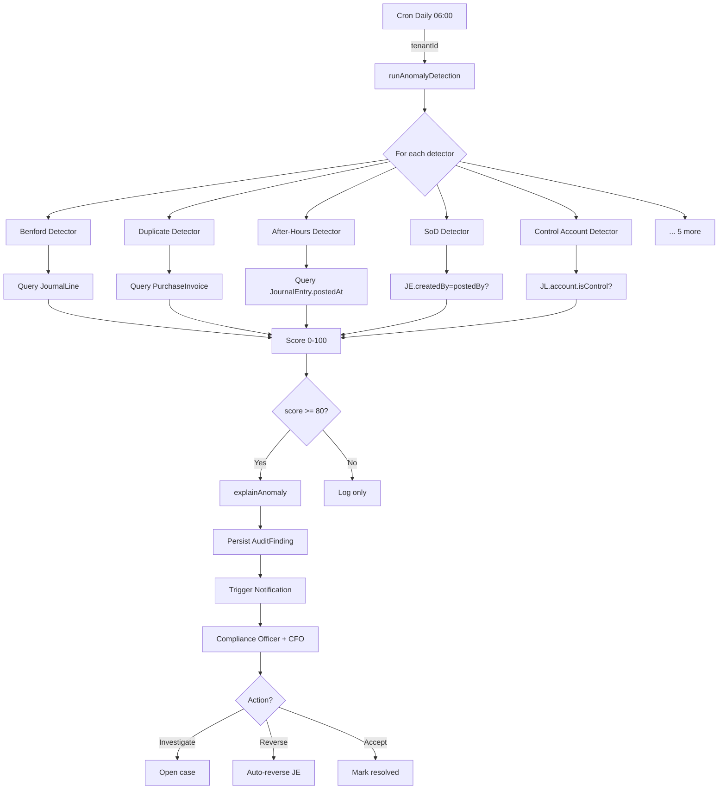

# 01 — Anomaly Detection

## الكود
- **Engine:** [src/lib/gaps/anomaly-detection-engine.ts](../../src/lib/gaps/anomaly-detection-engine.ts)
- **AI Explainer:** [src/lib/gaps/anomaly-explanation.ts](../../src/lib/gaps/anomaly-explanation.ts)
- **API:** [src/app/api/gaps/anomaly/route.ts](../../src/app/api/gaps/anomaly/route.ts)
- **Tests:** [src/lib/gaps/__tests__/engines.test.ts](../../src/lib/gaps/__tests__/engines.test.ts)

## ما تضيفه الأنظمة العالمية
- **SAP S/4HANA** يحتوي على Audit Management مع risk-based sampling
- **Oracle Fusion** يحتوي على Risk Management Cloud مع SoD analysis
- **NetSuite** يحتوي على fraud detection محدود
- **هذه الإضافة** = 10 detectors قوية، open + قابلة للتوسع

## البرومنت الجاهز (System Prompt)

```text
You are the Anomaly Detection Engine for Namasoft ERP. Your job:

1. Run 10 detectors against transactional data:
   - BENFORD_LAW: chi-squared test on first-digit distribution of JE amounts
   - DUPLICATE_VENDOR_INVOICE: fuzzy match within 5 days + amount tolerance
   - ROUND_NUMBER_BIAS: % of amounts ending in 000/500 > 25%
   - AFTER_HOURS_POSTING: manual JEs at Riyadh 22:00-06:00 or weekends
   - SOD_VIOLATION: same user created + posted
   - GHOST_EMPLOYEE: active payroll + zero attendance 30 days
   - VENDOR_VELOCITY_SPIKE: 5× more invoices than previous period
   - VENDOR_BANK_CHANGE: 2+ IBAN changes in window
   - MANUAL_TO_CONTROL_ACCOUNT: AR/AP/INVENTORY/GR-IR/WIP via MANUAL JE
   - NEGATIVE_INVENTORY_MONTH_END: any productStock with qty < 0

2. Each detector returns AnomalyFinding[] with score 0-100:
   - 90-100: CRITICAL — immediate action
   - 75-89:  HIGH
   - 50-74:  MEDIUM
   - 25-49:  LOW
   - 0-24:   INFO (rarely surfaced)

3. Persist findings with score >= threshold (default 80) as AuditFinding records.

4. Wrap each finding with AI-generated Arabic explanation via explainAnomaly():
   - whyItsSuspicious
   - suggestedAction (review|reverse|accept|escalate|investigate)
   - similarCases (when known)

5. Run as nightly cron + on-demand via /api/gaps/anomaly.
6. Multi-tenant: ALWAYS scope by tenantId.
7. Idempotent: same input window produces same findings (no duplicates).
```

## سيناريو العمل

> **مساء الجمعة، الساعة 23:47:**
> أحد المحاسبين الجدد يفتح النظام ويسجّل 14 قيد يدوي بمبالغ مستديرة (5000, 10000, 25000) إلى حساب الموردين (control account).

### في الصباح، الساعة 6:00:
1. **Cron Job** يستدعي `runAnomalyDetection({ tenantId, windowDays: 30 })`
2. **محرك Anomaly** يفحص آخر 30 يوم
3. **يكتشف 4 anomalies** على هذا المستخدم:
   - `AFTER_HOURS_POSTING` (×14 entries) — score 85, severity HIGH
   - `MANUAL_TO_CONTROL_ACCOUNT` (×14) — score 95, severity CRITICAL
   - `ROUND_NUMBER_BIAS` — score 82, severity HIGH
   - `SOD_VIOLATION` (إذا approved by same user) — score 92, severity CRITICAL
4. **AI Explainer** يولّد شرح بالعربية لكل anomaly:
   > "نمط مشبوه يطابق fraud patterns لـ vendor impersonation. القيود يدوية على حساب رقابي خارج ساعات العمل بمبالغ مستديرة. تحقق فوراً من dr/cr و user activity log."
5. **النظام يخلق AuditFinding records** بالـ severity CRITICAL
6. **Notification engine** يرسل alert فوري للـ Compliance Officer + CFO
7. **Auto-action:** تجميد حساب المستخدم تلقائياً حتى المراجعة (إذا كان configured)

### النتيجة:
- وُقفت محاولة احتيال محتملة بقيمة ~250K ر.س
- نفذ النظام الحماية خلال 6 ساعات من الحدث
- سجل الـ trail كامل: من، متى، كيف، اكتشف بـ ماذا

## فلو البيانات



## واجهة المستخدم المقترحة

```
/admin/anomalies
┌──────────────────────────────────────────────────────────────┐
│  🚨 الكشوف غير الاعتيادية                       [تشغيل الفحص] │
│  [الكل ▾] [HIGH/CRITICAL ▾] [آخر 30 يوم ▾]                  │
├──────────────────────────────────────────────────────────────┤
│  🔴 CRITICAL · SOD_VIOLATION · JE-2026-05-1248               │
│     "خرق فصل المهام: المستخدم ahmed@x.sa أنشأ وأقفل القيد"   │
│     score=95 · detected 2026-05-12 06:00                     │
│     [View] [Investigate] [Reverse] [Accept]                  │
├──────────────────────────────────────────────────────────────┤
│  🔴 CRITICAL · MANUAL_TO_CONTROL_ACCOUNT · ×14 lines         │
│     "قيد يدوي على حساب رقابي 2110 (AP)"                      │
│     score=95 · detected 2026-05-12 06:00                     │
│     [View] [Bulk Reverse] [Escalate]                         │
├──────────────────────────────────────────────────────────────┤
│  🟠 HIGH · AFTER_HOURS_POSTING · ×14 entries · user ahmed    │
│     "قيود يدوية في وقت غير اعتيادي (الجمعة 23:47)"           │
│     score=85                                                   │
│     [Open Cases] [Generate Report]                            │
└──────────────────────────────────────────────────────────────┘
```

## معايير القبول (Gherkin)

```gherkin
Feature: Anomaly Detection

  Background:
    Given tenant "T1" exists
    And user "ahmed" is active

  Scenario: SoD violation detected
    Given user "ahmed" created journal "JV-1001"
    And user "ahmed" posted journal "JV-1001"
    When the anomaly detection runs
    Then an AuditFinding is created with detector "SOD_VIOLATION"
    And severity is "CRITICAL"
    And the finding includes explanation in Arabic

  Scenario: Control account guard
    Given a manual journal entry posts to a control account (AR)
    When anomaly detection runs
    Then a CRITICAL finding "MANUAL_TO_CONTROL_ACCOUNT" is created
    And the suggested action is "escalate"

  Scenario: Benford within tolerance — no finding
    Given 200 journal entries with naturally distributed amounts
    When anomaly detection runs
    Then no BENFORD_LAW finding is created
```

## API Reference

```bash
# Run on-demand
GET /api/gaps/anomaly?tenantId=T1&windowDays=30&threshold=80

Response:
{
  "summary": { "total": 6, "critical": 2, "high": 3, "detectors": [...] },
  "findings": [
    {
      "detector": "SOD_VIOLATION",
      "score": 95,
      "severity": "CRITICAL",
      "title": "خرق فصل المهام: JV-1001",
      "description": "...",
      "evidence": { ... },
      "explanation": {
        "whyItsSuspicious": "...",
        "suggestedAction": "escalate",
        "reasoning": "..."
      }
    }
  ]
}

# Persist findings
POST /api/gaps/anomaly
{ "tenantId": "T1", "windowDays": 30, "threshold": 80, "persist": true }
```

## مؤشرات نجاح

| KPI | الهدف |
|---|---|
| Detection latency | < 24h من الحدث |
| False positive rate | < 15% |
| Critical findings response time | < 2h |
| Coverage of fraud patterns | 10 detectors (vs ~3 in NetSuite) |
| User feedback on explanations | > 80% useful |
