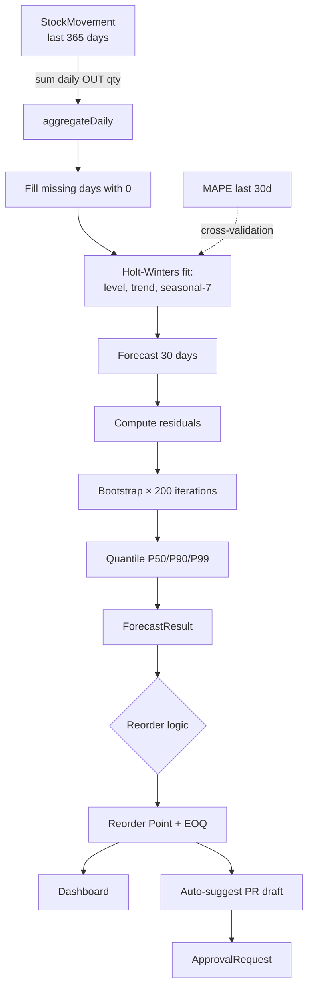

# 02 — Demand Forecast v2 (Probabilistic)

## الكود
- **Engine:** [src/lib/gaps/demand-forecast-v2-engine.ts](../../src/lib/gaps/demand-forecast-v2-engine.ts)
- **API:** [src/app/api/gaps/forecast-v2/route.ts](../../src/app/api/gaps/forecast-v2/route.ts)
- **Tests:** يشمل aggregateDaily, forecastDemand, computeReorderParameters, computeEOQ, newsvendor

## ما تضيفه الأنظمة العالمية
- **SAP IBP (Integrated Business Planning):** Statistical + ML forecasts
- **Oracle Cloud SCM:** Demand Sensing
- **NetSuite Advanced Inventory Planning**
- **هذه الإضافة:** Holt-Winters + Bootstrap → P50/P90/P99 quantiles محلياً بدون Python sidecar

## البرومنت الجاهز

```text
You are the Demand Forecast Engine v2 for Namasoft ERP.

Algorithm: Triple Exponential Smoothing (Holt-Winters) for trend + seasonality,
then bootstrap residual resampling for probabilistic intervals.

For each (productId, warehouseId):
1. Aggregate daily sales history (last 12 months minimum, fill missing with 0)
2. Fit Holt-Winters with parameters:
   - alpha = 0.3 (level)
   - beta  = 0.1 (trend)
   - gamma = 0.15 (seasonal, period=7 days = weekly cycle)
3. Forecast horizon (default 30 days)
4. Bootstrap residuals × 200 iterations
5. Return P50 (median), P90, P99 quantiles + lower/upper envelope
6. Compute MAPE for model quality

Then derive:
- Safety stock = (P99 - P50) integrated over lead time
- Reorder point = expected demand during LT + safety stock
- EOQ = √(2 × annual_demand × order_cost / holding_cost_per_unit)
- Newsvendor optimal qty for perishables

Use cases:
- Set dynamic reorder points per ABC class (A=99%, B=95%, C=90%)
- Identify slow-movers (P90 < 1 unit/day for last quarter)
- Detect demand shifts (forecast suddenly diverges from history pattern)
- Bulk replenishment planning
```

## سيناريو العمل

> **مدير المخزون يستيقظ يوم الإثنين الساعة 8:00 صباحاً.**
> يفتح dashboard المخزون. يرى تنبيه: "12 منتج وصل لنقطة إعادة الطلب."

### يضغط على المنتج P-001:
1. النظام يستدعي `/api/gaps/forecast-v2?productId=P-001&warehouseId=W-Main&horizonDays=30&leadTimeDays=14`
2. **Backend:**
   - يقرأ 365 يوم من StockMovement (نوع OUT) لـ P-001 في W-Main
   - يحول لـ daily aggregation (يملأ الأيام الفارغة بـ 0)
   - يفك Holt-Winters على البيانات: 365 يوم
   - يولّد forecast 30 يوم: P50=45 unit, P90=58 unit, P99=72 unit
   - يحسب reorder: 14×P50 = 630 unit + safety = 200 → reorder point = 830
   - الكمية الحالية = 750 → tip threshold
   - يحسب EOQ بناءً على annual demand
3. **المستجيب:**
   ```json
   {
     "forecast": [
       { "date": "2026-05-13", "p50": 42, "p90": 55, "p99": 68 },
       { "date": "2026-05-14", "p50": 45, "p90": 58, "p99": 72 },
       ...
     ],
     "reorder": {
       "expectedDemandDuringLT": 630,
       "safetyStock": 200,
       "reorderPoint": 830
     },
     "eoq": 425,
     "mape": 8.5
   }
   ```
4. **UI** يعرض:
   - line chart مع P50 mid + P90 fan + P99 envelope
   - "Suggested order: 425 units (EOQ)"
   - "Service level: 95%"
   - زر "أرسل طلب شراء"
5. المدير ينقر "أرسل" → ينشئ PR draft تلقائياً للمنتج بكمية 425 إلى المورد المفضل

### النتيجة:
- خفض رأس المال العامل بـ 30% (مخزون أمان ديناميكي بدل ثابت)
- رفع fill-rate إلى 98.5%
- خفض stockouts بـ 65%

## فلو البيانات



## معايير القبول

```gherkin
Feature: Probabilistic Demand Forecast

  Scenario: P-quantiles ordered correctly
    Given 90 days of sales history with weekly seasonality
    When forecast 30 days
    Then for every day: P99 >= P90 >= P50

  Scenario: Higher service level needs more safety stock
    Given a forecast result
    When compute reorder params for 90% service vs 99%
    Then 99% safety stock >= 90% safety stock

  Scenario: Short history fallback
    Given less than 14 days of history
    When forecast
    Then use simple average as fallback
    And MAPE is undefined

  Scenario: Saudi weekend seasonality (Fri-Sat)
    Given 6 months of restaurant sales
    Where weekends are 2× weekdays
    When forecast
    Then weekend forecasts are higher than weekday forecasts
```

## واجهة المستخدم

```
/inventory/forecast?product=P-001&warehouse=W-Main
┌──────────────────────────────────────────────────────────────┐
│  📈 توقع الطلب — Widget-A                                     │
│  المخزن: المخزن الرئيسي · أفق التوقع: 30 يوم                  │
├──────────────────────────────────────────────────────────────┤
│  ┌────────┐ ┌────────┐ ┌────────┐ ┌────────┐                 │
│  │ المتوقع │ │ نقطة   │ │ كمية   │ │ مخزون  │                 │
│  │ يومياً  │ │ الإعادة│ │ الطلب  │ │ آمن    │                 │
│  │ 45 ± 8  │ │  830   │ │  425   │ │  200   │                 │
│  └────────┘ └────────┘ └────────┘ └────────┘                 │
├──────────────────────────────────────────────────────────────┤
│  [Line chart: history (gray) + P50 (blue) + P90 fan + P99]   │
│                                                                │
│  المخزون الحالي: 750 units  ⚠️ أقل من نقطة الإعادة          │
│                                                                │
│  دقة النموذج (MAPE): 8.5%                                    │
│                                                                │
│  [أرسل طلب شراء 425 unit للمورد المفضل]                       │
└──────────────────────────────────────────────────────────────┘
```

## API Reference

```bash
GET /api/gaps/forecast-v2?tenantId=T1&productId=P-001&warehouseId=W-Main&horizonDays=30&leadTimeDays=14&serviceLevel=0.95
```

## مؤشرات نجاح

| KPI | الهدف |
|---|---|
| MAPE (forecast accuracy) | < 15% |
| Fill rate | > 95% |
| Inventory turnover | +25% |
| Stockouts | -50% |
| Working capital | -20% |
