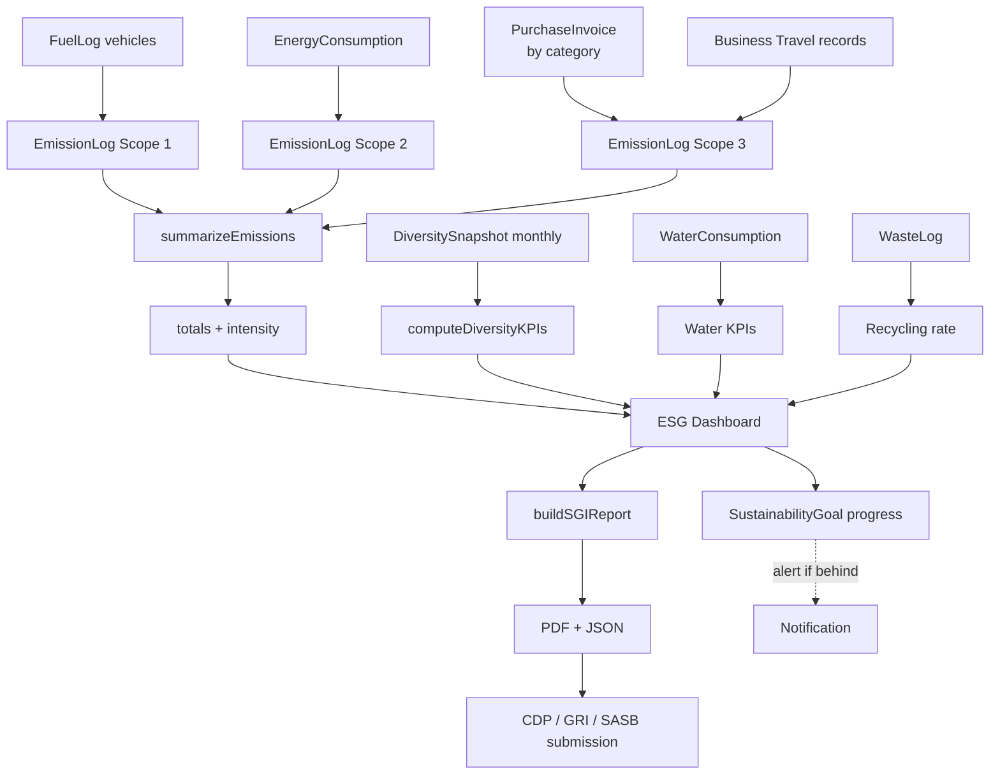

# 03 — ESG / Sustainability

## الكود
- **Engine:** [src/lib/gaps/esg-engine.ts](../../src/lib/gaps/esg-engine.ts)
- **API:** [src/app/api/gaps/esg/route.ts](../../src/app/api/gaps/esg/route.ts)

## ما تضيفه الأنظمة العالمية
- **SAP Sustainability Footprint Management** — Scope 1/2/3 + GHG Protocol
- **Oracle Sustainability** — emissions + waste + water + diversity
- **هذه الإضافة:** Saudi-localized — Saudi Green Initiative aligned + Saudi grid emission factors + Saudi labor demographics

## البرومنت الجاهز

```text
You are the ESG / Sustainability Engine for Namasoft ERP.

Compute Scope 1/2/3 emissions per GHG Protocol with Saudi-localized factors:
- Scope 1: Direct (vehicle fuel, on-site combustion, refrigerant leaks)
- Scope 2: Indirect from purchased electricity (Saudi grid 0.65 kgCO2e/kWh)
- Scope 3: Value chain (supplier emissions, business travel, employee commute)

Track:
- Energy consumption per branch (grid, solar, diesel)
- Water consumption per branch
- Waste streams by type (hazardous, recyclable, general, organic)
- Diversity (gender, nationality, Saudization, disability inclusion)

Compute KPIs:
- Total emissions, intensity per SAR revenue, per employee
- Simpson's diversity index for nationalities
- Female %, Saudization %, disability count
- Goal progress (vs baseline, on-track vs at-risk)

Produce Saudi Green Initiative report annually:
- Reduction % vs baseline
- Initiatives table with impact
- Certifications

Standards: GHG Protocol, GRI Standards, SASB, SGI.
```

## سيناريو العمل

> **مديرة الاستدامة في شركة مقاولات سعودية تجهز تقرير CDP السنوي.**
> الـ deadline بعد أسبوعين.

### الأسبوع الأول:
1. تفتح `/esg/dashboard`
2. تستدعي `/api/gaps/esg` بطلب POST يحوي:
   ```json
   {
     "entries": [
       // Scope 1: 35 سيارة شركة × متوسط 12,000 لتر/سنة
       { "scope": 1, "factorKey": "DIESEL_LITER", "qty": 420000, "date": "2026-05-01T00:00:00Z" },
       // Scope 2: 12 فرع × متوسط 200,000 kWh/سنة
       { "scope": 2, "factorKey": "ELECTRICITY_KWH_SA", "qty": 2400000 },
       // Scope 3: مشتريات سنوية حسب الفئة
       { "scope": 3, "factorKey": "CATEGORY_GENERAL_GOODS", "qty": 5000000 },
       { "scope": 3, "factorKey": "AIR_TRAVEL_KM_SHORT", "qty": 145000 }
     ],
     "revenue": 25000000,
     "employeeCount": 350,
     "diversity": {
       "date": "2026-05-12T00:00:00Z",
       "totalEmployees": 350,
       "female": 70, "male": 280,
       "saudiNationals": 175, "expats": 175,
       "disability": 8,
       "nationalities": { "SA": 175, "EG": 85, "PH": 45, "IN": 30, "PK": 15 }
     },
     "buildSGI": true,
     "organizationName": "Saudi Construction Co.",
     "baselineEmissions": 5000000
   }
   ```
3. **النظام يحسب:**
   - Scope 1: 420,000 × 2.68 = **1,125,600 kg CO2e**
   - Scope 2: 2,400,000 × 0.65 = **1,560,000 kg CO2e**
   - Scope 3 (general): 5,000,000 × 0.45 = **2,250,000 kg CO2e**
   - Scope 3 (travel): 145,000 × 0.158 = **22,910 kg CO2e**
   - **Total: 4,958,510 kg CO2e** (4,958 ton CO2e)
   - Intensity per SAR: 0.198 kg/SAR
   - Per employee: 14.17 ton/year
4. **التنوع:**
   - Female: 20%
   - Saudization: 50% (مطابق لـ Nitaqat Platinum)
   - Simpson's diversity index: 0.668
5. **SGI Report:** يحسب تخفيض 0.83% مقابل baseline (محتاج تحسين)

### الأسبوع الثاني:
- تحدد المديرة 3 مبادرات لتخفيض الانبعاثات:
  - استبدال 10 سيارات بسيارات كهربائية (وفر ~120 ton CO2e)
  - تركيب 500 kW solar في فرع 1 (وفر ~800 MWh/سنة = 520 ton CO2e)
  - تحسين logistics routing (وفر ~50 ton CO2e)
- يولّد التقرير PDF تلقائياً
- يرفع على CDP portal

## فلو البيانات



## معايير القبول

```gherkin
Feature: ESG Emissions Calculation

  Scenario: Scope 1 diesel
    Given 100 liters of diesel consumed
    When compute emission
    Then result is 268 kg CO2e (100 × 2.68)
    And source is DEFRA_2024

  Scenario: Scope 2 Saudi grid
    Given 1000 kWh consumed in Saudi
    When compute emission
    Then result is 650 kg CO2e (1000 × 0.65)
    And source is SAUDI_NCEC

  Scenario: Diversity Simpson's index
    Given employees: 60 SA, 20 IN, 10 EG, 10 PH
    When compute diversity KPIs
    Then Simpson's index is approx 0.58
    And saudization is 60%

  Scenario: SGI report with reduction
    Given current emissions 4M kgCO2e and baseline 5M
    When build SGI report
    Then reduction percent is 20%
```

## واجهة المستخدم

```
/esg/dashboard
┌────────────────────────────────────────────────────────┐
│  🌱 لوحة الاستدامة 2026                                 │
├────────────────────────────────────────────────────────┤
│  Scope 1 → 1,125 ton CO2e   Scope 2 → 1,560 ton       │
│  Scope 3 → 2,272 ton        Total → 4,958 ton          │
│                                                          │
│  Intensity / SAR revenue: 0.198 kg CO2e                 │
│  Intensity / employee: 14.17 ton/year                   │
├────────────────────────────────────────────────────────┤
│  📈 [Emissions trend chart 12 months]                   │
├────────────────────────────────────────────────────────┤
│  Diversity:  👩 20%  🇸🇦 50%  ♿ 8 employees           │
│  Diversity index: 0.668                                 │
├────────────────────────────────────────────────────────┤
│  Goals progress:                                         │
│  ▓▓▓▓▓░░░░░ 50%  Emissions -25% by 2030                │
│  ▓▓▓▓▓▓▓▓░░ 80%  Female % > 25% by 2027                │
│  ▓▓░░░░░░░░ 20%  Renewable energy 30% by 2030          │
├────────────────────────────────────────────────────────┤
│  [Download GRI Report] [SGI Report] [CDP Submission]   │
└────────────────────────────────────────────────────────┘
```

## مؤشرات نجاح

| KPI | الهدف |
|---|---|
| Reporting time | -70% (من 4 أسابيع إلى أسبوع) |
| Accuracy vs manual | > 95% |
| Coverage | 100% Scope 1+2, > 80% Scope 3 |
| Saudi Green Initiative compliance | Full report ready in 1 hour |
