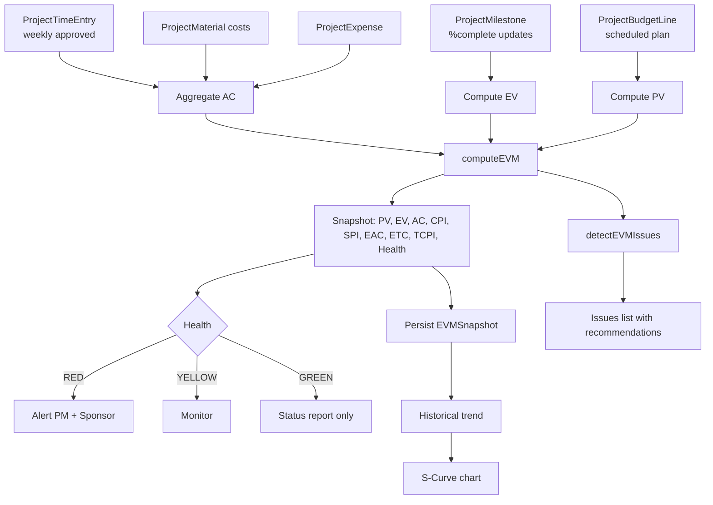

# 04 — Earned Value Management (EVM)

## الكود
- **Engine:** [src/lib/gaps/evm-engine.ts](../../src/lib/gaps/evm-engine.ts)
- **API:** [src/app/api/gaps/evm/route.ts](../../src/app/api/gaps/evm/route.ts)

## ما تضيفه الأنظمة العالمية
- **SAP PPM** — full EVM with PMI standards
- **Oracle Primavera** — EVM dashboards
- **MS Project Server** — EVM forecasting
- **هذه الإضافة:** كل المقاييس بمعادلات PMI الرسمية + auto-detect لـ مشاكل المشروع

## البرومنت الجاهز

```text
You are the EVM (Earned Value Management) Engine. Follow PMI PMBOK standards.

Inputs:
- asOfDate (current point in time)
- projectStartDate, projectEndDate
- budgetLines: planned spending schedule
- milestones: each with budget + plannedDate + percentComplete
- actuals: each with date + amount + category

Outputs (PMI standard):
- BAC = Budget at Completion (sum of milestone budgets)
- PV  = Planned Value = cumulative planned through asOf
- EV  = Earned Value = Σ(budget × %complete)
- AC  = Actual Cost = cumulative actuals
- CV  = EV - AC (cost variance, positive = under budget)
- SV  = EV - PV (schedule variance, positive = ahead)
- CPI = EV / AC (Cost Performance Index)
- SPI = EV / PV (Schedule Performance Index)
- EAC = BAC / CPI (Classic forecast)
- ETC = EAC - AC (Estimate to Complete)
- VAC = BAC - EAC (Variance at Completion)
- TCPI = (BAC - EV) / (BAC - AC)
- Health: RED if CPI/SPI < 0.85, YELLOW if < 0.95, else GREEN

Detect issues with severity & recommendations:
- CRITICAL: CPI < 0.85 → cost overrun
- CRITICAL: SPI < 0.85 → schedule slip
- HIGH: TCPI > 1.1 → unrealistic remaining performance needed
- MEDIUM: CPI/SPI 0.85-0.95 → monitor

Build S-curve for visualization (cumulative PV/EV/AC over time).
```

## سيناريو العمل

> **مدير مشروع تطوير ERP لعميل في الإمارات. الميزانية 600,000 AED. المشروع بدأ في يناير وينتهي في ديسمبر.**

### في 1 يونيو (شهر 5 من 12):
1. يفتح `/projects/PRJ-001/evm`
2. النظام يستدعي `/api/gaps/evm` POST مع:
   ```json
   {
     "asOfDate": "2026-06-01",
     "projectStartDate": "2026-01-01",
     "projectEndDate": "2026-12-31",
     "budgetLines": [
       { "date": "2026-02-01", "description": "Phase 1", "budgetedAmount": 100000 },
       { "date": "2026-05-01", "description": "Phase 2", "budgetedAmount": 200000 },
       { "date": "2026-08-01", "description": "Phase 3", "budgetedAmount": 300000 }
     ],
     "milestones": [
       { "id": "m1", "budgetedAmount": 100000, "plannedDate": "2026-02-01", "percentComplete": 1.0 },
       { "id": "m2", "budgetedAmount": 200000, "plannedDate": "2026-05-01", "percentComplete": 0.8 },
       { "id": "m3", "budgetedAmount": 300000, "plannedDate": "2026-08-01", "percentComplete": 0 }
     ],
     "actuals": [
       { "date": "2026-02-15", "amount": 110000, "category": "LABOR" },
       { "date": "2026-05-15", "amount": 180000, "category": "MATERIAL" }
     ],
     "buildSCurve": true
   }
   ```
3. **النظام يحسب:**
   - **BAC** = 600,000 (مجموع 100+200+300)
   - **PV** (planned through Jun 1) = 100+200 = 300,000 (لم يصل Phase 3 بعد)
   - **EV** = 100×1.0 + 200×0.8 + 300×0 = **260,000**
   - **AC** = 110 + 180 = **290,000**
   - **CPI** = 260/290 = **0.897** ← مشكلة!
   - **SPI** = 260/300 = **0.867** ← مشكلة!
   - **EAC classic** = 600 / 0.897 = **669,000** (تجاوز 69K)
   - **VAC** = 600 - 669 = **-69,000**
   - **TCPI** = (600-260)/(600-290) = **1.097** (يحتاج كفاءة 110%)
   - **Health: 🔴 RED** (CPI و SPI كلاهما تحت 0.95)
4. **الـ Issues detected:**
   ```
   🔴 CRITICAL — تجاوز تكلفة طفيف لكن مستمر (CPI 0.897)
       Recommendation: مراجعة العقود مع المتعاقدين الفرعيين
   🔴 CRITICAL — تأخر جدولي كبير (SPI 0.867)
       Recommendation: إعادة جدولة، تخصيص موارد إضافية
   ```
5. **مدير المشروع:**
   - يرى الـ S-curve يبين الانحراف بصرياً
   - يجدول اجتماع طارئ
   - يطلب CR من العميل لإضافة 70,000 AED للميزانية
   - يحدث الـ schedule لتمديد بشهر

## فلو البيانات



## معايير القبول

```gherkin
Feature: EVM Computation

  Scenario: BAC sums milestones
    Given milestones with budgets 100, 200, 300
    When compute EVM
    Then BAC = 600

  Scenario: EV from milestone progress
    Given milestone 100 at 100%, milestone 200 at 80%, milestone 300 at 0%
    When compute EVM
    Then EV = 260 (100 + 160 + 0)

  Scenario: CPI < 1 when over budget
    Given EV = 260 and AC = 290
    When compute CPI
    Then CPI = 0.897

  Scenario: Critical issue at CPI < 0.85
    Given EV = 100 and AC = 200
    When detect issues
    Then a CRITICAL issue is detected with title containing 'تجاوز تكلفة'

  Scenario: S-curve monotonic
    Given normal project data
    When build S-curve
    Then cumulative PV at each point >= previous point
```

## واجهة المستخدم

```
/projects/PRJ-001/evm
┌────────────────────────────────────────────────────────┐
│  📊 EVM Dashboard — Project PRJ-001                     │
│  As of: 2026-06-01  ·  Status: 🔴 RED                  │
├────────────────────────────────────────────────────────┤
│  BAC = 600,000 AED       Forecast = 669,000 AED        │
│                                                          │
│  ┌─────────┐ ┌─────────┐ ┌─────────┐ ┌─────────┐       │
│  │ CPI     │ │ SPI     │ │ % Done  │ │ % Spent │       │
│  │ 0.897   │ │ 0.867   │ │ 43%     │ │ 48%     │       │
│  │ 🔴 RED  │ │ 🔴 RED  │ │         │ │         │       │
│  └─────────┘ └─────────┘ └─────────┘ └─────────┘       │
├────────────────────────────────────────────────────────┤
│  [S-curve chart: PV / EV / AC lines diverging]          │
├────────────────────────────────────────────────────────┤
│  🔴 CRITICAL — تجاوز تكلفة 30,000 AED                   │
│     مراجعة العقود مع المتعاقدين الفرعيين                │
│  🔴 CRITICAL — تأخر شهرين عن الجدول                    │
│     إعادة جدولة، تخصيص موارد إضافية                    │
├────────────────────────────────────────────────────────┤
│  Forecast completion: 2027-01-28 (28 days late)         │
│  [Request CR] [Reschedule] [Add Resources]              │
└────────────────────────────────────────────────────────┘
```

## مؤشرات نجاح

| KPI | الهدف |
|---|---|
| Projects with CPI/SPI tracking | 100% |
| Detection of cost overrun | < 1 week from event |
| PM forecast accuracy (EAC vs actual) | ±5% |
| Time saved per status report | -80% |
