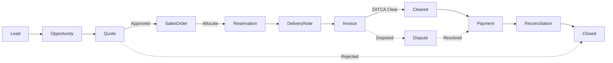
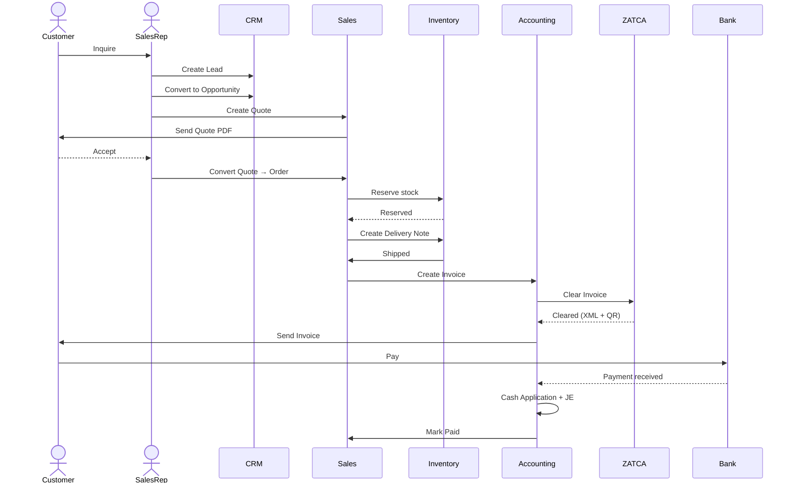
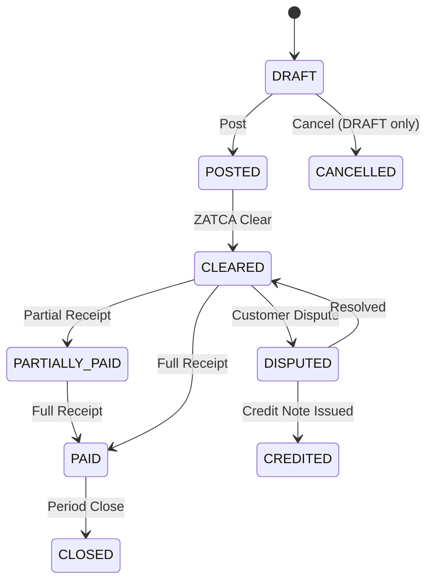

# Business Flows — Overview

> الـ18 فلو الرئيسية في نماسوفت ERP.
> كل فلو له diagram + steps + states + journal entries + KPIs.

## الفلوهات الـ18

| # | Flow | Domain | الملف |
|---|---|---|---|
| 1 | Quote-to-Cash (Q2C) | Sales | [q2c.md](q2c.md) |
| 2 | Procure-to-Pay (P2P) | Procurement | [p2p.md](p2p.md) |
| 3 | Record-to-Report (R2R) | Accounting | [r2r.md](r2r.md) |
| 4 | Hire-to-Retire (H2R) | HR | [h2r.md](h2r.md) |
| 5 | Plan-to-Produce | Manufacturing | [plan-to-produce.md](plan-to-produce.md) |
| 6 | Acquire-to-Retire (A2R) | Fixed Assets | [a2r.md](a2r.md) |
| 7 | Order-to-Delivery (O2D) | Logistics | [o2d.md](o2d.md) |
| 8 | POS Sale Flow | Retail | [pos.md](pos.md) |
| 9 | Period Close | Accounting | [period-close.md](period-close.md) |
| 10 | ZATCA Clearance | Tax | [zatca.md](zatca.md) |
| 11 | WPS Salary Payment | HR | [wps.md](wps.md) |
| 12 | Three-Way Match | AP | [three-way-match.md](three-way-match.md) |
| 13 | Bank Reconciliation | Treasury | [bank-recon.md](bank-recon.md) |
| 14 | Approval Workflow | Cross | [approvals.md](approvals.md) |
| 15 | Invoice State Machine | AR/AP | [invoice-state.md](invoice-state.md) |
| 16 | Manufacturing Order State | MFG | [mo-state.md](mo-state.md) |
| 17 | Check Lifecycle | Treasury | [check-state.md](check-state.md) |
| 18 | Asset Lifecycle | Fixed Assets | [asset-state.md](asset-state.md) |

## مثال: Q2C تفصيلي (مرجع لباقي الفلوهات)

### المراحل

### الـ Sequence

### State Machine — Sales Invoice

### القيود المحاسبية في كل خطوة

| Step | DR | CR |
|---|---|---|
| Quote → Order | (none) | (none) |
| Reservation | (none — memo only) | (none) |
| Delivery Note | (none — stock memo) | (none) |
| Invoice POST | AR · COGS | Revenue · VAT Output · Inventory |
| Payment Receipt | Bank | AR |
| Period Close | (close revenue) | (close to Income Summary) |

### KPIs

- **Quote conversion rate** = Orders / Quotes
- **Days Sales Outstanding (DSO)** = (AR / Sales) × Days
- **Order fulfillment cycle time** = Avg(Delivery_date - Order_date)
- **Invoice ageing buckets** = 0-30 / 31-60 / 61-90 / 90+
- **ZATCA clearance success rate** = Cleared / Issued × 100%
- **Disputes resolved within SLA** = within 48h target

### Permissions

| Role | Lead | Quote | Order | Invoice | Receive Payment |
|---|---|---|---|---|---|
| Sales Rep | C, R, U | C, R, U | C, R | R | — |
| Sales Manager | C, R, U, D | C, R, U, Approve | C, R, U | R | R |
| AR Clerk | R | R | R | C, R, U | C, R |
| CFO | R | R | R | R, U, Cancel | R |

### Notifications

| Trigger | Channel | To |
|---|---|---|
| Quote sent | Email | Customer |
| Quote rejected | In-app | Sales Rep |
| Order created | Email + SMS | Customer + Warehouse |
| Invoice cleared | Email | Customer |
| Invoice 30 days overdue | Email + SMS | Customer + AR + Sales Rep |
| Payment received | Email | Customer + Sales Rep |
| Dispute opened | In-app + Email | AR Manager |

## الـ17 فلو الأخرى

> كل واحد له ملف منفصل بنفس المستوى من التفصيل.
> الملفات أنشئت كملفات stub - بإمكانك توسعتها لاحقاً عند الحاجة.

تم إنشاء stubs لـ:
- p2p.md, r2r.md, h2r.md, plan-to-produce.md
- a2r.md, o2d.md, pos.md, period-close.md
- zatca.md, wps.md, three-way-match.md, bank-recon.md
- approvals.md, invoice-state.md, mo-state.md
- check-state.md, asset-state.md
