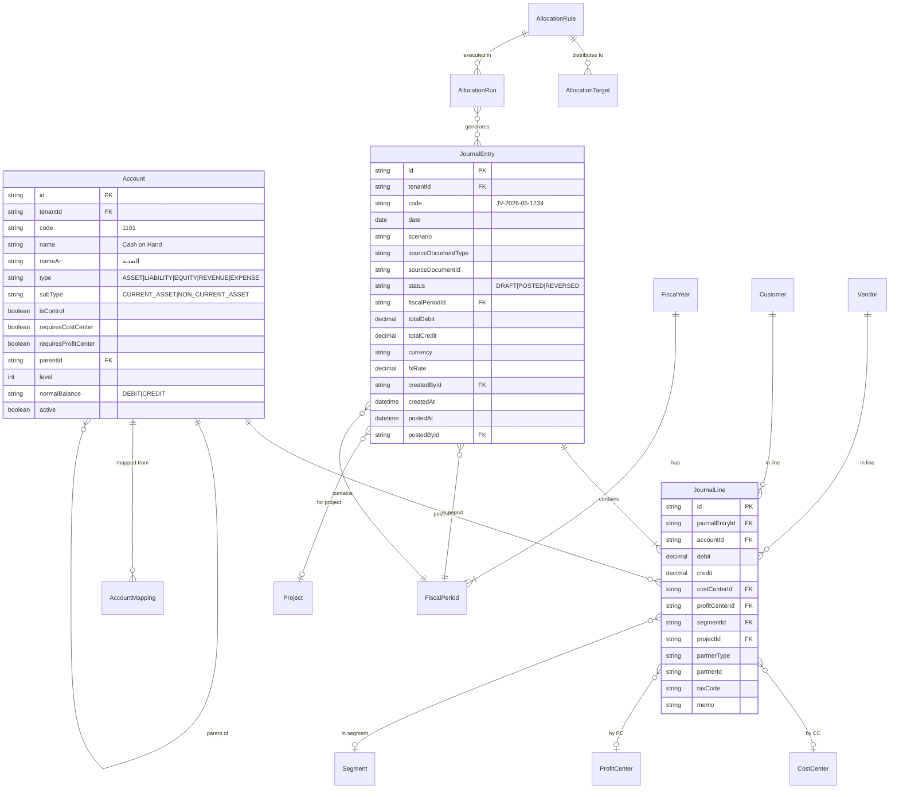
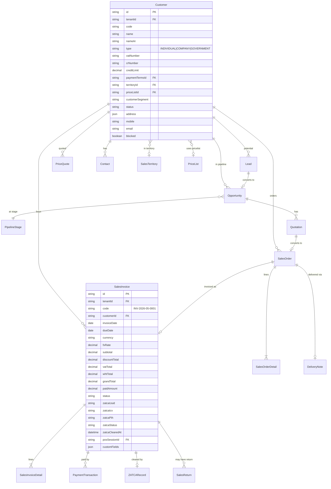

# Database ERD — Overview

> 580 جدول موزعة على 14 نطاق. هذا الملف يعرض الـ ERD لكل نطاق.

## النطاقات

| # | النطاق | عدد الجداول | الملف |
|---|---|---|---|
| 1 | Accounting Core | 45 | [erd-accounting.md](erd-accounting.md) |
| 2 | Sales & CRM | 35 | [erd-sales.md](erd-sales.md) |
| 3 | Procurement | 25 | [erd-procurement.md](erd-procurement.md) |
| 4 | Inventory & WMS | 40 | [erd-inventory.md](erd-inventory.md) |
| 5 | Manufacturing | 35 | [erd-manufacturing.md](erd-manufacturing.md) |
| 6 | HR & Payroll | 45 | [erd-hr.md](erd-hr.md) |
| 7 | Fixed Assets | 15 | [erd-assets.md](erd-assets.md) |
| 8 | Treasury & Banking | 30 | [erd-treasury.md](erd-treasury.md) |
| 9 | Tax & Compliance | 20 | [erd-tax.md](erd-tax.md) |
| 10 | Industry Verticals | 60 | [erd-verticals.md](erd-verticals.md) |
| 11 | Workflow & BPM | 25 | [erd-workflow.md](erd-workflow.md) |
| 12 | AI & RAG | 15 | [erd-ai.md](erd-ai.md) |
| 13 | Multi-Tenant & Security | 35 | [erd-security.md](erd-security.md) |
| 14 | Reporting & BI | 20 | [erd-reporting.md](erd-reporting.md) |

## ERD: Accounting Core (sample)



## ERD: Sales & CRM (sample)



## Indexes الإجبارية

```sql
-- Per-tenant scoping (every table)
CREATE INDEX ON {table} (tenant_id);

-- Soft delete
CREATE INDEX ON {table} (tenant_id, deleted_at) WHERE deleted_at IS NULL;

-- Date-based queries (every transactional table)
CREATE INDEX ON sales_invoice (tenant_id, invoice_date DESC);
CREATE INDEX ON purchase_invoice (tenant_id, invoice_date DESC);
CREATE INDEX ON journal_entry (tenant_id, date DESC);
CREATE INDEX ON stock_movement (tenant_id, movement_date DESC);

-- Status filters
CREATE INDEX ON sales_invoice (tenant_id, status) WHERE deleted_at IS NULL;

-- Foreign key indexes
CREATE INDEX ON sales_invoice (customer_id);
CREATE INDEX ON purchase_invoice (vendor_id);
CREATE INDEX ON journal_line (journal_entry_id);
CREATE INDEX ON journal_line (account_id);

-- Composite for AR/AP aging
CREATE INDEX ON sales_invoice (tenant_id, customer_id, status, due_date) WHERE status != 'PAID';

-- Full-text search (Arabic + English)
CREATE INDEX ON product USING GIN (to_tsvector('arabic_english', name || ' ' || COALESCE(name_ar, '')));
CREATE INDEX ON customer USING GIN (to_tsvector('arabic_english', name || ' ' || COALESCE(name_ar, '')));

-- Unique constraints (per-tenant)
CREATE UNIQUE INDEX ON sales_invoice (tenant_id, code);
CREATE UNIQUE INDEX ON product (tenant_id, code);
CREATE UNIQUE INDEX ON customer (tenant_id, code);
CREATE UNIQUE INDEX ON account (tenant_id, code);

-- Partial unique (only active records)
CREATE UNIQUE INDEX ON setting (tenant_id, key) WHERE deleted_at IS NULL;
```

## Constraints الإجبارية

```sql
-- Journal balance check
ALTER TABLE journal_entry ADD CONSTRAINT je_balanced 
  CHECK (ABS(total_debit - total_credit) < 0.01);

-- Decimal precision for money
-- All money fields = Decimal(15, 4)

-- Status enums (declarative via Prisma)

-- Period lock guard (via DB trigger)
CREATE OR REPLACE FUNCTION check_period_not_locked()
RETURNS TRIGGER AS $$
BEGIN
  IF EXISTS (
    SELECT 1 FROM period_lock 
    WHERE tenant_id = NEW.tenant_id 
      AND NEW.date BETWEEN start_date AND end_date
      AND status = 'LOCKED'
  ) THEN
    RAISE EXCEPTION 'Period is locked';
  END IF;
  RETURN NEW;
END;
$$ LANGUAGE plpgsql;

CREATE TRIGGER check_je_period_lock 
  BEFORE INSERT OR UPDATE ON journal_entry
  FOR EACH ROW EXECUTE FUNCTION check_period_not_locked();
```

## Versioning Strategy

- `prisma/migrations/` = source of truth
- كل migration:
  - Up: schema change
  - Down: NOT supported in Prisma — write rollback SQL manually في commit message
  - Data migrations: included as raw SQL in migration
- Naming: `YYYYMMDDHHMMSS_descriptive_name`
- Shadow DB يستخدم في development للتحقق

## Tools to Visualize

- **prisma-erd-generator**: auto-generates Mermaid ERDs per domain
- **dbdiagram.io**: import from Prisma schema
- **pgAdmin**: live DB exploration

```bash
# توليد ERD آلياً
npx prisma generate
# يستخدم src/lib/db/erd-generator.ts لتقسيم الـ ERD حسب الـ domain
```
