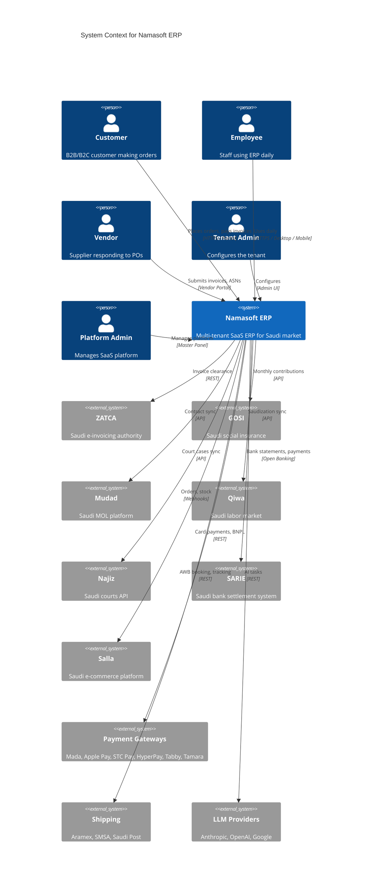
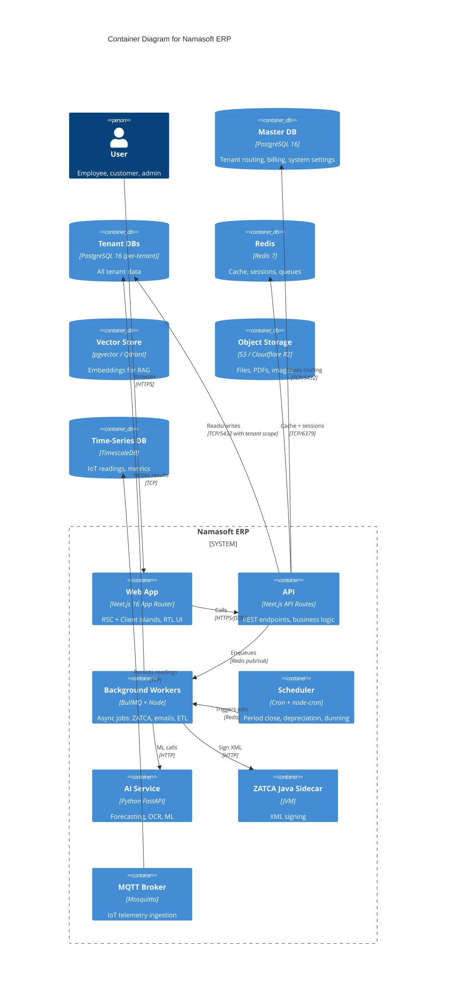
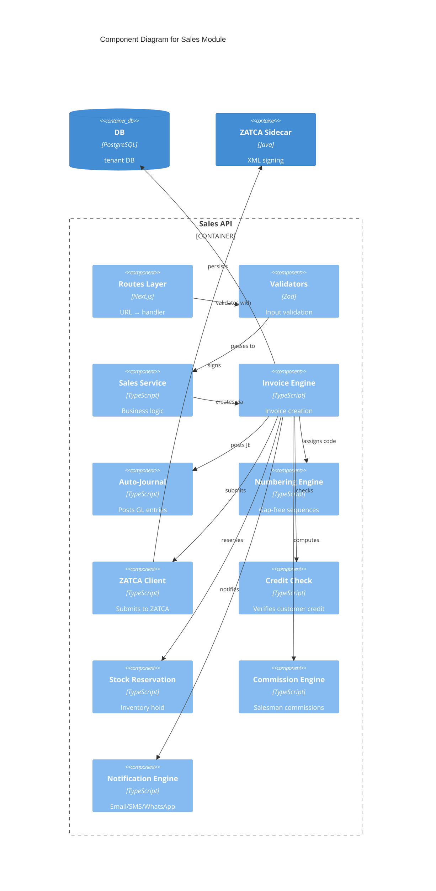
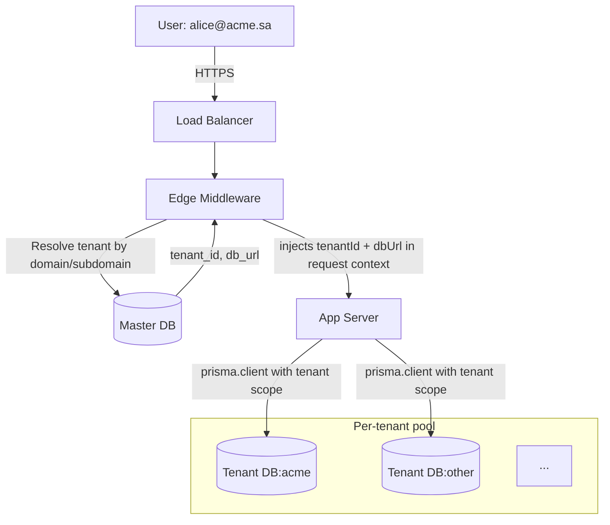
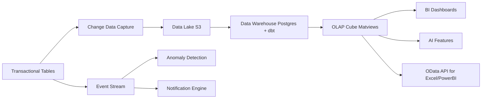

# Architecture — C4 Model

> 4 مستويات: Context → Container → Component → Code

## Level 1: System Context



## Level 2: Container



## Level 3: Component (Sales Module)



## Multi-Tenancy Architecture



**Routing logic:**
1. Domain `acme.namasoft.sa` → query Master DB
2. Get `tenant_id` + `database_url`
3. Inject into request context via middleware
4. Prisma client is scoped per-request (no global)
5. All queries automatically include `tenantId`

## Data Architecture



## Architecture Decision Records (ADRs)

Located in `docs/MASTER_PACK/14-architecture/adrs/`:

- **ADR-0001**: Multi-tenant database isolation strategy (DB-per-tenant chosen over Shared schema with row-level security)
- **ADR-0002**: Next.js 16 App Router over Pages Router
- **ADR-0003**: Prisma ORM over Drizzle/Knex
- **ADR-0004**: PostgreSQL over MySQL/MongoDB
- **ADR-0005**: Clerk Auth over Auth0/custom
- **ADR-0006**: pgvector over Qdrant for embeddings (single DB simpler)
- **ADR-0007**: BullMQ over Inngest/Trigger.dev
- **ADR-0008**: Decimal(15, 4) for money fields
- **ADR-0009**: Auto-journal engine for all GL writes
- **ADR-0010**: Idempotency-Key header for all POST endpoints
- **ADR-0011**: Cursor pagination as default
- **ADR-0012**: Saga pattern for multi-step distributed flows
- **ADR-0013**: ZATCA Phase 2 via Java sidecar (existing trusted lib)
- **ADR-0014**: Cookie-based sessions over JWT for web
- **ADR-0015**: Server Components by default

## Sample ADR

```markdown
# ADR-0001: Multi-Tenant Isolation Strategy

## Status
Accepted (2024-01-15)

## Context
We need multi-tenancy for SaaS deployment. Options:
1. Shared DB, shared schema with tenant_id column (row-level security)
2. Shared DB, schema-per-tenant
3. DB-per-tenant
4. Instance-per-tenant

## Decision
Database-per-tenant via Master DB routing.

## Consequences
**Positive:**
- Strong isolation (compliance friendly — PDPL)
- Per-tenant backup/restore trivial
- Performance: no noisy neighbor
- Tenant offboarding = drop DB
- Schema changes can be staged per-tenant

**Negative:**
- More DBs to manage (mitigated by managed Postgres)
- Cross-tenant analytics requires aggregation pipeline
- Migration coordination needed (ran in sequence per tenant)

## Alternatives Considered
- **Row-level security**: simpler ops but weak isolation, harder compliance
- **Schema-per-tenant**: middle ground but Postgres performance degrades > 1000 schemas
- **Instance-per-tenant**: too expensive for SME-tier pricing
```

## Threat Model (STRIDE summary)

| Threat | Asset | Mitigation |
|---|---|---|
| **Spoofing** | User identity | Clerk + MFA + WebAuthn |
| **Tampering** | Journal entries | Immutable POSTED + audit chain |
| **Tampering** | ZATCA invoices | XML signature + ICV chain |
| **Repudiation** | All transactions | FieldAuditLog with user/IP/UA |
| **Information Disclosure** | Cross-tenant data | DB-per-tenant + middleware guard |
| **Information Disclosure** | PII | Field encryption + masking |
| **DoS** | API endpoints | Rate limiting + Cloudflare |
| **DoS** | DB | Connection pool + query timeout |
| **Elevation of Privilege** | Admin functions | Role checks + SoD rules |
| **Elevation of Privilege** | API tokens | Scoped + short-lived |

## Capacity Planning

| Tier | Tenants | Users/Tenant | Tx/day | Storage | Compute |
|---|---|---|---|---|---|
| Today | 5 | 10 | 1K | 50 GB | 4 vCPU, 16 GB RAM |
| Year 1 | 200 | 20 | 50K | 2 TB | 16 vCPU, 64 GB RAM, replicas |
| Year 2 | 1K | 30 | 500K | 10 TB | K8s cluster, sharded DBs |
| Year 3 | 5K | 30 | 2M | 50 TB | Multi-region, dedicated pools |
| Year 5 | 20K | 30 | 10M | 200 TB | Global edge + CDN |

## Performance SLOs

| Metric | Target | Measurement |
|---|---|---|
| Page TTFB (p95) | < 300 ms | RUM |
| API response (p95) | < 500 ms | server-side |
| API response (p99) | < 1500 ms | server-side |
| DB query (p95) | < 100 ms | pg_stat_statements |
| Background job latency (p95) | < 30 s | BullMQ |
| ZATCA clearance (p95) | < 15 s | ZATCA queue |
| Period close (50K JEs) | < 5 min | end-to-end |
| Trial balance generation | < 3 s | server-side |
| Search response | < 500 ms | server-side |
| Availability (uptime) | 99.5% standard / 99.9% premium | external monitor |
