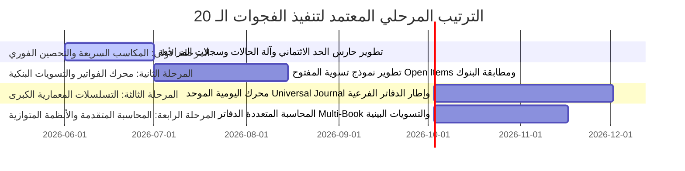

# خارطة الطريق التنفيذية للفجوات الـ 20 — Nama Invest ERP
## Operational Roadmap: The 20 Discovered Gaps Ranked by Impact & Cost

---

## 1. الملخص التنفيذي (Executive Summary)
تعد هذه الوثيقة دليلاً استراتيجياً ومعمارياً معتمداً لتوجيه وتحصين عمليات التعديل والتطوير المستقبلية داخل نظام **Nama Invest ERP**. لقد أظهر التقييم المعماري الشامل لسيناريوهات وحركية الأعمال (End-to-End Workflows) عبر الـ 16 دومين وموديول رئيسي، أن النظام يتميز بأرضية تقنية صلبة تدعم المعايير السعودية والخليجية لـ ZATCA، مع بنية متعددة المستأجرين فائقة الأمان.

مع ذلك، يتطلب بلوغ النظام مستويات الأنظمة العالمية الكبرى (مثل SAP S/4HANA و Oracle Fusion و NetSuite) معالجة منهجية لـ **20 فجوة معمارية وتشغيلية كبرى**. توضح خارطة الطريق هذه كيفية توزيع هذه الفجوات وترتيبها تصاعدياً بناءً على موازنة دقيقة بين **الأثر المالي والأمني والتشغيلي** مقابل **جهد وتكلفة التطوير الهندسي**، مع تصنيف متطلبات كل فجوة (واجهات، APIs، قاعدة بيانات، منطق) لوضع إطار عمل آمن وخالٍ تماماً من العشوائية.

---

## 2. مصفوفة تحديد الأولويات (Prioritization Matrix)
توزع الفجوات الـ 20 في هذه المصفوفة لضمان استغلال المكاسب السريعة عالية الأثر منخفضة الجهد أولاً، تليها معالجة متدرجة للمشاريع المعمارية الصعبة:

```
        عالي |-----------------------------------------------------------------|
             | [الفئة 2: المكاسب السريعة - Quick Wins]   | [الفئة 1: المشاريع المعمارية الضخمة]   |
             | - حارس تعديل الأصول والرواتب (17)      | - محرك اليومية الموحد (1)            |
             | - آلة الحالات والموافقات للمستندات (14)  | - إطار ترحيل الدفاتر الفرعية (2)     |
             | - تسلسل الترقيم الديناميكي (15)        | - نموذج الفواتير المفتوحة (3)        |
             | - حظر تجاوز الحد الائتماني (7)         | - محرك حجز المخزون الفعلي (13)       |
             | - التحقق الضريبي التلقائي (20)        | - إقفال الفترات الهرمي المتسلسل (4)  |
             | - حدود تسويات الجرد (19)              | - ربط مسير الرواتب المباشر (10)      |
الأثر        |                                         | - استيراد ومطابقة كشوف البنوك (11)   |
             |-----------------------------------------|--------------------------------------|
             | [الفئة 4: تحسينات إضافية منخفضة الأثر]  | [الفئة 3: استثمارات عالية التكلفة]   |
             | - نظام رسائل التحصيل التلقائي (18)     | - المحاسبة المتعددة المعايير (5)       |
             |                                         | - تسوية المشتريات الثلاثية (6)        |
             |                                         | - تسعير العقود الحصري للعملاء (8)    |
             |                                         | - شاشة خطوط الإنتاج MES (9)          |
             |                                         | - محرك الإهلاك التلقائي للأصول (12)  |
             |                                         | - تسويات المعاملات البينية (16)      |
        منخفض |-----------------------------------------------------------------|
                                  منخفض <-------------------------> عالي
                                            تكلفة وجهد التنفيذ
```

---

## 3. جدول تصنيف الفجوات الـ 20 (20 ERP Gaps Classification Table)

| الرقم | الفجوة المكتشفة | الدومين التشغيلي | مستوى الأثر | تكلفة التنفيذ | التصنيف التقني (UI / API / DB / Logic) | الأولوية |
| :--- | :--- | :--- | :--- | :--- | :--- | :--- |
| **1** | **Universal Journal (دفتر يومية موحد)** | المالية والحسابات | حرج جداً | عالية جداً | DB + API + Logic (تغيير هيكلي في الجداول) | **1** |
| **2** | **Subledger Accounting (إطار ترحيل فرعي)**| المالية والتكامل | حرج | عالية | API + Logic (محرك موحد لتوليد القيود) | **2** |
| **3** | **Open Items Model (تسوية الفواتير المفتوحة)**| الذمم المدينة والدائنة| حرج | متوسطة | DB + API + Logic (تتبع تسوية الفواتير الجزئية)| **3** |
| **4** | **Hierarchy Period Close (الإغلاق الهرمي للمخازن/الحسابات)**| المالية والمخازن | مرتفع | متوسطة | API + Logic (محرك تحقق متسلسل) | **4** |
| **5** | **Multi-Book / Multi-GAAP (الدفاتر المتوازية)**| المالية والمحاسبة | مرتفع | عالية | DB + API + Logic (دفاتر موازية للضرائب والمعايير)| **13** |
| **6** | **Three-Way Match (المطابقة الثلاثية للمشتريات)**| المشتريات والتوريد | مرتفع | متوسطة | API + Logic (مطابقة الفاتورة مع الـ PO والـ GRN)| **9** |
| **7** | **Credit Limit Block (حظر تجاوز الائتمان تلقائياً)**| المبيعات و AR | مرتفع | منخفضة | Logic (فحص الحد الائتماني عند إصدار الفاتورة) | **5 (Quick Win)**|
| **8** | **Contract Pricing (تسعير العقود والاتفاقيات الخاصة)**| المبيعات و POS | متوسط | متوسطة | DB + API + Logic (جداول أسعار حصرية للعملاء)| **14**|
| **9** | **Shop-Floor / MES Terminal (شاشة الإنتاج والعمالة)**| التصنيع والإنتاج | متوسط | عالية | UI + API + Logic (شاشات لمس لخطوط الإنتاج) | **15**|
| **10** | **Qiwa & Mudad Link (ربط مسير الرواتب المباشر)**| الموارد البشرية والرواتب| مرتفع | متوسطة | API + Logic (توليد ورفع آلي لملفات WPS) | **6**|
| **11** | **Bank Reconciliation (استيراد ومطابقة كشوف البنوك)**| الخزينة والبنوك | مرتفع | متوسطة | UI + API + Logic (دعم ملفات MT940 ومطابقتها) | **7**|
| **12** | **Depreciation Engine (محرك إهلاك الأصول التلقائي)**| الأصول الثابتة | مرتفع | متوسطة | DB + API + Logic (ترحيل قيود الإهلاك الشهري آلياً)| **10**|
| **13** | **Inventory Reservation (حجز المخزون المؤقت والفعلي)**| المستودعات والجرد | مرتفع | متوسطة | DB + API + Logic (حجز البضاعة لأوامر المبيعات) | **8**|
| **14** | **Document State Machine (آلة حالات المستندات)**| النظام العام والتحقق | مرتفع | منخفضة | Logic (تنظيم الحالات: مسودة، موافقة، إلغاء، ترحيل)| **11 (Quick Win)**|
| **15** | **Configurable Numbering (تسلسل ترقيم ديناميكي)**| إعدادات النظام | مرتفع | منخفضة | DB + API + Logic (توليد أرقام مستندات مخصصة) | **12 (Quick Win)**|
| **16** | **Inter-company Eliminations (تسوية العمليات البينية)**| المحاسبة المتقدمة | متوسط | عالية | DB + API + Logic (إقصاء حركات الفروع والشركات) | **16**|
| **17** | **Field-Level Audit Trail (سجل مراجعة الحقول الحساسة)**| الأمن والرقابة | حرج | منخفضة | DB + Logic (حفظ سجل التعديلات التفصيلي للأصول) | **17 (Quick Win)**|
| **18** | **Automated Dunning (رسائل المتابعة والتحصيل التلقائي)**| الذمم المدينة | متوسط | منخفضة | UI + API + Logic (إرسال إشعارات السداد الآلية) | **18**|
| **19** | **Stock Adjustment Tolerances (حدود تسويات الجرد)**| المستودعات والمخازن | مرتفع | منخفضة | UI + Logic (طلب موافقة المدير للتسويات الكبيرة) | **19 (Quick Win)**|
| **20** | **Tax Group Validation (التحقق الضريبي التلقائي)**| حسابات الضرائب و ZATCA| مرتفع | منخفضة | DB + Logic (تأكيد مطابقة نسب القيمة المضافة) | **20 (Quick Win)**|

---

## 4. المكاسب السريعة (Quick Wins — منخفضة التكلفة وعالية الأثر)
هي البنود التي يمكن تنفيذها فوراً بحد أدنى من الجهد التقني وبدون مخاطرة تشغيلية، وتوفر حماية فورية للأعمال:

*   **الفجوة 7: حظر تجاوز الحد الائتماني للعميل (Credit Limit Block):**
    منع ترحيل فواتير أو أوامر بيع جديدة للعميل الذي يتجاوز سقف دينه المعتمد برفض الطلب تلقائياً، ما لم يتوفر استثناء مسجل من المدير المالي.
*   **الفجوة 14: آلة حالات المستندات الموحدة (Document State Machine):**
    وضع حارس صارم يمنع حركات الانتقال غير المنطقية للمستندات (مثل تعديل مستند تم ترحيله أو إلغاء مسودة غير معتمدة).
*   **الفجوة 17: سجل المراجعة التفصيلي للحقول الحساسة (Field-Level Audit Trail):**
    تسجيل تفصيلي فوري لأي تعديل يمس حقول البيانات البنكية أو الرواتب أو البدلات للموظفين مع الاحتفاظ بالقيمة القديمة والجديدة وتاريخ واسم المستخدم المعدل.
*   **الفجوة 15: تسلسلات الترقيم التلقائية القابلة للتكوين (Numbering Sequences):**
    توليد أرقام متسلسلة مشفرة ومعيارية لكل نوع مستند بشكل تلقائي ديناميكي يمنع التكرار أو التجاوز.

---

## 5. المشاريع المعمارية الضخمة (Strategic Architecture Tasks)
هي تعديلات بنيوية عميقة تضمن نقل النظام إلى مصاف الكبار وتستلزم تصميماً دقيقاً ومطولاً:

*   **الفجوة 1: Universal Journal (محرك القيد الموحد):**
    توحيد جميع أبعاد القيود (الفروع، مراكز التكلفة، المشاريع) في جدول واحد صلب لتقليل زمن الاستعلام والتقارير.
*   **الفجوة 2: Subledger Accounting (إطار ترحيل الدفاتر الفرعية):**
    بناء كلاس أساسي موحد لجميع الحركات الفرعية في النظام يولد قيوداً يومية متوازنة بطريقة قياسية وخاضعة لقوانين التحقق المشتركة.
*   **الفجوة 3: نموذج الذمم المفتوحة (Open Items Model):**
    تصميم ذكي يربط السداد الجزئي أو الكلي بالفاتورة الأصلية بدقة، مما يسهل استخراج أعمار الديون الحقيقية ومطابقة الحسابات.

---

## 6. البنود التي تتطلب تغييرات في الجداول وقاعدة البيانات (DB/Schema Changes)
هذه التعديلات يجب أن تمر بدورة التحقق والاختبار العزل الكامل لضمان عدم حدوث تراجع أو فقدان للبيانات:
1.  **الفجوة 1 (Universal Journal):** تطلب دمج أعمدة الأبعاد المالية كحقول صريحة في جدول `JournalLine` في Prisma.
2.  **الفجوة 3 (Open Items Model):** تطلب إنشاء جدول وسيط `OpenItemMatching` لتخزين تطابق الدفعات مع الفواتير.
3.  **الفجوة 8 (Contract Pricing):** تطلب إنشاء جدول `ContractPriceList` يربط العملاء بأسعار حصرية خارج جداول الأسعار العامة.
4.  **الفجوة 12 (Asset Depreciation):** تطلب حقول جديدة لحساب قيم الإهلاك التراكمي وصافي القيمة الدفترية للأصول.
5.  **الفجوة 13 (Inventory Reservation):** تطلب إضافة جدول `StockReservation` للربط المؤقت بين كميات المخازن وأوامر المبيعات النشطة.

---

## 7. البنود التي تتطلب تصميماً معمارياً مالياً (Financial Architecture Design)
هذه البنود حساسة مالياً وضريبياً وتتطلب مراجعة من مستشار مالي وقوانين SOCPA و ZATCA:
*   **الفجوة 4 (Hierarchy Period Close):** يستلزم بناء تسلسل صارم يمنع إغلاق الفترات العامة دون إغلاق المستودعات الفرعية وحركات الاستلام أولاً لتلافي فروقات الجرد والتقييم المخزني.
*   **الفجوة 5 (Multi-Book Accounting):** تصميم دفاتر محاسبية موازية تدعم معايير متعددة (IFRS للمجموعات، SOCPA للوائح المحلية، ومحاسبة الزكاة والدخل).
*   **الفجوة 6 (Three-Way Match):** بناء سياسة تفاوت مالي وضريبي (Tolerance Limits) تحدد النسبة المسموح بها للاختلاف بين أمر الشراء الفعلي، وسند الاستلام المخزني، وفاتورة المورد قبل رفض المعاملة.
*   **الفجوة 16 (Inter-company Eliminations):** بناء منطق إقصاء آلي ومتقدم للعمليات البينية بين الفروع المتقاطعة والشركات التابعة لضمان تقديم قوائم مالية موحدة دقيقة للمجموعة.

---

## 8. الترتيب المرحلي المقترح للتنفيذ (Recommended Phase Order)

لضمان سلامة التنفيذ والتشغيل، نوصي باتباع الترتيب المرحلي التالي المقسم إلى أربع مراحل واضحة:



---

## 9. ما لا يجب تغييره أو المساس به (What Must NOT Be Changed)
أثناء تنفيذ خارطة الطريق هذه، تظل القواعد الذهبية لسلامة النظامERP سارية بدون أي استثناء:
1.  **يمنع تعديل القيود اليومية المرحلة (Zero Posted JE Modifications):** أي خطأ مالي يعالج فقط عبر ترحيل قيد تسووي أو عكسي معتمد لضمان شرف وسلامة المعايير المحاسبية.
2.  **يمنع تجاوز عزل المستأجرين (No Tenant Leakage):** يمنع تماماً تمرير أي استعلام أو عملية على الجداول دون تصفية صريحة وقوية برقم المستأجر المعتمد من الجلسة لمنع تسريب البيانات.
3.  **حماية فواتير ZATCA المرحلة:** الفواتير المرسلة والموقعة ضريبياً لا يمكن حذفها أو تعديل قيمها بأي شكل من الأشكال.

---

## 10. التوصية النهائية (Final Recommendation)
توصي البنية الهندسية للنظام بالبدء المباشر بـ **المرحلة الأولى (المكاسب السريعة)** لكونها تقدم عائداً أمنياً وتشغيلياً ضخماً بأقل نسبة مخاطرة تقنية، وتؤسس لانتقال سلس وآمن نحو البناء المعماري المالي الكبير.
