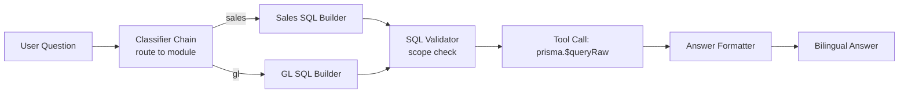
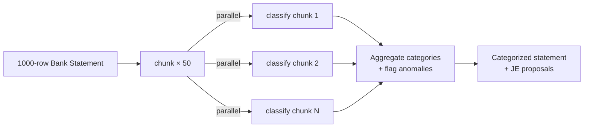

# AI / Prompt Engineering — Namasoft ERP

> **آخر تحديث:** 2026-05-10
> **Stack:** Google Gemini (primary) + Ollama (offline fallback) + LangChain orchestration

---

## 1. AI Use Cases في النظام

| Feature | Endpoint | Model | Pattern |
|---------|---------|-------|---------|
| **CFO Assistant** | `/api/cfo/*` | Gemini 1.5 Pro | RAG + tool-calling |
| **OCR Receipts** | `/api/purchases/ocr` | Gemini Vision | Vision + structured extraction |
| **Bank Statement Analyzer** | `/api/finance/bank-analyze` | Gemini 1.5 Pro | Few-shot classification |
| **Auto-translation** | `/api/transliterate` | Gemini Flash | Translation chain |
| **Knowledge Q&A** | `/api/knowledge/ask` | Gemini + pgvector | RAG |
| **Explain (UX assist)** | `/api/explain` | Gemini Flash | Single-turn explainer |
| **Auto-categorize transactions** | background | Gemini Flash | Classification |
| **Fraud / Anomaly detection** | background | rule + Gemini second-opinion | Hybrid |

---

## 2. System Prompt Anatomy

كل system prompt يجب أن يتبع هذا الهيكل:

```
ROLE          — أنت مساعد CFO لشركة سعودية متعددة الفروع
RULES         — لا تُفصح بيانات tenant آخر؛ التزم بـ SOCPA و ZATCA
CONTEXT       — اللغة الافتراضية: عربي؛ العملة: SAR؛ الفترة المالية: تقويم ميلادي
CAPABILITIES  — الأدوات المتاحة (tool-calling): query_sales, query_gl, query_inventory
FORMAT        — JSON object: { answer_ar, answer_en, evidence[], next_action? }
SAFETY        — ارفض الإفصاح عن: kلمات سر، iqama، رواتب أفراد، أرقام بطاقات
EXAMPLES      — قبل/بعد (few-shot)
```

### Template

```ts
// src/lib/ai/prompts/cfo.ts
export const CFO_SYSTEM_PROMPT = `
أنت مساعد CFO ذكي لمنشأة سعودية تستخدم Namasoft ERP.

# الدور
- تجيب على أسئلة المالك المتعلقة بالأداء المالي بلغة بسيطة.
- تستخدم البيانات المتوفرة عبر الأدوات (tools) دون تخمين.

# القواعد الإلزامية
1. كل أرقامك من tools — لا تخترع.
2. لا تكشف بيانات موظفين أو عملاء بأسمائهم إلا إذا طُلب صراحة.
3. التزم بـ ZATCA و SOCPA و IFRS.
4. العملة الأساسية: SAR. أظهر تكافؤ USD/EUR إن طُلب.
5. اللغة: عربي افتراضياً. أجب بالإنجليزية فقط إن سُئلت بها.

# الأدوات
- query_sales(period, group_by?) → ملخص المبيعات
- query_gl(account, period) → حركة حساب
- query_inventory(item?, warehouse?) → الكميات والقيمة
- run_report(name) → P&L | BS | CF | AR_AGING

# تنسيق الإجابة
ابدأ بإجابة من سطر، ثم 2-3 أسطر تفسير، ثم الأرقام في جدول، ثم اقتراح Next Action.

# الأمان
ارفض أي طلب لكشف:
- كلمات سر / hashes
- أرقام هويات / إقامات
- رواتب أفراد بعينهم (إلا للـ HR admin)
- بطاقات / IBAN كاملة (4 آخر أرقام فقط)
`.trim();
```

---

## 3. Context Engineering

### 3.1 Token Budget Allocation (Gemini Pro 32k context)

```
System Prompt:        2,000 tokens   (هوية ثابتة)
Tenant Profile:         500          (اسم، صناعة، حجم)
RAG Retrieval:        4,000          (top-K relevant chunks)
Tool Definitions:     1,500          (function specs)
Conversation Hx:      8,000          (last N turns; sliding window)
Current Question:       500
─────────────────────────
Reserved for output: 15,500          (~5K answer + 10K reasoning)
```

### 3.2 Sliding Window + Summarization

عند تجاوز عتبة 8K في الـ history:
1. لخّص آخر N أزواج (Q+A) في turn واحد بحجم 800 token.
2. احتفظ بآخر 3 turns كاملة.
3. ضع الـ summary كـ system message.

```ts
async function compressHistory(messages: Msg[]): Promise<Msg[]> {
  if (countTokens(messages) < 8000) return messages;
  const old = messages.slice(0, -3);
  const recent = messages.slice(-3);
  const summary = await summarizeChain.invoke({ messages: old });
  return [{ role: 'system', content: `Earlier conversation: ${summary}` }, ...recent];
}
```

---

## 4. LangChain Patterns المستخدمة

### 4.1 Sequential Chain — تحويل سؤال → SQL → نتيجة → إجابة



### 4.2 Tool-Calling (Function Calling)

```ts
const tools = [
  {
    name: 'query_sales',
    description: 'احصل على ملخص المبيعات لفترة محددة',
    parameters: z.object({
      period: z.enum(['MTD', 'QTD', 'YTD']),
      groupBy: z.enum(['customer', 'product', 'channel']).optional(),
    }),
  },
  // ...
];

const llm = new ChatGoogleGenerativeAI({ model: 'gemini-1.5-pro' }).bindTools(tools);
```

### 4.3 RAG Chain — راجع [rag-architecture.md](./rag-architecture.md)

### 4.4 Map-Reduce لتحليل كشوف بنكية كبيرة



---

## 5. Output Validation

كل LLM response يمر بـ:

```ts
const ResponseSchema = z.object({
  answer_ar: z.string().min(1),
  answer_en: z.string().min(1),
  evidence: z.array(z.object({ source: z.string(), value: z.unknown() })),
  next_action: z.string().optional(),
});

const validated = ResponseSchema.safeParse(rawLLMOutput);
if (!validated.success) {
  // Retry with feedback or fall back to rule-based response
}
```

> **Never trust LLM output blindly** — كل output يُمرَّر على Zod قبل العرض.

---

## 6. Safety Rails

| Risk | Mitigation |
|------|------------|
| **Prompt injection** | strip user-provided data before placing in system zone; sandwich technique |
| **Cross-tenant leak via embeddings** | namespace per tenant in vector store + tenant filter in retrieval |
| **PII in LLM logs** | scrub Iqama / IBAN / salary before logging |
| **Hallucinated numbers** | tool-calling + reject answers without `evidence[]` |
| **Toxicity / unsafe** | Gemini SafetySettings BLOCK_MEDIUM_AND_ABOVE |
| **Cost runaway** | per-tenant daily token budget; throttle at 80% |
| **Sensitive ops** | LLM cannot post journal entries; only proposes — human approves |

---

## 7. Prompt Versioning

```
src/lib/ai/prompts/
  cfo.v1.ts                   ← deprecated
  cfo.v2.ts                   ← current
  cfo.v3.experimental.ts      ← A/B test 5%
```

- Each prompt has explicit version + changelog comment block.
- A/B framework: `getActivePrompt(tenant, feature)` reads from feature flags.
- Win condition: success rate (validated output / total) ≥ baseline + 2%.

---

## 8. Evaluation Set

- **Golden questions** in `tests/ai/golden/cfo-questions.jsonl`.
- Each entry: `{ question, expectedTopic, mustContain[], mustNotContain[] }`.
- CI runs subset; nightly runs full.
- Regression alert if score drops > 5%.

---

## 9. LLM Cost Tracking

| Operation | Avg tokens | $/call (Gemini Pro) |
|-----------|------------|---------------------|
| CFO question | 6,000 in + 1,500 out | $0.012 |
| OCR receipt | 2,000 in + 500 out | $0.004 |
| Bank classify (50 rows) | 4,000 in + 800 out | $0.008 |
| Knowledge Q&A | 5,000 in + 1,000 out | $0.010 |

- Per-tenant counter incremented on every call.
- Surfaced in Tenant Usage dashboard.
- Plan limits (Phase 2): Free 50/day, Growth 500/day, Enterprise unlimited.

---

## 10. Fallback to Local (Ollama)

عند فشل Gemini أو في وضع Desktop offline:

```ts
const llm = new ChatRouter({
  primary: new ChatGoogleGenerativeAI({ model: 'gemini-1.5-flash' }),
  fallback: new ChatOllama({ model: 'llama3.1:8b' }),
  policy: 'fail-fast',  // أو 'cost-optimize' أو 'capability-based'
});
```

---

## 11. References

- [src/lib/ai/](../../src/lib/) — AI primitives (when extracted)
- [docs/ai/rag-architecture.md](./rag-architecture.md)
- [LangChain docs](https://js.langchain.com/) (1.4.0 in package.json)
- [Gemini API docs](https://ai.google.dev/)
