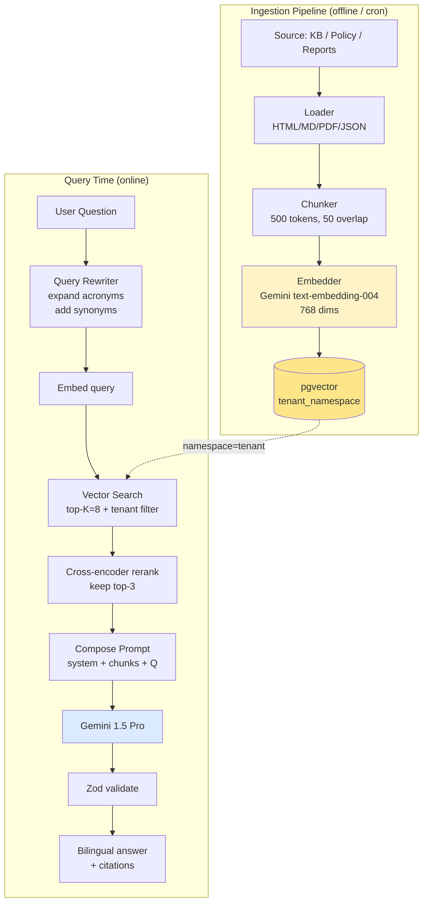
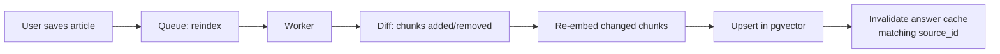

# RAG Architecture — Namasoft ERP

> **آخر تحديث:** 2026-05-10
> **Pattern:** Retrieval-Augmented Generation (RAG) للـ Knowledge Base + CFO Assistant

---

## 1. ما الذي نسترجع منه (Sources)

| Source | Refresh | Use case |
|--------|---------|----------|
| **Knowledge articles** (admin-curated) | live | Help & docs Q&A |
| **Tenant policies** (HR manual, AP policy) | on save | "ما سياسة المصاريف؟" |
| **Past invoices / journal entries** | nightly | "كم مبيعاتنا الشهر الماضي؟" |
| **Reports cache** (P&L history) | hourly | "قارن أداء Q1 بـ Q4" |
| **System docs** (this repo's `/docs`) | weekly | Internal admin Q&A |
| **ZATCA / SOCPA standards** | rarely | Compliance Q&A |

---

## 2. Architecture Diagram



---

## 3. Vector Store Choice

### Postgres + pgvector (Phase 1)

```sql
CREATE EXTENSION IF NOT EXISTS vector;

CREATE TABLE knowledge_chunk (
  id          UUID PRIMARY KEY,
  tenant_id   TEXT NOT NULL,
  source_id   TEXT NOT NULL,
  source_type TEXT NOT NULL,         -- article|policy|report|invoice|...
  content     TEXT NOT NULL,
  metadata    JSONB DEFAULT '{}'::JSONB,
  embedding   vector(768) NOT NULL,
  created_at  TIMESTAMP DEFAULT now()
);

CREATE INDEX kc_tenant_idx ON knowledge_chunk (tenant_id);
CREATE INDEX kc_embed_idx ON knowledge_chunk
  USING hnsw (embedding vector_cosine_ops)
  WITH (m = 16, ef_construction = 64);
```

**Why pgvector?**
- نفس قاعدة البيانات → عزل tenant واضح
- لا حاجة لخدمة منفصلة (تكلفة + نقطة فشل)
- يكفي حتى ~10M chunk لكل instance

### Phase 2 خيارات (إذا تجاوزنا 50M chunks)
- Qdrant (self-hosted)
- Pinecone (managed)
- Weaviate (hybrid + features)

---

## 4. Chunking Strategy

| Doc type | Chunk size | Overlap | Strategy |
|----------|-----------|---------|----------|
| Markdown / docs | 500 tokens | 50 | by `##` headings |
| HR policy PDF | 400 | 80 | by paragraph |
| Invoice line items | 200 | 0 | by invoice (one chunk = one invoice summary) |
| GL entries | aggregate | n/a | "month summary per account" precomputed |
| Code (for AI Code Q&A) | 1000 | 100 | by function/class via AST |

```ts
// Markdown chunker
import { MarkdownTextSplitter } from 'langchain/text_splitter';
const splitter = new MarkdownTextSplitter({ chunkSize: 500, chunkOverlap: 50 });
const chunks = await splitter.createDocuments([rawMarkdown]);
```

---

## 5. Embedding Model

| Model | Dims | Use |
|-------|------|-----|
| **Gemini `text-embedding-004`** | 768 | primary (general) |
| **Gemini `text-embedding-large`** | 3072 | future high-recall mode |
| **Local `nomic-embed-text` (Ollama)** | 768 | offline / desktop fallback |

> Maintain compatibility: when changing models, re-embed all chunks (background job, can take days).

---

## 6. Retrieval Strategy

### 6.1 Hybrid Search (Vector + Keyword)

```sql
-- Vector recall
SELECT id, content, 1 - (embedding <=> $1::vector) AS similarity
FROM knowledge_chunk
WHERE tenant_id = $tenant
ORDER BY embedding <=> $1::vector
LIMIT 20;

-- Keyword recall (Postgres FTS)
SELECT id, content, ts_rank(tsv, query) AS rank
FROM knowledge_chunk, plainto_tsquery('arabic', $q) query
WHERE tenant_id = $tenant AND tsv @@ query
LIMIT 20;

-- Reciprocal Rank Fusion → top 8
```

### 6.2 Filters

```ts
// Tenant filter is MANDATORY (cross-tenant leak risk)
const filter = {
  tenant_id: ctx.tenantId,
  source_type: { in: allowedTypes },
  created_at: { gte: oneYearAgo },     // optional freshness
};
```

### 6.3 Reranking

- Top-20 from hybrid → Gemini reranker (or Cohere) → keep top-3 to fit context.
- Skip reranking if top-1 similarity > 0.92 (high confidence).

---

## 7. Prompt Composition

```
─── System ──────────────────────────────
{CFO_SYSTEM_PROMPT}

─── Retrieved Context ──────────────────
[1] (article: "expense-policy.md", confidence: 0.91)
    «المصاريف فوق 5,000 ريال تتطلب موافقة المدير المالي.»

[2] (report: "ar-aging-2026-04.json", confidence: 0.87)
    «إجمالي ذمم متأخرة: 142,300 ريال — 18% فوق المتوسط.»

[3] (kb: "vat-faq.md", confidence: 0.82)
    «نسبة VAT في السعودية 15% منذ 2020-07-01.»

─── User Question ──────────────────────
"كيف أصدر فاتورة بـ VAT؟"

─── Answer in JSON: { answer_ar, answer_en, evidence[], next_action? }
```

---

## 8. Evaluation Metrics

| Metric | Target | How |
|--------|--------|-----|
| **Hit@K (recall@5)** | > 90% | golden test set |
| **MRR (Mean Reciprocal Rank)** | > 0.8 | tagged ground truth |
| **Faithfulness** (no hallucinations) | > 95% | LLM-as-judge eval |
| **Answer relevance** | > 85% | LLM-as-judge eval |
| **Latency p95** | < 2.5s | tracing |
| **Cost / query** | < $0.015 | metering |

---

## 9. Cross-Tenant Safety

```
Rule: every retrieval MUST include `WHERE tenant_id = ctx.tenantId`.

Test (must always pass):
  - Insert chunk for tenant A.
  - Query for "X" as tenant B.
  - Assert returned chunks are 0 for tenant A's content.

Implementation: a TypeScript helper `searchKnowledge(tenantId, query)` is the
ONLY public API. Direct pgvector queries are forbidden in route handlers.
```

---

## 10. Caching

- **Embedding cache**: hash of query → cached embedding (24h TTL).
- **Answer cache**: `hash(tenantId + question + dataVersion)` → answer (1h TTL for live data, 24h for static knowledge).
- Bypass on `?fresh=1` query param for power users.

---

## 11. Update Pipeline



---

## 12. References

- [Prompt Engineering](./prompt-engineering.md)
- [pgvector docs](https://github.com/pgvector/pgvector)
- [LangChain RAG cookbook](https://js.langchain.com/docs/use_cases/question_answering/)
