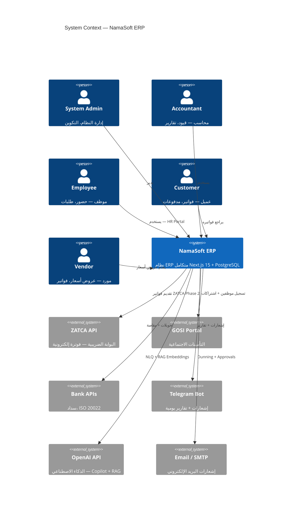
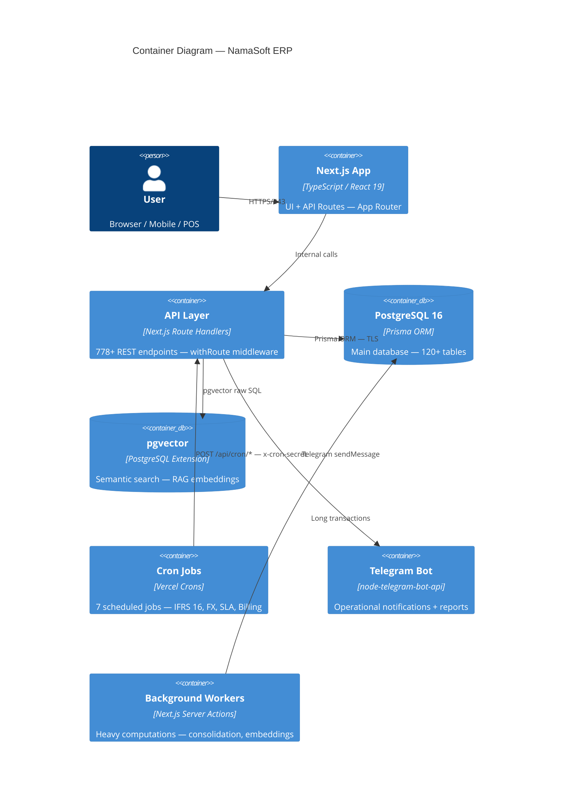
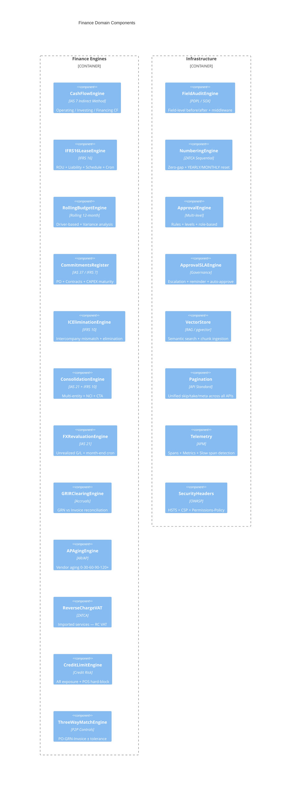
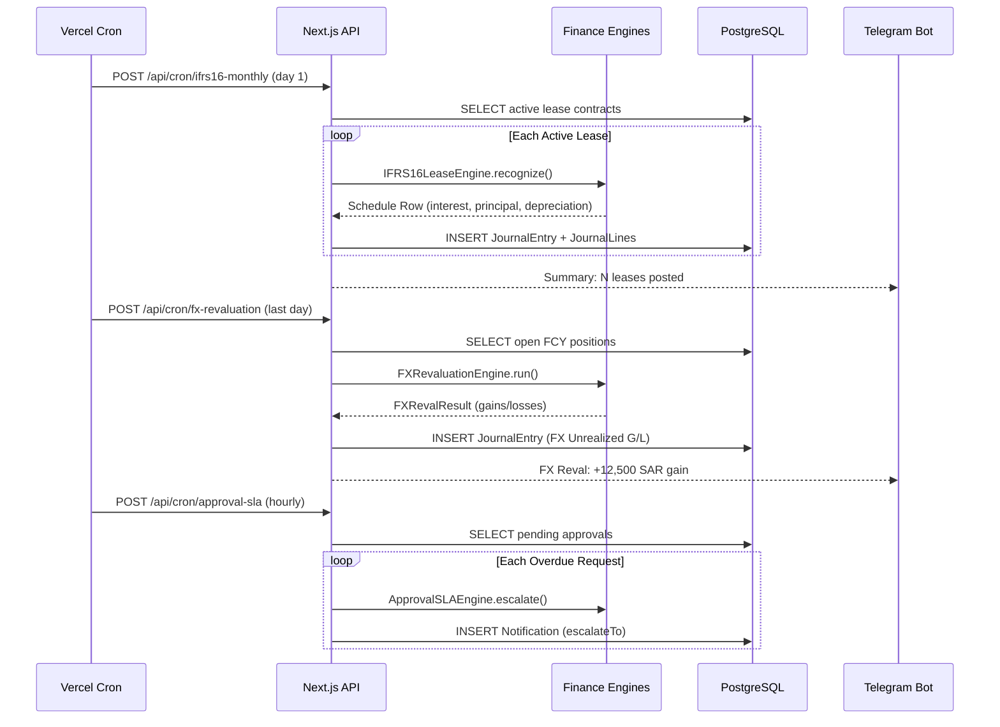
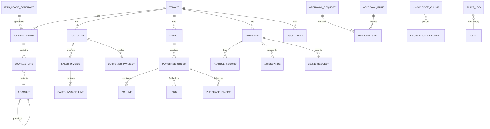

# NamaSoft ERP — System Architecture (C4 Model)
# معمارية النظام

> Last updated: 2026-05-11 | Version: 9.3.0

---

## Level 1 — System Context

---

## Level 2 — Container Diagram

---

## Level 3 — Component Diagram (Finance Domain)

---

## Level 4 — Financial Period-End Sequence

---

## Data Model Overview

---

## Technology Stack

| Layer | Technology | Version | Purpose |
|-------|-----------|---------|---------|
| Frontend | Next.js | 15.x | App Router + RSC |
| UI Library | shadcn/ui | Latest | Component library |
| Language | TypeScript | 5.x | Type safety |
| ORM | Prisma | 6.x | DB access |
| Database | PostgreSQL | 16.x | Primary store |
| Vector DB | pgvector | 0.7.x | RAG embeddings |
| Auth | next-auth / JWT | 5.x | Authentication |
| Validation | Zod | 3.x | Schema validation |
| Testing | Jest | 29.x | Unit tests (88+ cases) |
| CI/CD | GitHub Actions | — | Build + test + deploy |
| Hosting | Hetzner VPS | — | Production server |
| Monitoring | Custom telemetry | — | Spans + metrics |
| Notifications | Telegram Bot | — | Ops + alerts |
| ZATCA | Java SDK + XML | Phase 2 | E-invoicing |

---

## API Surface Summary

| Category | Endpoints | Status |
|----------|-----------|--------|
| Finance (IFRS) | 45+ | ✅ Production |
| Accounting (GL/AP/AR) | 80+ | ✅ Production |
| HR & Payroll | 60+ | ✅ Production |
| Sales & CRM | 70+ | ✅ Production |
| Purchases & P2P | 55+ | ✅ Production |
| Inventory & WMS | 65+ | ✅ Production |
| ZATCA & VAT | 25+ | ✅ Phase 2 Live |
| AI & RAG | 15+ | ✅ Production |
| System & Settings | 60+ | ✅ Production |
| Cron Jobs | 7 | ✅ Scheduled |
| **Total** | **778+** | **✅** |

---

## Compliance Coverage

| Standard | Coverage | Engine / Module |
|----------|----------|----------------|
| ZATCA Phase 2 | ✅ Full | ZATCA XML + QR + SDK |
| IAS 7 (Cash Flow) | ✅ Indirect Method | `financial-statements-engine.ts` |
| IFRS 16 (Leases) | ✅ Full | `ifrs16-lease-engine.ts` + Cron |
| IFRS 10 (Consolidation) | ✅ NCI + IC Elim | `consolidation-engine.ts` |
| IAS 21 (FX) | ✅ Revaluation | `fx-revaluation-engine.ts` |
| IAS 37 (Provisions) | ✅ Commitments | `commitments-register-engine.ts` |
| PDPL (Saudi) | ✅ DSR + DPIA | `pdpl-engine.ts` + `DPIA_TEMPLATE.md` |
| GOSI | ✅ Contributions | HR module |
| SOX Section 404 | ✅ Field Audit | `field-audit-engine.ts` (middleware) |
| OWASP Top 10 | ✅ Headers | `security-headers.ts` |
