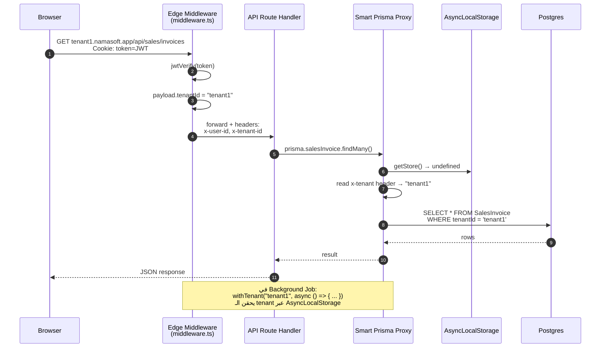
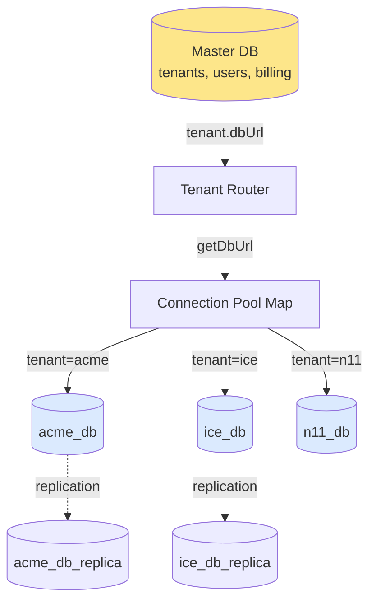
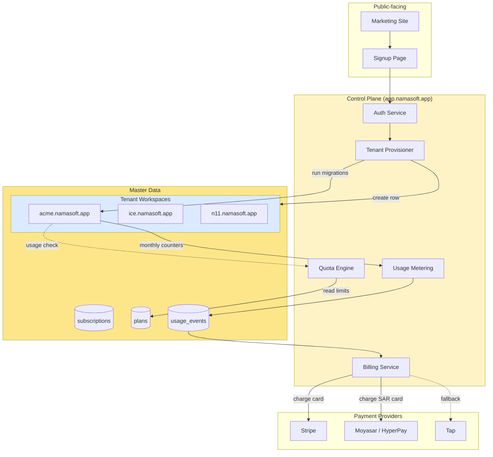
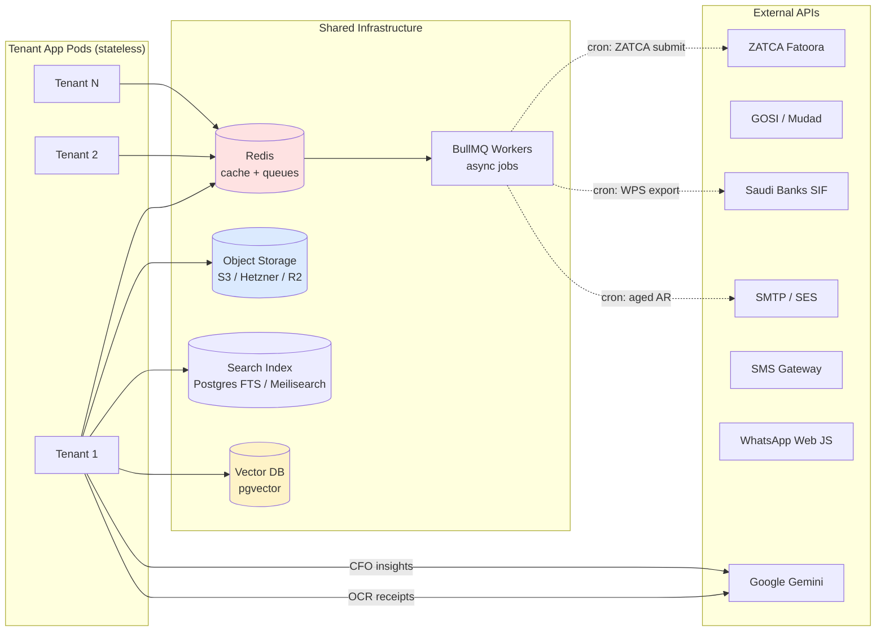
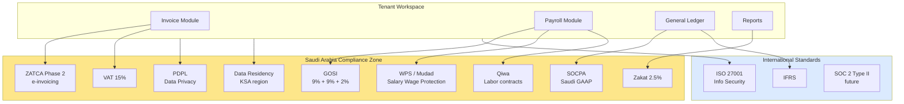

# Multi-Tenant Architecture — Namasoft ERP

> **النسخة:** 1.0
> **آخر تحديث:** 2026-05-10
> **الحالة:** Authoritative (مرجع رسمي)
> **المسؤول:** Architecture Team
> **يقرأ تلقائياً من قبل Claude Code وأي AI Agent**

---

## 1. الفلسفة المعمارية

Namasoft ERP صُمّم كـ **SaaS متعدد المستأجرين** على بنية Next.js 16 + Prisma + PostgreSQL مع وضع ثانٍ **Desktop** (Electron) لقاعدة بيانات محلية واحدة.

### استراتيجية العزل (Isolation Strategy)

| الوضع | النموذج | الاستخدام | العزل |
|-------|---------|-----------|-------|
| **SaaS Cloud** | Single DB + Row-Level Security | Web/PWA متعدد العملاء | `tenantId` على كل صف + Prisma `$extends` |
| **Desktop** | Single DB لكل جهاز | Electron offline-first | `DESKTOP_MODE=true` يُلغي الـ tenant injection |
| **Enterprise (Future)** | DB-per-tenant | عملاء حكوميون / بنوك | `getDbUrl()` يبني URL لكل tenant |

> **القرار الحالي (Phase 1):** Single Postgres DB مع RLS عبر Prisma extension.
> **Phase 2 (مستقبل):** الانتقال لـ DB-per-tenant للعملاء الكبار (يدعمه `getDbUrl()` الموجود في [src/lib/prisma.ts](../../src/lib/prisma.ts) سطر 36).

---

## 2. Domain Routing — توجيه النطاقات

### نموذج النطاقات

```
namasoft.app                    → Marketing site (لا يحتاج tenant)
app.namasoft.app                → SaaS Control Plane (تسجيل، فوترة)
{tenant}.namasoft.app           → Tenant workspace
{tenant}.namasoft.app/api/*     → Tenant APIs (مع x-tenant header)
admin.namasoft.app              → Internal Admin (الفريق فقط)
status.namasoft.app             → Status Page
docs.namasoft.app               → Public docs / OpenAPI
```

### مخطط Domain Routing

```mermaid
flowchart TB
    User[User Browser] -->|HTTPS| CDN[Cloudflare / Vercel Edge]
    CDN -->|wildcard *.namasoft.app| LB[Load Balancer]

    LB -->|app.namasoft.app| ControlPlane[Control Plane Pod<br/>Sign-up, Billing, Tenant Provisioning]
    LB -->|{tenant}.namasoft.app| TenantApp[Tenant App Pod<br/>Next.js + Prisma]
    LB -->|admin.namasoft.app| AdminApp[Internal Admin]
    LB -->|status.namasoft.app| Status[Status Page]

    TenantApp --> MW[Edge Middleware<br/>JWT verify + tenant inject]
    MW -->|x-tenant header| Routes[API Routes]
    Routes -->|getPrisma| Prisma[Prisma Smart Proxy]
    Prisma -->|SELECT WHERE tenantId| DB[(Postgres Primary)]
    Prisma -.read replica.-> DBR[(Postgres Replica)]

    style ControlPlane fill:#fef3c7
    style TenantApp fill:#dbeafe
    style DB fill:#fde68a
```

### قواعد التوجيه

1. **wildcard DNS** — `*.namasoft.app A 1.2.3.4` (Cloudflare proxied).
2. **TLS** — وايلدكارد certificate (Let's Encrypt DNS-01) أو Cloudflare Universal SSL.
3. **Reserved subdomains** (لا يمكن للـ tenant استخدامها): `app, admin, api, docs, status, www, mail, ftp, ns1, ns2`.
4. **Vanity domains** (Phase 3): `myshop.com → CNAME → cname.namasoft.app` مع TLS provisioning تلقائي.

---

## 3. Tenant Resolution — اكتشاف المستأجر

### آلية الاكتشاف (الأولوية من الأعلى للأسفل)

النظام يحاول اكتشاف الـ tenant بالترتيب التالي (مرجع: [src/lib/prisma.ts:127](../../src/lib/prisma.ts#L127)):

| # | المصدر | الاستخدام |
|---|--------|-----------|
| 1 | `tenantContext` (AsyncLocalStorage) | تنفيذ background jobs و cron tasks (`withTenant()`) |
| 2 | `currentRequestStore` | حقن من middleware wrapper |
| 3 | `x-tenant` header (request) | حقن من Edge Middleware |
| 4 | `next/headers` (Next.js context) | استرجاع داخل Server Components |
| 5 | `process.env.TENANT` / `DEFAULT_TENANT` | PM2 per-process mode |
| 6 | `'n11'` (fallback) | Development fallback |

### مخطط Tenant Resolution



### Subdomain → Tenant ID Mapping

| Subdomain | Tenant ID | Notes |
|-----------|-----------|-------|
| `n11.namasoft.app` | `n11` | Default test tenant |
| `acme.namasoft.app` | `acme` | Customer "ACME Corp" |
| `ice.namasoft.app` | `ice` | Customer "ICE" |

> **Slug rules:** lowercase, alphanumeric, dash-separated, 3-32 chars, لا تبدأ برقم.

---

## 4. Database Mapping — تخطيط قاعدة البيانات

### النموذج الحالي (Phase 1) — Shared DB + RLS

```
┌──────────────────────────────────────────────────────┐
│ namasoft_db (Single PostgreSQL Database)             │
├──────────────────────────────────────────────────────┤
│ ┌────────────────────────────────────────────────┐   │
│ │ Tenant table (id, slug, name, plan, ...)       │   │
│ ├────────────────────────────────────────────────┤   │
│ │ User table (id, tenantId, email, role, ...)    │   │
│ ├────────────────────────────────────────────────┤   │
│ │ SalesInvoice (tenantId, ...)  ← RLS injected   │   │
│ │ JournalEntry (tenantId, ...)  ← RLS injected   │   │
│ │ Account      (tenantId, ...)  ← RLS injected   │   │
│ │ ... 157 models total                           │   │
│ └────────────────────────────────────────────────┘   │
└──────────────────────────────────────────────────────┘
```

### مخطط DB Mapping

```mermaid
flowchart LR
    subgraph App["Application Layer"]
        Code[API Route Code]
        Code -->|prisma.invoice.findMany| Proxy[Smart Proxy]
        Proxy -->|withRLS extension| Ext[Prisma Query Extension]
    end

    subgraph Inject["Auto Injection"]
        Ext -->|read = WHERE tenantId| Where[where.tenantId = X]
        Ext -->|write = SET tenantId| Set[data.tenantId = X]
    end

    subgraph DB["PostgreSQL"]
        Where --> SQL[SELECT * FROM invoice<br/>WHERE tenantId='acme']
        Set --> SQL2[INSERT INTO invoice<br/>VALUES (..., 'acme')]
        SQL --> Postgres[(namasoft_db)]
        SQL2 --> Postgres
    end

    subgraph Bypass["Bypass للسيستم"]
        SysModels[Tenant, User, Session, SystemSetting]
        SysModels -.->|skip injection| Postgres
    end

    style Proxy fill:#dbeafe
    style Ext fill:#fef3c7
    style Postgres fill:#fde68a
```

### النموذج المستقبلي (Phase 2) — DB-per-Tenant



> **Migration Path:** عند انتقال tenant من Phase 1 → Phase 2: `pg_dump --schema=... | pg_restore` ثم تحديث `tenants.dbUrl` ثم إخلاء الـ pool.

---

## 5. Auth Flow — تدفق المصادقة

### نموذج المصادقة المتعدد

| Provider | الاستخدام | الحالة |
|----------|-----------|--------|
| **Custom JWT** | Production primary | ✅ نشط ([middleware.ts](../../middleware.ts) + `JWT_SECRET`) |
| **Clerk** | Web SSO (Phase 2) | ⏸️ مدمج لكن غير مفعّل |
| **OTP / MFA** | Sensitive ops | ✅ ([otplib](../../package.json), `mfa/verify`) |
| **API Keys (B2B)** | External integrations | ✅ (`/api/b2b/*`) |
| **Cron Secret** | Background jobs | ✅ (`x-cron-secret` header) |

### مخطط Auth Flow

```mermaid
sequenceDiagram
    autonumber
    participant Browser
    participant Edge as Edge Middleware
    participant Auth as /api/auth/login
    participant DB as Postgres
    participant Route as Protected Route

    Browser->>Auth: POST /api/auth/login<br/>{ email, password }
    Auth->>DB: SELECT user WHERE email
    DB-->>Auth: user record (hash)
    Auth->>Auth: bcrypt.compare(password, hash)
    Auth->>Auth: jwt.sign({ userId, tenantId, role })
    Auth-->>Browser: 200 + Set-Cookie: token=JWT<br/>HttpOnly; Secure; SameSite=Lax

    Note over Browser,Auth: ─── Subsequent requests ───

    Browser->>Edge: GET /api/sales/invoices<br/>Cookie: token=JWT
    Edge->>Edge: extract token (header or cookie)
    Edge->>Edge: jwtVerify(token, JWT_SECRET)

    alt Invalid / Expired
        Edge-->>Browser: 401 Unauthorized
    else Valid
        Edge->>Edge: inject headers:<br/>x-user-id, x-tenant-id, x-user-role
        Edge->>Route: forward request
        Route->>DB: query with tenant scope
        DB-->>Route: data
        Route-->>Browser: 200 + JSON
    end
```

### Token Lifecycle

| Event | Action |
|-------|--------|
| **Login** | issue access (1h) + refresh (30d) |
| **Refresh** | rotate access; revoke old refresh; new refresh issued |
| **Logout** | revoke refresh; clear cookie |
| **Compromise** | revoke all sessions for user; force re-login |
| **Tenant suspended** | reject all tokens for tenant (lookup in cache) |

### Role-Based Access Control (RBAC)

```
Roles (granular):
  - super_admin       (system-wide; only internal team)
  - tenant_admin      (full access within tenant)
  - accounting_admin  (GL, JE, reports)
  - sales_manager     (sales module)
  - hr_admin          (HR + payroll)
  - cashier           (POS only)
  - employee          (self-service)
  - read_only_auditor (compliance read)
```

---

## 6. SaaS Control Plane — لوحة التحكم المركزية

### المسؤوليات

```
Control Plane (app.namasoft.app):
  ├─ Tenant Provisioning    (إنشاء tenant جديد + تهيئة schema)
  ├─ Subscription Billing   (Stripe / Tap / Moyasar / HyperPay)
  ├─ Plan Management        (Starter / Growth / Enterprise)
  ├─ Quota Enforcement      (users, storage, transactions/month)
  ├─ Usage Metering         (counters → billing)
  ├─ Self-Service Onboarding (signup → wizard → ready)
  ├─ Admin Dashboard         (internal team only)
  └─ Status / Health Reporting
```

### مخطط Control Plane



### Tenant Lifecycle States

```
created → onboarding → active → suspended → archived → purged
                  ↓
                trial → trial_expired
```

| State | Effect |
|-------|--------|
| `onboarding` | wizard incomplete, can login |
| `active` | full access |
| `trial` | active + countdown banner; auto-suspend on day 31 |
| `suspended` | reads blocked, login blocked, billing failed |
| `archived` | data retained 90 days; no access |
| `purged` | hard delete (GDPR / PDPL right to be forgotten) |

---

## 7. Shared Services — الخدمات المشتركة



### تخصيص لكل خدمة

| Service | عزل المستأجرين |
|---------|----------------|
| **Redis** | key prefix: `tenant:{slug}:*` |
| **BullMQ** | queue prefix: `q:{slug}:*` |
| **S3** | bucket path: `s3://namasoft-prod/tenants/{slug}/*` |
| **Vector DB** | namespace per tenant (pgvector partition) |
| **Logs** | `tenant_id` field on every log line |
| **Metrics** | `tenant` label on Prometheus metrics |

---

## 8. Compliance Boundaries — حدود الامتثال



### Data Residency Rules

| Data Type | Storage Location | Cross-border? |
|-----------|------------------|----------------|
| **PII (مواطن سعودي)** | KSA region only | ❌ ممنوع |
| **Financial records** | KSA primary + DR in KSA | ❌ |
| **ZATCA invoices** | KSA (immutable, 7 years) | ❌ |
| **Backups** | KSA encrypted | ❌ |
| **Logs (sanitized)** | KSA preferred | ⚠️ مع IP redaction |
| **Marketing data (anonymized)** | global allowed | ✅ |

### Compliance Matrix

| Regulation | Module Touched | Owner | Audit Frequency |
|------------|---------------|-------|----------------|
| ZATCA Phase 2 | sales/invoicing | tenant_admin | monthly |
| GOSI | payroll | hr_admin | monthly |
| WPS / Mudad | payroll | hr_admin | per pay-cycle |
| PDPL | all (PII) | DPO | quarterly |
| SOCPA | accounting | accounting_admin | yearly |
| IFRS | financial reports | accounting_admin | yearly |

---

## 9. Failure Modes & Mitigations

| Risk | Impact | Mitigation |
|------|--------|------------|
| **Tenant ID leakage** (one tenant reads another's data) | 🔴 Critical | RLS extension + integration tests in [src/middleware/__tests__/tenant-isolation.test.ts](../../src/middleware/__tests__/tenant-isolation.test.ts) |
| **Connection pool exhaustion** | 🟠 High | Single shared client + pgBouncer in front |
| **Hot tenant (one tenant overloads DB)** | 🟠 High | Phase 2 → DB per noisy tenant |
| **JWT secret leak** | 🔴 Critical | rotate quarterly + revoke all tokens |
| **Subdomain takeover** | 🟠 High | Validate `Host` header against tenants whitelist |
| **Cross-tenant background job** | 🔴 Critical | `withTenant()` mandatory wrapper for all BullMQ jobs |
| **PDPL violation (KSA data → US)** | 🔴 Critical | Region pinning + sentry data scrubbing |

---

## 10. Roadmap & Open Decisions

### Decided
- ✅ Phase 1: Shared DB + RLS via Prisma extension
- ✅ JWT auth as primary; Clerk as Phase 2 SSO
- ✅ Subdomain-based tenant resolution
- ✅ AsyncLocalStorage for background jobs

### Open Questions
- ❓ متى ننتقل لـ DB-per-tenant؟ (proposed: عند تجاوز 50 tenant أو tenant بـ >100k tx/شهر)
- ❓ Vanity domains: bring-your-own vs. proxy through Cloudflare for Customers?
- ❓ Active-Active multi-region؟ (KSA الشمالية + الشرقية فقط، لا cross-border)
- ❓ Switching to Postgres native RLS بدلاً من Prisma extension؟ (أقوى أمنياً لكن أصعب في الـ migrations)

---

## 11. References

| Doc | Purpose |
|-----|---------|
| [src/lib/prisma.ts](../../src/lib/prisma.ts) | Smart Prisma Proxy + tenant resolution |
| [middleware.ts](../../middleware.ts) | Edge auth + JWT verify |
| [prisma/schema.prisma](../../prisma/schema.prisma) | 157 models with `tenantId` |
| [src/middleware/__tests__/tenant-isolation.test.ts](../../src/middleware/__tests__/tenant-isolation.test.ts) | Cross-tenant leakage tests |
| [docs/architecture/system-overview.md](./system-overview.md) | High-level architecture |
| [docs/security/security-plan.md](../security/security-plan.md) | Threat model + controls |
| [docs/deployment/deployment-plan.md](../deployment/deployment-plan.md) | Infra & rollout |

---

**نهاية الوثيقة.**
