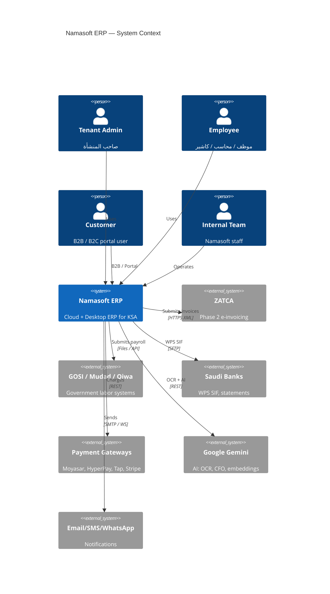
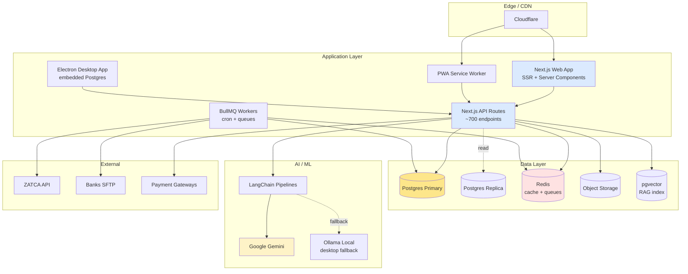
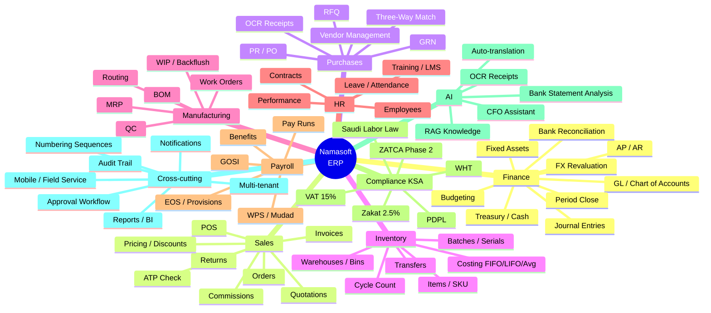
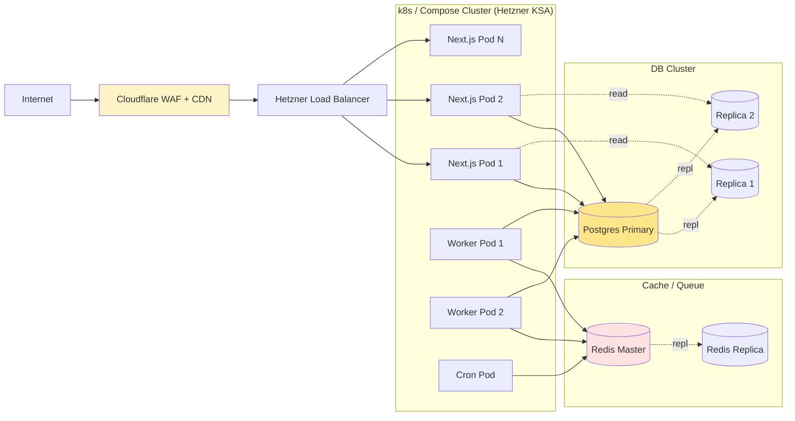

# System Architecture Overview — Namasoft ERP

> **النسخة:** 1.0 — **آخر تحديث:** 2026-05-10
> **يُقرأ مع:** [multi-tenant.md](./multi-tenant.md)

---

## 1. C4 Level 1 — System Context

---

## 2. C4 Level 2 — Container View

---

## 3. C4 Level 3 — Module Map (104 Modules)

---

## 4. Stack Decisions (DR)

| Layer | Choice | Rationale |
|-------|--------|-----------|
| **Frontend** | Next.js 16 + React 19 | RSC + edge runtime + Vercel-class DX |
| **Styling** | Tailwind 4 + shadcn/ui | atomic + ownable components |
| **State** | TanStack Query + Server Actions | minimal client state |
| **Forms** | react-hook-form + Zod | type-safe boundary |
| **Backend** | Next.js Route Handlers | colocation; one repo |
| **ORM** | Prisma 5.22 | mature; types end-to-end |
| **DB** | PostgreSQL 16 | ACID + RLS + pgvector |
| **Cache** | Redis | de-facto |
| **Queue** | BullMQ | Redis-backed; reliable |
| **Auth** | Custom JWT + Clerk (planned) | flexibility + future SSO |
| **AI** | Google Gemini + Ollama fallback | KSA-region availability |
| **i18n** | Next.js native + JSON | RTL/LTR mirror |
| **Testing** | Jest + Vitest + Playwright | unit + e2e |
| **Monitoring** | Sentry + Prometheus | errors + metrics |

---

## 5. Runtime Topology

---

## 6. Cross-Cutting Concerns

| Concern | Approach |
|---------|----------|
| **Tenancy** | RLS via Prisma extension ([multi-tenant.md](./multi-tenant.md)) |
| **AuthZ** | Role + permission matrix; checked in API layer |
| **Audit** | Field-level audit trail (planned Phase 0) |
| **Idempotency** | `Idempotency-Key` header on POST/PUT writes |
| **Rate-limiting** | Redis token bucket; per-tenant + per-IP |
| **Logging** | Structured JSON; tenantId on every line |
| **Observability** | Sentry + Prometheus + OpenTelemetry traces |
| **Backups** | Daily full + WAL streaming; tested quarterly |
| **DR / RTO** | RTO 4h, RPO 15min |

---

## 7. References

- [Multi-Tenant Architecture](./multi-tenant.md)
- [Security Plan](../security/security-plan.md)
- [Deployment Plan](../deployment/deployment-plan.md)
- [API Specifications](../api/openapi-summary.md)
- [GLOBAL_ERP_GAP_ANALYSIS.md](../../GLOBAL_ERP_GAP_ANALYSIS.md)
