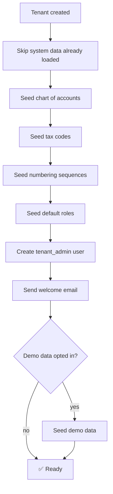

# Seed Data & Sample Data — Namasoft ERP

> **آخر تحديث:** 2026-05-10
> **Source:** [prisma/seed.ts](../../prisma/seed.ts)

---

## 1. أنواع البيانات الأولية

| Type | Purpose | When loaded |
|------|---------|-------------|
| **System reference** | currencies, countries, tax codes | once at first migration |
| **Tenant defaults** | chart of accounts, numbering sequences, tax codes | on tenant provision |
| **Demo data** | fake customers, invoices, employees | on `--demo` flag |
| **Test fixtures** | known-state factories | per-test |

---

## 2. System Reference Data

### 2.1 Currencies

```ts
const currencies = [
  { code: 'SAR', name: 'Saudi Riyal', symbol: 'ر.س', decimals: 2, isBase: true },
  { code: 'USD', name: 'US Dollar', symbol: '$', decimals: 2 },
  { code: 'EUR', name: 'Euro', symbol: '€', decimals: 2 },
  { code: 'AED', name: 'UAE Dirham', symbol: 'د.إ', decimals: 2 },
  { code: 'KWD', name: 'Kuwaiti Dinar', symbol: 'د.ك', decimals: 3 },
  // ... GCC + major
];
```

### 2.2 Saudi Tax Codes

```ts
const taxCodes = [
  { code: 'VAT_15',     rate: 15,  name: 'ضريبة القيمة المضافة 15%' },
  { code: 'VAT_0',      rate: 0,   name: 'صفرية (تصدير)' },
  { code: 'VAT_EXEMPT', rate: 0,   name: 'إعفاء' },
  { code: 'WHT_5',      rate: 5,   name: 'استقطاع 5%' },
  { code: 'WHT_15',     rate: 15,  name: 'استقطاع 15%' },
  { code: 'WHT_20',     rate: 20,  name: 'استقطاع 20%' },
];
```

### 2.3 Countries (KSA + GCC + major)

`SA, AE, KW, BH, OM, QA, EG, JO, US, GB, FR, DE, IN, PK, ...`

---

## 3. SOCPA Chart of Accounts (Default)

Hierarchical 4-level template seeded for every new tenant:

```
1xxx Assets
  11xx Current Assets
    1110 Cash on Hand
    1120 Banks
    1130 Accounts Receivable
    1140 Inventory
    1150 Prepaid Expenses
  12xx Non-Current Assets
    1210 Fixed Assets
    1220 Accumulated Depreciation
    1230 Intangible Assets

2xxx Liabilities
  21xx Current Liabilities
    2110 Accounts Payable
    2120 VAT Output Payable
    2130 VAT Input Receivable
    2140 GR/IR (Goods Received Not Invoiced)
    2150 Salaries Payable
  22xx Long-term Liabilities

3xxx Equity
  3100 Capital
  3200 Retained Earnings
  3300 Current Year P/L

4xxx Revenue
  4100 Sales
  4200 Sales Returns (contra)
  4300 Other Income

5xxx Expenses
  5100 COGS
  5200 Salaries & Wages
  5300 Rent
  5400 Utilities
  5500 Depreciation
  5600 Marketing
  5700 G&A
```

> Each account marked `isControl: true/false`, `isPostable: true/false`, `currencyCode`, `taxCode?`.

---

## 4. Numbering Sequences (per tenant default)

| Document | Format | Reset |
|----------|--------|-------|
| Invoice | `INV-{YYYY}-{0000}` | yearly |
| Sales Order | `SO-{YYYY}-{0000}` | yearly |
| Quote | `Q-{YYYY}-{0000}` | yearly |
| Purchase Order | `PO-{YYYY}-{0000}` | yearly |
| GRN | `GRN-{YYYY}-{0000}` | yearly |
| Vendor Invoice | `VI-{YYYY}-{0000}` | yearly |
| Journal Entry | `JE-{YYYY}-{00000}` | yearly |
| Payment | `PV-{YYYY}-{0000}` | yearly |
| Receipt | `RV-{YYYY}-{0000}` | yearly |
| Payroll Run | `PR-{YYYY}-{MM}` | n/a (period) |

---

## 5. Default Roles & Permissions

```ts
const defaultRoles = [
  {
    name: 'tenant_admin',
    permissions: ['*'],
  },
  {
    name: 'accounting_admin',
    permissions: [
      'accounting:*', 'reports:read',
      'sales:read', 'purchases:read',
    ],
  },
  {
    name: 'sales_manager',
    permissions: ['sales:*', 'reports:sales:read'],
  },
  {
    name: 'cashier',
    permissions: ['pos:*', 'sales:invoice:create'],
  },
  // ...
];
```

---

## 6. Demo / Sample Data (for new tenants opting-in)

### 6.1 Fake customers (Saudi-flavored)

- شركة الراجحي للتجارة (acme corp)
- مؤسسة النور الذهبية
- الشركة العالمية للمواد الغذائية
- متاجر السلام
- ... (50 records)

### 6.2 Fake products

- أرز بسمتي 5 كجم — 35 SAR
- زيت دوار الشمس 1.5 لتر — 12 SAR
- شاي ليبتون 100 كيس — 18 SAR
- ... (200 SKUs across 10 categories)

### 6.3 Fake invoices

- 12 months × ~50 invoices/month seeded for trend charts.
- Mix of paid / partially paid / overdue / draft.

### 6.4 Fake employees

- 25 employees across Sales, Operations, Admin.
- Mix of Saudi + non-Saudi (for GOSI/SANED variation).
- 6 months of payroll runs precomputed.

> **All demo data is clearly tagged** with `isDemoData: true` and can be wiped with `npm run db:demo:clean`.

---

## 7. Test Factories

```ts
// src/tests/factories/customer.ts
export function makeCustomer(overrides: Partial<Customer> = {}): CustomerInput {
  return {
    name: faker.company.name(),
    nameAr: faker.helpers.arabicCompanyName(),
    vatNumber: faker.string.numeric(15),
    creditLimit: faker.number.int({ min: 1000, max: 100000 }),
    ...overrides,
  };
}

export async function seedCustomers(prisma: PrismaClient, n: number) {
  const data = Array.from({ length: n }, () => makeCustomer());
  return prisma.customer.createMany({ data });
}
```

---

## 8. Loading Order (provision pipeline)



---

## 9. Seed Scripts

```bash
# system-wide reference data (currencies, countries, etc.)
npm run db:seed:system

# per-tenant defaults
npm run db:seed:tenant -- --tenant=acme

# demo data
npm run db:seed:demo -- --tenant=acme

# wipe demo data
npm run db:demo:clean -- --tenant=acme
```

---

## 10. Backup of Seed State (for tests)

- After loading reference + a clean tenant, snapshot DB:
  ```bash
  pg_dump --format=custom > tests/fixtures/clean-tenant.dump
  ```
- Tests `restoreSnapshot()` per file (Testcontainers).

---

## 11. References

- [prisma/seed.ts](../../prisma/seed.ts)
- [Migration Strategy](../migrations/migration-strategy.md)
- [Test Plan](../testing/test-plan.md)
