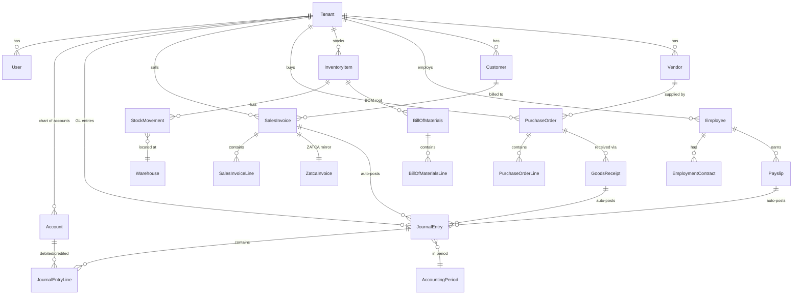

# Database ERD — Namasoft ERP

> **آخر تحديث:** 2026-05-10
> **Source of Truth:** [prisma/schema.prisma](../../prisma/schema.prisma) (157 models)

---

## 1. توليد ERD آلياً

```bash
# 1) من Prisma → Mermaid
npx prisma-erd-generator

# 2) من Prisma → DBML (dbdocs.io)
npx prisma-dbml-generator

# 3) Postgres → DBML
dbdocs build prisma/dbml/schema.dbml
```

> **Recommended:** أضف `prisma-erd-generator` كـ dev dependency واجعل `npm run erd` يولّد PNG/SVG في `docs/database/erd.png`.

---

## 2. تصنيف الـ 157 نموذج (High-Level Map)



---

## 3. الـ Domains الرئيسية

### 3.1 Identity & Access
- `Tenant`, `User`, `Session`, `Role`, `Permission`, `RolePermission`
- `ApiKey`, `OAuthClient`, `RefreshToken`

### 3.2 Master Data
- `Customer`, `Vendor`, `Employee`, `InventoryItem`, `Warehouse`
- `Currency`, `ExchangeRate`, `TaxCode`, `UnitOfMeasure`

### 3.3 Accounting (GL)
- `Account` (chart of accounts), `AccountingPeriod`
- `JournalEntry`, `JournalEntryLine`
- `FxRevaluation`, `PeriodClose`

### 3.4 Sales (O2C)
- `Quotation`, `SalesOrder`, `SalesInvoice`, `SalesInvoiceLine`
- `SalesReturn`, `Commission`, `PriceList`, `Discount`

### 3.5 Purchases (P2P)
- `PurchaseRequisition`, `RFQ`, `PurchaseOrder`, `PurchaseOrderLine`
- `GoodsReceipt`, `VendorInvoice`, `VendorPayment`
- `ThreeWayMatch`

### 3.6 Inventory
- `InventoryItem`, `StockMovement`, `Warehouse`, `Bin`
- `Batch`, `Serial`, `CycleCount`, `Transfer`
- `ItemCost` (FIFO/LIFO/AVG)

### 3.7 Manufacturing
- `BillOfMaterials`, `Routing`, `WorkCenter`, `WorkOrder`
- `MrpRun`, `WipMovement`, `QualityCheck`

### 3.8 HR & Payroll
- `Employee`, `EmploymentContract`, `LeaveRequest`, `Attendance`
- `PayRun`, `Payslip`, `GosiSubmission`, `WpsExport`, `EosCalculation`

### 3.9 Treasury & Banking
- `BankAccount`, `BankStatement`, `BankReconciliation`
- `Check`, `PettyCash`, `CashPosition`

### 3.10 ZATCA Compliance
- `ZatcaInvoice`, `ZatcaCounter`, `ZatcaCallback`
- `ZatcaCertificate`, `ZatcaSettings`

### 3.11 System / Cross-cutting
- `AuditLog`, `Setting`, `Numbering`, `Approval`, `ApprovalStep`
- `Notification`, `Webhook`, `WebhookDelivery`
- `KnowledgeArticle`, `VectorEmbedding`

---

## 4. Naming Conventions

| Element | Convention |
|---------|------------|
| Model | `PascalCase`, singular (e.g. `SalesInvoice`) |
| Table | `snake_case` (Prisma `@@map`) |
| Column | `camelCase` in code, `snake_case` in DB (`@map`) |
| FK | `{related}Id` (e.g. `customerId`) |
| Index | composite `(tenantId, ...)` always first |
| Enum | `UPPER_SNAKE_CASE` |
| ID | `cuid()` strings (NOT auto-int) |
| Money | `Decimal(18, 4)` always |
| Dates | `DateTime` UTC; render in app per tenant TZ |

---

## 5. Constraints & Indexes

### Required indexes on every "tenant-scoped" model

```prisma
model SalesInvoice {
  id        String   @id @default(cuid())
  tenantId  String
  number    String
  // ...
  @@unique([tenantId, number])           // numbering uniqueness
  @@index([tenantId, status])
  @@index([tenantId, customerId])
  @@index([tenantId, issuedAt])
}
```

### Critical FKs with `onDelete`

```prisma
JournalEntry  →  Account            (Restrict; never delete posted accounts)
SalesInvoice  →  Customer           (Restrict)
Payslip       →  Employee           (Restrict)
ApprovalStep  →  Approval           (Cascade)
WebhookDelivery → Webhook           (Cascade)
```

---

## 6. Soft Delete

- Implemented via [src/lib/prisma-soft-delete.ts](../../src/lib/prisma-soft-delete.ts).
- All tenant-scoped models have `deletedAt: DateTime?`.
- Default queries filter `deletedAt: null`. Bypass with `findMany({ where: { deletedAt: { not: null } } })`.

---

## 7. Migration Strategy

See [migration-strategy.md](../migrations/migration-strategy.md). Rules:
- **Never** edit a committed migration.
- **Never** drop a column with active data — use `@deprecated` first.
- Backfills run as separate scripts in `scripts/migrations/<date>-<name>.ts`.
- For ZATCA-touched tables: migrations require approval from tenant_admin.

---

## 8. Auto-generation Tooling

```bash
# Mermaid ERD per domain
npm run erd:generate           # outputs docs/database/erd-{domain}.mmd

# DBML for dbdocs.io hosted ERD
npm run erd:dbml               # outputs prisma/dbml/schema.dbml

# Per-table audit (count rows + last write per tenant)
npm run db:audit
```

> If these scripts don't exist yet, they should be added as part of Phase 0.

---

## 9. Reference Maps (planned per-domain ERDs)

- [erd-finance.mmd](./erd-finance.mmd) — GL, AP, AR, treasury *(TODO)*
- [erd-sales.mmd](./erd-sales.mmd) — O2C *(TODO)*
- [erd-purchases.mmd](./erd-purchases.mmd) — P2P *(TODO)*
- [erd-inventory.mmd](./erd-inventory.mmd) — stock + costing *(TODO)*
- [erd-manufacturing.mmd](./erd-manufacturing.mmd) — BOM + MO *(TODO)*
- [erd-hr-payroll.mmd](./erd-hr-payroll.mmd) — HR + payroll *(TODO)*
- [erd-zatca.mmd](./erd-zatca.mmd) — invoicing chain *(TODO)*

> **TODO:** generate per-domain ERDs once `prisma-erd-generator` is wired into `npm run erd:generate`.
