# 🗄️ Database Architecture (ERD)

Welcome to the Nama Invest ERP Database Schema overview. Since the schema contains over 600 models, it has been automatically split into modular diagrams for readability. 

## 🗺️ Module Diagrams

### 1. 💼 Accounting Module
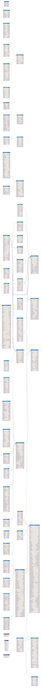

### 2. 🛒 Sales & Customers
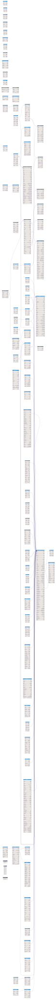

### 3. 📦 Purchases & Suppliers
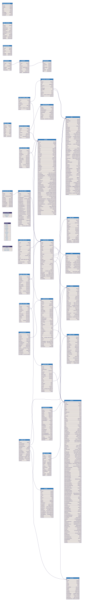

### 4. 🧮 Inventory & Logistics
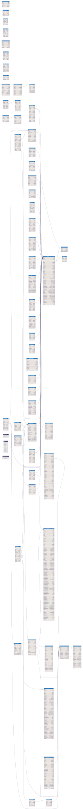

### 5. 🏭 Manufacturing & Production
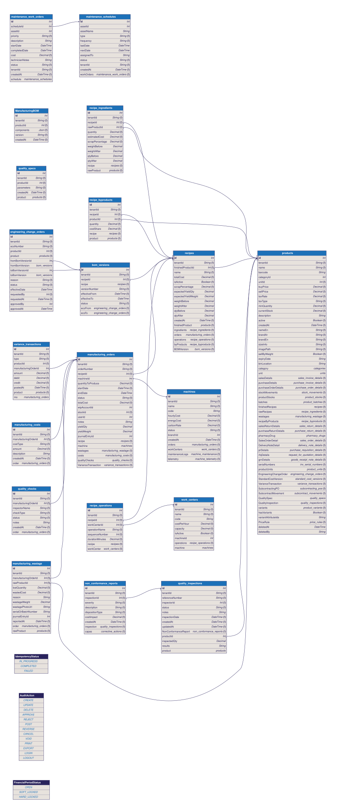

### 6. 👥 HR & Payroll
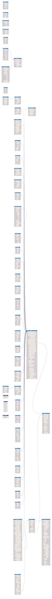

### 7. 🏦 Treasury & Banking
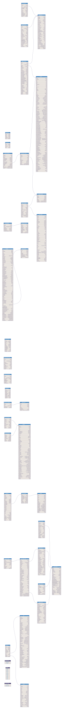

### 8. 🏢 Fixed Assets
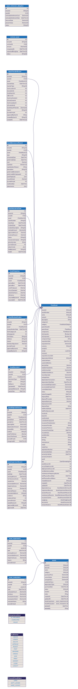

### 9. 🤖 AI Capabilities
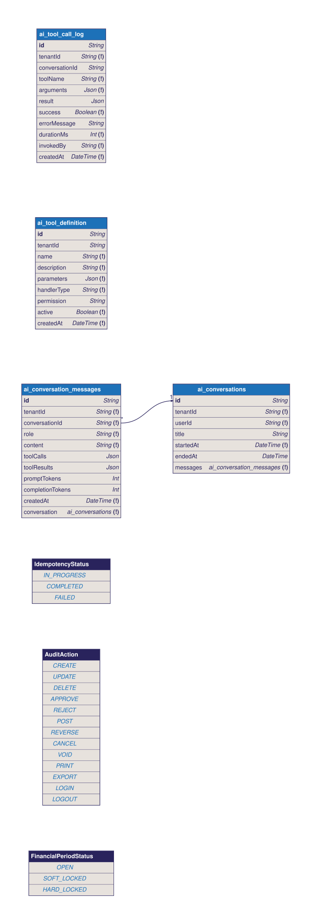

### 10. 🇸🇦 ZATCA E-Invoicing
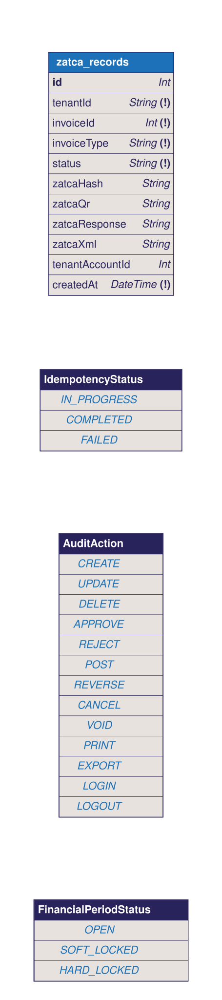

### 11. 🛡️ Master Tenant & Security
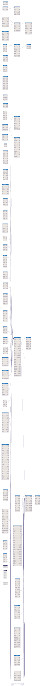

### 12. 🔗 Common & Uncategorized

---

## 🏷️ Badge Legend

- **`🔴 Tenant`**: Tenant Isolated (Multi-tenant Foreign Key).
- **`🟡 Controlled`**: Controlled Account/Entity.
- **`[SD]`**: Soft Delete Enabled (`deletedAt`).
- **`External Module`**: Table referenced from another module (Foreign Key link).

> **Note**: This file and all SVGs are auto-generated via `.github/workflows/erd.yml` and `.husky/pre-commit` hooks.
