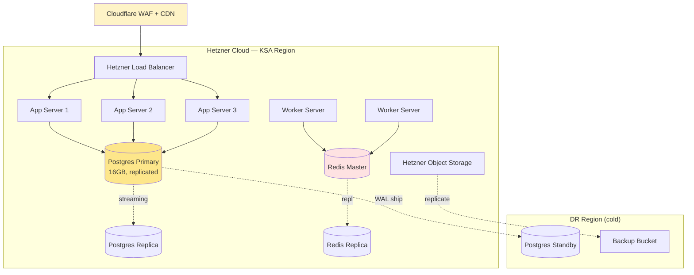
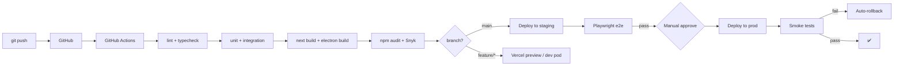
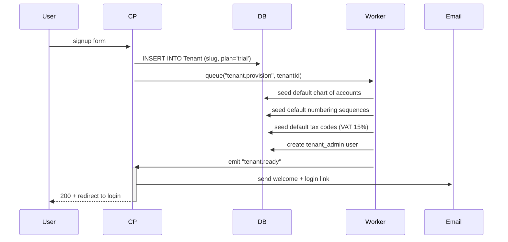

# Deployment Plan — Namasoft ERP

> **آخر تحديث:** 2026-05-10
> **يُقرأ مع:** [HETZNER_DEVOPS_POSTGRES_GUIDE.md](../../HETZNER_DEVOPS_POSTGRES_GUIDE.md) و [DEPLOYMENT.md](../../DEPLOYMENT.md)

---

## 1. Environments

| Env | URL | Purpose | Data |
|-----|-----|---------|------|
| **local** | `http://localhost:3000` | dev | local Postgres or Docker |
| **dev** | `dev.namasoft.app` | shared dev | seeded fake tenant |
| **staging** | `staging.namasoft.app` | UAT, demos | masked production sample |
| **prod** | `*.namasoft.app` | customers | live |
| **dr** | `dr.namasoft.app` (cold) | disaster recovery | replicated 15min RPO |

---

## 2. Infrastructure Topology



---

## 3. Stack on Each Tier

| Tier | Tech |
|------|------|
| Edge | Cloudflare (CDN, WAF, rate-limit, DDoS) |
| LB | Hetzner LB (TLS termination at LB or pass-through) |
| App | Next.js standalone (Node 20+) on systemd or k3s |
| Worker | BullMQ workers (Node) on dedicated boxes |
| DB | Postgres 16 (managed via Hetzner or self-managed) |
| Cache | Redis 7 (sentinel for HA) |
| Storage | Hetzner Object Storage (S3-compatible) |
| Monitoring | Sentry + Prometheus + Grafana (or Hetzner managed) |

---

## 4. CI/CD Pipeline



See [docs/devops/cicd.md](../devops/cicd.md) for full pipeline spec.

---

## 5. Release Strategy

| Type | Cadence | Rollout |
|------|---------|---------|
| **Patch (bugfix)** | as needed | direct to prod after CI |
| **Minor (feature)** | weekly | staging 24h → 10% prod canary → full |
| **Major (schema)** | monthly | staging 1 week → blue/green prod |
| **Hotfix (P0)** | within 1h | feature flag → fast roll |
| **Desktop (Electron)** | bi-weekly | electron-updater auto-update |

---

## 6. Database Migrations

```
Local:    npx prisma migrate dev --name <name>
Staging:  CI runs `prisma migrate deploy`
Prod:     manual approval → `prisma migrate deploy` → smoke tests
```

### Safe migration rules
1. **Additive first** — add column with default, deploy, backfill, then make NOT NULL.
2. **Rename = create new + dual-write + backfill + drop old** (3 deploys).
3. **Drop = soft-deprecate** for 2 releases before drop.
4. Long-running backfill → run as background job, not in migration.

---

## 7. Zero-Downtime Deploy

- Build immutable image per commit.
- Health-check `/api/health` on `:3000`.
- LB drains old pod (30s) → starts new pod → switch.
- Postgres connections: PgBouncer in transaction-pool mode handles cycling.

---

## 8. Backup & Disaster Recovery

| Asset | Strategy | RPO | RTO |
|-------|----------|-----|-----|
| Postgres | continuous WAL + daily full | 15 min | 4 h |
| Object storage | versioning + cross-bucket replicate | 1 h | 1 h |
| Configs | git + secrets manager | 0 | 1 h |
| Tenant data export | self-service quarterly | per-tenant | n/a |

### DR Drill
- Quarterly restore test from latest backup → validate row counts + checksums.
- Annual full failover to DR region (announced in advance).

---

## 9. Tenant Provisioning



Seeds: see [docs/data/seed-data.md](../data/seed-data.md).

---

## 10. Desktop App (Electron)

- Build: `npm run electron:build` → produces `.exe` (Windows), `.dmg` (planned macOS).
- Auto-update: electron-updater pulls signed releases from GitHub Releases.
- Bundled: embedded Postgres via `embedded-postgres` (`DESKTOP_MODE=true`).
- Code-signing: Windows EV cert (planned).

---

## 11. Observability

| Signal | Tool | Retention |
|--------|------|-----------|
| Errors | Sentry | 90 days |
| Metrics | Prometheus + Grafana | 30 days raw, 1 year aggregated |
| Traces | OpenTelemetry → Tempo | 14 days |
| Logs (app) | Loki / Hetzner logs | 30 days |
| Logs (audit) | Postgres + S3 archive | 7 years (compliance) |
| Uptime | Better Stack / UptimeRobot | indefinite |

### Key SLIs/SLOs

| SLI | SLO |
|-----|-----|
| API availability | 99.9% (43min/month) |
| API p95 latency (read) | < 300ms |
| API p95 latency (write) | < 800ms |
| ZATCA submission success | > 99% |
| Background job latency | p95 < 5min |

---

## 12. Cost Model (per ~50 tenants estimate)

| Item | Monthly (€) |
|------|------------|
| Hetzner CCX21 ×3 (app) | 90 |
| Hetzner CPX31 ×2 (worker) | 50 |
| Hetzner managed Postgres (16GB) | 90 |
| Object storage (1 TB) | 5 |
| Cloudflare Pro | 20 |
| Sentry (developer) | 26 |
| Domain + SSL | 2 |
| **Total ~** | **€280 / month** |

---

## 13. Runbooks

- `runbook-zatca-down.md` *(TODO)* — مقدّمة الفواتير في الـ queue
- `runbook-postgres-failover.md` *(TODO)*
- `runbook-tenant-suspend.md` *(TODO)*
- `runbook-data-export.md` *(TODO)* — PDPL request

---

## 14. References

- [HETZNER_DEVOPS_POSTGRES_GUIDE.md](../../HETZNER_DEVOPS_POSTGRES_GUIDE.md)
- [DEPLOYMENT.md](../../DEPLOYMENT.md)
- [docs/devops/cicd.md](../devops/cicd.md)
- [docs/security/security-plan.md](../security/security-plan.md)
