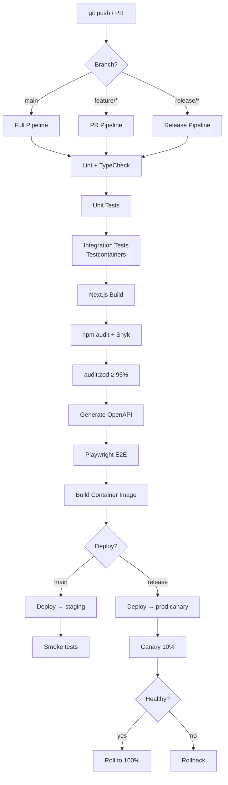

# CI/CD Pipeline — Namasoft ERP

> **آخر تحديث:** 2026-05-10
> **Tool:** GitHub Actions ([.github/workflows/](../../.github/))

---

## 1. Pipeline Overview



---

## 2. Workflow Files

```
.github/workflows/
  ├─ pr.yml              ← runs on pull_request
  ├─ main.yml            ← runs on push to main
  ├─ release.yml         ← runs on tags v*
  ├─ nightly.yml         ← scheduled (e2e + perf + security)
  ├─ desktop.yml         ← electron build on tags
  └─ dependabot.yml      ← weekly dep updates
```

---

## 3. PR Pipeline (Fast — < 10 min)

```yaml
# .github/workflows/pr.yml
name: PR Pipeline
on:
  pull_request:
    branches: [main]

jobs:
  validate:
    runs-on: ubuntu-latest
    steps:
      - uses: actions/checkout@v4
      - uses: actions/setup-node@v4
        with: { node-version: '20', cache: 'npm' }

      - run: npm ci
      - run: npm run typecheck
      - run: npm run lint
      - run: npm run audit:zod -- --threshold=95
      - run: npm run test:unit -- --coverage
      - run: npm run openapi -- --check    # fail if drift

      - uses: actions/upload-artifact@v4
        with:
          name: coverage
          path: coverage/

  integration:
    runs-on: ubuntu-latest
    services:
      postgres:
        image: postgres:16
        env:
          POSTGRES_PASSWORD: test
        ports: [5432:5432]
      redis:
        image: redis:7
        ports: [6379:6379]
    steps:
      - uses: actions/checkout@v4
      - uses: actions/setup-node@v4
      - run: npm ci
      - run: npx prisma migrate deploy
      - run: npx prisma db seed
      - run: npm run test    # integration tests
```

---

## 4. Main Branch Pipeline (Full)

After PR passes + merge to `main`:

```yaml
# .github/workflows/main.yml
jobs:
  full-build:
    needs: validate
    steps:
      - run: npm run build           # next build standalone
      - run: docker build -t namasoft:${{ github.sha }} .
      - run: docker push namasoft:${{ github.sha }}

  deploy-staging:
    needs: full-build
    environment: staging
    steps:
      - run: kubectl set image deployment/web web=namasoft:${{ github.sha }}
      - run: kubectl rollout status deployment/web --timeout=5m

  smoke-staging:
    needs: deploy-staging
    steps:
      - run: npm run test:smoke -- --baseUrl=https://staging.namasoft.app

  e2e-staging:
    needs: smoke-staging
    steps:
      - run: npx playwright install --with-deps
      - run: npm run test:e2e -- --baseUrl=https://staging.namasoft.app
```

---

## 5. Release Pipeline (Tagged)

```yaml
# .github/workflows/release.yml
on:
  push:
    tags: ['v*.*.*']

jobs:
  produce-artifact:
    steps:
      - run: npm ci
      - run: npm run build
      - run: docker build -t namasoft:${{ github.ref_name }} .
      - run: docker push namasoft:${{ github.ref_name }}

      # Electron desktop build
      - run: npm run electron:build
      - uses: actions/upload-artifact@v4
        with: { name: desktop, path: dist-electron/ }

      # GitHub Release
      - uses: softprops/action-gh-release@v2
        with:
          files: dist-electron/Namasoft-Setup-*.exe
          generate_release_notes: true

  deploy-prod-canary:
    needs: produce-artifact
    environment: production-canary
    steps:
      - run: kubectl set image deployment/web-canary web=namasoft:${{ github.ref_name }}
      - run: kubectl rollout status deployment/web-canary

  promote-or-rollback:
    needs: deploy-prod-canary
    steps:
      - run: ./scripts/check-canary-health.sh   # 10 min observation
      - run: kubectl set image deployment/web web=namasoft:${{ github.ref_name }}
```

---

## 6. Nightly Pipeline

```yaml
# .github/workflows/nightly.yml
on:
  schedule:
    - cron: '0 2 * * *'   # 2am UTC (5am Riyadh)

jobs:
  full-e2e:
    # entire E2E suite + visual regression

  performance:
    # k6 load tests against staging

  security:
    # OWASP ZAP baseline + npm audit + snyk
```

---

## 7. Branching Strategy (Trunk-based with hotfixes)

```
main          ────────●──●──●──●──●──●──●──── (always green)
                       \         \         \
feature/* ─────●─●─●────●         \         \
                                   \         \
release/v2.5  ──────────────────────●──●──●──── (frozen for QA)
hotfix/*      ──●──●─────────────────●          (urgent prod fixes)
```

### Rules
- `main` is always deployable.
- All work in feature branches → PR to `main`.
- Releases tag from `main`. Hotfixes branch off latest release tag.
- No long-lived dev branch.

---

## 8. Code Review Requirements

| File pattern | Required reviewers |
|--------------|---------------------|
| `prisma/schema.prisma` | DBA + tenant_admin (codeowner) |
| `src/lib/auto-journal.ts` | accountant validator |
| `src/lib/zatca/**` | compliance owner |
| `src/middleware/**` | security owner |
| `**/*payroll*` | HR domain owner |
| `**/migrations/**` | DBA + DevOps |

Configure via `CODEOWNERS` file.

---

## 9. Quality Gates (block merge if failing)

| Gate | Threshold |
|------|-----------|
| TypeScript errors | 0 |
| ESLint errors | 0 |
| Unit test failures | 0 |
| Integration test failures | 0 |
| Coverage on touched files | ≥ 70% |
| Coverage on `auto-journal.ts` | ≥ 95% |
| Zod schema audit | ≥ 95% routes covered |
| `npm audit` high/critical | 0 (or waived with justification) |
| OpenAPI drift | 0 (regenerate if needed) |
| Bundle size delta | ≤ +5% |

---

## 10. Secrets Management in CI

```yaml
# Use GitHub Encrypted Secrets, never inline
env:
  DATABASE_URL: ${{ secrets.STAGING_DATABASE_URL }}
  JWT_SECRET: ${{ secrets.STAGING_JWT_SECRET }}
  GEMINI_API_KEY: ${{ secrets.GEMINI_API_KEY }}
```

Rotation:
- Quarterly rotation cadence
- Automated rotation via separate workflow (planned)

---

## 11. Caching Strategy

```yaml
- uses: actions/cache@v4
  with:
    path: |
      ~/.npm
      .next/cache
      node_modules
    key: ${{ runner.os }}-npm-${{ hashFiles('package-lock.json') }}
```

- Save 60-80% time on cold cache.

---

## 12. Notifications

| Event | Channel |
|-------|---------|
| PR opened/merged | GitHub UI |
| Build failed on `main` | Slack `#dev-alerts` |
| Deploy to prod | Slack `#deploys` |
| Canary unhealthy | Slack `#deploys` + PagerDuty |
| Nightly e2e failure | Slack `#dev-alerts` |
| Security scan finds | Slack `#security` |

---

## 13. Dev Loop (Local)

```bash
# Pre-commit (via husky)
npm run typecheck
npm run lint -- --fix
npm run test:unit -- --bail

# Before PR
npm run audit:zod
npm run openapi
npm run test
```

---

## 14. References

- [Deployment Plan](../deployment/deployment-plan.md)
- [Test Plan](../testing/test-plan.md)
- [.github/workflows/](../../.github/) (when present)
- [.husky/](../../.husky/)
