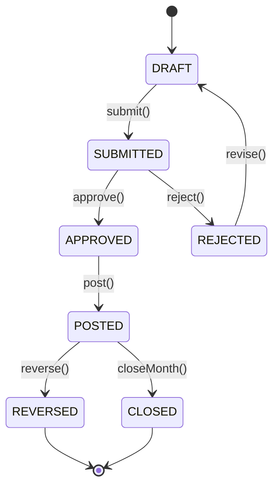

# [MODULE_NAME] — Business Flow & Data Flow

---

## 1. Actors / الأطراف

| Actor | Role |
|-------|------|
| End User | [دوره] |
| Manager | [دوره] |
| Approver | [دوره] |
| System | الأتمتة |

---

## 2. Happy Path Scenario / السيناريو الناجح

### Step 1: [اسم الخطوة]
**Actor**: User
**Action**: [الفعل]
**Inputs**: [البيانات المُدخلة]
**System Response**: [استجابة النظام]
**Outputs**: [النتيجة]

### Step 2: ...

---

## 3. Alternative Scenarios / السيناريوهات البديلة

### Scenario A: [حالة استثنائية 1]
[الوصف]

### Scenario B: [حالة استثنائية 2]
[الوصف]

---

## 4. Data Flow Diagram

```
┌──────────┐    POST /api/[module]    ┌──────────────┐
│   User   ├─────────────────────────►│  API Handler │
└──────────┘                          └──────┬───────┘
                                             │ validate (Zod)
                                             ▼
                                      ┌──────────────┐
                                      │ Module Engine│
                                      └──────┬───────┘
                                             │ transaction
                                             ▼
                              ┌──────────────────────────┐
                              │  Prisma (PostgreSQL)     │
                              │  - main table            │
                              │  - audit_log             │
                              │  - journal_entry         │
                              └──────────────────────────┘
                                             │
                                             ▼
                                      ┌──────────────┐
                                      │ Event Bus    │─► Workers (BullMQ)
                                      └──────────────┘     │
                                                           ├─► Notification
                                                           ├─► Webhook
                                                           └─► Audit Sync
```

---

## 5. State Transitions



---

## 6. Accounting Impact / الأثر المحاسبي

### عند الـ Post:
```
DR  [Account 1]                XXX
DR  [Account 2]                YYY
    CR  [Account 3]                  ZZZ
    CR  [Account 4]                  WWW
```

**شرح**:
- لماذا هذه الحسابات؟
- متى يختلف القيد؟

### عند الـ Reverse:
[نفس القيد لكن معكوس]

---

## 7. Integration Points / نقاط التكامل

| Module | Direction | Trigger | Data Passed |
|--------|-----------|---------|-------------|
| GL | Outbound | On Post | Journal Entry |
| AR/AP | Outbound | On Post | Customer/Vendor balance |
| Inventory | Bidirectional | Stock movement | Item quantity |
| ZATCA | Outbound | On invoice creation | XML + sign |
| Audit Trail | Outbound | All changes | before/after |

---

## 8. Notifications / الإشعارات

| Event | Recipients | Channel | Template |
|-------|-----------|---------|----------|
| Created | Owner + Manager | Email + In-app | `template_created` |
| Submitted | Approvers | Email + In-app | `template_pending` |
| Approved | Owner | Email + In-app | `template_approved` |
| Rejected | Owner | Email + In-app | `template_rejected` |

---

## 9. SLA / مستوى الخدمة

| Step | Target Time | Escalation |
|------|------------|-----------|
| Approval | 2 working days | Manager+1 |
| Posting | Immediate | - |
| Notification | < 30 sec | Retry 3x |

---

## 10. Edge Cases

- [ ] What if approver is on leave?
- [ ] What if amount exceeds approval limit?
- [ ] What if multi-currency conversion fails?
- [ ] What if period is closed mid-transaction?
- [ ] What if duplicate submission detected?
- [ ] What if tenant is suspended?
