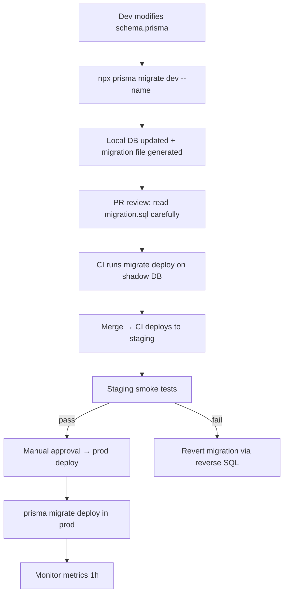

# Migration Strategy — Namasoft ERP

> **آخر تحديث:** 2026-05-10
> **Tool:** Prisma Migrate ([prisma/migrations/](../../prisma/migrations/))

---

## 1. القواعد الذهبية

1. **Never edit a committed migration.** الـ migrations سجلّ — التعديلات تحطّم البيئات الأخرى.
2. **Never drop columns immediately.** اتبع `add → backfill → cut traffic → drop` (3 deploys).
3. **Never write raw SQL** ما لم يكن لـ Postgres-only feature (RLS, pgvector, generated columns).
4. **Backfills as scripts**, not in migrations — تشغيل تدريجي + قابل للإيقاف.
5. **Migration must be reversible** أو موثّق صراحة كـ `IRREVERSIBLE`.
6. **Test on production-shaped data** قبل الـ deploy (staging snapshot).

---

## 2. أنواع التغييرات

### 2.1 Additive (Safe)

| Change | Pattern |
|--------|---------|
| Add nullable column | direct migration |
| Add column with default | direct migration |
| Add new index | use `CONCURRENTLY` if large table |
| Add new table | direct |
| Add new enum value | direct (Postgres allows ALTER TYPE) |

### 2.2 Modifying (Risky)

| Change | Pattern |
|--------|---------|
| Add NOT NULL to existing column | 3-step: add nullable → backfill → ALTER NOT NULL |
| Rename column | dual-write: add new + dual-write + backfill + read-from-new + drop old |
| Change type | dual-column with computed sync; flip; drop |
| Drop column | mark `@deprecated` → wait 2 releases → drop |

### 2.3 Destructive (Plan + Approval)

| Change | Required |
|--------|---------|
| Drop table | written runbook + tenant-comm + 30-day deprecation |
| Drop unique constraint | re-evaluate; usually replace with composite |
| Type change losing precision | full data export pre-flight |

---

## 3. Naming Convention

```
prisma/migrations/
  20260510120000_add_invoice_zatca_uuid/
    migration.sql

Format: <YYYYMMDDHHMMSS>_<verb>_<scope>
Examples:
  20260101000000_init
  20260315093000_add_payroll_eos_table
  20260420121500_rename_customer_phone_to_phones
  20260510073000_index_sales_invoice_status
```

---

## 4. Migration Workflow



---

## 5. Backfills

### 5.1 Pattern

```ts
// scripts/migrations/2026-04-20-backfill-invoice-currency.ts
import { prisma } from '@/lib/prisma';

async function main() {
  const batchSize = 1000;
  let cursor: string | undefined;

  while (true) {
    const batch = await prisma.salesInvoice.findMany({
      where: { currencyCode: null },
      take: batchSize,
      orderBy: { id: 'asc' },
      cursor: cursor ? { id: cursor } : undefined,
    });
    if (batch.length === 0) break;

    await prisma.salesInvoice.updateMany({
      where: { id: { in: batch.map(b => b.id) } },
      data: { currencyCode: 'SAR' },
    });

    cursor = batch[batch.length - 1].id;
    console.log(`Backfilled ${batch.length} (cursor: ${cursor})`);
  }
}

main().catch(console.error);
```

### 5.2 Rules

- Idempotent (safe to re-run).
- Filter only rows that need backfill (`WHERE col IS NULL`).
- Batch size 500-2000 depending on row size.
- Sleep 10ms between batches if locking observed.
- Log progress + ETA.
- Configurable via `--dry-run` flag.

---

## 6. Long-Running Migration (Zero Downtime)

```
T0   add new column `phones JSONB DEFAULT '[]'`        ← deploy
T+1d backfill from `phone` → `phones[0]` (script)
T+2d update writes to populate both                    ← deploy
T+5d update reads to use `phones[0]`                   ← deploy
T+12d remove writes to old `phone`                     ← deploy
T+19d drop column `phone`                              ← deploy
```

---

## 7. Multi-Tenant Migration Considerations

- Single shared DB → migration applies to ALL tenants atomically.
- DB-per-tenant (Phase 2): orchestrator runs migrations sequentially with progress tracking.
- ZATCA-touched tables (`ZatcaInvoice`, `ZatcaCounter`, `ZatcaCertificate`): require **explicit tenant communication** before any migration that could affect generated XML.

---

## 8. Migration Rollback

```bash
# ❌ NOT SUPPORTED by Prisma in production (no built-in rollback)
# Strategy:
#   1. Take pre-migration backup (always, even when "safe")
#   2. If migration breaks production:
#      a. RESTORE from backup (RTO ~30min for 50GB DB)
#      b. OR write reverse migration manually + run prisma migrate deploy
```

> **Each migration must include a `rollback.sql` sibling** documenting the reverse operations.

---

## 9. Database-Level Migrations (Postgres-only features)

For pgvector / RLS / partitioning / triggers, write raw SQL in `prisma/migrations/<name>/migration.sql`:

```sql
-- 20260510_add_pgvector
CREATE EXTENSION IF NOT EXISTS vector;

ALTER TABLE knowledge_chunk
  ADD COLUMN embedding vector(768);

CREATE INDEX kc_embed_idx
  ON knowledge_chunk USING hnsw (embedding vector_cosine_ops);
```

Mark these migrations as `IRREVERSIBLE` in commit message.

---

## 10. Schema Drift Detection

```bash
npm run db:drift                # diff prod schema vs prisma/schema.prisma
```

Alert if:
- table exists in DB but not in schema (manual change → import)
- column type differs
- index missing in DB

---

## 11. Test Migration on Production-Shaped Data

```bash
# 1. Snapshot prod (sanitized)
pg_dump prod --schema-only > schema.sql
pg_dump prod --data-only --table=large_tables_only > data.sql

# 2. Restore to staging
psql staging < schema.sql
psql staging < data.sql

# 3. Run migration timing test
EXPLAIN (ANALYZE) <migration_sql>
```

> Migrations expected to run > 60s require explicit "long migration" runbook + maintenance window.

---

## 12. Forbidden Operations in Migration

- ❌ `DELETE FROM <table>` (data deletion)
- ❌ `TRUNCATE`
- ❌ `DROP TABLE` without 30-day deprecation
- ❌ Renaming a column without dual-write
- ❌ Adding `NOT NULL` to a column with no default and existing data

---

## 13. References

- [prisma/migrations/](../../prisma/migrations/) — historical
- [Prisma Migrate docs](https://www.prisma.io/docs/concepts/components/prisma-migrate)
- [Database ERD](../database/erd.md)
- [Deployment Plan](../deployment/deployment-plan.md)
