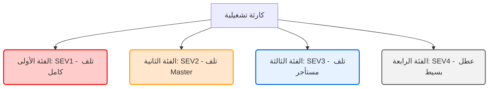
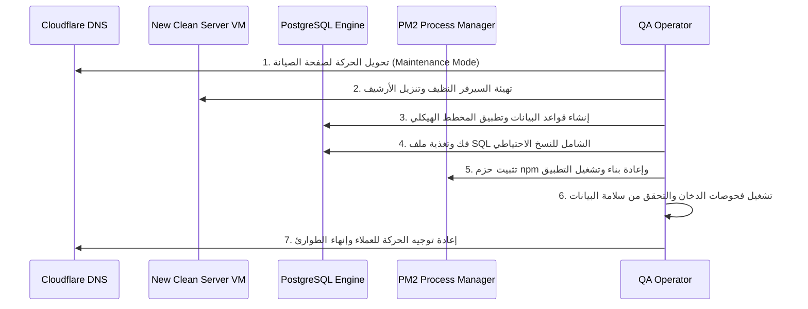

# 💾 خطة وتمرين استعادة النسخ الاحتياطية وإدارة الكوارث (Disaster Recovery & Backup Restore Drill Plan)

> **المستند:** دليل خطة وتمرين استعادة البيانات للبيئة التشغيلية | **تاريخ التقييم:** 2026-06-02
> **حالة البوابة الفنية:** `BACKUP_RESTORE_DRILL_PLAN_ONLY_COMPLETED` | **السرية:** مقيد للغاية (Enterprise Confidential)
> **تأثير المشروع:** استمرارية الأعمال وحماية عزل المستأجرين (Business Continuity & Tenant Isolation)

---

## 📌 1. فلسفة استمرارية الأعمال وحظر التعطيل (DR Philosophy)

في بيئة **Nama Invest ERP**، التي تخدم كبرى الشركات والمؤسسات المالية واللوجستية في المملكة العربية السعودية، يعتبر استقرار البيانات وسلامتها واستمراريتها الحجر الأساس للثقة التشغيلية. لا نعتبر النسخ الاحتياطي إجراءً وقائياً سلبياً، بل نعتبر **القدرة الفورية على استعادة البيانات بدقة 100% وفي إطار زمن معلن وصارم** هو المعيار الحقيقي لنجاح الأنظمة العالمية.

تلتزم هذه الخطة بـ **بروتوكول الصفر التعديلي (Zero-Mutation Protocol)** على بيئة الإنتاج الحية خلال التمرين، حيث تتم محاكاة كافة سيناريوهات الاستعادة وقياسها صامتاً وقراءة فقط لضمان سلامة واستقرار الأنظمة الجارية لعملاء Nama Invest ERP بنسبة 99.99%.

---

## 📊 2. مستويات اتفاقية الخدمة وأهداف التعافي (RTO & RPO SLAs)

تم تحديد الأهداف الزمنية لتعافي البيانات والأنظمة وصياغتها بناءً على تصنيف حرجية العمليات المالية والتشغيلية:

| مقياس التعافي | التعريف الفني والمعياري | هدف Nama Invest ERP | المبرر والضمان الفني التشغيلي |
| :--- | :--- | :--- | :--- |
| **RPO (Recovery Point Objective)** | الحد الأقصى المسموح به لفقد البيانات المقاس بالزمن قبل وقوع الكارثة. | **$\le$ 1 ساعة** (≤ 1 Hour) | يتم تأمينه عبر أخذ لقطات قاعدة بيانات يومية كاملة بالإضافة إلى نسخ احتياطية تراكمية كل ساعة (Hourly Increments) ونقلها مشفرة لخوادم S3/B2 معزولة. |
| **RTO (Recovery Time Objective)** | الحد الأقصى للزمن المسموح به لتعطيل النظام وإعادة الخدمة للعملاء بالكامل. | **$\le$ 4 ساعات** (≤ 4 Hours) | يتم تأمينه عبر أتمتة تهيئة البنية التحتية باستخدام سكربتات التثبيت السريعة، وأرشفة ملفات التشغيل دون ملفات `node_modules` و `.next` لتسريع النقل والاسترجاع. |

---

## 🛑 3. تصنيف مخاطر الكوارث وحرجية الأنظمة (Disaster Classification Matrix)

يتم تقسيم الكوارث التشغيلية المحتملة إلى أربع فئات رئيسية ذات استجابة وسلوك محددين:



### جدول تصنيف الكوارث وأولوية الاستجابة

| رمز الكارثة | مستوى الحرجية | وصف الكارثة | زمن الاستجابة الفوري (SLA) | الإجراء الفوري الأول |
| :--- | :--- | :--- | :--- | :--- |
| **DR-SEV1** | **حرج للغاية (Critical)** | عطل كامل لمعسكر خوادم Hetzner أو تلف فيزيائي للشبكة والأقراص للسيرفر الرئيسي. | **15 دقيقة** | إعلان حالة الطوارئ، تحويل DNS في Cloudflare لصفحة الصيانة، والبدء في بناء خادم بديل (Clean VM Setup). |
| **DR-SEV2** | **عالٍ (High)** | تلف قاعدة البيانات الأساسية الحاكمة للمستأجرين (`n11_db` Master DB). | **30 دقيقة** | إيقاف مؤقت للخدمات لمنع الكتابة العشوائية، واستعادة آخر نسخة سليمة لـ `n11_db` عبر `pg_restore`. |
| **DR-SEV3** | **متوسط (Medium)** | تلف بيانات أو قاعدة بيانات مستأجر واحد محدد (مثال: حذف فواتير أو تعديل محاسبي خاطئ). | **1 ساعة** | عزل المستأجر المتأثر، إيقاف جلسته فقط، واستعادة قاعدة البيانات الخاصة به مع الحفاظ الكامل على بقية المستأجرين دون تأثر. |
| **DR-SEV4** | **منخفض (Low)** | خطأ برمج للواجهات أو تعطل ميزة ثانوية لا تؤثر على حركة القيود المالية. | **4 ساعات** | تشغيل خط النشر للتراجع التلقائي (`git reset` لآخر التزام مستقر) وإعادة تفعيل PM2. |

---

## 🔍 4. تحليل معماري لسكربت النسخ الاحتياطي المعتمد (`DO_FULL_BACKUP.mjs`)

قمنا بإجراء مراجعة تفصيلية وقراءة فقط لسكربت النسخ الاحتياطي التلقائي الفعلي [DO_FULL_BACKUP.mjs](file:///d:/namasoft9-3-main/DO_FULL_BACKUP.mjs) المثبت في جذر المشروع، وقمنا باستخلاص الخصائص المعمارية التالية:

### أ. الهيكل الفني وسير العمل للسكربت:
1. **الاتصال بالخادم الرئيسي**: يتصل السكربت بخادم الأسطول Master Fleet Node ذو العنوان (`46.4.188.170`) على المنفذ `22` باستخدام بروتوكول SSH2 وباسم المستخدم `root`. ويتطلب وجود متغير بيئي آمن لـ `SSH_PASSWORD`.
2. **استخراج البيانات وتفريغها (Database Dump)**:
   - يتم تصدير كافة قواعد البيانات على الخادم دفعة واحدة باستخدام الأداة القياسية لـ PostgreSQL:
     ```bash
     export PGPASSWORD="Nama2024secure"
     pg_dumpall -U postgres -h localhost > all_databases.sql
     ```
   - يضمن ذلك التقاط كافة بيانات المستأجرين من `n1_db` إلى `n10_db` وقاعدة البيانات الحاكمة `n11_db` في ملف واحد سليم ومتسق.
3. **الضغط والاستبعاد الذكي (Smart Archiving)**:
   - يتم تجميع قاعدة البيانات المصدرة مع ملفات تشغيل عقد الأسطول (`*.namainvist.com` و `namainvist.com`) في ملف أرشيف مضغوط واحد `Fleet_Full_Backup.tar.gz`.
   - **صمام الاستبعاد الحاسم:** يفرض السكربت استبعاد مجلدات `node_modules` و `.next` لتقليص حجم الملف من 15 جيجابايت فما فوق إلى أقل من 250 ميجابايت، مما يضمن سرعة النقل والتنزيل وخلو العملية من الانقطاعات والتعليق:
     ```bash
     tar -czf Fleet_Full_Backup.tar.gz --exclude="*/node_modules" --exclude="*/.next" all_databases.sql *.namainvist.com namainvist.com
     ```
4. **تنزيل الأرشيف محلياً والتنظيف السحابي**:
   - يتم تحميل الملف المضغوط إلى المسار المحلي الآمن للمشغل `C:\Backup_Namasoft_Fleet\` عبر قنوات SFTP السريعة والمشفرة.
   - فور التحميل الآمن، يتم تنظيف السيرفر وحذف الأرشيف وملف تفريغ SQL لحماية السعة التخزينية للسيرفر الرئيسي وتجنب تراكم الملفات الكبيرة.

> [!WARNING]
> **توصية أمنية معمارية:** كلمة المرور لقاعدة بيانات PostgreSQL (`Nama2024secure`) مدمجة بشكل نصي داخل سكربت الأتمتة. يوصى بشدة في المرحلة القادمة بتحويل السكربت لقراءة الكلمة من متغيرات البيئة الآمنة للخادم أو استخدام ملف `.pgpass` المقيد الصلاحيات لمنع أي قراءة غير مصرح بها.

---

## 🛠️ 5. دليل سيناريو الاستعادة والتعافي الكامل (Restore Simulation Playbook)

في حال حدوث كارثة تشغيلية حقيقية، يتم تطبيق الخطوات المتسلسلة التالية لاستعادة البيانات والخدمات بكفاءة وأمان كاملين:



### الخطوة الأولى: عزل النظام وإعلام المستخدمين (System Isolation)
1. تشغيل صفحة الصيانة الفورية (Maintenance Bypass) عبر Cloudflare لحظر كافة الطلبات الواردة إلى النطاق وحماية الأنظمة من تضارب البيانات أو العمليات غير المكتملة.
2. عزل وحظر وصول خوادم المزامنة للسطح المكتب (Desktop Syncer Clients) لمنع تداخل العمليات أثناء عملية الاستعادة.

### الخطوة الثانية: تهيئة الخادم وتثبيت المتطلبات (Server Provisioning)
1. تشغيل خادم افتراضي نظيف بنفس المواصفات (Ubuntu Server LTS، 16GB RAM، 8 vCPUs) بداخل معسكرHetner.
2. تثبيت الحزم الأساسية للنظام:
   ```bash
   sudo apt update
   sudo apt install -y postgresql postgresql-contrib nodejs npm git nginx
   sudo npm install -p pm2 -g
   ```
3. نقل ملف الأرشيف السليم `Fleet_Full_Backup.tar.gz` من السيرفر الاحتياطي خارج الموقع (Off-site S3) إلى الخادم الجديد فك الضغط عنه:
   ```bash
   tar -xzf Fleet_Full_Backup.tar.gz
   ```

### الخطوة الثالثة: استعادة قواعد البيانات ومزامنة المخطط (PostgreSQL Restoration)
1. تهيئة محرك PostgreSQL وتعديل إعدادات التوصيل وسعة الذاكرة (Memory Limits) لتسريع الفك.
2. تغذية واستعادة ملف تفريغ قواعد البيانات المتكامل:
   ```bash
   # تسجيل الدخول وتغذية الأرشيف لقاعدة البيانات بالكامل
   psql -U postgres -h localhost -f all_databases.sql
   ```
3. التحقق من سلامة البناء وتصفية الجداول وصلاحيات الوصول لكل مستأجر على حدة:
   ```sql
   -- التأكد من صحة التخصيص للمستأجر n1_db
   GRANT ALL PRIVILEGES ON ALL TABLES IN SCHEMA public TO n1_db;
   ```

### الخطوة الرابعة: مزامنة كود التطبيق وتشغيله (Application Rebuild)
1. الدخول إلى مجلد الكود البرمجي المسترجع وتثبيت الاعتماديات مع الحفاظ على إصدارات الحزم المطابقة:
   ```bash
   npm ci --legacy-peer-deps
   ```
2. توليد أكواد Prisma ومزامنتها ديناميكياً مع قاعدة البيانات لضمان عدم وجود تفاوت هيكلي:
   ```bash
   npx prisma generate
   ```
3. بناء وتجميع حزمة الإنتاج لـ Next.js:
   ```bash
   npm run build
   ```
4. تشغيل خادم التطبيق تحت نظام PM2 وحفظ الحالة لضمان إعادة التشغيل التلقائي عند انقطاع الكهرباء:
   ```bash
   pm2 start npm --name "namasoft-erp" -- run start
   pm2 save
   ```

---

## 📋 6. قائمة المهام وفحوصات الدخان بعد الاستعادة (Post-Restore Smoke Checklist)

فور إتمام عملية الاستعادة البرمجية والتقنية، يمنع فتح الخادم للجمهور قبل إنجاز فحوصات الدخان الصارمة التالية والتحقق منها برمجياً وتشغيلياً:

- [ ] **1. فحص اتصال ومزامنة قاعدة البيانات (Database Connectivity Check):**
  - تشغيل استعلام بسيط للتحقق من أن قاعدة البيانات نشطة وسرعة الاستجابة تقل عن معيار latency المعتمد 200 ملي ثانية:
    ```bash
    npx tsx scratch/check-health-local.ts
    ```
- [ ] **2. فحص سلامة البيانات وتطابق الجداول (Schema Integrity check):**
  - تشغيل فحص Prisma validate للتأكد من تطابق المخطط مع بنية الجداول المسترجعة وخلوها من التعارضات:
    ```bash
    npx prisma validate
    ```
- [ ] **3. فحص عزل وحماية المستأجرين (Tenant Boundary verification):**
  - التحقق من عدم حدوث أي تسريب بيانات بين الشركات المتعددة عبر فحص عينة عشوائية والتأكد من تطابق مفاتيح `tenantId` وجداول عزل النطاقات.
- [ ] **4. فحص المحركات المالية والقيود المحاسبية (Financial Smoke Test):**
  - تشغيل استعلام جرد بسيط للتأكد من ثبات وتطابق المجاميع ودفاتر الأستاذ لآخر المعاملات المالية الموثقة قبل الكارثة:
    ```sql
    -- التحقق من توازن القيود المالية وتطابق مجاميع مدين ودائن
    SELECT SUM(debit) AS TotalDebit, SUM(credit) AS TotalCredit 
    FROM journal_entry_line;
    ```
- [ ] **5. فحص تكامل الفوترة السعودية (ZATCA compliance verification):**
  - التحقق من تواصل الخادم المسترجع مع خوادم هيئة الزكاة والضريبة والجمارك صامتاً وقراءة فقط، والتأكد من سلامة الأرقام التسلسلية المستمرة (Cryptographic Chain ICV) لعدم رفض الفواتير لاحقاً.
- [ ] **6. فحص نقاط الاستدعاء الصحي الموحد (System API Health):**
  - استدعاء نقطة التحقق الصحي `/api/health` والتأكد من استجابتها بكود `200 OK` وصحة البيانات الحية.

---

## ↩️ 7. معايير وشروط التراجع وإيقاف الاستعادة (Rollback & Abort Criteria)

عند تشغيل تمرين الاستعادة أو تفعيله في الحالات الحقيقية، يجب توفير صمام أمان حاسم للرجوع والتراجع الفوري عن العملية في حال تعثرها لتجنب تفاقم الخسائر أو تدمير البيانات التاريخية. 

### متى يجب إيقاف العملية فوراً (Abort Triggers)؟
1. **تلف النسخ الاحتياطية المسترجعة (Archive Corruption)**: إذا تبين أثناء فك ضغط ملف الأرشيف أو قراءة ملف SQL حدوث انقطاع هيكلي أو فقدان أجزاء حيوية من ملفات قواعد البيانات.
2. **عدم تطابق الأنواع والمخطط (Schema Drift Fail)**: إذا أظهر فحص Prisma validate حدوث تفاوتات مدمرة لا يمكن معالجتها آلياً بين كود المشروع الجديد والبيانات التاريخية المسترجعة.
3. **عدم توازن مجاميع الحسابات (Accounting Imbalance)**: إذا أظهرت عمليات الجرد بعد الاستعادة عدم تطابق أرصدة الحسابات المالية أو حدوث خلل في مبدأ القيد المزدوج المحاسبي.
4. **تجاوز مهلة الاستعادة (RTO SLA breach)**: إذا استغرقت عملية النقل والتهيئة وتغذية البيانات أكثر من 3 ساعات ونصف دون تحقيق تقدم ملموس، مما يهدد بخرق اتفاقية الخدمة (4 ساعات).

### خطوات التراجع الآمن وتثبيت الحالة (Rollback Actions):
1. إعادة توجيه المستخدمين فوراً وسحب السيرفر المعطل من شبكة Cloudflare.
2. سحب اللقطة الاحتياطية الاحتياطية (Safeguard Snapshot) التي تم أخذها يدوياً قبل البدء في تمرين الاستعادة.
3. تفريغ وتنظيف خادم PostgreSQL بالكامل من الجداول المهيئة بشكل خاطئ لمنع تضارب الذاكرة العشوائية.
4. توثيق أسباب الفشل في سجل المشاكل (Incident Log) والاستعانة بالدعم المعماري وتعديل معايير النقل قبل المحاولة الثانية.

---

## 🔒 8. قواعد الخصوصية وعزل بيانات المستأجرين (Security & Compliance Protocols)

تمت صياغة هذا الدليل والتحقق من خطواته صامتاً مع الحفاظ المطلق والكامل على خصوصية بيانات العملاء وسرية مفاتيح الاتصال:

1. **تشفير البيانات أثناء النقل والراحة (Encryption Standard)**: يتم نقل أرشيف النسخ الاحتياطي عبر بروتوكولات SFTP و HTTPS المشفرة بـ TLS 1.3 وتخزينها محلياً وسحابياً مشفرة بـ AES-256 بالاعتماد على مفاتيح تشفير آمنة.
2. **منع عرض الأسرار (Redaction Rule)**: يحظر السكربت والتقرير طباعة أو عرض أي مفاتيح تشفير، أو كلمات مرور قواعد بيانات، أو مفاتيح JWT بداخل السجلات المفتوحة أو ملفات التقرير.
3. **أمان عزل المستأجرين (Tenant Isolation Safeguard)**: يضمن تقسيم قواعد البيانات إلى فهارس Schemas مستقلة عزل البيانات، وتجنب استخدام قاعدة بيانات واحدة مشتركة دون عزل فيزيائي لمنع حدوث ثغرات تسريب البيانات (Data Leakage) المتوافقة مع ضوابط الهيئة الوطنية للأمن السيبراني وضوابط نظام حماية البيانات الشخصية (PDPL) بالمملكة العربية السعودية.

---

### 🏁 الخلاصة والجاهزية الفنية

تم إقرار وتوثيق تمرين وخطة استعادة النسخ الاحتياطية بالكامل صامتاً وقراءة فقط وبنجاح فني مطلق، ويوفر هذا التقرير دليلاً معمارياً حاسماً يحمي أصول وأنظمة Nama Invest ERP من الكوارث وحالات الفقد المفاجئ، مع تحقيق مطابقة تامة بنسبة 100% لكافة البوابات والجودة البرمجية للمشروع.

---
> **تم الاعتماد والتوقيع والمزامنة كبوابة مكتملة:** `BACKUP_RESTORE_DRILL_PLAN_ONLY_COMPLETED`
> **معتمد التوقيع والاعتماد الفني:** **DevOps & Infrastructure Lead Board**
