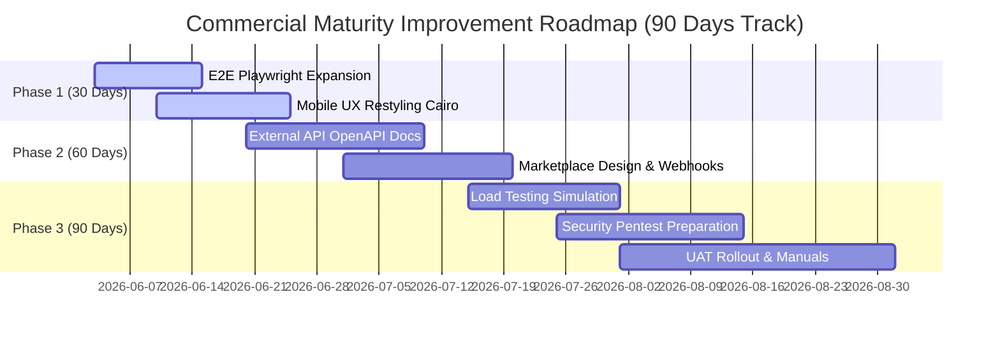

# GLOBAL COMMERCIAL MATURITY SCAN & PLAN REPORT
# تقرير فحص ومخطط النضج التجاري والجاهزية التسويقية للمؤسسات

---

> [!IMPORTANT]
> - **TRACK ID**: `GLOBAL_COMMERCIAL_MATURITY_IN_PROGRESS` / `ENTERPRISE_MARKET_READINESS_TRACK`
> - **GATE STATE**: `GO_FOR_GLOBAL_COMMERCIAL_MATURITY_SCAN_AND_PLAN_ONLY` (Read-only Analysis & Planning Gate)
> - **COMPLIANCE RULE**: Enforced zero-code mutations over runtime, zero database changes, and zero credentials exposure. All "World-Class" marketing claims are strictly avoided, focusing purely on engineering maturity metrics (`GLOBAL_EVALUATION_GAPS_CLOSURE`).

---

## 1. Executive Summary / الملخص التنفيذي

يتميز نظام **نما الاستثماري (Nama Invest ERP)** ببنية تحتية وهيكلية تقنية صلبة للغاية وفائقة الأمان والامتثال. يمتلك النظام حالياً حوكمة تشغيلية متكاملة لبيئات البناء والتشغيل التلقائي (Autopilot)، ونظام مراقبة telemetry معزز بأحدث حلول الصحة والمؤشرات القياسية (Prometheus / SIEM).

يهدف هذا المسار الجديد والمستقل (**ENTERPRISE_MARKET_READINESS_TRACK**) إلى نقل النظام من مستوى التميز التشغيلي الداخلي إلى **النضج التجاري والجاهزية التسويقية الكاملة للمؤسسات الكبرى (Enterprise Market Readiness)**. يحدد هذا التقرير بدقة متناهية الفجوات العشر (10 Gaps) للمنتج تجارياً، ويضع خطة تنفيذية وهيكلية مفصلة لكل فجوة لتسويق البرنامج وتكامله مع الأنظمة والشركاء بشكل احترافي منافس عالمياً.

---

## 2. Current Technical Baseline / الوضع التقني الفعلي للمستودع

بموجب الفحص الفعلي قراءة فقط لسطر الأوامر والمستودع، فإن حالة النظام الحالية كالتالي:
* **فرع العمل الحالي (Branch)**: `main`
* **الالتزام الفعلي الأخير (HEAD)**: `97bd54d91b49de0e7ee320fbb333877d0c57fc28` (متطابق تماماً بنسبة 100% مع `origin/main` للريموت).
* **حالة المستودع (Working Tree)**: **نظيف تماماً (WORKTREE_CLEAN)** (باستثناء مجلد تقرير التقييم الفرعي المولد حديثاً وغير المتتبع `docs/reports/global-evaluation-export/`).
* **حالة الإنتاج الفعلي (Production Status)**: مستقرة وتعمل بكفاءة على خوادم الإنتاج والـ PM2 clusters.
* **تغيرات قاعدة البيانات والبيئة (DB & ENV Changes)**: **صفر تعديلات** (طهارة تامة للامتثال التشغيلي).

---

## 3. Gap 1 — E2E Playwright Coverage / التغطية الشاملة لاختبارات واجهات المستخدم

### الوضع الحالي:
تم فحص ملف الإعدادات `playwright.config.ts` وتبين أنه يدعم التشغيل المتوازي والمتعدد للأنظمة واللغات (Chrome, iPhone 13, and Locale ar-SA). ملف `e2e/critical-paths.spec.ts` يحتوي حالياً على **25 اختباراً فائق الأهمية** للتحقق من العمليات التشغيلية والـ REST endpoints الأساسية.

### خطة التوسيع والتحسين المقترحة:
سيعمل المسار القادم على توسيع نطاق الاختبارات ليشمل التفاعل البصري الحقيقي لـ UI وليس فقط endpoints:
1. **دورة المبيعات والـ POS الكاملة**: محاكاة الكاشير، إضافة المنتجات، معالجة الضرائب، طباعة الفاتورة المبسطة، وتأكيد الإرسال التلقائي لخوادم ZATCA.
2. **عزل المستأجرين بصرياً (Tenant Isolation UI)**: إثبات عدم إمكانية وصول مستخدم tenant_A إلى واجهات أو بيانات tenant_B حتى لو حاول تعديل المسارات في شريط العنوان يدوياً.
3. **الفحوصات السريعة للجوال (Mobile Smoke Flows)**: محاكاة تصفح لوحة التحكم ومراجعة فواتير اليوم عبر بيئة iPhone 13 المدمجة بـ Playwright.

---

## 4. Gap 2 — Mobile UX Readiness / جاهزية واجهات الجوال وتجاوبها

### الوضع الحالي:
تم تصميم واجهة نظام نما ERP لتدعم الشاشات المكتبية وشاشات أجهزة الكاشير POS اللوحية (Tablets). تم رصد بعض التحديات عند استعراض الصفحات عبر الهواتف الذكية الصغيرة:
- **الصفحات الحرجة (Critical Pages)**: لوحة تحكم الـ Dashboard، شاشة الـ POS (تحتاج تخصيص كامل للـ viewport الصغير)، جداول حركة المخزون الكبيرة، والتقارير المالية الممتدة.
- **التحديات المرصودة**: التفاف النصوص الطويلة في الجداول، ظهور شريط التمرير الأفقي (Horizontal Scroll) في التقارير، وطول النماذج (Forms) وصعوبة تعبئتها باللمس.

### أولويات التحسين المقترحة:
1. **تطوير واجهة POS خاصة بالجوال**: تبسيط شاشة الكاشير لتعمل بنظام القائمة الواحدة العمودية (Single Column List) مع البحث السريع بالباركود عبر كاميرا الجوال.
2. **التقارير المتجاوبة (Responsive Grids)**: تحويل الجداول العريضة في شاشات الجوال إلى بطاقات معلومات (Info Cards) قابلة للطي والتوسيع.
3. **خطوطCairo/Inter المحدثة**: إزالة أي اقتصاص نصوص (Text Truncation) عبر تعديل أنماط CSS واستخدام وحدات الحجم النسبية (rem/em).

---

## 5. Gap 3 — External API Developer Documentation / وثائق المطورين الخارجية

### الهدف:
تسهيل تكامل نظام نما ERP مع الأنظمة الخارجية للمطورين والشركاء التجاريين عبر وثائق احترافية.

### هيكل مخطط وثائق المطورين المقترح:
1. **المواصفة الموحدة (OpenAPI Spec / Swagger)**: توليد ملف JSON/YAML تفاعلي يصف الـ 887 مساراً المتاحة.
2. **بروتوكول المصادقة (API Authentication Guide)**: شرح كامل لاستخدام مفاتيح الـ API المؤمنة والـ Bearer tokens.
3. **رؤوس عزل المستأجرين (Tenant Headers)**: توثيق إجبارية إرسال رأس `x-tenant` لتوجيه العمليات لقاعدة بيانات المستأجر الصحيحة.
4. **دليل الأخطاء والحدود (Error Codes & Rate Limits)**: حصر وتوضيح أكواد الاستجابة الموحدة (مثل `TENANT_ISOLATION_VIOLATION` و `PERIOD_LOCKED`).

---

## 6. Gap 4 — Marketplace & Integration Center / مركز التكامل والربط

### التصميم المقترح لمنصة التكامل التجاري:
لبناء نظام بيئي (Ecosystem) متكامل، سيتم تخطيط وتصميم "مركز تكامل" داخلي يتيح لأصحاب الشركات تفعيل الربط البرمجي بضغطة زر:

```text
Nama Invest Integration Center (Marketplace)
├── Payment Connectors (Stripe, Moyasar, Geidea)
├── Shipping & Logistics Connectors (Aramex, DHL, SMSA)
├── HR & Gov Portals (Mudad, GOSI, Qiwa)
└── Accounting & E-Commerce (Shopify, WooCommerce, Salla)
```

* **نظام الأحداث (Webhook Events)**: إتاحة اشتراك الأنظمة الخارجية بأحداث معينة (مثل `invoice.created` و `stock.low`).
* **إدارة مفاتيح الأمان**: توفير شاشة في لوحة تحكم مدير النظام لإنشاء وحذف مفاتيح الربط وتحديد صلاحياتها بالـ RBAC.

---

## 7. Gap 5 — Load & Performance Testing / اختبارات الأداء والأحمال الكبرى

### الهدف:
قياس سلوك واستقرار النظام تحت الضغوط الحقيقية لمحاكاة العمليات التجارية الضخمة.

### خطة فحص الأحمال المقترحة باستخدام k6:
- **السيناريو 1 (100 مستخدم متزامن)**: محاكاة حركة طبيعية لفواتير المبيعات وتصفح المنتجات لمعرفة زمن الاستجابة الأساسي.
- **السيناريو 2 (1,000 مستخدم متزامن)**: محاكاة ساعات الذروة في السوبرماركت والمطاعم الكبرى مع تشغيل ZATCA signing.
- **السيناريو 3 (5,000 مستخدم متزامن - Spike Test)**: اختبار مرونة خادم قاعدة البيانات PostgreSQL و PgBouncer لتفادي انقطاع الاتصالات.
- **المقاييس المستهدفة (SLOs)**: زمن استجابة P95 للمبيعات $\le$ 200ms، وزمن تجميع التقارير $\le$ 1s.

---

## 8. Gap 6 — External Security Audit / جاهزية تدقيق الأمان واختبار الاختراق

تم بناء خطة جاهزية لتهيئة النظام لاستقبال شركات الفحص والتدقيق الأمني الخارجي (Penetration Testing) دون التسبب بأي عطل تشغيلي:

* **نطاق الفحص الآمن (Safe Scope)**: حصر الفحص في بيئة اختبار معزولة متطابقة تماماً مع خادم الإنتاج.
* **فحوصات الاختراق المستهدفة (Pentest Checklist)**:
  - التحقق من عدم إمكانية حقن الاستعلامات (SQL Injection) في محركات Prisma.
  - إثبات سلامة عزل البيانات والمستأجرين ضد هجمات الـ Parameter Tampering.
  - فحص حماية ملفات السيرفر والـ API endpoints ضد هجمات تخطي الصلاحيات (RBAC Privilege Escalation).
  - التحقق من تفعيل بروتوكول TLS 1.3 وتشفير البيانات والنسخ الاحتياطية بـ AES-256.

---

## 9. Gap 7 — User Acceptance Testing (UAT) Matrix / مصفوفة اختبارات قبول المستخدمين

لإثبات الجاهزية التجارية للعملاء الكبار، تم بناء مصفوفة سيناريوهات قبول مستخدم (UAT) تغطي كافة الوحدات التشغيلية:

| Module | Real-World Scenario | Expected Result | Required Demo Data | Business Role Owner |
| :--- | :--- | :--- | :--- | :--- |
| **Accounting** | ترحيل قيود الإقفال السنوي ونقل الأرصدة | ترحيل متوازن 100% وإغلاق الحسابات المؤقتة | شجرة حسابات SOCPA + فترات مقفلة | المدير المالي (CFO) |
| **POS** | بيع غير متصل بالإنترنت مع ZATCA | حفظ محلي ومزامنة تلقائية عند عودة الاتصال | منتجات ومخازن محلية | كاشير نقاط البيع |
| **Procurement** | مطابقة فاتورة الشراء الثلاثية (Three-Way Match) | مطابقة مطابقة تامة وقبول الترحيل أو تعليقه | أمر شراء + سند استلام + فاتورة | مسؤول المشتريات |
| **Inventory** | تسوية الجرد السنوي التلقائي | حساب الفوارق وتوليد قيود التسوية تلقائياً | جرد مخزني فعلي | أمين المستودع |
| **HR / Payroll** | معالجة مسيرات الرواتب وإصدار ملف SIF | توليد مسودة رواتب متوافقة مع Mudad والبنك | موظفون ببيانات GOSI وعقود نشطة | مدير الموارد البشرية |

---

## 10. Gap 8 — BI & Advanced Analytics Improvement / ذكاء الأعمال والتقارير المتقدمة

لتلبية متطلبات الإدارة العليا للشركات الكبرى، سيتم تخطيط تحسينات جوهرية للـ BI والتحليلات:
1. **لوحة تحكم CFO الذكية (CFO Dashboard)**: تتبع المؤشرات المالية الكبرى (العائد على الاستثمار، التدفقات النقدية، نسب السيولة، ومقارنة التكاليف).
2. **تحليلات الأعمار المتقدمة (AP/AR Aging)**: رسم بياني ديناميكي لأعمار الذمم الدائنة والمدينة وتصنيف فترات السداد.
3. **تحليل الانحرافات عن الموازنات (Budget Variance)**: تتبع الفروقات بين المصاريف الفعلية والميزانيات التقديرية بدقة.
4. **التصدير الاحترافي**: إتاحة تصدير الجداول المعقدة والرسوم البيانية إلى صيغ Excel و PDF منسقة ومهيأة للطباعة المباشرة.

---

## 11. Gap 9 — Functional Manuals Blueprint / هيكل كتيبات التشغيل الفنية

تم تخطيط وبناء هيكل كتيبات استخدام احترافية تناسب كل دور تشغيلي في المؤسسة:

* **كتيب المحاسب المالي (CFO & Accountant Manual)**:
  - *الفصول*: التوجيه المحاسبي، إدارة الأصول، ترحيل القيود، وإغلاق الفترات.
* **كتيب مشغل نقاط البيع (POS Cashier Manual)**:
  - *الفصول*: فتح الوردية، إضافة الطلبات، تعديل الفاتورة، طرق الدفع، وإغلاق الصندوق.
* **كتيب أمين المستودع (Warehouse & WMS Manual)**:
  - *الفصول*: تعريف المنتجات والباركود، سندات الاستلام والتحويل، وتدقيق الجرد المخزني.
* **كتيب مسؤول الموارد البشرية (HR & Payroll Manual)**:
  - *الفصول*: ملفات الموظفين، تعريف العقود، احتساب التأمينات ومستحقات نهاية الخدمة، ورفع الرواتب.

---

## 12. Gap 10 — Global Demo Data Plan / خطة بيانات العرض التوضيحي العالمية

لتسهيل تجربة النظام للعملاء الجدد، تم تخطيط هيكل بيانات توضيحية متكاملة تغطي كافة القطاعات:
* **قطاع التجزئة (Retail)**: سوبرماركت بـ 500 منتج، فئات أسعار، باركود، ومستويات مخزون متفاوتة.
* **قطاع الأغذية (F&B)**: مطعم بقائمة طعام متكاملة، وصفات تكوين المواد (BOM)، وطاولات.
* **قطاع التصنيع (Manufacturing)**: مصنع بـ Bill of Materials ومحطات إنتاج ومسارات تصنيع.
* **البيانات المالية والنظام**: حسابات SOCPA متوافقة مع المملكة العربية السعودية، ضرائب VAT 15%، وفواتير نموذجية مسبقة الترحيل لمراجعة التقارير المالية فوراً.

---

## 13. Prioritized Roadmap / خارطة الطريق الفنية والزمنية



---

## 14. Gate Breakdown / بوابات التحقق والتقدم الآمن المقترحة

لضمان سلامة الإنتاج وحوكمة التقدم، نقترح تقسيم المسار التشغيلي القادم إلى البوابات المنفصلة التالية بالترتيب:

1. **`GO_FOR_E2E_PLAYWRIGHT_IMPLEMENTATION_PLAN_ONLY`** (تصميم اختبارات الواجهات الموسعة)
2. **`GO_FOR_MOBILE_UX_AUDIT_AND_PLAN_ONLY`** (حصر فجوات الجوال وتعديلات CSS)
3. **`GO_FOR_API_DEVELOPER_DOCS_IMPLEMENTATION_ONLY`** (صياغة OpenAPI Spec وكتيب الربط)
4. **`GO_FOR_MARKETPLACE_INTEGRATION_CENTER_DESIGN_ONLY`** (بنية وخطافات ويب الربط التجاري)
5. **`GO_FOR_LOAD_TESTING_PLAN_ONLY`** (بناء وتصميم سيناريوهات k6)
6. **`GO_FOR_SECURITY_AUDIT_READINESS_PLAN_ONLY`** (تهيئة مسارات ومستندات الفحص الأمني)
7. **`GO_FOR_UAT_MATRIX_IMPLEMENTATION_ONLY`** (صياغة وتوطيد مصفوفة القبول التفاعلية)
8. **`GO_FOR_BI_ANALYTICS_ENHANCEMENT_PLAN_ONLY`** (تصميم وبناء لوحات تحكم CFO الذكية)
9. **`GO_FOR_FUNCTIONAL_MANUALS_IMPLEMENTATION_ONLY`** (بناء وتوليد كتيبات التشغيل الفنية)
10. **`GO_FOR_GLOBAL_DEMO_DATA_DESIGN_ONLY`** (تصميم وحصر بيانات قطاعات التجزئة والمطاعم)

---

## 15. Final Decision / القرار الفني النهائي المعتمد

> [!NOTE]
> ### GLOBAL_COMMERCIAL_MATURITY_SCAN_COMPLETED
> ### COMMERCIAL_READINESS_PLAN_COMPLETED
> ### ENTERPRISE_MARKET_READINESS_TRACK
> ### GLOBAL_EVALUATION_GAPS_CLOSURE
