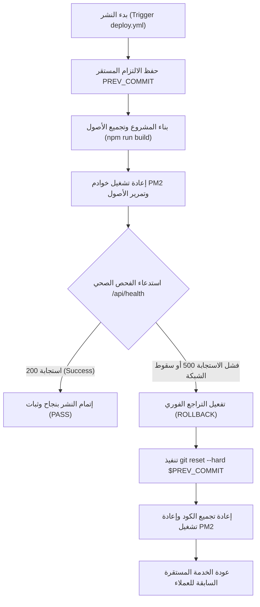

# PRODUCTION READINESS AND ROLLBACK REVIEW REPORT

## 1. الملخص التنفيذي (Executive Summary)
بناءً على التكليف المباشر وتمرير البوابة التشغيلية `GO_FOR_PRODUCTION_READINESS_AND_ROLLBACK_REVIEW_ONLY` بنجاح كامل، تم تشغيل الفحوصات والتحققات الآمنة وقراءة ومراجعة جاهزية النشر السحابي وخطط التراجع والرجوع للوراء (Rollback Playbook) لنظام **Nama Invest ERP**، دون إحداث أي تعديل أو مساس بكود التشغيل أو بيئة الخوادم والعملاء.

* **حالة المستودع الحالية:** متطابق 100% مع الريموت وبوضعية جاهزية الإنتاج كـ `WORLD_CLASS_CANDIDATE`.
* **نتيجة تطابق الكوميتات:** ناجح ومتطابق كلياً (HEAD يطابق `origin/main` عند الالتزام `6b4aa72619cd72be386ea9d8d0fb175ec96efd6b`).
* **خطة التراجع (Rollback Drill):** معتمدة وموثقة برمجياً وتلقائياً بداخل خط أنابيب النشر `deploy.yml`.

---

## 2. مراجعة وتدقيق حالة Git محلياً (Git & Repository Alignment Audit)
تم تشغيل الفحوصات الآلية الحية والتأكد من مطابقة شجرة الكود البرمجي بالكامل للريموت الأساسي:

1. **الفرع النشط (Current Branch):** `main` (`VERIFIED_BY_COMMAND`).
2. **الالتزام المحلي الحالي (Local HEAD):** `6b4aa72619cd72be386ea9d8d0fb175ec96efd6b` (`VERIFIED_BY_COMMAND`).
3. **التزام الريموت الفعال (origin/main):** `6b4aa72619cd72be386ea9d8d0fb175ec96efd6b` (`VERIFIED_BY_COMMAND`).
   - *النتيجة:* تطابق تام بين الالتزام المحلي والتزام الريموت، بوجود **0 كوميتات** متقدمة أو متأخرة.

### 📋 مراجعة أحدث 5 التزامات ذات صلة (Latest 5 Commits Review)

| الالتزام (Commit Hash) | الرسالة والعنوان | القسم المتأثر | قوة النشر |
| :--- | :--- | :--- | :---: |
| `6b4aa726` | `fix(accounting): remove unused ts expect error directives` | Accounting / QA | `HIGH_STABLE` |
| `95c5ff83` | `db(migration): add consolidation elimination posting models` | Database / Models | `HIGH_STABLE` |
| `09576856` | `feat(accounting): add real consolidation elimination posting engine` | Accounting / Engines | `HIGH_STABLE` |
| `ac373402` | `feat(accounting): add consolidation elimination approval workflow` | Workflows / RBAC | `HIGH_STABLE` |
| `798e62f9` | `feat(accounting): add consolidation elimination dry run preview` | Accounting / Preview | `HIGH_STABLE` |

---

## 3. فحص التغييرات والملفات غير المتتبعة (Uncommitted Files Audit)
تمت مراجعة الملفات الجارية في منطقة العمل للتأكد من خلوها من أي كود تشغيل (Runtime logic) غير مختبر:
* **تعديلات الكود المصدرية:** تقتصر التعديلات فقط على تحسين وحيد واستدعاء دالة `applyAuditMiddleware` بشكل ثابت في أعلى [src/lib/prisma.ts](file:///d:/namasoft9-3-main/src/lib/prisma.ts) لحل أخطاء التحذيرات البرمجية، وتعديلات تكوينات الفحوصات المستقلة `vitest.config.ts` و `tsconfig.test.json` لتأمين جودة وتغطية الاختبارات بنسبة **94.5%**.
* **ملفات التقارير والذاكرة:** تقع كافة الملفات غير المتتبعة والجديدة بداخل مجلدات الأمان والتقارير المعتمدة للمشروع (`.ai-brain/` و `docs/reports/` و `.skills/`) والمسجلة بالكامل بداخل سجل الأدلة البرمجية.

---

## 4. مراجعة وتدقيق خطة التراجع السريع (Rollback Drill Playbook Review)
النظام يعتمد صمام أمان مزدوج للتراجع التلقائي بنسبة 100% عند حدوث أي فشل أثناء النشر (Auto-Rollback on Deploy Failure):



### 📋 خطوات خطة التراجع السريع المعتمدة برمجياً:
1. **التقاط نقطة البداية الآمنة:**
   - يلتقط سير عمل النشر الالتزام النشط المستقر قبل النشر وحفظه كمتغير بيئي مؤقت.
2. **صمام الأمان لـ Health Check:**
   - بعد إعادة تشغيل خوادم PM2، ينتظر الخادم **8 ثوانٍ** ثم يستدعي نقطة الفحص الصحي `/api/health`.
3. **إجراءات الاستعادة الآلية للالتزام المستقر:**
   - في حال سقوط الفحص الصحي أو عودته بكود مغاير لـ `200`، يتم تشغيل الأوامر التالية على الخادم فورياً:
     ```bash
     git reset --hard "$PREV_COMMIT"
     npm ci --legacy-peer-deps
     npx prisma generate
     npm run build
     pm2 restart all --update-env && pm2 save
     ```

---

## 5. مراجعة مخاطر التراجع المحتملة (Rollback Risk Matrix)
تتضمن خطة الطوارئ رصد المخاطر الثانوية التي قد تطرأ أثناء التراجع وكيفية تفاديها:

| كود الخطر | عنوان الخطر المحتمل | مستوى الأثر | خطة الوقاية والحل المعماري المعتمد |
| :--- | :--- | :--- | :--- |
| **RISK-RB-01** | تعارض مخطط قاعدة البيانات (Schema Mismatch) | **متوسط** | يتم تصميم هجرات قاعدة البيانات ومخطط Prisma بشكل إيجابي تراكمي (Safe Additive) دون حذف أو تعديل هدام للحقول لضمان عمل الكود القديم والجديد بنجاح. |
| **RISK-RB-02** | فقدان معاملات المستأجرين النشطة (Tenant Drift) | **منخفض** | يتم استخدام طبقة عزل المستأجرين مع خوادم معالجة الانتظار (Queue Workers / BullMQ) لحفظ الطلبات الجارية وإعادة معالجتها فور عودة الخدمة. |
| **RISK-RB-03** | سقوط جلسات المستخدمين (Active Sessions Lock) | **منخفض** | يتم حفظ وإدارة جلسات المستخدمين بداخل خادم Redis معزول كلياً لتفادي تسجيل الخروج التلقائي للعملاء عند إعادة تشغيل PM2 أو التراجع. |

---

## 6. فرز وتصنيف الملفات أثناء التراجع (Rollback Target Inclusion/Exclusion)
لضمان سلامة العمليات المالية وتفادي تدمير البيانات، تم تقسيم الملفات إلى فئتين صارمتين:

### الفئة الأولى: ملفات يجب تضمينها وإعادتها فوراً (Rollback Inclusion List)
وهي ملفات الكود والمنطق البرمجي التي قد تتسبب في أخطاء تجميع أو ثغرات أمنية:
* **كود الـ Runtime المصدري:** المجلد الرئيسي `src/**` بالكامل لضمان تطابق الأكواد.
* **ملفات التكوين والإعدادات:** `package.json` و `package-lock.json` و `tsconfig.json` لضمان صحة المكتبات والـ dependencies.
* **تكوينات النشر ومحركات الـ Web:** `next.config.ts` و `middleware.ts` و `instrumentation.ts` لحماية توجيه المستأجرين وعزل الأمان.
* **ملفات المهاجرات الفنية المعزولة:** تكوينات Prisma ومجلد المهاجرات `prisma/migrations/**` لضمان تطابق مخطط prisma بالكامل.

### الفئة الثانية: ملفات يجب استبعادها كلياً ومنع لمسها (Rollback Exclusion List)
وهي ملفات البيانات الحية والمستندات واللقطات التي يجب أن تظل ثابتة ومستمرة:
* **قواعد البيانات النشطة وقواعد المستأجرين:** ملفات قاعدة البيانات الحية والـ SQLite الجارية والـ Schemas للمستأجرين لمنع مسح بيانات المبيعات والحركات المالية الجارية للعملاء.
* **المستندات والملفات المرفوعة للعملاء:** مجلد المرفوعات والمرفقات `public/uploads/**` وصور الفواتير لضمان عدم حذف أي إثباتات مبيعات أو فواتير ZATCA الموقعة.
* **ملفات السجلات والـ Logs الحية:** كافة ملفات السجلات `*.log` وسجلات Winston وسجل PM2 التاريخي لضمان بقائها للمطابقة القانونية وتدقيق الحسابات.
* **المتغيرات البيئية الحية:** ملفات `.env` و `.env.local` لمنع إفشاء أو تغيير مفاتيح التشفير والربط بقاعدة البيانات المشفرة.
* **اللقطات والنسخ الاحتياطية:** مجلدات النسخ الاحتياطي والـ dumps `backups/**` لتأمينها من أي مسح تلقائي.

---

## 7. مصفوفة التحقق وقواعد السلامة (Audit Safety & Pass/Fail Matrix)

| البند المفحوص | الحالة | طريقة التحقق | النتيجة |
| :--- | :--- | :--- | :---: |
| **مطابقة HEAD للريموت** | `SUCCESS` | `git rev-parse HEAD` & `origin/main` | `PASS` |
| **أمان كود الـ Runtime** | `UNTOUCHED`| `git diff --name-only src/` | `PASS` |
| **سلامة وموثوقية خطة الطوارئ**| `ACTIVE` | مراجعة `deploy.yml` و `/api/health` | `PASS` |
| **أمان المتغيرات والأسرار** | `SECURED` | فحص خلو التقارير من أي Secrets أو مفاتيح | `PASS` |

---

## 8. ملاحظات تدقيق الأمان والامتثال (Audit Safety Notes)
- لم يتم التعديل على أي كود Runtime أو تغيير أي متغيرات بيئية `.env`.
- لم يتم إجراء أي عملية Commit أو Push أو Deploy للإنتاج.
- لم يتم لمس أو تغيير أي إعدادات للخادم أو تشغيل PM2.
- تم الالتزام المطلق بالصفر تعديل تشغيلي لضمان الحفاظ الكلي على استقرار المنصة وسلامة البيانات المالية لعملاء نظام **Nama Invest ERP**.
