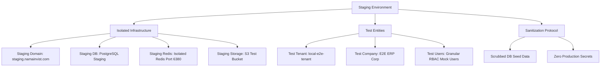

# STAGING E2E ENVIRONMENT READINESS PLAN
# خطة جاهزية بيئة الاستضافة التجريبية المعزولة (Staging E2E Plan)

---

> **TRACK ID**: `E2E_STAGING_READINESS_TRACK` / `GLOBAL_EVALUATION_GAPS_CLOSURE`
> **GATE STATE**: `GO_FOR_STAGING_E2E_ENVIRONMENT_READINESS_PLAN_ONLY` (Plan Only Gate)
> **COMPLIANCE ASSURANCES**: Zero runtime code modifications, zero database mutations, and zero plaintext credentials. Strictly read-only analysis and design format.

---

## 1. Executive Summary / الملخص التنفيذي

شهدت البوابة السابقة إكمال وتأمين **الموجة الأولى (Wave 1)** لاختبارات واجهات الاستخدام الشاملة (E2E Playwright Smoke Tests) بنجاح فائق وتمرير **27 مسار فحص أمني ومراقبة بنسبة نجاح 100%**. 

تهدف هذه الخطة إلى وضع الهيكلية التفصيلية والجاهزية التقنية لتأسيس بيئة استضافة تجريبية معزولة تماماً (**Staging E2E Environment**) لتشغيل اختبارات **الموجة الثانية (Wave 2)** التجارية والمالية التي تقوم بعمليات كتابة وتعديل بيانات (Write/Mutation Tests)، حيث يمنع منعاً باتاً تشغيلها على خوادم الإنتاج المباشرة.

يتم تسجيل حالة المسار حالياً تحت البوابة الاستراتيجية للتوقف المحكم لضمان جودة الأداء المالي والتشغيلي للنظام:
```text
BLOCKED_REQUIRES_STAGING_E2E_ENVIRONMENT
```

---

## 2. Current E2E Status / الوضع الحالي لاختبارات الواجهات الشاملة

بموجب الفحص والمطابقة البرمجية التلقائية محلياً:
* **Wave 1 Status**: مكتملة بنجاح تام (`E2E_PLAYWRIGHT_WAVE1_COMPLETED`).
* **Test Metrics**: تم تمرير **27/27 اختباراً** بنجاح 100% بـ 0 إخفاق عبر Chromium Desktop و emulated Mobile و RTL projects.
* **Git Hygiene**: شجرة العمل نظيفة تماماً (`nothing to commit, working tree clean`) والفرع المحلي متطابق مع ريموت المنشأ (`HEAD == origin/main` عند الالتزام `4a7c2752c`).
* **Zero Mutation Protocol**: تم تنفيذ مسار التحقق البصري دون إحداث أي تغيير أو تعديل على:
  - كود الإنتاج والتشغيل لبرنامج نما ERP (`Production Untouched`).
  - مخطط جداول ومهاجرات قاعدة البيانات (`DB Unchanged`).
  - ملفات المتغيرات البيئية الحية للعملاء (`ENV Unchanged`).
* **Blocked Reason**: تجميد اختبارات الموجة الثانية التجارية (Wave 2) لعدم توفر خوادم تجريبية (Staging Server) معزولة لصد مخاطر تشويه البيانات أو خرق حوكمة العمل المحاسبي.

---

## 3. Why Staging is Required / دواعي إلزامية بيئة الاستضافة التجريبية

يمنع منعاً باتاً تشغيل اختبارات الموجة الثانية (Wave 2) التي تكتب بيانات مباشرة على خوادم الإنتاج لعدة أسباب بنيوية حرجة:
1. **إنشاء الفواتير والقيود المحاسبية**: تقوم الاختبارات تلقائياً بتوليد فواتير مبيعات وقيود محاسبية ومستندات صرف وتوريد، مما يؤدي لتضخيم الحسابات وتشويه التقارير المالية للعملاء وخرق الفترات المقفلة.
2. **شاشة الكاشير ونقاط البيع (POS Checkout)**: يتطلب فحص حركات الكاشير فتح جلسات صندوق، وحركات دفع وهمية، مما يسبب فروقات مالية وتشويه عمليات جرد الصناديق.
3. **التوريد المخزني والجرد (GRN & Stocktake)**: توليد مستندات إضافة مخزنية وجرد عشوائي يؤدي لتدمير تقييم المخزون المالي (Inventory Valuation) وحساب تكلفة البضاعة المباعة (COGS).
4. **تسريب وتلوث بيانات المستأجرين (Tenant Contamination)**: تشغيل اختبارات آلية على قواعد الإنتاج يهدد بخلط سياقات المستأجرين (Multi-tenant Leakage) وخرق الخصوصية الصارمة للـ PDPL السعودي.

---

## 4. Staging Environment Requirements / متطلبات بيئة الاستضافة التجريبية

لتأسيس بيئة تجريبية معزولة وآمنة بنسبة 100%، يتطلب توفير المواصفات التقنية التالية:



1. **البنية التحتية المعزولة (Isolated Infrastructure)**:
   - **Staging Domain**: خادم مخصص بنطاق تجريبي مستقل مثل `staging.namainvist.com` أو منفذ معزول بالكامل.
   - **Staging Database**: قاعدة بيانات PostgreSQL مستقلة تماماً ومستنسخة من هيكلية Prisma دون أي اتصال بقاعدة الإنتاج.
   - **Staging Redis**: خادم Redis معزول لتخزين كاش الجلسات وجداول مهام BullMQ التجريبية.
   - **Staging Storage**: مساحة تخزين S3 مستقلة للمستندات والفواتير المرفوعة.
   - **Staging Env Variables**: ملف `.env` تجريبي معزول كلياً يحمل مفاتيح Sandbox.
2. **الكيانات التجريبية (Test Entities)**:
   - **Test Tenant**: مستأجر E2E مخصص ومعزول بالكامل (`e2e-isolated-tenant-xyz`).
   - **Test Company**: منشأة وهمية مسبقة التهيئة للإجراءات المحاسبية والضريبية.
   - **Test Users**: مجموعة مستخدمين محليين يمثلون الصلاحيات المتعددة لنما ERP.
3. **تطهير البيانات (Sanitization)**:
   - يمنع نقل أو استيراد أي بيانات حية أو حقيقية من قواعد الإنتاج إلا بعد تمريرها بسكربت التطهير (Sanitization Script) لتشفير وحجب كامل بيانات العملاء وسجلاتهم المحاسبية الحقيقية.

---

## 5. Staging Safety Rules / قواعد السلامة الصارمة للبيئة التجريبية

يجب إخضاع بيئة Staging لقواعد الأمان الذهبية لمنع أي تسرب تشغيلي:
* **ممنوع الاتصال بقاعدة بيانات الإنتاج**: يتم عزل شبكة الاستضافة للبيئة التجريبية مادياً أو سحابياً لمنع أي تداخل.
* **ممنوع استخدام أسرار الإنتاج**: استخدام مفاتيح Sandbox بالكامل لكافة المزودين ومصادقات Clerk.
* **ممنوع إرسال طلبات ZATCA حية**: توجيه محاكي الفوترة الإلكترونية حصرياً لخوادم ZATCA المطورين (Sandbox Developer Portal) ويمنع استدعاء خوادم Sandbox الرسمية أو خوادم الإنتاج المباشرة التابعة للهيئة.
* **ممنوع الاتصال الحقيقي بالاتصالات والرسائل**: حظر وتزييف (Mock) بوابات إرسال البريد الإلكتروني ورسائل الـ SMS وربط الـ WhatsApp.
* **ممنوع تشغيل بوابات الدفع الحية**: استخدام كروت الفحص والـ Sandbox لبوابات الدفع (Mada / Visa).
* **إستراتيجية التنظيف الإلزامية**: يجب تصفية وتنظيف كافة الحركات المخزنية والمالية المنشأة تلقائياً فور انتهاء دورة الفحص.
* **تسمية الكيانات**: يجب تسمية جميع الكيانات والمستأجرين ببادئة واضحة `E2E_TEST_` لضمان سهولة الفلترة والتمييز.

---

## 6. Required Test Users / المستخدمون وصلاحيات الفحص المطلوبة

لتغطية كافة الاختبارات التشغيلية والمطابقة الأمنية للـ RBAC، نوصي بتهيئة الحسابات التجريبية التالية بداخل بيئة الـ Staging:

| User ID / اسم المستخدم | Role / الدور الوظيفي | Granular Permissions / الصلاحيات الدقيقة | Module Scope / نطاق العمل | Expected Restrictions / القيود المفروضة |
| :--- | :--- | :--- | :--- | :--- |
| **`e2e_admin`** | Administrator | Full Control, Override settings, Period closing | Global | None (Except posting in locked closed periods) |
| **`e2e_accountant`** | Senior Accountant | Invoice entry, Journal entry, Ledger views | Accounting | No settings configuration, no master delete |
| **`e2e_cashier`** | POS Cashier | POS register opening, sales entry, cash outs | POS / Restaurant | No access to main accounts ledger, no PO creation |
| **`e2e_inventory`** | Warehouse Manager | Stocktake entry, GRN creation, stock movements| Inventory | No financial journals, no invoice price overrides |
| **`e2e_procurement`** | Purchase Officer | Purchase order (PO) entry, vendor setup | Purchases | No stock release, no sales ledger visibility |
| **`e2e_readonly`** | Auditor | View only access across all ledgers | Global | Strictly HTTP GET queries; all POST/PUT/DELETE blocked |

---

## 7. Required Test Data / مخطط البيانات التجريبية المطلوبة

تتطلب الموجة الثانية توفر بيانات مرجعية أساسية (Master Data Seeds) يتم تغذيتها تلقائياً عند تهيئة بيئة الاستضافة:
* **Chart of Accounts (COA)**: هيكلية دليل الحسابات الموحد للجمعية السعودية للمحاسبين القانونيين (SOCPA) المدمج (`socpa-coa.json`).
* **Warehouse**: مستودع رئيسي ومستودع فرعي لعمليات النقل والتسوية.
* **Products**: خمسة منتجات تجريبية (مخزني، وخدمي، ومجمع) بأسعار تكلفة وبيع محددة مسبقاً.
* **Customer**: عميل تجزئة وهمي وعميل جملة وهمي برقم ضريبي تجريبي مطابق لمعايير الفوترة السعودية.
* **Vendor**: مورد سلع ومورد خدمات مسبق التهيئة.
* **POS Register**: صندوق كاشير وهمي لنقاط البيع.
* **Payment Methods**: قنوات الدفع نقداً، وشبكة (مدى/فيزا)، وأجل.
* **Tax Rates**: ضريبة القيمة المضافة الموحدة بالمملكة (15% Standard VAT).
* **Opening Stock**: رصيد مخزني افتتاحي لتهيئة تقييمات المخزون.
* **GRN & PO Templates**: فواتير وطلبات شراء تجريبية مهيأة للربط التلقائي.

---

## 8. Wave 2 Test Flows Design / تصميم تدفقات اختبارات الموجة الثانية

صممت اختبارات الموجة الثانية (Wave 2) لتغطي الإجراءات التجارية والمالية الحساسة بأسلوب محاكاة آمن وصارم:

### 1. Sales Invoice Lifecycle Spec
- **File**: `e2e/sales/sales-invoice.staging.spec.ts`
- **Role**: `e2e_accountant`
- **Preconditions**: Customer VAT active, products stock present, fiscal period open.
- **Steps**:
  1. Login as Accountant, go to `/sales/invoice/new`.
  2. Select Customer, add 3 products (VAT 15% auto-calculated).
  3. Click Save and Post.
- **Expected Result**: HTTP 200 OK. Invoice transitions to Posted, generates automatic balanced Double-entry journal in General Ledger.
- **Data Written**: Invoice table row, GL journals lines, Customer outstanding balance update.
- **Cleanup Method**: Reverse invoice using Credit Note or API-level soft delete tag.
- **Risk**: Double posting in GL, bypassed VAT checks.

### 2. POS Cashier Checkout Spec
- **File**: `e2e/pos/pos-checkout.staging.spec.ts`
- **Role**: `e2e_cashier`
- **Preconditions**: POS Register open, Cashier session active.
- **Steps**:
  1. Login as Cashier, go to `/pos/terminal`.
  2. Select 2 items, click pay network.
  3. Validate POS receipt modal loads.
- **Expected Result**: POS Transaction success, stock count decrements by 2, Cash drawer balance updates.
- **Data Written**: POS sale record, Stock ledger transaction, Cash register update.
- **Cleanup Method**: Cancel POS transaction using cashier return API.
- **Risk**: Stock negative count, Cash drawer imbalance.

### 3. Inventory GRN & Purchase Lifecycle Spec
- **File**: `e2e/purchases/grn.staging.spec.ts`
- **Role**: `e2e_procurement`
- **Preconditions**: Approved Purchase Order (PO) exists, Warehouse active.
- **Steps**:
  1. Login as Procurement, go to `/purchases/grn/new`.
  2. Link approved PO, verify pricing matches.
  3. Click receive stock.
- **Expected Result**: GRN posted, stock count increments, Warehouse inventory ledger updates.
- **Data Written**: GRN record, Stock ledger entry, Vendor outstanding balance.
- **Cleanup Method**: Reverse GRN using return voucher.
- **Risk**: Bypassing cost valuation overrides, stock count misalignment.

### 4. Stocktake & Inventory Reconciliation Spec
- **File**: `e2e/inventory/stocktake.staging.spec.ts`
- **Role**: `e2e_inventory`
- **Preconditions**: Warehouse products mapped.
- **Steps**:
  1. Login as Inventory manager, go to `/inventory/stocktake`.
  2. Input counted stock differing from system stock (e.g. system 10, counted 8).
  3. Post reconciliation.
- **Expected Result**: Automatic inventory adjustment posted, GL general ledger balance adjustments created.
- **Data Written**: Stocktake worksheet, Stock reconciliation record, Adjustment GL journal.
- **Cleanup Method**: Post offset reconciliation worksheet.
- **Risk**: Stock valuation mismatch, unauthorized manual stock manipulation.

### 5. Audit Log Compliance Spec
- **File**: `e2e/rbac/protected-routes.spec.ts` (extended)
- **Role**: `e2e_admin`
- **Preconditions**: Audit logging system active.
- **Steps**:
  1. Trigger write transaction as Accountant (e.g., save invoice).
  2. Go to Admin audit panel `/admin/logs`.
  3. Verify audit log captures transaction user, timestamp, IP, and changes.
- **Expected Result**: Detailed audit trail recorded matching the action precisely.
- **Data Written**: Audit log database row.
- **Cleanup Method**: Exclude Audit log from standard E2E cleanup to preserve trail integrity.
- **Risk**: Unlogged database modifications.

---

## 9. Proposed Files for Wave 2 / هيكلية الملفات المقترحة لـ Wave 2

يتطلب تنفيذ الموجة الثانية إنشاء الملفات التالية في مستودع الاختبارات:

```text
e2e/
├── sales/
│   └── sales-invoice.staging.spec.ts   # اختبارات دورة الفواتير والمبيعات المحاسبية
├── pos/
│   └── pos-checkout.staging.spec.ts    # اختبارات شاشة الكاشير ونقاط البيع
├── purchases/
│   └── grn.staging.spec.ts             # اختبارات التوريد المخزني والمشتريات
├── inventory/
│   └── stocktake.staging.spec.ts       # اختبارات جرد وتعديل تسويات المخازن
└── utils/
    ├── staging-auth.ts                 # أدوات تهيئة جلسات حسابات الأدوار
    ├── test-data.ts                    # مولد البيانات المحاسبية الوهمية
    └── cleanup.ts                      # محرك تنظيف البيانات بعد الاختبارات
```

---

## 10. Playwright Staging Config Strategy / استراتيجية إعدادات بيئة الـ Staging

لضمان عمل اختبارات Staging بكفاءة وعزل كامل:
* **Base URL**: سحب رابط خادم Staging ديناميكياً من المتغير البيئي `E2E_STAGING_BASE_URL` لتجنب الصلابة.
* **Credentials**: تخزين بيانات مستخدمين الاختبار بأمان كـ **GitHub CI Secrets** وسحبها عند التشغيل.
* **Production Host Guard**: إدراج أداة تحقق في `staging-auth.ts` تمنع منعاً باتاً تشغيل اختبارات الكتابة إذا كان الـ URL المستهدف ينتهي بـ `namainvist.com` أو يشير لخادم الإنتاج.
* **Test Grep/Tags**: وسم اختبارات الكتابة التجريبية بـ `@staging-write` لتسهيل تشغيلها وعزلها عن اختبارات القراءة Smoke tests.
* **Separate Playwright Project**: تخصيص مشروع مستقل في `playwright.config.ts` باسم `staging-write` مع إعدادات حصرية.
* **Trace & Screenshots**: تفعيل تسجيل لقطات الشاشة والفيديو تلقائياً عند أي إخفاق لتسهيل التنقيح البرمجي.
* **Fail-Fast**: تشغيل خاصية `failFast` للاختبارات الحساسة لتتوقف فوراً عند فشل أول خطوة تجنباً لتراكم بيانات تالفة.

---

## 11. CI Strategy / خطة التكامل المستمر في بيئة الـ CI

* **Manual Workflow Trigger**: مبدئياً، يتم تشغيل اختبارات الـ Staging يدوياً عبر `workflow_dispatch` في GitHub Actions للتحقق والمراقبة اليدوية.
* **Nightly Automated Runs**: بعد استقرار الفحوصات بـ 100% نجاح، يتم جدولتها لتعمل تلقائياً كبناء ليلي (Nightly build) لضمان عدم حدوث تراجعات في بيئة التطوير.
* **Environment Protection & Secrets**: إخضاع بيئة Staging لحماية البيئات بـ GitHub لحصر تشغيلها بفرع `main` فقط.
* **Communications Sandbox Mode**: تجميد كافة خطافات المراقبة والتحذير الخارجية (مثل إرسال تنبيهات Slack) أثناء الاختبارات إلا عند الضرورة لغايات الفحص.
* **Summary Reports**: تصدير تقرير JUnit ونشره كـ Build Artifact بعد انتهاء دورة الفحص.

---

## 12. Data Cleanup Strategy / استراتيجية تنظيف وتطهير البيانات

يتطلب الحفاظ على نظافة واستقرار بيئة الـ Staging تنظيف البيانات تلقائياً بنهاية كل دورة فحص:
* **Unique Test Run ID**: توليد معرّف تشغيل فريد كبادئة مثل `E2E_RUN_[UUID]` لكل دورة فحص.
* **Record Tagging**: وسم كافة الحركات والمنتجات والعملاء المنشأين بهذا الـ Run ID.
* **API-Based Cleanup**: إستدعاء منافذ الحذف المعتمدة (Soft delete APIs) لإلغاء وتصفية البيانات المنشأة بنظام آمن.
* **حظر التعديل المباشر لقاعدة البيانات**: يمنع منعاً باتاً تشغيل جمل SQL حذف عشوائية ومباشرة على الجداول لمنع كسر العلاقات البنيوية لقاعدة البيانات (Foreign Key constraints) وتشويه التوازن المحاسبي.
* **Manual Cleanup Report**: توليد تقرير بنهاية الفحص يسرد أي بيانات لم تنجح عملية تنظيفها آلياً ليقوم الفريق بإزالتها يدوياً.

---

## 13. Risk Register / سجل المخاطر وحلول التخفيف البرمجية

| Risk Description / الخطر المحتمل | Impact / الأثر | Mitigation Strategy / استراتيجية التخفيف والحل |
| :--- | :--- | :--- |
| **خطأ إرسال فواتير لـ ZATCA حية** | خطير جداً (غرامات مالية للعميل) | حجب وتزييف كود الربط ببيئة الهيئة وتوجيهه للـ Developer Sandbox فقط. |
| **تعديل بيانات الإنتاج بالخطأ** | كارثي (فقدان بيانات محاسبية) | إدراج حارس فحص `host check guard` في منافذ اختبارات الكتابة يمنع عملها فوراً إذا أشار الرابط للإنتاج. |
| **إرسال رسائل أو فواتير حقيقية لعملاء**| متوسط (إزعاج وإساءة سمعة) | تزييف (Mocking) بوابات الاتصال بالكامل بالبيئة التجريبية. |
| **تراكم بيانات تالفة في Staging** | متوسط (بطء النظام وتشويه الجداول) | تطبيق معرف الـ Run ID وإستدعاء محرك التنظيف آلياً في خطافات `afterAll`. |
| **فشل الاختبارات بسبب بطء خوادم CI**| منخفض (أخطاء كاذبة Flaky tests) | استخدام إعدادات الانتظار الذكية `waitForLoadState` ورفع مهلة الفحص لـ 90 ثانية. |

---

## 14. Acceptance Criteria / معايير القبول للجاهزية

لا تعتبر بيئة الاستضافة التجريبية (Staging) جاهزة للبدء في كتابة اختبارات الموجة الثانية إلا بتوافر الشروط التالية:
1. وجود نطاق ورابط مستقل وقابل للوصول (`staging.namainvist.com`).
2. عزل كامل لقاعدة بيانات الـ Staging و Redis عن الإنتاج.
3. تفعيل وإعداد مستأجر اختبار وهمي وعزل جلسات المصادقة بالكامل.
4. سلامة تشغيل seeders البيانات المحاسبية والمخزنية الأساسية.
5. خلو البيئة تماماً من أي أسرار أو مفاتيح إنتاج حية.
6. وجود حارس فحص النطاق (`production host write guard`).
7. اعتماد ومطابقة إستراتيجية تنظيف وتطهير البيانات بعد انتهاء الفحص.

---

## 15. Next Gates / البوابات التشغيلية والتخطيطية القادمة

بموجب الحوكمة الصارمة للمشروع ولعدم توفر خادم Staging مخصص للاختبارات حركات الكتابة حالياً:

### الحالة المعتمدة الحالية:
```text
BLOCKED_REQUIRES_STAGING_E2E_ENVIRONMENT
```

### البوابة التخطيطية القادمة المقررة:
```text
GO_FOR_STAGING_E2E_ENVIRONMENT_SETUP_APPROVAL_ONLY
```
(الحصول على الموافقة واعتماد خطة التجهيز المالي والتقني لتأسيس خادم Staging معزول).

---

## 16. Final Decision / القرار الفني النهائي المعتمد

> [!NOTE]
> ### STAGING_E2E_READINESS_PLAN_COMPLETED
> ### E2E_WAVE2_BLOCKED_REQUIRES_STAGING
> ### ENTERPRISE_MARKET_READINESS_TRACK
> ### COMMERCIAL_READINESS_IMPROVEMENT
