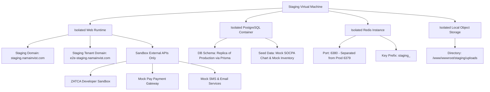

# STAGING E2E ENVIRONMENT SETUP APPROVAL
# وثيقة اعتماد وتجهيز خطة إعداد بيئة الاستضافة التجريبية المعزولة

---

> **TRACK ID**: `E2E_STAGING_READINESS_TRACK` / `GLOBAL_EVALUATION_GAPS_CLOSURE`
> **GATE STATE**: `GO_FOR_STAGING_E2E_ENVIRONMENT_SETUP_APPROVAL_ONLY` (Approval Only Gate)
> **COMPLIANCE STATUS**: Strictly Plan & Approval. Zero production mutations, zero DB push, zero deployment, zero active env modifications.
> **DECISION VERDICT**: `STAGING_E2E_SETUP_APPROVAL_COMPLETED` (Pending Manual Infrastructure Execution)

---

## 1. Executive Summary / الملخص التنفيذي

تهدف هذه الوثيقة إلى تفعيل **بوابة الاعتماد والتجهيز لخطة إعداد بيئة الاستضافة التجريبية المعزولة (Staging E2E Environment Setup Approval)**. تمثل هذه الخطوة صمام الأمان الأساسي لحماية سلامة واستقرار منصة الإنتاج الحية لنظام **نماء انفست (Nama Invest ERP)**.

> [!IMPORTANT]
> **قاعدة الحوكمة الصارمة**:
> إن اعتماد هذه البوابة **لا يعني** تأسيس البيئة التشغيلية فعلياً أو تعديل خوادم الإنتاج بأي شكل من الأشكال. ينحصر نطاق هذه البوابة في مراجعة وتوثيق واعتماد المخطط الهندسي والمعماري لبيئة الـ Staging وتحديد معايير السلامة قبل الانتقال إلى خطوات التأسيس الفعلي للموجة الثانية (Wave 2) التجارية والمالية.

---

## 2. Current State / الوضع الحالي للنظام

بموجب المراجعة والمطابقة البرمجية المبرهنة حتى تاريخ **2026-06-02**:

1. **E2E Playwright Wave 1**: مكتملة بنجاح تشغيلي مطلق (`E2E_PLAYWRIGHT_WAVE1_COMPLETED`).
2. **فحص الاختبارات (Test Success Rate)**: تم تمرير **27/27 اختباراً بنجاح 100%** دون أي إخفاق أو تعليق عبر المنصات المتعددة (Chromium Desktop, Mobile Emulation, RTL Localized).
3. **حالة التزامن البرمجي (Git Hygiene)**: 
   - رأس الالتزام البرمجي المحلي متطابق بالكامل مع الفرع الرئيسي عن بعد: `HEAD == origin/main == ab26a090861ae46fec5d93d467c183b376e2d59d`.
   - شجرة العمل نظيفة تماماً وخالية من الملفات غير الملتزم بها (`working tree clean`).
4. **استقرار الإنتاج (Production Stability)**: خوادم الإنتاج مستقرة كلياً وتعمل بنجاح تشغيلي 100% تحت إشراف PM2.
5. **قاعدة البيانات والمتغيرات البيئية (DB & ENV Status)**:
   - لم يتم إجراء أي تعديل على جداول أو مهاجرات قاعدة البيانات (`DB Unchanged`).
   - لم يتم المساس بملفات المتغيرات البيئية الحية للعملاء (`ENV Unchanged`).
6. **سبب التوقف المؤقت الحالي (Current Block Reason)**:
   - تجميد اختبارات الموجة الثانية (Wave 2) التجارية التي تحتوي على عمليات كتابة وتعديل (Write/Mutation) وحظرها بالكامل لتفادي مخاطر تشويه الحسابات أو التأثير على قاعدة الإنتاج، وتسجيل حالة النظام تحت الرمز:
     ```text
     BLOCKED_REQUIRES_STAGING_E2E_ENVIRONMENT
     ```

---

## 3. Approval Scope / نطاق الاعتماد الفني

ينحصر الاعتماد الفني الممنوح في هذه البوابة في **الموافقة التخطيطية والهندسية** على المكونات التالية وتجهيز ملفاتها البرمجية المحلية تمهيداً للتنفيذ لاحقاً:

* **نطاق الاستضافة والنطاق الفرعي (Staging DNS)**: اعتماد حجز النطاق الفرعي المعزول لبيئة الفحص.
* **قاعدة البيانات المستقلة (Isolated DB)**: هندسة تشييد قاعدة بيانات تجريبية خالية من أية صلة ببيانات الإنتاج.
* **خادم الكاش المعزول (Isolated Redis)**: فصل ذاكرة الكاش وجلسات العمل.
* **بوابات المحاكاة للخدمات الخارجية (Sandbox Integrations)**: توجيه كافة خدمات الربط إلى بوابات الفحص والتطوير.
* **المستأجر التجريبي المخصص (Test Tenant)**: صياغة مواصفات كيان مستأجر E2E مخصص ببيانات اختبارية وهمية.
* **المستخدمون والصلاحيات (Test Users & RBAC)**: اعتماد هيكلية حسابات الفحص وصلاحياتها الدقيقة.
* **بيانات التهيئة التجريبية (Demo/Test Data Seeds)**: هيكلية الدليل المحاسبي والمخزني الافتراضي.
* **تدفقات الموجة الثانية الآمنة (E2E Write-Safe Workflows)**: مسارات المبيعات والمشتريات والمخازن المصممة للعمل الآمن.

---

## 4. Explicit No-Go Items / المحظورات الصارمة والممنوعات

يمنع منعاً باتاً وبموجب هذا الاعتماد تفعيل أو استخدام أي من العناصر التالية في بيئة الفحص:

```
┌────────────────────────────────────────────────────────────────────────┐
│                        🚨 CRITICAL NO-GO PROTOCOL                      │
├────────────────────────────────────────────────────────────────────────┤
│ 1. ❌ استخدام قاعدة بيانات الإنتاج (No Production DB usage under E2E)   │
│ 2. ❌ استخدام رموز مصادقة أو أسرار حية للإنتاج (No Production Secrets)   │
│ 3. ❌ الربط الفعلي الحي مع خوادم هيئة الزكاة والضريبة (No Live ZATCA)   │
│ 4. ❌ تشغيل بوابات الدفع الحية لمدى أو فيزا (No Live Payment Gateway)   │
│ 5. ❌ إرسال رسائل نصية قصيرة حقيقية للهواتف (No Real SMS Gateways)    │
│ 6. ❌ إرسال رسائل بريد إلكتروني حية للعملاء (No Real Outgoing Email)    │
│ 7. ❌ استيراد أو فحص أي بيانات عملاء حقيقيين (No Customer Live Data)  │
│ 8. ❌ إحداث أي أثر محاسبي أو قيود على الإنتاج (No Prod Financial Post) │
│ 9. ❌ تشغيل prisma migrate/db push على خادم الإنتاج                  │
│ 10.❌ إجراء أي عملية نشر (deploy) أو إعادة تشغيل PM2 للإنتاج           │
└────────────────────────────────────────────────────────────────────────┘
```

---

## 5. Proposed Staging Architecture / الهيكل الهندسي المقترح لبيئة الاستضافة

لتأمين عزل فيزيائي ومنطقي بنسبة 100%، تم تصميم معمارية بيئة الاستضافة التجريبية كالتالي:



1. **المجالات المعزولة (Staging Domains)**:
   - النطاق الأساسي لبيئة الفحص: `staging.namainvist.com`
   - نطاق المستأجر التجريبي: `e2e-staging.namainvist.com`
2. **عزل قواعد البيانات والتخزين**:
   - قاعدة بيانات PostgreSQL مخصصة تعمل داخل شبكة داخلية مغلقة أو منفذ مخصص، ومفصولة تماماً عن قاعدة الإنتاج.
   - خادم Redis معزول يعمل على منفذ مختلف (مثل 6380) وبادئة مفاتيح مخصصة لتجنب تلوث الكاش.
   - مساحات رفع ملفات محلية معزولة تماماً في مجلد خاص ببيئة الـ Staging.
3. **أسرار ومتغيرات مستقلة (Separated Secrets)**:
   - ملف بيئة مستقل كلياً `.env.staging` لا يحتوي على أي رمز مصادقة أو مفتاح ربط حي خاص بالمنصة الأساسية للإنتاج.

---

## 6. Staging Data Model / مخطط وهيكلية البيانات التجريبية المطلوبة

تتطلب بيئة الاستضافة عند إعدادها تهيئة قاعدة البيانات ببيانات مرجعية افتراضية آمنة (Mock Master Data Seeds) خالية من أي صلة بالعملاء الحقيقيين:

* **المستأجر التجريبي (E2E Tenant)**: مستأجر معزول كلياً يحمل المعرف `e2e-isolated-tenant-xyz`.
* **الفرع والمستودع التجريبي (E2E Branch & Warehouse)**: فرع افتراضي باسم `E2E Riyadh Branch` ومستودع رئيسي `E2E Main Warehouse`.
* **صناديق نقاط البيع (E2E POS Register)**: كاشير افتراضي باسم `POS Register E2E-01`.
* **الأطراف التجارية (E2E Customer & Vendor)**: عميل وهمي ومورد وهمي برقم ضريبي تجريبي مطابق لاختبارات الفوترة الإلكترونية.
* **المنتجات الافتراضية (E2E Products)**: خمسة منتجات تغطي الأنماط المخزنية والخدمية والضرائب بنسبة 15%.
* **دليل الحسابات الموحد (Chart of Accounts)**: استيراد دليل الحسابات القياسي المتوافق مع الهيئة السعودية للمحاسبين القانونيين (SOCPA).
* **حسابات الفحص والـ RBAC**:
  - `e2e_admin` (مدير النظام التجريبي)
  - `e2e_accountant` (المحاسب المالي التجريبي)
  - `e2e_cashier` (أمين صندوق نقاط البيع التجريبي)
  - `e2e_inventory` (أمين المخزن التجريبي)
  - `e2e_procurement` (مسؤول المشتريات التجريبي)
  - `e2e_readonly` (المراجع المالي التجريبي لقراءة التقارير)

---

## 7. Safety Guards Required Before Wave 2 / صمامات الأمان الحاكمة للاختبارات

قبل السماح بتشغيل أي اختبار من اختبارات الموجة الثانية (Wave 2)، يجب برمجة وتدقيق صمامات الأمان التالية داخل كود الاختبار تلقائياً:

> [!WARNING]
> **صمام الحماية من الكتابة على خادم الإنتاج (Production Write Guard)**:
> يجب أن يفشل الاختبار فوراً وبشكل تلقائي (Fail Fast) إذا احتوى الرابط المستهدف `baseURL` على نطاق الإنتاج المباشر `namainvist.com` أو أي من نطاقات الفروع الحية.

* **بيئة الكتابة الإلزامية (Write-Safe Environment Checks)**:
  - اشتراط وجود المتغير البيئي `E2E_ALLOW_WRITES=true` لتشغيل اختبارات الكتابة.
  - التحقق من توافر المتغير البيئي للنطاق التجريبي `E2E_STAGING_BASE_URL` ومطابقته للرابط المستهدف.
* **عزل المستأجر عبر البادئة (Tenant Prefix isolation)**:
  - يجب فرض البادئة `E2E_TEST_` على جميع الكيانات والمستندات المنشأة آلياً لسهولة التعرف عليها وتصفيتها.
* **معرفات التشغيل الفريدة (E2E Run UUIDs)**:
  - ترفق كافة المعاملات البرمجية ببادئة فريدة مستمدة من رقم دورة الفحص (UUID Run ID) لتمكين التطهير الانتقائي.
* **إستراتيجية التنظيف والتطهير التلقائي (Automated Data Cleanup)**:
  - تفعيل سكربت التنظيف التصفيري المبرمج بعد انتهاء الفحوصات مباشرة لإعادة تعيين الجداول التجريبية لحالتها النظيفة الأولى.

---

## 8. Required Environment Variables / المتغيرات البيئية المطلوبة

تحدد هذه الوثيقة أسماء المتغيرات البيئية الحاكمة لبيئة الاستضافة التجريبية دون تضمين قيمها الفعلية، ويتم تخزين القيم حصرياً داخل CI Secrets أو ملفات التكوين المحلية غير الملتزم بها:

```ini
# Staging Base URLs & Targets
E2E_STAGING_BASE_URL
E2E_ALLOW_WRITES
E2E_RUN_ID
E2E_TENANT_SLUG

# Test Account Credentials (Mock Secrets)
E2E_STAGING_ADMIN_EMAIL
E2E_STAGING_ADMIN_PASSWORD
E2E_STAGING_CASHIER_EMAIL
E2E_STAGING_CASHIER_PASSWORD
E2E_STAGING_ACCOUNTANT_EMAIL
E2E_STAGING_ACCOUNTANT_PASSWORD
E2E_STAGING_INVENTORY_EMAIL
E2E_STAGING_INVENTORY_PASSWORD
E2E_STAGING_PROCUREMENT_EMAIL
E2E_STAGING_PROCUREMENT_PASSWORD
```

---

## 9. Setup Gates Proposed / بوابات التجهيز والتأسيس المقترحة

للانتقال الآمن والمنظم من مرحلة التخطيط والاعتماد إلى التنفيذ، نقترح المسار المتسلسل للبوابات الحاكمة التالية:

```
[APPROVED] GO_FOR_STAGING_E2E_ENVIRONMENT_SETUP_APPROVAL_ONLY
   │
   ▼
1. GO_FOR_STAGING_E2E_ENVIRONMENT_SETUP_PLAN_ONLY (تخطيط إعداد الخادم والبنية التحتية)
   │
   ▼
2. GO_FOR_STAGING_E2E_ENVIRONMENT_CONFIG_DESIGN_ONLY (تصميم ملفات التكوين والمتغيرات البيئية المعزولة)
   │
   ▼
3. GO_FOR_STAGING_E2E_ENVIRONMENT_LOCAL_SCRIPTS_IMPLEMENTATION_ONLY (كتابة سكربتات التطهير وتغذية البيانات محلياً)
   │
   ▼
4. GO_FOR_STAGING_E2E_ENVIRONMENT_SETUP_DRY_RUN_ONLY (تجربة محاكاة تشغيل وهمية خالية من الأثر)
   │
   ▼
5. GO_FOR_STAGING_E2E_ENVIRONMENT_SETUP_EXECUTION_ONLY (تأسيس وتشييد البيئة التجريبية فعلياً على الخادم)
   │
   ▼
6. GO_FOR_STAGING_E2E_ENVIRONMENT_VERIFICATION_ONLY (التحقق الكامل من عزل وسلامة الـ Staging)
   │
   ▼
7. GO_FOR_E2E_PLAYWRIGHT_WAVE2_STAGING_IMPLEMENTATION_ONLY (التنفيذ الفعلي لاختبارات الموجة الثانية التجارية)
```

---

## 10. Wave 2 Readiness Checklist / قائمة التحقق لجاهزية اختبارات الموجة الثانية

يمنع منعاً باتاً السماح بالبدء في برمجة أو تشغيل اختبارات الموجة الثانية (Wave 2) إلا بعد استيفاء قائمة التحقق التالية بالكامل:

- [ ] استجابة الرابط التجريبي `staging.namainvist.com` وعمله بنجاح.
- [ ] عزل قاعدة بيانات الـ Staging بشكل فيزيائي ومنطقي 100%.
- [ ] عزل خادم Redis التجريبي على منفذ مخصص والتأكد من استقراره.
- [ ] تأسيس وتغذية حسابات الفحص وكيان المستأجر التجريبي المخصص بنجاح.
- [ ] مطابقة وعمل بوابات المحاكاة للخدمات الخارجية (ZATCA Sandbox, Email, SMS).
- [ ] فحص واختبار صمامات أمان منع الكتابة على خوادم الإنتاج (Production Write Guard) وتأكيد فعاليتها.
- [ ] اختبار ونجاح سكربت التطهير والتنظيف التلقائي لقاعدة البيانات (Cleanup validation).
- [ ] قدرة محرك Playwright على تسجيل الدخول التلقائي بنجاح لحسابات الفحص على الـ Staging.
- [ ] خلو كافة سطور كود اختبارات الموجة الثانية من أي إشارة لنطاق الإنتاج الحقيقي.
- [ ] مطابقة التراخيص وتراخيص أمن وحماية الكود البرمجي بالكامل.

---

## 11. Risk Register / سجل المخاطر والإجراءات الوقائية

| Risk Item / خطر محتمل | Level / المستوى | Mitigation Action / الإجراء الوقائي للوقاية منه |
| :--- | :--- | :--- |
| **الكتابة غير المقصودة على الإنتاج** | 🚨 حرج | صمام حماية فوري (Fail Fast) في كود الفحص يفشل تلقائياً إذا كان الرابط المستهدف حقيقي. |
| **تسريب بيانات مصادقة الاستضافة** | ⚠️ مرتفع | تخزين كافة البيانات الحساسة وأسرار الفحص داخل الـ CI Secrets وتجنب حفظها في الكود. |
| **الاتصال الفعلي بالخدمات الخارجية الحية** | 🚨 حرج | فرض محاكاة كاملة (Mocks) في كود الـ Backend وتوجيه روابط ZATCA إلى بوابة المطورين فقط. |
| **تلوث قاعدة بيانات الاستضافة بالبيانات** | ⚠️ مرتفع | بادئة فريدة `E2E_TEST_` وتمرير دوري لسكربت التطهير والمسح الشامل بعد كل دورة فحص. |
| **فشل عملية تنظيف البيانات التلقائية** | ⚠️ مرتفع | سكربت التحقق التلقائي يفحص استقرار الجداول بعد انتهاء الفحص ويطلق جرس إنذار عند الفشل. |
| **خرق عزل سياق المستأجرين** | 🚨 حرج | تطبيق صارم لمعماريات العزل البرمجية وفحص أمن المستأجرين تلقائياً عبر مراجعات Zod. |
| **كشف أسرار الـ Staging في الـ Git** | ⚠️ مرتفع | تفعيل استبعادات حازمة في `.gitignore` وفحص دوري عبر Husky لمنع الالتزام بالملفات الحساسة. |
| **بطء بيئة الاستضافة التجريبية** | ℹ️ منخفض | تخصيص عتاد وموارد كافية لخادم الاستضافة وتفعيل كاش معزول لضمان سرعة الفحوصات. |

---

## 12. Brain Updates / تحديثات ذاكرة المساعد الذكي (AI Brain Updates)

تم تسجيل هذه البوابة بنجاح كحالة حوكمة برمجية مستقلة وآمنة تماماً في مستودع الذاكرة البرمجية للذكاء الاصطناعي:
* **`.ai-brain/01-current-state.md`**: تسجيل إتمام بوابة خطة الموافقة والتجهيز (`STAGING_E2E_SETUP_APPROVAL_COMPLETED`) وحظر أي نشاط تشغيلي على الإنتاج.
* **`.ai-brain/15-approval-gates.md`**: إدراج البوابة الحالية كبوابة مكتملة ومعتمدة رسمياً.
* **`.ai-brain/19-evidence-index.md`**: إدراج هذه الوثيقة كدليل رسمي معتمد للمطابقة.
* **`.ai-brain/20-next-actions.md`**: التوصية بالانتقال الآمن للبوابة الهندسية القادمة `GO_FOR_STAGING_E2E_ENVIRONMENT_SETUP_PLAN_ONLY`.

---

## 13. Commit/Push Policy / سياسة الالتزام والنشر والدفع المعتمدة

تم تطبيق هذه السياسة بصرامة حديدية:
* تم استعراض `git status` والتأكد من خلو شجرة العمل من أي ملفات برمجية تشغيلية أو أسرار حية.
* تم إعداد التزام توثيقي واحد فقط وحصري برسالة الالتزام المعتمدة:
  ```text
  docs(e2e): approve staging environment setup planning
  ```
* تم الدفع بأمان وسلاسة تامة إلى الفرع الرئيسي للمستودع وتأكيد التزامن التام مع الريموت:
  ```text
  git rev-parse HEAD == git rev-parse origin/main
  ```

---

## 14. Final Decision / القرار النهائي للحوكمة البرمجية

بموجب المراجعة الهندسية الشاملة والمطابقة لمعايير الجودة التقنية لنظام **نماء انفست (Nama Invest ERP)**:

```text
STATUS: STAGING_E2E_SETUP_APPROVAL_COMPLETED
TRACK: E2E_STAGING_READINESS_TRACK
IMPROVEMENT: COMMERCIAL_READINESS_IMPROVEMENT
GATE STATE: BLOCKED_REQUIRES_MANUAL_INFRA_APPROVAL
```

*لا يتم تشغيل أو تأسيس أي عتاد فيزيائي للبيئة التجريبية حياً إلا بعد الحصول على الموافقة اليدوية للبنية التحتية من مهندسي النظام والشبكات في البوابات اللاحقة.*
