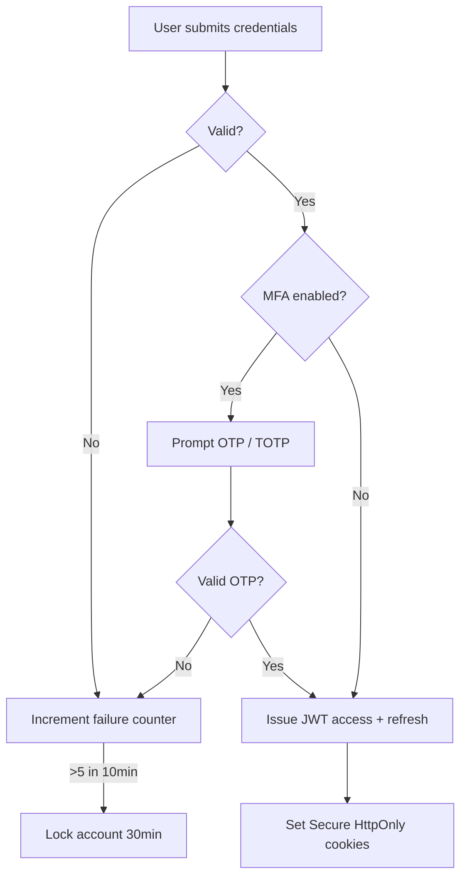

# Security Plan — Namasoft ERP

> **آخر تحديث:** 2026-05-10
> **Standards:** ISO 27001 (target), SOC 2 Type II (Phase 3), PDPL (KSA), OWASP Top 10

---

## 1. Threat Model (STRIDE)

| Category | Threat | Mitigation |
|----------|--------|------------|
| **Spoofing** | impersonate user | JWT + MFA on sensitive ops; session binding |
| **Tampering** | modify journal entry | append-only audit log; reversal entries only |
| **Repudiation** | deny user action | signed audit trail with userId + IP + timestamp |
| **Information disclosure** | cross-tenant leak | RLS Prisma extension + integration tests |
| **DoS** | flood APIs | Redis rate-limit + Cloudflare WAF |
| **Elevation of privilege** | tenant_admin → super_admin | role separation; super_admin behind separate domain |

---

## 2. Authentication



### Password Policy
- min 12 chars, must contain upper + lower + digit + symbol
- bcrypt cost factor 12
- breach-check via HaveIBeenPwned (planned)
- forced rotation: NOT enforced (per NIST SP 800-63B); rotate on suspicion

### MFA
- TOTP via [otplib](../../package.json) (Google Authenticator compatible)
- Backup codes (10 single-use) generated at enrollment
- Required for: payroll posting, period close, ZATCA cert upload, role assignment

---

## 3. Authorization (RBAC)

```
Permission = action + resource + scope
e.g., "sales:invoice:create" applies if user.role has it
```

- Roles defined per tenant (Phase 2: custom roles).
- Super-admin actions logged separately + Slack alert.
- Field-level RBAC: planned (e.g., hide `Employee.salary` from non-HR roles).

---

## 4. Data Protection

### At Rest
- Postgres TDE via Hetzner LUKS encryption.
- Backups: pg_dump → AES-256-GCM → Hetzner S3 (KSA region).
- Sensitive columns (`User.passwordHash`, `Employee.iqamaNumber`, payment cards): app-layer encryption (planned: AWS KMS / pgcrypto).

### In Transit
- TLS 1.3 only (Cloudflare + origin).
- HSTS preload (`max-age=31536000; includeSubDomains; preload`).
- mTLS for ZATCA + bank SFTP integrations.

### In Use
- Memory: avoid logging PII (Sentry `beforeSend` scrubber).
- LLM context: strip Iqama / salary before sending to Gemini (RAG layer).

---

## 5. Secrets Management

| Secret | Storage | Rotation |
|--------|---------|----------|
| `JWT_SECRET` | env var (Hetzner secrets) | quarterly |
| `DATABASE_URL` | env var | on team change |
| `ZATCA_PRIVATE_KEY` | encrypted DB column | yearly (cert renewal) |
| `GEMINI_API_KEY` | env var | quarterly |
| `STRIPE_SECRET` | env var | quarterly |
| OAuth client secrets | env var | quarterly |

> **NEVER commit secrets.** Pre-commit hook scans for known patterns ([.husky/](../../.husky/)).

---

## 6. OWASP Top 10 Coverage

| # | Risk | Status |
|---|------|--------|
| A01 — Broken Access Control | RBAC + RLS + tests | ✅ |
| A02 — Cryptographic Failures | TLS + bcrypt + KMS planned | 🟡 |
| A03 — Injection | Prisma parameterized; no raw SQL | ✅ |
| A04 — Insecure Design | threat-modeled features | 🟡 ongoing |
| A05 — Misconfiguration | Helmet headers + CSP planned | 🟡 |
| A06 — Vulnerable Components | `npm audit` weekly + Dependabot | ✅ |
| A07 — Auth Failures | JWT + MFA + lockout | ✅ |
| A08 — Data Integrity | signed webhooks; idempotency | ✅ |
| A09 — Logging & Monitoring | Sentry + structured logs | ✅ |
| A10 — SSRF | URL allowlist for outbound | 🟡 |

---

## 7. Headers Baseline

```
Content-Security-Policy: default-src 'self'; img-src 'self' data: https:; ...
Strict-Transport-Security: max-age=63072000; includeSubDomains; preload
X-Content-Type-Options: nosniff
X-Frame-Options: DENY
Referrer-Policy: strict-origin-when-cross-origin
Permissions-Policy: camera=(), microphone=(), geolocation=(self)
```

> Implement via Next.js middleware response headers (planned; today partial).

---

## 8. PDPL Compliance (Saudi Personal Data Protection Law)

| Requirement | Implementation |
|-------------|----------------|
| **Lawful basis** | terms-of-service consent recorded |
| **Purpose limitation** | data classifications + audit |
| **Right to access** | self-service export from profile |
| **Right to rectify** | profile edit |
| **Right to erasure** | tenant `purged` state hard-deletes |
| **Data residency** | KSA region only (Hetzner Riyadh / dammam) |
| **Breach notification** | 72h window — runbook in [incident-response.md](./incident-response.md) (TODO) |
| **DPO assignment** | required (organization role) |

---

## 9. Audit & Logging

- **Audit Log** (planned Phase 0): every write captures `(userId, tenantId, action, before, after, ip, ua, ts)`.
- **System Log**: Sentry + Prometheus + Loki (or Hetzner managed).
- **ZATCA Log**: every submission + response stored 7 years.
- **Access Log**: nginx + Cloudflare logs retained 90 days.

---

## 10. Vulnerability Management

| Source | Cadence |
|--------|---------|
| `npm audit` | every CI run + weekly cron |
| Dependabot | auto-PR for security updates |
| Snyk / OWASP ZAP | monthly scan |
| Penetration test | yearly (third-party) |
| Bug bounty | Phase 3 (HackerOne / Intigriti) |

---

## 11. Incident Response (سياسة الاستجابة)

```
Detect → Triage → Contain → Eradicate → Recover → Post-mortem
   ↓         ↓         ↓          ↓           ↓          ↓
Sentry    P0/P1/P2  isolate   patch      restore     blameless
alert     classify  tenant    + tests    from        review
                              + audit    backup      → action items
```

- On-call rotation: PagerDuty (planned) or Telegram alert bot.
- P0 (data breach) → notify users + ZATCA + Saudi Data Authority within 72h.
- P1 (downtime) → status page update within 15min.

---

## 12. Security Testing

- Unit: auth bypass, RBAC, RLS leakage tests in [src/middleware/__tests__/tenant-isolation.test.ts](../../src/middleware/__tests__/tenant-isolation.test.ts)
- Integration: e2e auth flows in [e2e/](../../e2e/)
- Load: k6 scripts in [k6/](../../k6/)
- DAST: OWASP ZAP CI step (planned)

---

## 13. References

- [Multi-Tenant Architecture](../architecture/multi-tenant.md) — isolation guarantees
- [HARDENING.md](../../HARDENING.md) — historical hardening notes
- [Deployment Plan](../deployment/deployment-plan.md) — infra security
