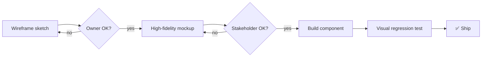

# Wireframes & Mockups — Namasoft ERP

> **آخر تحديث:** 2026-05-10
> **Tools:** Stitch (`.stitch/`) + Excalidraw + Figma (recommended)

---

## 1. هيكل المخططات

كل ميزة (feature) يجب أن تكون لها:
1. **Sketch / Wireframe** (low-fidelity) — لاتخاذ القرار
2. **Mockup** (high-fidelity) — للموافقة قبل الكود
3. **Component map** — أي components من shadcn/ui ستُستخدم

---

## 2. Top-Level Pages (text wireframes)

### 2.1 Dashboard (الرئيسية)

```
┌──────────────────────────────────────────────────────────┐
│ Logo  │ Search [        ]  │   🔔  │  AR/EN  │  User ▾  │
├───────┴────────────────────┴───────┴─────────┴──────────┤
│  ▦ Dashboard                                             │
│  ▤ Sales         ┌──────────┬──────────┬──────────┐     │
│  ▥ Purchases     │ KPI: Rev │ KPI: P&L │ KPI: AR  │     │
│  ◇ Inventory     │  150K SAR│  +12%    │  18 days │     │
│  ◈ Manuf.        └──────────┴──────────┴──────────┘     │
│  ◯ HR/Payroll    ┌─────────────────────────────────┐    │
│  $ Accounting    │ Sales last 30 days  [chart]     │    │
│  ⚙ Settings      └─────────────────────────────────┘    │
│                  ┌────────────────┬───────────────┐      │
│                  │ Top customers  │ Aged AR       │      │
│                  └────────────────┴───────────────┘      │
└──────────────────────────────────────────────────────────┘
```

### 2.2 Sales Invoice — Create / Edit

```
┌──────────────────────────────────────────────────────────┐
│ ← Back to invoices            Status: DRAFT              │
├──────────────────────────────────────────────────────────┤
│ ┌─ Customer ──────────┐  ┌─ Dates ───────────────────┐  │
│ │ [Select customer ▾] │  │ Issue: 2026-05-10         │  │
│ │ + New customer      │  │ Due: 2026-06-09 (Net 30)  │  │
│ └─────────────────────┘  └───────────────────────────┘  │
│                                                          │
│ ┌─ Lines ─────────────────────────────────────────────┐ │
│ │ # │ Item       │ Qty │ Price │ VAT │ Total          │ │
│ │ 1 │ [Item ▾]   │ [2] │ [500] │ 15% │ 1,150 SAR      │ │
│ │ 2 │ [Item ▾]   │ [1] │ [200] │ 15% │   230 SAR      │ │
│ │ + Add line                                          │ │
│ └─────────────────────────────────────────────────────┘ │
│                                              ┌────────┐ │
│                              Subtotal:       │1,200.00│ │
│                              VAT (15%):      │  180.00│ │
│                              Total:          │1,380.00│ │
│                                              └────────┘ │
│ Notes: [_____________________________]                   │
│                                                          │
│ [Save Draft]   [Save & Post]   [Cancel]                  │
└──────────────────────────────────────────────────────────┘
```

### 2.3 POS — Cashier Screen (touch-first)

```
┌─────────────────────────────────────────────────────────────┐
│ Cashier: علي     │ Session: #4521 │ 12:42 PM │ [Close]    │
├──────────────────┴────────────────┴──────────┴─────────────┤
│ ┌─ Categories ─┐  ┌─ Cart ─────────────────┐  ┌─ Total ──┐│
│ │ ◉ Food        │  │ Rice Bag      ×2  20.00│  │           ││
│ │ ◯ Drinks      │  │ Cola Can      ×4  12.00│  │  46.00 SAR││
│ │ ◯ Snacks      │  │ Chips         ×3  14.00│  │           ││
│ │ ◯ Other       │  └────────────────────────┘  │ VAT 6.00  ││
│ └───────────────┘  ┌────────────────────────┐  │ ─────────││
│ ┌─ Items ──────┐  │ Discount: 0.00          │  │  52.00   ││
│ │ [Rice]       │  └────────────────────────┘  └───────────┘│
│ │ [Cola]       │                                            │
│ │ [Chips]      │  ┌─ Pay ──────────────────────────────────┐│
│ │ [...]        │  │   [Cash]   [Card]   [Transfer]  [Mada] ││
│ └──────────────┘  └────────────────────────────────────────┘│
└─────────────────────────────────────────────────────────────┘
```

### 2.4 Period Close Wizard

```
┌──────────────────────────────────────────────────────────┐
│ Close Period: April 2026               Step 3 of 5       │
├──────────────────────────────────────────────────────────┤
│ ✅ Step 1: All draft invoices posted? (12/12)            │
│ ✅ Step 2: Bank reconciliations done? (3/3 banks)        │
│ ▶  Step 3: FX revaluation                                │
│      → 15 foreign-currency accounts to revalue           │
│      → [Run revaluation]                                 │
│ ⬜ Step 4: Adjusting JEs reviewed                        │
│ ⬜ Step 5: Lock period                                   │
│                                                          │
│ [Back]                                       [Continue]  │
└──────────────────────────────────────────────────────────┘
```

---

## 3. Wireframe Catalog (per module)

| Module | Wireframes | Status |
|--------|------------|--------|
| Auth (login, MFA, signup) | 4 | ✅ done |
| Dashboard | 1 | ✅ done |
| Sales (list, create, post, ZATCA status) | 6 | 🟡 partial |
| Purchases (RFQ, PR, PO, GRN, 3WM) | 8 | 🟡 partial |
| Inventory (item, stock, transfer, count) | 7 | 🟡 partial |
| Manufacturing (BOM, MO, backflush, QC) | 6 | 🟡 partial |
| HR (employee, leave, attendance) | 6 | 🟡 partial |
| Payroll (run, slip, GOSI, WPS) | 5 | 🟠 missing |
| Accounting (CoA, JE, period close, FX) | 8 | 🟡 partial |
| Treasury (banks, checks, recon) | 5 | 🟠 missing |
| Reports (P&L, BS, CF, AR aging) | 4 | ✅ done |
| Settings (users, roles, numbering) | 5 | 🟡 partial |
| POS | 4 | ✅ done |
| Mobile (employee self-service) | 6 | 🟠 missing |

> **Action:** complete the 🟠 wireframes within `/.stitch/` and link from this index.

---

## 4. Stitch Project Structure

```
.stitch/
  ├─ DESIGN.md                 ← design system (auto-generated)
  ├─ projects/
  │   ├─ sales-flow/
  │   ├─ pos-cashier/
  │   ├─ payroll-run/
  │   └─ ...
  └─ exports/
      ├─ figma/
      └─ react/                ← Stitch → React via skill
```

---

## 5. Mockup Approval Process



---

## 6. Templates Library

- Email templates: `src/templates/emails/*.tsx` (planned)
- Print invoice templates: `src/templates/print/invoice-{ar,en,bilingual}.tsx`
- Receipt thermal templates: `src/templates/print/receipt-58mm.tsx`, `receipt-80mm.tsx`
- Report templates (PDF): `src/templates/pdf/*.tsx`

---

## 7. References

- [Style Guide](./style-guide.md)
- [.stitch/DESIGN.md](../../.stitch/DESIGN.md) (if generated)
- Skill `/stitch-design` — generate / edit Stitch screens
