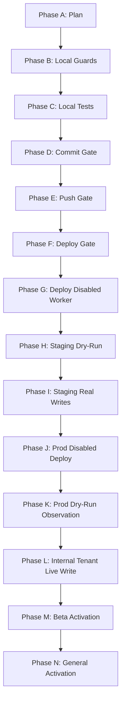
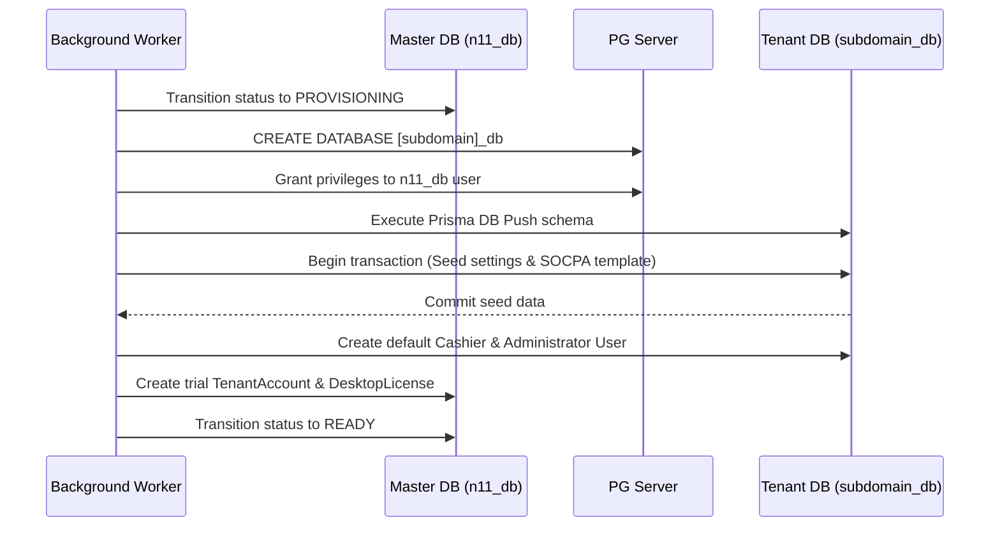

# Customer Onboarding Phase 4E — Real Worker Implementation Plan Report

## 1. Summary Dashboard

* **FINAL_STATUS:** `CUSTOMER_ONBOARDING_PHASE4E_REAL_WORKER_IMPLEMENTATION_PLAN_COMPLETED`
* **REPORT_PATH:** `tmp/customer-onboarding-phase4e-real-worker-implementation-plan-report.md`
* **MODE:** `PLAN_ONLY_NO_CODE`
* **CODE_CHANGED:** `NO_RUNTIME_CODE_CHANGE`
* **DB_CHANGED:** `NO`
* **SQL_EXECUTED:** `NO`
* **PRISMA_SCHEMA_CHANGED:** `NO`
* **MIGRATION_CREATED:** `NO`
* **DEPLOY:** `NO`
* **PRODUCTION_TOUCHED:** `NO`
* **WORKER_ACTIVE:** `NO`
* **QUEUE_ACTIVE:** `NO`
* **FEATURE_FLAG_CHANGED:** `NO`
* **REAL_WRITES:** `NO`
* **SECRET_HYGIENE:** `PASS`
* **NEXT_RECOMMENDED_APPROVAL:** `GO_FOR_CUSTOMER_ONBOARDING_PHASE4E_REAL_WORKER_LOCAL_GUARDS_IMPLEMENTATION_ONLY`

---

## 2. Current Baseline & Files Reviewed

### Git Baseline Info
* **Current Branch:** `main`
* **HEAD Commit:** `937c3f2f095aebab659d18325b8aefd79c866ebf` (feat(onboarding): add dry-run provisioning worker)
* **Origin/Main Commit:** `937c3f2f095aebab659d18325b8aefd79c866ebf`
* **Workspace Status:** Clean runtime codebase. Only temporary report document files are modified/created.

### Files Reviewed (Read-Only Mode)
* [src/lib/tenant/provisioning-worker.ts](file:///d:/namasoft9-3-main/src/lib/tenant/provisioning-worker.ts)
* [src/lib/tenant/provisioning-queue.ts](file:///d:/namasoft9-3-main/src/lib/tenant/provisioning-queue.ts)
* [src/lib/tenant/provisioning-job-types.ts](file:///d:/namasoft9-3-main/src/lib/tenant/provisioning-job-types.ts)
* [src/app/api/tenant/provision/route.ts](file:///d:/namasoft9-3-main/src/app/api/tenant/provision/route.ts)
* [src/app/api/tenant/provision/status/route.ts](file:///d:/namasoft9-3-main/src/app/api/tenant/provision/status/route.ts)
* [src/app/api/tenant/provision/retry/route.ts](file:///d:/namasoft9-3-main/src/app/api/tenant/provision/retry/route.ts)
* [src/lib/tenant/provisioning-guard.ts](file:///d:/namasoft9-3-main/src/lib/tenant/provisioning-guard.ts)
* [src/lib/tenant/reserved-subdomains.ts](file:///d:/namasoft9-3-main/src/lib/tenant/reserved-subdomains.ts)
* [prisma/schema.prisma](file:///d:/namasoft9-3-main/prisma/schema.prisma)
* [package.json](file:///d:/namasoft9-3-main/package.json)
* [deploy.js](file:///d:/namasoft9-3-main/deploy.js)

---

## 3. Implementation Phases

We divide the path to live activation into 14 progressive, gated steps to ensure maximum safety and prevent premature real writes:



### Phase 4E-A: Real Worker Implementation Plan Only
* **Objective:** Produce this design/implementation plan report, outlining all configurations, guards, and safety layers.
* **Scope:** No code changes allowed.

### Phase 4E-B: Local Real-Write Guards Implementation
* **Objective:** Write the logic for the real database execution and validation checks locally, keeping all feature flags disabled by default.
* **Scope:** Modify worker code to include SSH-less Prisma transactions, Redlock, and feature flag safety checks.

### Phase 4E-C: Local Tests
* **Objective:** Build unit and integration tests confirming that guards block live database commands when flags are off, and execute correctly when flags are explicitly enabled in test setups.
* **Scope:** Add test files in `tests/integration/customer-onboarding/`.

### Phase 4E-D: Commit Gate
* **Objective:** Perform a rigorous review of local changes, lint checks, type check rules (`npm run typecheck`), and secure a local Git commit.
* **Scope:** Local git branch state review.

### Phase 4E-E: Push Gate
* **Objective:** Verify matching HEAD and upstream origin. Secure remote push of code behind disabled flags.
* **Scope:** Git push to origin/main.

### Phase 4E-F: Deploy Gate
* **Objective:** Staging/Production build and smoke test assessment on staging prior to deployment sync.
* **Scope:** SSH connectivity and validation runs.

### Phase 4E-G: Deploy Disabled Worker Only
* **Objective:** Deploy worker runtime files with environment flags explicitly disabled (`CUSTOMER_ONBOARDING_WORKER_ENABLED=false`).
* **Scope:** Running `node deploy.js` for worker files only.

### Phase 4E-H: Staging Dry-Run Activation
* **Objective:** Activate the worker process on the staging server in simulation mode (`CUSTOMER_ONBOARDING_WORKER_DRY_RUN=true`).
* **Scope:** PM2 daemon monitoring and logging validation.

### Phase 4E-I: Staging Limited Real Writes
* **Objective:** Test database generation and setup scripts on the staging PostgreSQL instance.
* **Scope:** Verify staging database `${subdomain}_db` creation.

### Phase 4E-J: Production Disabled Deploy
* **Objective:** Deploy worker code files to production VPS with all live features turned off in environment configs.
* **Scope:** Production environment configuration audit.

### Phase 4E-K: Production Dry-Run Observation
* **Objective:** Turn on worker in dry-run mode on production to verify BullMQ queue connectivity and CPU behaviors under load without writing to databases.
* **Scope:** Production PM2 logging.

### Phase 4E-L: Internal Test Tenant Real Write
* **Objective:** Activate real writes strictly for specific, pre-configured internal test subdomains on production.
* **Scope:** Restricting active writes using subdomain string comparisons in the guard.

### Phase 4E-M: Beta Activation
* **Objective:** Permit onboarding for a controlled set of 5 external customers under direct developer supervision.
* **Scope:** Live onboarding monitoring.

### Phase 4E-N: General Activation Gate
* **Objective:** Fully deprecate legacy synchronous provisioning logic, routing all onboarding signups through the background worker pipeline.
* **Scope:** Default production activation.

---

## 4. Implementation Scope Plan

The following files are candidate targets for modification in upcoming execution phases:

### `src/lib/tenant/provisioning-worker.ts`
* **Updates:** 
  - Integrate real database execution methods replacing the mock `executeStepDryRun`.
  - Add logic to connect to PostgreSQL admin and run schema creation commands.
  - Implement SSH-less seeding inside PostgreSQL via local PrismaClient context.
  - Incorporate the BullMQ background consumer thread.

### `src/lib/tenant/provisioning-queue.ts`
* **Updates:**
  - Define the `BullMQProvisioningQueueAdapter` which interfaces with the Redis server.
  - Implement jobs queuing via `bullmq` FlowProducer / Queue structures.

### `src/lib/tenant/provisioning-job-types.ts`
* **Updates:**
  - Standardize error detail shapes, error metadata JSON structures, and tracking payload schemas.

### `src/app/api/tenant/provision/route.ts`
* **Updates:**
  - Replace current SSH-based execution with BullMQ queuing commands if queue flag is enabled.

### `src/app/api/tenant/provision/status/route.ts`
* **Updates:**
  - Query status directly from the BullMQ queue state registry before checking the master database.

### `src/app/api/tenant/provision/retry/route.ts`
* **Updates:**
  - Permit super-administrators to re-queue failed database runs back into BullMQ.

### Future Admin Dashboard Pages & APIs
* **New Files:** `src/app/admin/onboarding/page.tsx`, `src/app/api/admin/onboarding/retry/route.ts`

---

## 5. Feature Flag Implementation Plan

To guarantee system stability, environment configurations must be strictly partitioned. Every environment flag must default to a production-safe state:

| Feature Flag | Type | Default (Prod-Safe) | Purpose |
| :--- | :--- | :--- | :--- |
| `CUSTOMER_ONBOARDING_QUEUE_ENABLED` | Boolean | `false` | Routes incoming HTTP requests to BullMQ instead of the synchronous legacy system. |
| `CUSTOMER_ONBOARDING_WORKER_ENABLED` | Boolean | `false` | Initiates the PM2 background worker listening thread. |
| `CUSTOMER_ONBOARDING_WORKER_DRY_RUN` | Boolean | `true` | Forces the worker process to mock commands instead of writing to databases. |
| `CUSTOMER_ONBOARDING_PROVISIONING_REAL_WRITES_ENABLED` | Boolean | `false` | Authorizes the execution of physical `CREATE DATABASE` and prisma seed commands. |
| `CUSTOMER_ONBOARDING_WORKER_ALLOWED_ENV` | String | `"development"` | Enforces validation checks restricting worker runtimes to permitted environments. |
| `CUSTOMER_ONBOARDING_WORKER_MAX_CONCURRENCY` | Integer | `1` | Restricts parallel job processing count to protect CPU and IO resources. |

---

## 6. Real Write Guard Plan

A central security middleware, `verifyRealWritePermission()`, will validate every transaction. Operations will throw a hard error and transition to `FAILED` unless:

1. **System Permission Configuration:**
   * `CUSTOMER_ONBOARDING_PROVISIONING_REAL_WRITES_ENABLED === true`
   * `CUSTOMER_ONBOARDING_WORKER_DRY_RUN === false`
2. **Environment Conformity Check:**
   * Node process environment must match `CUSTOMER_ONBOARDING_WORKER_ALLOWED_ENV` (e.g. production, staging).
3. **Execution Context Identification:**
   * The `provisioningRunId` must exist and be registered in the master `TenantProvisioningRun` database table.
4. **Collision and Sanitization Checks:**
   * Subdomain format must pass standard criteria (e.g., alphanumeric, 3-20 chars).
   * Subdomain must not be in the operational reserved keywords set (`RESERVED_SUBDOMAINS`).
   * PostgreSQL database name `${subdomain}_db` must not already exist in the database server metadata.
5. **Session and Entity Integrity:**
   * Subdomain and userEmail must not be registered in the master `TenantAccount` registry.
6. **Financial Protection Guard:**
   * Under no circumstances can the worker execute write commands targeting accounting entries or posting transactions in a tenant's database context. Seeding is strictly restricted to template metadata (Chart of Accounts skeleton).
7. **Secret Sanitization:**
   * All logging procedures must strip out password hashes, SSO secrets, and database access tokens before writing messages.

---

## 7. DB Transaction Plan

Live setups will be performed inside isolated database transaction boundaries:



1. **Master DB Updates:** Log progression states inside `TenantProvisioningRun`. Update attempt counters.
2. **Database Provisioning:** Establish the database client connection context. Execute safe native PostgreSQL connection creation commands.
3. **Tenant Schema Application:** Issue `npx prisma db push` commands with scoped database URLs (`DATABASE_URL="${base_url}/${subdomain}_db"`).
4. **Isolated Seeding Transaction:** Seed template data within a single transaction scope on the newly generated tenant database.
5. **User Context Generation:** Write default roles and Admin users. Passwords must be hashed using `bcryptjs` beforehand.
6. **Registration Log:** Set the tenant's master registration record `TenantAccount` to `active`. Create corresponding default license keys in `DesktopLicense`.

---

## 8. Idempotency Plan

To avoid race conditions and double provisioning:

* **Redis Lock (Redlock):** A distributed lock is acquired on keys `lock:provision:runId` and `lock:provision:subdomain` at worker startup, with a strict 10-minute timeout.
* **Deterministic Job Identifiers:** The `provisioningRunId` acts as the unique BullMQ job name, ensuring duplicate messages are ignored.
* **Run ID Continuity:** All generated assets (Tenant Database, Owner ID, and License Key) are linked directly to `provisioningRunId`.
* **State Check Recovery:** If a step fails, the worker examines `TenantProvisioningRun.currentStep` to resume from the last failed checkpoint instead of restarting database creation.

---

## 9. Failure Handling Plan

We design specific handlers for each point of failure:

* **Validation Failure:** Update status to `FAILED`. Do not queue. Mark `lastErrorCode = 'INVALID_INPUT'`.
* **Subdomain Conflict:** Update status to `FAILED`. Prevent automated retries to avoid loops.
* **Database Setup Failure:** Transition to `FAILED`. Increment attempt counter. If attempts > 3, transition status to `NEEDS_MANUAL_REVIEW`.
* **Seed Failure:** Log errors, keep database shell intact, set status to `FAILED` for administrator investigation.
* **Owner Creation Failure:** Stop flow, log security warnings, set state to `FAILED`.
* **Health Check Failure:** Attempt minor retry loop. If health response remains offline, mark state as `FAILED`.
* **Retry Exhaustion:** Auto-escalate status to `NEEDS_MANUAL_REVIEW`. Send notification events.

---

## 10. Compensation Plan

To maintain auditing integrity and prevent database corruption:

* **No Automatic Drops:** The system will **never** automatically execute `DROP DATABASE` command on failure. This ensures logs and database states remain available for debugging.
* **Orphan Status Management:** When a job fails, the subdomain lock is retained for 30 minutes, after which it is released only if the tenant account is marked as `failed` or `cancelled`.
* **Manual Cleanup Interface:** Super-administrators can execute a manual "Force Cancel" command via the admin dashboard, which explicitly runs the cleanup script:
  * `DROP DATABASE IF EXISTS <subdomain>_db`
  * Deletes `TenantAccount` and matching `DesktopLicense` records.
  * Updates `TenantProvisioningRun` status to `CANCELLED`.

---

## 11. Testing Plan

Tests will be created locally under `tests/integration/customer-onboarding/` using mock database interfaces:

1. **Default Deny Check:** Test that running the worker without variables throws `REAL_PROVISIONING_WORKER_DISABLED`.
2. **Flag Dependency Verification:** Confirm that if `CUSTOMER_ONBOARDING_PROVISIONING_REAL_WRITES_ENABLED` is false, database connection contexts do not execute writes.
3. **Dry-Run Safety Test:** Validate that dry-run returns the complete timeline without generating database tables.
4. **Idempotency Duplicate Rejection:** Verify that queueing identical `runId` or `subdomain` returns `PROVISIONING_IN_PROGRESS`.
5. **Reserved Subdomain Rejection:** Confirm that trying to register `admin` or `portal` is rejected with `RESERVED_SUBDOMAIN`.
6. **Failed Step Transitions:** Assert status progresses correctly through validation, database setup, seeding, and activation.
7. **Secret Hygiene Verification:** Review test runs logs to verify password parameters are not stored in telemetry.

---

## 12. Deploy Plan

The deployment pipeline is designed around a multi-gate sync policy:

```
[Local Code Check] ──> [Git Commit Check] ──> [Staging Run (FF=off)] 
                                                      │
[Beta Activation] <── [Prod Run (Dry-Run)] <── [Prod Deploy (FF=off)]
```

1. **Local Validation:** Run typecheck, linting, and vitest runs locally.
2. **Git Baseline Verification:** Assure local changes are fully committed and matching remote repository state.
3. **Staging Deploy:** Deploy files to staging VPS. Set flags to dry-run first. Perform live staging runs.
4. **Production Deploy (FF=Off):** Use `node deploy.js --files-only` to deploy files, ensuring `CUSTOMER_ONBOARDING_WORKER_ENABLED=false`.
5. **Production Dry-Run:** Set `CUSTOMER_ONBOARDING_WORKER_ENABLED=true` but keep `CUSTOMER_ONBOARDING_WORKER_DRY_RUN=true`.
6. **Controlled Live Write:** Verify execution with a single test subdomain, then proceed to Beta customer activation.

---

## 13. Rollback & Kill Switch Plan

In case of a production issue (e.g. server latency, database lock escalation):

* **Environment Variable Override:** Change environment configs to `CUSTOMER_ONBOARDING_WORKER_ENABLED=false` or `CUSTOMER_ONBOARDING_PROVISIONING_REAL_WRITES_ENABLED=false`.
* **Daemon Process Termination:** Execute `pm2 stop provisioning-worker` on the server immediately.
* **Queue Pause Command:** Send command to BullMQ to pause job processing.
* **Manual Audit Execution:** Review the status database. Clean up any stuck database registrations manually using the super-administrator control panel.
* **No Destructive Rollover:** The system will never drop databases automatically during rollback.

---

## 14. Monitoring Plan

A dashboard will visualize worker telemetry:

* **Queue Metrics:** Monitor BullMQ active, pending, completed, and failed job lengths.
* **Worker Status:** Heartbeat signals indicating worker daemon health.
* **Process Speeds:** Average execution durations logged per step (e.g. database creation vs seeding times).
* **Alert Triggers:** Notifications sent when a run status transitions to `NEEDS_MANUAL_REVIEW` or is stuck in `PROVISIONING` for longer than 10 minutes.

---

## 15. Admin Dashboard Plan

The onboarding interface inside the ICE administration panel will present:

* **Onboarding Runs Log:** A paginated table showing `runId`, `subdomain`, `email`, `status`, and `createdAt`.
* **Timeline Detailed Inspector:** Renders every step's status (`PENDING`, `COMPLETED`, `FAILED`) and execution durations.
* **Action Controls:**
  * **Retry Button:** Permits admins to re-enqueue a failed job.
  * **Cancel & Cleanup Button:** Executes database dropping commands and frees reservation tags.
* **Health Panel:** Visualizes active background worker health metrics.

---

## 16. Security Review

* **Path and Input Sanitization:** Subdomains are sanitized to lowercase alphanumeric strings.
* **Query Scoping:** Status APIs resolve query requests using validated payload bodies rather than query strings.
* **Privileged Gateways:** Administration actions (retry/cleanup) require Clerk-authenticated master admin credentials.
* **Error Sanitization:** Error logs output structural indicators rather than full SQL dumps or path listings.

---

## 17. Secret Hygiene Review

* **Verification:** `PASS`
* Config strings and command templates use placeholders (e.g., `PGPASSWORD="[PASSWORD]"`).
* No developer tokens, credentials, or private keys are exposed in report structures.
