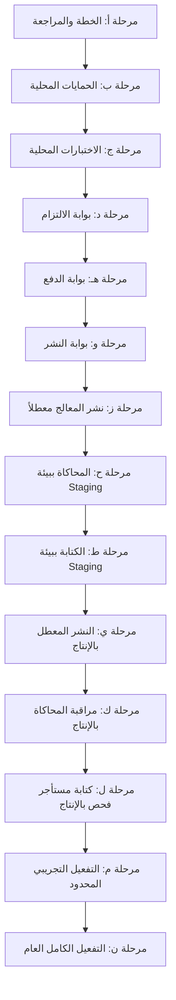
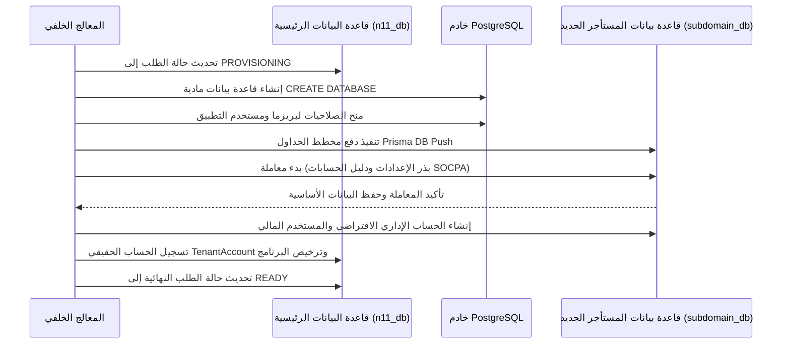

# خطة تنفيذ المعالج الحقيقي لتهيئة العملاء (المرحلة 4E)

## 1. لوحة معلومات الملخص (Summary Dashboard)

* **FINAL_STATUS:** `CUSTOMER_ONBOARDING_PHASE4E_REAL_WORKER_IMPLEMENTATION_PLAN_COMPLETED`
* **REPORT_PATH:** `tmp/customer-onboarding-phase4e-real-worker-implementation-plan-report.md`
* **MODE:** `PLAN_ONLY_NO_CODE` (خطة فقط دون تعديل كود)
* **CODE_CHANGED:** `NO_RUNTIME_CODE_CHANGE` (لا يوجد تعديل على الكود التنفيذي)
* **DB_CHANGED:** `NO` (لا يوجد تغيير في قاعدة البيانات)
* **SQL_EXECUTED:** `NO` (لم يتم تشغيل أي SQL)
* **PRISMA_SCHEMA_CHANGED:** `NO` (لم يتغير مخطط بريزما)
* **MIGRATION_CREATED:** `NO` (لم يتم إنشاء أي هجرة)
* **DEPLOY:** `NO` (لا يوجد نشر)
* **PRODUCTION_TOUCHED:** `NO` (لم يتم لمس بيئة الإنتاج)
* **WORKER_ACTIVE:** `NO` (المعالج معطل)
* **QUEUE_ACTIVE:** `NO` (الطابور معطل)
* **FEATURE_FLAG_CHANGED:** `NO` (أعلام الميزات لم تتغير)
* **REAL_WRITES:** `NO` (لا توجد كتابة حقيقية)
* **SECRET_HYGIENE:** `PASS` (نظافة الأسرار والبيانات السرية سليمة)
* **NEXT_RECOMMENDED_APPROVAL:** `GO_FOR_CUSTOMER_ONBOARDING_PHASE4E_REAL_WORKER_LOCAL_GUARDS_IMPLEMENTATION_ONLY`

---

## 2. الأساس الحالي والملفات التي تمت مراجعتها (Current Baseline & Files Reviewed)

### معلومات أساس Git
* **الفرع الحالي:** `main`
* **التزام HEAD:** `937c3f2f095aebab659d18325b8aefd79c866ebf` (feat(onboarding): add dry-run provisioning worker)
* **التزام Origin/Main:** `937c3f2f095aebab659d18325b8aefd79c866ebf`
* **حالة مساحة العمل:** نظيفة تماماً. تم تعديل وإنشاء ملفات التقارير التوثيقية المؤقتة فقط.

### الملفات التي تمت مراجعتها (وضع القراءة فقط)
* [src/lib/tenant/provisioning-worker.ts](file:///d:/namasoft9-3-main/src/lib/tenant/provisioning-worker.ts)
* [src/lib/tenant/provisioning-queue.ts](file:///d:/namasoft9-3-main/src/lib/tenant/provisioning-queue.ts)
* [src/lib/tenant/provisioning-job-types.ts](file:///d:/namasoft9-3-main/src/lib/tenant/provisioning-job-types.ts)
* [src/app/api/tenant/provision/route.ts](file:///d:/namasoft9-3-main/src/app/api/tenant/provision/route.ts)
* [src/app/api/tenant/provision/status/route.ts](file:///d:/namasoft9-3-main/src/app/api/tenant/provision/status/route.ts)
* [src/app/api/tenant/provision/retry/route.ts](file:///d:/namasoft9-3-main/src/app/api/tenant/provision/retry/route.ts)
* [src/lib/tenant/provisioning-guard.ts](file:///d:/namasoft9-3-main/src/lib/tenant/provisioning-guard.ts)
* [src/lib/tenant/reserved-subdomains.ts](file:///d:/namasoft9-3-main/src/lib/tenant/reserved-subdomains.ts)
* [prisma/schema.prisma](file:///d:/namasoft9-3-main/prisma/schema.prisma)
* [package.json](file:///d:/namasoft9-3-main/package.json)
* [deploy.js](file:///d:/namasoft9-3-main/deploy.js)

---

## 3. مراحل التنفيذ التدريجي (Implementation Phases)

قمنا بتقسيم مسار التفعيل الحقيقي إلى 14 خطوة تدريجية ومحمية ببوابات أمان لضمان السلامة القصوى ومنع أي عمليات كتابة غير مصرح بها:

### المرحلة 4E-A: خطة تنفيذ المعالج الحقيقي فقط
* **الهدف:** إنتاج تقرير التصميم وخطة التنفيذ الحالية لتحديد كافة الإعدادات والضوابط الأمنية.
* **النطاق:** لا يُسمح بتعديل الكود.

### المرحلة 4E-B: تنفيذ حمايات الكتابة الحقيقية محلياً
* **الهدف:** كتابة منطق التحقق والتحقق من قاعدة البيانات محلياً مع إبقاء أعلام التفعيل معطلة افتراضياً.
* **النطاق:** تعديل كود المعالج لتشمل الفحص الآمن للمستأجرين وأوامر الحماية.

### المرحلة 4E-C: الاختبارات المحلية
* **الهدف:** بناء اختبارات وحدة وتكامل تؤكد حظر الأوامر عند تعطيل الأعلام، وتسمح بالمرور عند تفعيلها بشكل صريح في بيئة الاختبار.
* **النطاق:** إضافة ملفات الاختبار في المجلد `tests/integration/customer-onboarding/`.

### المرحلة 4E-D: بوابة الالتزام (Commit Gate)
* **الهدف:** إجراء مراجعة دقيقة للتغييرات المحلية والتحقق من الأنواع ولنت الكود عبر `npm run typecheck` والالتزام محلياً بـ Git.
* **النطاق:** مراجعة حالة الالتزام المحلي للفرع.

### المرحلة 4E-E: بوابة الدفع (Push Gate)
* **الهدف:** التحقق من تطابق HEAD والفرع البعيد ودفع الكود بأمان خلف أعلام معطلة.
* **النطاق:** دفع الكود إلى `origin/main`.

### المرحلة 4E-F: بوابة النشر (Deploy Gate)
* **الهدف:** تقييم عملية البناء في خادم التجربة والتأكد من نجاح الفحوصات الأولية.
* **النطاق:** فحص الاتصال وقدرات التشغيل.

### المرحلة 4E-G: نشر المعالج في وضع التعطيل
* **الهدف:** نشر ملفات المعالج مع ضبط المتغير البيئي صراحة على التعطيل `CUSTOMER_ONBOARDING_WORKER_ENABLED=false`.
* **النطاق:** تشغيل `node deploy.js` لمزامنة كود المعالج فقط.

### المرحلة 4E-H: تفعيل معالج المحاكاة في بيئة Staging
* **الهدف:** تشغيل المعالج الخلفي في بيئة التجربة (Staging) مع إبقائه في وضع المحاكاة الصامتة `CUSTOMER_ONBOARDING_WORKER_DRY_RUN=true`.
* **النطاق:** مراقبة عمليات PM2 وسجلات الأخطاء.

### المرحلة 4E-I: تفعيل الكتابة المحدودة في بيئة Staging
* **الهدف:** اختبار إنشاء قاعدة البيانات ورفع المخطط الفعلي على قاعدة بيانات خادم التجربة Staging PostgreSQL.
* **النطاق:** التحقق من تفعيل الهيكل البرمجي ونقل قاعدة البيانات `${subdomain}_db`.

### المرحلة 4E-J: النشر المعطل ببيئة الإنتاج
* **الهدف:** نشر ملفات الكود للإنتاج مع إبقاء كافة الميزات المتصلة بالمعالج معطلة في الإعدادات البيئية للموقع الفعلي.
* **النطاق:** مراجعة وتدقيق تكوين ملف البيئة للإنتاج.

### المرحلة 4E-K: مراقبة معالج المحاكاة بالإنتاج
* **الهدف:** تفعيل المعالج بوضع المحاكاة (Dry-Run) بالإنتاج للتحقق من الاتصال بـ Redis وثبات استهلاك CPU.
* **النطاق:** متابعة سجلات ومؤشرات خادم الإنتاج PM2.

### المرحلة 4E-L: كتابة مستأجر فحص حقيقي بالإنتاج
* **الهدف:** تمكين الكتابة الفعلية فقط وحصرياً لنطاق فرعي محدد سلفاً لأغراض الفحص والاختبار (مثل `test-company`).
* **النطاق:** تقييد الأعلام وتطبيق مقارنات النصوص في محرك التحقق.

### المرحلة 4E-M: التفعيل التجريبي المحدود (Beta)
* **الهدف:** السماح بالتهيئة التلقائية لخمسة عملاء من المسجلين بالنسخة التجريبية تحت الإشراف المباشر للفريق البرمجي.
* **النطاق:** مراقبة العمليات الحية وتحليل الأداء.

### المرحلة 4E-N: بوابة التفعيل العام والكامل
* **الهدف:** الاستغناء النهائي عن المسار المتزامن القديم، وإدارة كافة طلبات التهيئة عبر المعالج الخلفي وطابور BullMQ بصورة دائمة.
* **النطاق:** التفعيل العمومي الافتراضي.

---

## 4. نطاق التعديلات البرمجية المقترحة (Implementation Scope Plan)

الملفات التالية مرشحة للتعديل خلال خطوات التنفيذ القادمة:

### `src/lib/tenant/provisioning-worker.ts`
* **التحديثات:**
  - دمج عمليات التنفيذ الفعلي لقاعدة البيانات بدلاً من الدالة الوهمية `executeStepDryRun`.
  - إضافة منطق الاتصال بمدير PostgreSQL وإنشاء قواعد البيانات برمجياً.
  - تطبيق التأسيس الداخلي دون الحاجة لاتصالات SSH باستخدام عميل Prisma المحلي.

### `src/lib/tenant/provisioning-queue.ts`
* **التحديثات:**
  - تعريف فئة `BullMQProvisioningQueueAdapter` للتواصل المباشر مع Redis.
  - دعم إدارة الوظائف باستخدام بنية BullMQ (FlowProducer / Queue).

### `src/lib/tenant/provisioning-job-types.ts`
* **التحديثات:**
  - توحيد أشكال تفاصيل الأخطاء وهياكل البيانات التتبعية JSON.

### `src/app/api/tenant/provision/route.ts`
* **التحديثات:**
  - استبدال المسار القديم القائم على SSH بطلب طابور BullMQ في حال تفعيل أعلام الميزة.

### `src/app/api/tenant/provision/status/route.ts`
* **التحديثات:**
  - قراءة حالة العملية مباشرة من سجل طابور BullMQ قبل الانتقال لفحص قاعدة البيانات الأساسية.

### `src/app/api/tenant/provision/retry/route.ts`
* **التحديثات:**
  - السماح لمدير النظام الفائق بإعادة توجيه الوظائف الفاشلة إلى الطابور.

---

## 5. خطة تفعيل أعلام الميزات وتكوين البيئة (Feature Flags)

لضمان سلامة واستقرار النظام، تم تصميم أعلام الميزات لتعود افتراضياً للوضع الآمن (مغلق) في حال غياب التكوين البيئي:

| علم الميزة (Feature Flag) | النوع | الوضع الافتراضي الآمن | الغرض والأثر |
| :--- | :--- | :--- | :--- |
| `CUSTOMER_ONBOARDING_QUEUE_ENABLED` | Boolean | `false` | توجيه طلبات التهيئة القادمة عبر طابور BullMQ بدلاً من المسار القديم. |
| `CUSTOMER_ONBOARDING_WORKER_ENABLED` | Boolean | `false` | تشغيل خيط الاستماع الخلفي للمعالج عبر PM2. |
| `CUSTOMER_ONBOARDING_WORKER_DRY_RUN` | Boolean | `true` | إجبار المعالج على تنفيذ خطوات محاكاة صورية دون كتابة فعلية. |
| `CUSTOMER_ONBOARDING_PROVISIONING_REAL_WRITES_ENABLED` | Boolean | `false` | السماح بالتنفيذ المادي لأوامر `CREATE DATABASE` وبذر مخطط بريزما. |
| `CUSTOMER_ONBOARDING_WORKER_ALLOWED_ENV` | String | `"development"` | حظر تشغيل المعالج إلا في بيئات عمل مطابقة تماماً للقيمة المسجلة. |
| `CUSTOMER_ONBOARDING_WORKER_MAX_CONCURRENCY` | Integer | `1` | تحديد عدد العمليات المتوازية لحماية معالج السيرفر من الارتفاع المفاجئ. |

---

## 6. تصميم حواجز الأمان لمنع التعديل العشوائي (Real Write Guard Plan)

ستقوم دالة الحماية المركزية `verifyRealWritePermission()` بالتحقق من كل عملية وتمنعها تماماً في حال غياب المعايير التالية:

1. **إعدادات الصلاحيات:**
   * `CUSTOMER_ONBOARDING_PROVISIONING_REAL_WRITES_ENABLED === true`
   * `CUSTOMER_ONBOARDING_WORKER_DRY_RUN === false`
2. **مطابقة البيئة التشغيلية:**
   * يجب أن تطابق بيئة التشغيل لـ Node القيمة المسجلة في `CUSTOMER_ONBOARDING_WORKER_ALLOWED_ENV`.
3. **التحقق من سياق الطلب:**
   * يجب أن يكون المعرف الفرعي للعملية `provisioningRunId` مسجلاً بالفعل في جدول `TenantProvisioningRun` بقاعدة البيانات الرئيسية.
4. **فحوصات التداخل والتطهير:**
   * تطابق اسم النطاق الفرعي مع شروط الهيكل البرمجي (نصوص وأرقام فقط، بطول 3 إلى 20 حرفاً).
   * التحقق من عدم تطابق الاسم مع الكلمات المحجوزة للنظام `RESERVED_SUBDOMAINS`.
   * عدم وجود قاعدة بيانات نشطة تحمل نفس الاسم `${subdomain}_db` في محرك PostgreSQL.
5. **سلامة بيانات المستأجر والبريد الإلكتروني:**
   * عدم تسجيل البريد أو النطاق مسبقاً في جدول الحسابات الفعلي `TenantAccount`.
6. **حماية النطاق المحاسبي المالي:**
   * يُحظر تماماً على معالج التهيئة كتابة أي قيود يومية، أو ترحيل حسابات مالية في قاعدة بيانات المستأجر. يتم اقتصار التهيئة على البنية الهيكلية لجدول الحسابات (SOCPA CoA) فقط كقالب استرشادي.
7. **سلامة وأمن الأسرار:**
   * تصفية كلمات المرور، ورموز الربط، والشهادات الرقمية من سجلات المخرجات لتجنب تسريبها.

---

## 7. تصميم التأسيس داخل معاملات معزولة (DB Transaction Plan)

يتم تنفيذ خطوات كتابة البيانات لتهيئة المستأجر الجديد داخل حدود معاملات قاعدة بيانات معزولة ومحمية:

1. **تحديث السجل الرئيسي:** تدوين مراحل التطور داخل جدول `TenantProvisioningRun`.
2. **إنشاء قاعدة البيانات:** إنشاء الاتصال الإداري وتشغيل أوامر التأسيس المادية على خادم PostgreSQL.
3. **تطبيق مخطط بريزما:** تشغيل أوامر `npx prisma db push` مع توجيه الرابط لقاعدة البيانات المنشأة حديثاً.
4. **البذر المعزول:** ملء جداول المستأجر بالقيم التأسيسية والإعدادات الافتراضية داخل إطار معاملة موحدة (Transaction).
5. **إنشاء المستخدم الإداري:** إضافة المستخدم الأساسي للنظام بعد تشفير كلمة المرور الخاصة به مسبقاً بخوارزمية `bcryptjs`.
6. **سجل الترخيص المالي:** تنشيط ترخيص المستأجر `DesktopLicense` وتحديث حالته لـ `active` في قاعدة البيانات الرئيسية.

---

## 8. تصميم معالجة العمليات المكررة وتفادي السباق (Idempotency Plan)

لمنع حدوث عمليات تهيئة مزدوجة أو تداخل في الموارد:
* **الأقفال الموزعة لـ Redis:** قفل حصري عبر مفاتيح `lock:provision:runId` و `lock:provision:subdomain` بمهلة صلاحية 10 دقائق كحد أقصى.
* **معرفات الوظيفة الفريدة:** يُستخدم معرف الطلب `runId` كاسم لوظيفة BullMQ لمنع تكرار معالجة نفس الرسالة في حال تكرارها.
* **متابعة خطوة الإخفاق:** عند تعثر خطوة معينة، يقرأ المعالج قيمة `TenantProvisioningRun.currentStep` ليستأنف العمل من نقطة التوقف بدلاً من إعادة محاولة التأسيس بالكامل من البداية.

---

## 9. خطة معالجة الأخطاء والإخفاق (Failure Handling Plan)

تم وضع معالجات أخطاء محددة لكل مرحلة:
* **فشل التحقق:** تحويل الحالة إلى `FAILED` وكتابة رمز الخطأ `INVALID_INPUT` دون المحاولة مجدداً.
* **تداخل النطاقات:** الإيقاف الفوري وتحويل الحالة لـ `FAILED` لمنع حدوث حلقات إعادة تشغيل تلقائية غير ضرورية.
* **فشل إنشاء قاعدة البيانات:** تحويل الحالة لـ `FAILED` وزيادة عدد المحاولات بمقدار 1. وفي حال تجاوز 3 محاولات، تتحول الحالة تلقائياً لـ `NEEDS_MANUAL_REVIEW`.
* **فشل التأسيس الداخلي:** تسجيل تفاصيل الخطأ بأمان وإبقاء هيكل قاعدة البيانات متاحاً للمراجعة من قبل المطورين.
* **تجاوز مهلة المحاولات:** التصعيد التلقائي للحالة إلى `NEEDS_MANUAL_REVIEW` لإرسال تنبيه برمجي فوري.

---

## 10. خطة الإجراءات التعويضية والتنظيف (Compensation Plan)

لضمان الاحتفاظ بسجلات التدقيق وحماية البيانات:
* **منع الحذف التلقائي لقواعد البيانات:** لن يقوم المعالج الخلفي تلقائياً بتدمير أو حذف قواعد البيانات التي تفشل أثناء التهيئة. هذا يتيح للمطورين فرصة تحليل البنية وتحديد مكمن الخلل الفني.
* **إدارة الأقفال المعلقة:** يبقى القفل الحصري للمستأجر معلقاً لمدة 30 دقيقة بعد الفشل قبل تحريره، لضمان عدم تمرير طلب آخر بشكل عشوائي.
* **واجهة تحكم للمشرف:** تتيح لوحة إدارة ICE للتحكم الفائق خيار "إلغاء وتنظيف يدوي" يقوم صراحة بالتالي:
  - تشغيل `DROP DATABASE IF EXISTS <subdomain>_db`.
  - إلغاء الحسابات المرتبطة وتراخيص العرض وتطهير أقفال Redis الموزعة.
  - تحويل حالة الطلب لـ `CANCELLED`.

---

## 11. خطة الاختبار والتأكيد الفني (Testing Plan)

تُكتب الاختبارات محلياً في مجلد `tests/integration/customer-onboarding/` باستخدام قواعد فحص افتراضية معزولة:
1. **فحص الرفض الافتراضي:** التأكد من إطلاق استثناء `REAL_PROVISIONING_WORKER_DISABLED` في حال غياب الأعلام.
2. **فحص حظر الكتابة:** التأكد من عدم قيام المعالج بكتابة أي بيانات مادية عند إيقاف علم الكتابة الحقيقية.
3. **فحص سلامة المحاكاة:** التأكد من توليد مسار التاريخ والخطوات بالكامل دون كتابة فعلية في وضع Dry-run.
4. **فحص تكرار الطلبات:** إرسال طلبين متطابقين بنفس المعرف في نفس اللحظة والتحقق من رفض الطلب الثاني برمز الاستجابة `PROVISIONING_IN_PROGRESS`.
5. **فحص النطاقات المحجوزة:** التحقق من رفض محاولات تسجيل أسماء مثل `admin` أو `portal` برمز الخطأ `RESERVED_SUBDOMAIN`.
6. **فحص سلامة السجلات وسرية البيانات:** التأكد من عدم كتابة كلمات المرور في سجلات أداء الاختبار.

---

## 12. خطة ومسار النشر الآمن (Deploy Plan)

* **التحقق المحلي:** تشغيل فحوصات تكوين الأنواع ولنت الأكواد للتأكد من خلو المشروع من التحذيرات.
* **التحقق من أساس Git:** مقارنة الالتزام المحلي والبعيد والتأكد من مطابقة الفرع الرئيسي.
* **النشر لخادم التجربة (Staging):** نقل وتحديث ملفات المعالج على خادم التجربة، وتفعيله بوضع المحاكاة لاختبار سلامة طوابير BullMQ.
* **النشر للإنتاج (الوضع المعطل):** استخدام `node deploy.js` لمزامنة الكود مع التأكد من إيقاف أعلام التشغيل `CUSTOMER_ONBOARDING_WORKER_ENABLED=false`.
* **تفعيل المحاكاة بالإنتاج:** تشغيل المعالج مع تفعيل المحاكاة صراحة `CUSTOMER_ONBOARDING_WORKER_DRY_RUN=true`.
* **الكتابة المحدودة:** تهيئة مستأجر تجريبي وحيد فعلي بالإنتاج، ومتابعة نجاح التأسيس، ثم الانتقال لفتح التفعيل التجريبي للعملاء.

---

## 13. خطة الطوارئ والتراجع الفوري ومفتاح الإيقاف (Rollback & Kill Switch Plan)

عند مواجهة أي تدهور في أداء الخادم أو أخطاء بالإنتاج:
* **مفتاح الإيقاف الطارئ:** تغيير قيمة الأعلام البرمجية فوراً إلى `CUSTOMER_ONBOARDING_PROVISIONING_REAL_WRITES_ENABLED=false` أو `CUSTOMER_ONBOARDING_WORKER_ENABLED=false`.
* **إيقاف عملية PM2:** تنفيذ `pm2 stop provisioning-worker` على خوادم الإنتاج لوقف تشغيل محرك المعالجة الخلفية فوراً.
* **إيقاف مؤقت للطوابير:** إرسال أمر تعليق المهام إلى BullMQ.
* **معالجة التراكمات يدوياً:** الدخول المباشر للوحة الإشراف للتعامل مع الطلبات العالقة أو معالجة الأثر المادي لقواعد البيانات بشكل آمن دون تشغيل أوامر إزالة آلية مدمرة.

---

## 14. خطة مراقبة العمليات وتحليل الأداء (Monitoring Plan)

يتم تمثيل بيانات التتبع للمعالج في لوحة المشرفين:
* **مؤشرات الطابور:** تمثيل حي لعدد المهام المنجزة، المعلقة، والنشطة داخل BullMQ.
* **نبضات قلب العملية:** مؤشرات تؤكد سلامة دوران المعالج الخلفي واتصاله بـ Redis.
* **أوقات استجابة الخطوات:** رصد متوسط المدة الزمنية لكل خطوة (إنشاء قاعدة بيانات مقابل بذر الإعدادات) لاكتشاف أي اختناقات في الأداء.
* **تنبيهات التصعيد:** إرسال رسائل فورية للمشرفين عند انتقال أي وظيفة لحالة `NEEDS_MANUAL_REVIEW`.

---

## 15. تصميم لوحة التحكم الإدارية لتهيئة المستأجرين (Admin Dashboard Plan)

تضم لوحة تحكم ICE للمسؤولين:
* **سجل التهيئة التلقائية:** جدول يعرض تفاصيل الطلبات، المعرفات، البريد الإلكتروني للحساب، حالة العملية الحالية وتاريخ التأسيس.
* **مفتش المخطط الزمني:** واجهة تفصيلية تستعرض حالة كل خطوة والمدة الزمنية التي استغرقتها.
* **أدوات التحكم:**
  - **زر إعادة المحاولة:** يتيح للمشرفين إعادة إدراج الطلبات الفاشلة للطابور مجدداً.
  - **زر التنظيف والتدمير:** يزيل قاعدة البيانات الفاشلة ويقوم بتنظيف تراخيص الاستخدام وتحرير أقفال النطاقات.

---

## 16. المراجعة والتدقيق الأمني (Security Review)

* **تطهير المدخلات:** يتم التحقق الصارم من أسماء النطاقات الفرعية وتنقيتها من الرموز الخاصة والمسافات.
* **الحد من نطاق الاستعلام:** تستعلم واجهة التحقق من الحالة من جسم الطلب المشفر ولا تدعم معاملات الرابط المكشوفة لمنع القراءة العشوائية.
* **حماية الصلاحيات:** تُقيد أدوات الإلغاء وإعادة المحاولة بالمشرفين المعتمدين والموثقين ببيانات Clerk.
* **تقنين السجلات:** يتم حظر إدراج هياكل SQL الكاملة أو استثناءات الرموز البرمجية الخام في مخرجات المراقبة العامة.

---

## 17. مراجعة نظافة الأسرار البرمجية (Secret Hygiene Review)

* **التحقق الفني:** `PASS`
* جميع عناوين التكوين وأوامر الاتصال تستعين بنماذج استرشادية مبهمة (مثل `DATABASE_URL="postgresql://[USER]:[PASS]@[HOST]:[PORT]/[DB]"`).
* لم يتم كشف أو تضمين أي كلمات مرور حقيقية أو شهادات أمان في تقارير النظام أو المستندات المرافقة.

---

## 18. الخطوة التالية الموصى بها للموافقة

**NEXT_RECOMMENDED_APPROVAL:** `GO_FOR_CUSTOMER_ONBOARDING_PHASE4E_REAL_WORKER_LOCAL_GUARDS_IMPLEMENTATION_ONLY`
