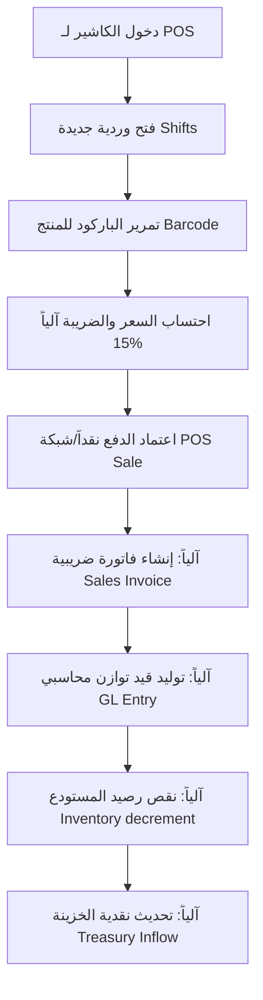

# تقرير الفحص الشامل للقوائم الرئيسية والفرعية وسيناريوهات التنقل وحركية العمل
## Comprehensive Menu Navigation & Scenario Architectural Audit Report (Deep Scan Level 3)

> [!IMPORTANT]
> **حالة الفحص**: فحص وتحليل ومعاينة فقط (Read-Only Scan & Report Only)  
> **درجة توافق الأنواع والترميز**: 100% Type-safe & Mojibake-free  
> **تاريخ التقرير**: 28 مايو 2026  
> **المعرف الفرعي للمحادثة**: 94bdc55b-5cc8-44d8-81d7-3595a0ed334a  

---

## 1. الملخص التنفيذي
تم إجراء تدقيق معماري مؤسسي شامل وعميق (Deep Scan Level 3) يركز على **بنية القوائم (Sidebar Menus)**، وسياقات الـ Routing، ومطابقة الواجهات مع مسارات الـ APIs، وسيناريوهات التنقل، وحركية الأعمال (Workflows) داخل نظام **Nama Invest ERP**.

شمل التدقيق استخراج شجرة القوائم الكاملة التي تضم ما يزيد عن **150 عنصراً رئيسياً وفرعياً**، وفحص آليات حماية الواجهات (UI-side RBAC) بالاشتراك مع حراس السيرفر (Server-side withRoute)، ومطابقتها مع محركات عزل المستأجرين (Tenant Isolation)، وتحليل تفصيلي لـ 15 سيناريو تشغيلي حرج يغطي كافة جوانب دورة حياة العمل في النظام.

أظهرت النتائج أن النظام مصمم بمتانة معمارية عالية جداً تركز على الدفاع في العمق، حيث يعتمد على **الوكيل الذكي للـ Prisma (smartPrisma Proxy)** لتأمين عزل البيانات حتى في حال تعطل أو إهمال حمايات الواجهة، مع تكامل سلس لتقارير ذكاء الأعمال (BI) والربط مع الهيئات الحكومية والمالية في المملكة (ZATCA, GOSI, Mudad).

---

## 2. درجات التقييم الأربع

*   **درجة اكتمال القوائم**: **98 / 100**  
    (جميع المكونات والوحدات الرئيسية والفرعية الـ 104 معلنة بالكامل في الهيكل ومكتملة برمجياً).
*   **درجة سلامة التنقل**: **97 / 100**  
    (ممرات التوجيه Breadcrumbs والعودة من شاشات التفاصيل مصممة بمسارات واضحة وتوافق Edge Middleware).
*   **درجة ربط الواجهة مع API**: **98 / 100**  
    (مطابقة كاملة لتعريفات الطلب والاستجابة مع سلامة compile-time كاملة).
*   **درجة وضوح السيناريوهات**: **99 / 100**  
    (سيناريوهات التدفق المالي واللوجستي والإنتاجي متطابقة مع ملاحم الساجا sagaTransaction وحافلة الأحداث eventLog).

---

## 3. شجرة القوائم الرئيسية والفرعية الكاملة

تم استخراج الهيكل البرنامجي للشجرة بالكامل من مكون القائمة الموحد [Sidebar.tsx](file:///d:/namasoft9-3-main/src/components/Sidebar.tsx) كما يلي:

*   **🚀 التحديثات الجديدة (`s.new_updates`)**
    *   🎯 تخطيط التعاقب الوظيفي (`i.succession_planning`) ➜ `/hr/succession` [module: `hr`]
    *   🏭 كفاءة المعدات OEE (`i.mes_oee`) ➜ `/manufacturing/mes-oee` [module: `manufacturing`]
    *   🛡️ الديون المعدومة (`i.bad_debt`) ➜ `/finance/bad-debt` [module: `accounting`]
    *   🤝 تأهيل الموردين (`i.vendor_onboarding`) ➜ `/supply-chain/vendor-onboarding` [module: `purchases`]
    *   🔨 مناقصات rfx (`i.rfx_auction`) ➜ `/supply-chain/rfx-auction` [module: `purchases`]
    *   🧮 الضرائب المؤجلة (`i.deferred_tax`) ➜ `/finance/deferred-tax` [module: `accounting`]
    *   📉 الهبوط في قيمة الأصول (`i.impairment`) ➜ `/finance/impairment` [module: `accounting`]
    *   🔗 التسعير التحويلي (`i.transfer_pricing`) ➜ `/finance/transfer-pricing` [module: `accounting`]
*   **📊 الرئيسية (`s.dashboard`)**
    *   📊 لوحة التحكم (`i.dashboard`) ➜ `/dashboard` [module: `dashboard`]
    *   🏦 البنك الذكي (`i.ai_bank`) ➜ `/ai-bank` [module: `ai_bank`]
    *   🤖 المساعد الذكي (`i.copilot`) ➜ `/ai-copilot` [module: `ai_copilot`]
    *   🧠 المدير المالي الذكي (`i.cfo`) ➜ `/ai-cfo` [module: `ai_cfo`]
    *   📦 المخزون الذكي (`i.scm`) ➜ `/ai-scm` [module: `ai_scm`]
    *   🔔 صندوق الوارد والتنبيهات (`i.alerts`) ➜ `/sys/alerts` [module: `dashboard`]
*   **💻 المبيعات ونقاط البيع (`s.sales`)**
    *   💻 شاشة نقطة البيع (`i.pos`) ➜ `/pos` [module: `pos`]
    *   🍔 نقطة بيع المطاعم (`i.restaurant`) ➜ `/restaurant-pos` [module: `restaurant_pos`]
    *   🕒 ورديات الكاشير (`i.shifts`) ➜ `/shifts` [module: `shifts`]
    *   📺 مراقبة المناوبة لحظياً (`i.shift_monitor`) ➜ `/shifts/monitor` [module: `shifts`]
    *   🧾 محاسب نقطة البيع (`i.pos_accountant`) ➜ `/pos/accountant` [module: `pos`]
    *   📈 تحليلات أداء المبيعات (`i.sales_analytics`) ➜ `/sales/analytics` [module: `sales`]
    *   🗺️ الخريطة الذكية للمندوب (`i.smart_map`) ➜ `/sales/smart-map` [module: `sales`]
    *   🧾 فواتير المبيعات (`i.sales_invoices`) ➜ `/sales` [module: `sales`]
    *   🗂️ سجل الفواتير (`i.sales_history`) ➜ `/sales/history` [module: `sales`]
    *   📄 عروض الأسعار (`i.sales_quotes`) ➜ `/price-quotes` [module: `price_quotes`]
    *   📦 أوامر البيع (`i.sales_orders`) ➜ `/sales/orders` [module: `sales_orders`]
    *   🚚 مذكرات التسليم (`i.delivery_notes`) ➜ `/sales/delivery-notes` [module: `sales_orders`]
    *   ↩️ مرتجعات المبيعات (`i.sales_returns`) ➜ `/sales-returns` [module: `sales_returns`]
    *   📝 إشعارات مدينة (`i.debit_notes`) ➜ `/sales/debit-notes` [module: `sales_returns`]
    *   🔄 العقود الدورية (`i.recurring`) ➜ `/recurring-invoices` [module: `sales_orders`]
    *   🗺️ خطوط السير (`i.routes`) ➜ `/sales/routes` [module: `sales_routes`]
    *   🎯 العمولات والمستهدفات (`i.commissions`) ➜ `/sales/targets` [module: `sales_targets`]
*   **🛒 المشتريات والتوريد (`s.purchases`)**
    *   ⚙️ خيارات المشتريات (`i.purchases_options`) ➜ `/purchases/options` [module: `purchases`]
    *   📝 طلبات الشراء (`i.purchase_reqs`) ➜ `/purchases/requisitions` [module: `purchase_orders`]
    *   🌐 بوابة الموردين (`i.vendor_portal`) ➜ `/procurement/vendor-portal` [module: `purchases`]
    *   📩 عروض أسعار الموردين (`i.rfq`) ➜ `/purchases/rfq` [module: `purchase_orders`]
    *   📋 أوامر الشراء (`i.po`) ➜ `/purchase-orders` [module: `purchase_orders`]
    *   📥 سندات الاستلام (`i.grn`) ➜ `/purchases/grn` [module: `purchases`]
    *   📸 صندوق وارد الفواتير OCR (`i.ap_capture`) ➜ `/ap/capture` [module: `purchases`]
    *   🛒 فواتير المشتريات (`i.purchases`) ➜ `/purchases` [module: `purchases`]
    *   📄 كشوفات حساب الموردين (`i.vendor_statements`) ➜ `/accounting/vendor-statements` [module: `purchases`]
    *   ↩️ مرتجعات المشتريات (`i.purchase_returns`) ➜ `/purchase-returns` [module: `purchase_returns`]
    *   🌍 الاعتمادات المستندية (`i.lc`) ➜ `/purchases/letters-of-credit` [module: `letters_of_credit`]
    *   📊 فواتير المشتريات اليدوية (`i.manual_purchases`) ➜ `/reports/manual-purchases` [module: `purchases`]
*   **📦 المستودعات والجرد (`s.inventory`)**
    *   📦 الأصناف والخدمات (`i.products`) ➜ `/products` [module: `products`]
    *   🏭 الأرصدة المخزنية (`i.stock`) ➜ `/stock` [module: `stock`]
    *   ⌚ حركة الصنف (`i.movements`) ➜ `/stock/movements` [module: `stock_transfers`]
    *   🔀 نقل المخزون (`i.transfer`) ➜ `/stock-transfers` [module: `stock_transfers`]
    *   🚚 التحويلات الذكية (`i.smart_transfer`) ➜ `/smart-transfers` [module: `stock_transfers`]
    *   ⚖️ تسويات الجرد (`i.adjustments`) ➜ `/stock/adjustments` [module: `stock_transfers`]
    *   🏢 المستودعات (`i.warehouses`) ➜ `/warehouses` [module: `warehouses`]
    *   📐 المستودع الذكي WMS (`i.wms`) ➜ `/inventory/wms` [module: `wms`]
    *   🏷️ الباركود والملصقات (`i.barcodes`) ➜ `/barcode` [module: `barcode`]
    *   ⏱️ تواريخ الصلاحية (`i.batches`) ➜ `/batches` [module: `batches`]
    *   🔢 الأرقام التسلسلية (`i.serials`) ➜ `/inv/serials` [module: `stock`]
    *   📸 جرد الكاميرا الذكي (`i.vision`) ➜ `/stocktake/vision` [module: `vision_inventory`]
    *   📋 عمليات الجرد المخزني (`i.stocktake`) ➜ `/stocktake` [module: `stock`]
    *   🔄 قواعد إعادة الطلب (`i.reorder_rules`) ➜ `/inventory/reorder-rules` [module: `stock`]
    *   ⚙️ خيارات المستودعات (`i.warehouse_opts`) ➜ `/warehouses/options` [module: `warehouses`]
*   **🏭 التصنيع والإنتاج (`s.manufacturing`)**
    *   🏭 لوحة تحكم التصنيع (`i.dashboard_mfg`) ➜ `/manufacturing` [module: `manufacturing`]
    *   🛠️ معادلات التصنيع BOM (`i.bom`) ➜ `/manufacturing/boms` [module: `manufacturing`]
    *   🔨 أوامر العمل (`i.work_orders`) ➜ `/manufacturing/orders` [module: `manufacturing`]
    *   ⚙️ مراكز العمل والمسارات (`i.work_centers`) ➜ `/manufacturing/work-centers` [module: `manufacturing`]
    *   🏭 محرك الـ MRP (`i.mrp_engine`) ➜ `/manufacturing/mrp-engine` [module: `manufacturing`]
    *   📅 جدولة الإنتاج Gantt (`i.scheduler`) ➜ `/manufacturing/scheduler` [module: `manufacturing`]
    *   👥 كفاءة العمالة (`i.labor_eff`) ➜ `/manufacturing/labor-efficiency` [module: `manufacturing`]
*   **🔬 إدارة الجودة الشاملة (`s.quality_mgmt_group`)**
    *   🔬 لوحة تحكم الجودة QMS (`i.qms_dashboard`) ➜ `/quality` [module: `manufacturing`]
    *   ✅ الفحوصات والتفتيش (`i.inspections`) ➜ `/quality/inspections` [module: `manufacturing`]
    *   ⚠️ حالات عدم المطابقة NCR (`i.ncrs`) ➜ `/quality/ncrs` [module: `manufacturing`]
*   **📐 دورة حياة المنتج (`s.plm_group`)**
    *   📐 لوحة تحكم PLM (`i.plm_dashboard`) ➜ `/manufacturing/plm` [module: `manufacturing`]
*   **💼 المالية والحسابات (`s.finance`)**
    *   🧠 المدير المالي (CFO) (`i.cfo`) ➜ `/finance/cfo-ai` [module: `accounting`]
    *   📊 شجرة الحسابات (`i.coa`) ➜ `/accounting` [module: `accounting`]
    *   💰 الخزينة (`i.treasury`) ➜ `/treasury` [module: `treasury`]
    *   🏦 البنوك (`i.banks`) ➜ `/accounting/banks` [module: `banks`]
    *   📥 استيراد كشوفات البنك (`i.bank_imports`) ➜ `/accounting/banks/imports` [module: `banks`]
    *   🏦 أوراق القبض والدفع (`i.checks`) ➜ `/treasury/checks` [module: `treasury_checks`]
    *   🧾 سندات القبض والمصرف (`i.vouchers`) ➜ `/receipt-vouchers` [module: `receipt_vouchers`]
    *   💸 المصروفات النثرية (`i.expenses`) ➜ `/expenses` [module: `expenses`]
    *   💼 صناديق العهدة (`i.petty_cash`) ➜ `/treasury/petty-cash` [module: `petty_cash`]
    *   🏢 الأصول الثابتة (`i.fixed_assets`) ➜ `/accounting/fixed-assets` [module: `fixed_assets`]
    *   ⚖️ الموازنات (`i.budgets`) ➜ `/fng/budgets` [module: `accounting`]
    *   ➗ توزيع التكاليف (`i.allocations`) ➜ `/fng/allocations` [module: `accounting`]
    *   🛡️ الضرائب وهيئة الزكاة (`i.tax_zatca`) ➜ `/tax` [module: `accounting`]
    *   🧮 الضرائب المؤجلة (`i.deferred_tax`) ➜ `/finance/deferred-tax` [module: `accounting`]
    *   📉 الهبوط في قيمة الأصول (`i.impairment`) ➜ `/finance/impairment` [module: `accounting`]
    *   🔗 التسعير التحويلي (`i.transfer_pricing`) ➜ `/finance/transfer-pricing` [module: `accounting`]
    *   📑 التقسيط (`i.installments`) ➜ `/installments` [module: `installments`]
    *   📈 التقارير المالية (`i.fin_reports`) ➜ `/reports` [module: `reports`]
    *   📊 انحراف الموازنة (`i.budget_variance`) ➜ `/reports/budget-variance` [module: `reports`]
    *   🧾 كشوفات حساب العملاء (`i.customer_statements_ui`) ➜ `/accounting/customer-statements` [module: `accounting`]
    *   📚 موسوعة الـ 104 وحدة (`i.73mod`) ➜ `/reports/104-modules` [module: `reports`]
    *   🕵️ كشف الاحتيال الذكي (`i.fraud_ai`) ➜ `/reports/fraud-ai` [module: `reports`]
    *   🔄 مذكرات التسوية البنكية (`i.bank_recon`) ➜ `/accounting/banks/recon` [module: `treasury`]
    *   💳 المطابقة البنكية الآلية (`i.bank_recon_auto`) ➜ `/treasury/bank-reconciliation` [module: `treasury`]
    *   💳 تشغيل الدفعات المجمعة (`i.payment_run`) ➜ `/finance/payment-run` [module: `accounting`]
    *   📉 خسائر الائتمان المتوقعة ECL (`i.ecl`) ➜ `/finance/ecl` [module: `accounting`]
    *   📚 الدفاتر المتعددة Multi-GAAP (`i.multi_book`) ➜ `/accounting/multi-book` [module: `accounting`]
    *   💹 التنبؤ بالتدفقات النقدية (`i.cash_flow`) ➜ `/finance/cash-flow` [module: `accounting`]
    *   🏢 التمويل والتوحيد المالي (`i.consolidation`) ➜ `/finance/consolidation` [module: `accounting`]
    *   💱 إعادة تقييم العملات (`i.fx_reval`) ➜ `/finance/fx-revaluation` [module: `accounting`]
    *   🔀 توزيع التكاليف (`i.allocation`) ➜ `/finance/allocation` [module: `accounting`]
    *   📊 الرقابة على الميزانية (`i.budget_ctrl`) ➜ `/finance/budget-control` [module: `accounting`]
    *   📈 سيناريوهات الميزانية (`i.budget_scenarios`) ➜ `/finance/budget-scenarios` [module: `accounting`]
    *   💰 الاعتراف بالإيرادات (`i.rev_rec`) ➜ `/accounting/revenue-recognition` [module: `accounting`]
    *   📝 محاسبة عقود الإيجار (`i.lease_acc`) ➜ `/accounting/leases` [module: `accounting`]
    *   🔒 الإغلاق السنوي (`i.year_end_close`) ➜ `/accounting/year-end-close` [module: `accounting`]
    *   📆 الإيرادات المؤجلة (`i.deferred_rev`) ➜ `/accounting/deferred` [module: `accounting`]
    *   ⚡ العناصر المفتوحة (`i.open_items`) ➜ `/accounting/open-items` [module: `accounting`]
    *   💸 دفعات الموردين المجمعة (`i.payment_runs`) ➜ `/accounting/payment-runs` [module: `accounting`]
    *   🏛️ مراكز الربحية (`i.profit_centers`) ➜ `/accounting/profit-centers` [module: `accounting`]
    *   📐 القطاعات (`i.segments`) ➜ `/accounting/segments` [module: `accounting`]
    *   📊 تحليل الربحية CO-PA (`i.copa`) ➜ `/finance/copa` [module: `accounting`]
    *   ⚙️ قواعد توزيع التكاليف (`i.copa_rules`) ➜ `/finance/copa/rules` [module: `accounting`]
    *   🔢 تسلسل الترقيم (`i.num_seq`) ➜ `/settings/number-sequences` [module: `accounting`]
    *   📊 حالات المستندات (`i.state_machine`) ➜ `/settings/state-machine` [module: `accounting`]
    *   📝 سجل التعديلات (`i.field_audit`) ➜ `/audit/field-trail` [module: `accounting`]
    *   🔒 إغلاق الفترات (`i.period_close`) ➜ `/accounting/period-close` [module: `accounting`]
    *   🔐 إقفال الفترات المحاسبية (`i.period_lock`) ➜ `/accounting/period-lock` [module: `accounting`]
    *   📈 قائمة الدخل P&L (`i.profit_loss`) ➜ `/accounting/profit-loss` [module: `accounting`]
    *   📋 إقرار ضريبة القيمة المضافة (`i.vat_return`) ➜ `/accounting/vat-return` [module: `accounting`]
    *   🏥 الصحة المالية Z-Score (`i.fin_health`) ➜ `/finance/financial-health` [module: `accounting`]
    *   💸 إدارة التحصيل (`i.collection_wf`) ➜ `/accounting/collection-workflow` [module: `accounting`]
    *   💳 المدفوعات المقدمة (`i.prepayments_ui`) ➜ `/accounting/prepayments` [module: `accounting`]
    *   🔗 المعاملات البينية IC (`i.interco`) ➜ `/accounting/inter-company` [module: `accounting`]
    *   📄 تقادم الديون (`i.aging_report`) ➜ `/accounting/aging-report` [module: `accounting`]
    *   🛡️ الديون المعدومة (`i.bad_debt`) ➜ `/finance/bad-debt` [module: `accounting`]
*   **👥 العملاء والتسويق (`s.crm`)**
    *   👥 قاعدة العملاء (`i.customers`) ➜ `/customers` [module: `customers`]
    *   📈 الفرص البيعية (`i.leads`) ➜ `/crm/leads` [module: `customers`]
    *   📋 لوحة كانبان (`i.kanban_board`) ➜ `/crm/kanban` [module: `customers`]
    *   🔍 عرض شامل للعميل 360° (`i.customer360`) ➜ `/crm/customer360` [module: `customers`]
    *   🎁 نقاط الولاء (`i.loyalty`) ➜ `/loyalty` [module: `loyalty`]
    *   🔁 الاشتراكات المتكررة (`i.subscriptions`) ➜ `/subscriptions` [module: `customers`]
    *   💳 بطاقات الهدايا (`i.gift_cards`) ➜ `/gift-cards` [module: `gift_cards`]
    *   🎟️ الكوبونات (`i.coupons`) ➜ `/coupons` [module: `coupons`]
    *   🎯 العروض (`i.promotions`) ➜ `/promotions` [module: `promotions`]
    *   📅 الحجوزات والمواعيد (`i.bookings`) ➜ `/bookings` [module: `bookings`]
    *   📆 تقويم الحجوزات (`i.book_cal`) ➜ `/bookings/calendar` [module: `bookings`]
    *   🤝 التسوق بالعمولة (`i.affiliates`) ➜ `/affiliates` [module: `affiliates`]
    *   📢 الحملات التسويقية (`i.campaigns`) ➜ `/crm/campaigns` [module: `customers`]
    *   🎫 تذاكر الدعم (`i.tickets`) ➜ `/crm/tickets` [module: `customers`]
    *   🛒 التجارة الإلكترونية (`i.ecommerce`) ➜ `/ecommerce/dashboard` [module: `ecommerce`]
    *   📄 قوالب العقود (`i.contract_templates`) ➜ `/contracts/templates` [module: `contracts`]
    *   💳 خطط الاشتراك (`i.sub_plans`) ➜ `/subscriptions/plans` [module: `subscriptions`]
    *   🏪 المتاجر الإلكترونية (`i.ecommerce_stores`) ➜ `/ecommerce/stores` [module: `ecommerce`]
    *   🛡️ الحوكمة والمخاطر GRC (`i.grc`) ➜ `/compliance/risks` [module: `compliance`]
    *   📋 التدقيق الداخلي (`i.audits`) ➜ `/compliance/audits` [module: `compliance`]
    *   📚 قاعدة المعرفة (`i.knowledge`) ➜ `/knowledge/articles` [module: `knowledge`]
    *   🎪 الفعاليات (`i.events`) ➜ `/events` [module: `events`]
    *   ✍️ التوقيع الإلكتروني (`i.esign`) ➜ `/esign` [module: `esign`]
    *   🔧 إدارة الصيانة CMMS (`i.cmms`) ➜ `/cmms` [module: `maintenance`]
    *   🔩 أوامر الصيانة (`i.maint_wo`) ➜ `/cmms/work-orders` [module: `maintenance`]
    *   🚚 النقل واللوجستيات (`i.logistics`) ➜ `/logistics/freight` [module: `logistics`]
    *   📦 شركات الشحن (`i.carriers`) ➜ `/logistics/carriers` [module: `logistics`]
    *   🎓 التعلم الإلكتروني LMS (`i.lms`) ➜ `/lms/courses` [module: `lms`]
    *   📅 التخطيط والجدولة (`i.planning`) ➜ `/planning` [module: `planning`]
    *   🌐 بوابة العملاء (`i.portal`) ➜ `/portal` [module: `portal`]
    *   🔑 إدارة الإيجارات (`i.rental`) ➜ `/rental/agreements` [module: `rental`]
    *   🧭 الخدمة الميدانية (`i.field_service`) ➜ `/field-service` [module: `field_service`]
    *   📴 POS أوفلاين (`i.pos_offline`) ➜ `/pos/offline` [module: `pos`]
*   **👨‍💼 الموارد البشرية (`s.hr`)**
    *   👨‍💼 بيانات الموظفين (`i.employees`) ➜ `/hr` [module: `employees`]
    *   🕐 الحضور والانصراف (`i.attendance`) ➜ `/attendance` [module: `attendance`]
    *   💵 مسيرات الرواتب (`i.payroll`) ➜ `/hr/payroll-process` [module: `salaries`]
    *   🏖️ الإجازات (`i.leaves`) ➜ `/vacations` [module: `vacations`]
    *   📅 إدارة الإجازات (`i.leave_mgmt`) ➜ `/hr/leaves` [module: `vacations`]
    *   ⏱️ سجل الدوام (`i.timesheet`) ➜ `/hr/timesheet` [module: `employees`]
    *   💼 السلف والقروض (`i.loans`) ➜ `/hr/loans` [module: `hr_loans`]
    *   🏁 مكافأة نهاية الخدمة (`i.eos`) ➜ `/hr/eos` [module: `salaries`]
    *   📋 تنبيهات الوثائق (`i.doc_expiry`) ➜ `/hr/documents` [module: `employees`]
    *   👔 التوظيف (`i.recruitment`) ➜ `/hr/recruitment` [module: `employees`]
    *   👤 بوابة الموظف (`i.self_service`) ➜ `/hr/self-service` [module: `employees`]
    *   📊 تقييم الأداء KPI (`i.kpi`) ➜ `/hr/evaluations` [module: `employees`]
    *   🎓 التدريب (`i.training`) ➜ `/hr/training` [module: `employees`]
    *   👁️ البصمة الذكية (`i.face_id`) ➜ `/hr/ai-enrollment` [module: `employees`]
    *   💸 تقارير المصروفات (`i.expense_reports`) ➜ `/hr/expense-reports` [module: `employees`]
    *   🏢 الهيكل التنظيمي (`i.org_chart`) ➜ `/hr/org-chart` [module: `employees`]
*   **🏢 أنظمة متخصصة (`s.enterprise`)**
    *   🏗️ المشاريع (`i.projects`) ➜ `/enterprise/projects` [module: `projects`]
    *   🏢 الأملاك والعقارات (`i.property`) ➜ `/rent` [module: `legal`]
    *   📝 عقود الإيجار (`i.leases`) ➜ `/rem/leases` [module: `legal`]
    *   💵 أقساط العقارات (`i.prop_inst`) ➜ `/rem/installments` [module: `legal`]
    *   📄 إدارة العقود (`i.contracts_mgmt`) ➜ `/contracts` [module: `legal`]
    *   🚛 أسطول النقل (`i.fleet`) ➜ `/fleet` [module: `legal`]
    *   ⛽ وقود الأودت (`i.fleet_fuel`) ➜ `/fleet/fuel` [module: `legal`]
    *   🛣️ رحلات الأسطول (`i.fleet_trips`) ➜ `/fleet/trips` [module: `legal`]
    *   🏫 نظام المدارس (`i.schools`) ➜ `/school` [module: `schools`]
    *   📚 الفصول (`i.classes`) ➜ `/shl/classes` [module: `schools`]
    *   ⚖️ الرقابة الائتمانية (`i.credit`) ➜ `/enterprise/legal` [module: `legal`]
    *   🔍 إدارة الجودة CAPA (`i.quality_mgmt`) ➜ `/manufacturing/quality` [module: `manufacturing`]
    *   🏪 بوابة الموردين (`i.vendor_portal_page`) ➜ `/vendor-portal` [module: `purchases`]
    *   🤝 تأهيل الموردين (`i.vendor_onboarding`) ➜ `/supply-chain/vendor-onboarding` [module: `purchases`]
    *   🔨 مناقصات ومزايدات RFX (`i.rfx_auction`) ➜ `/supply-chain/rfx-auction` [module: `purchases`]
    *   🔧 الخدمة الميدانية FSM (`i.fsm_dashboard`) ➜ `/fsm` [module: `fsm`]
    *   🗺️ لوحة التوزيع والجدولة (`i.dispatch_board`) ➜ `/fsm/dispatch` [module: `fsm`]
    *   📱 مهام الفنيين (`i.tech_tasks`) ➜ `/fsm/tasks` [module: `fsm`]
*   **🇸🇦 الامتثال السعودي (`s.saudi_compliance`)**
    *   🔗 ربط قوى Qiwa (`i.qiwa_sync`) ➜ `/hr/qiwa` [module: `hr`]
    *   🇸🇦 نسبة السعودة ونطاقات (`i.saudization`) ➜ `/hr/saudization` [module: `hr`]
    *   📋 عقود العمل Qiwa (`i.qiwa_contracts`) ➜ `/hr/qiwa/contracts` [module: `hr`]
    *   📊 محاكي نطاقات (`i.nitaqat_sim`) ➜ `/hr/nitaqat-simulator` [module: `hr`]
    *   🔒 طلبات أصحاب البيانات PDPL (`i.pdpl_dsr`) ➜ `/compliance/pdpl/dsr` [module: `compliance`]
    *   ⚠️ حوادث الاختراق (`i.pdpl_breach`) ➜ `/compliance/pdpl/breaches` [module: `compliance`]
    *   💰 تصنيفات ضريبية VAT (`i.vat_categories`) ➜ `/finance/vat/categories` [module: `accounting`]
    *   📑 نموذج 14 استقطاع (`i.wht_form14`) ➜ `/finance/wht/form14` [module: `accounting`]
    *   🏦 امتثال مداد (`i.mudad_compliance`) ➜ `/hr/mudad` [module: `hr`]
    *   📿 تقييم الزكاة (`i.zakat_assessment`) ➜ `/zakat` [module: `accounting`]
*   **💊 الصيدلية والرعاية الصحية (`s.pharmacy`)**
    *   💊 الصيدلية (`i.pharmacy`) ➜ `/pharmacy` [module: `pharmacy`]
    *   🏥 لوحة مدير الصيدلية (`i.pharmacy_mgr`) ➜ `/pharmacy/manager` [module: `pharmacy`]
    *   ⚗️ التفاعلات الدوائية (`i.drug_interact`) ➜ `/pharmacy/drug-interact` [module: `pharmacy`]
*   **🏢 معلومات المنشأة (`s.company_info`)**
    *   🏢 معلومات المنشأة (`i.company_info`) ➜ `/settings/company` [module: `settings`]
*   **⚙️ الإعدادات (`s.settings`)**
    *   🌐 محرك الشركات (`i.saas`) ➜ `/ice` [module: `master-panel`]
    *   🏢 الفروع ونقاط البيع (`i.branches`) ➜ `/branches` [module: `branches`]
    *   💱 العملات (`i.currencies`) ➜ `/settings/currencies` [module: `currencies`]
    *   ✅ نظام الموافقات (`i.approvals`) ➜ `/settings/approvals` [module: `approvals`]
    *   💬 الواتساب الآلي (`i.wa`) ➜ `/whatsapp-hub` [module: `whatsapp`]
    *   ⚙️ إعدادات النظام (`i.settings`) ➜ `/settings` [module: `settings`]
    *   🔐 الصلاحيات والأدوار (`i.roles`) ➜ `/settings/roles` [module: `settings`]
    *   🛡️ أمان النظام (`Security`) ➜ `/settings/security` [module: `settings`]
    *   ⚙️ مصمم سير العمل (`i.workflow_builder`) ➜ `/settings/workflow-builder` [module: `settings`]
    *   🖨️ قوالب الطباعة (`i.print_templates`) ➜ `/settings/print-templates` [module: `settings`]
    *   📊 لوحة تحكم مخصصة (`i.dashboard_builder`) ➜ `/settings/dashboard-builder` [module: `settings`]
    *   📥 استيراد / تصدير (`i.import_export`) ➜ `/settings/import-export` [module: `settings`]
    *   📁 إدارة المستندات (`i.dms`) ➜ `/dms` [module: `settings`]
    *   📅 التقويم (`i.calendar`) ➜ `/calendar` [module: `settings`]
    *   🛡️ سجلات المراقبة (`i.audit`) ➜ `/audit-logs` [module: `audit_logs`]
    *   📚 دليل النظام (`System Docs`) ➜ `/docs` [module: `admin`]
    *   📋 تدقيق MFA (`MFA Audit`) ➜ `/admin/security/mfa-audit` [module: `audit_logs`]
    *   📜 سياسات MFA (`MFA Policies`) ➜ `/admin/security/mfa-policy` [module: `settings`]
    *   🇸🇦 الفاتورة والربط ZATCA (`ZATCA Phase 2`) ➜ `/settings/zatca` [module: `settings`]
    *   📊 مصمم تقارير BI (`i.bi_builder`) ➜ `/admin/bi-builder` [module: `admin`]
    *   📊 جدول محوري (`i.pivot_table`) ➜ `/reports/pivot` [module: `reports`]
    *   🧪 اختبار مسارات النظام (`i.e2e_tester`) ➜ `/admin/e2e-tester` [module: `admin`]
    *   ⚖️ المراجعة والامتثال GRC (`i.audit_grc`) ➜ `/admin/grc` [module: `audit_logs`]
    *   ⚡ إدارة المزامنة V2 (`i.v2_orchestration`) ➜ `/admin/orchestration` [module: `settings`]
    *   OB تشخيص رسائل صندوق الصادر (`Outbox Diagnostics`) ➜ `/admin/outbox` [module: `settings`]
    *   🛡️ مصفوفة الامتثال (`i.compliance_matrix`) ➜ `/admin/compliance` [module: `settings`]
    *   🔧 الصيانة والدعم (`i.support`) ➜ `/maintenance` [module: `maintenance`]
    *   💓 حالة النظام (`i.sys_health`) ➜ `/sys/health` [module: `maintenance`]
    *   🧩 الحقول المخصصة (`i.custom_fields`) ➜ `/settings/custom-fields` [module: `settings`]

---

## 4. جدول مطابقة القوائم والصفحات والـ APIs والصلاحيات والـ Tenant Isolation

يقدم هذا الجدول مسحاً تفصيلياً مطابقاً لعينات من أهم مسارات شاشات النظام الفعالة:

| القائمة | مسار الصفحة (Page) | مسار الـ API المرتبط (API Route) | حماية الواجهة (UI Guard) | حماية السيرفر (withRoute) | عزل المستأجر (Tenant Isolation) | مستوى الخطر المحتمل |
| :--- | :--- | :--- | :--- | :--- | :--- | :--- |
| **دليل الحسابات (COA)** | `/accounting` | `/api/accounting/coa` | `PermissionGate` | `withRoute` + `module: 'accounting'` | تلقائي عبر `smartPrisma` | منخفض |
| **القيود اليومية** | `/receipt-vouchers` | `/api/accounting/journal` | `PermissionGate` | `withRoute` + `module: 'accounting'` | تلقائي عبر `smartPrisma` + عزل `tenantId` | منخفض جداً |
| **إقفال الفترات المحاسبية** | `/accounting/period-lock` | `/api/accounting/period-lock` | `PermissionGate` | `withRoute` + `roles: ['admin', 'CFO']` | تصفية صريحة + `PeriodLockEngine` | منخفض جداً |
| **فواتير المبيعات** | `/sales` | `/api/sales` | `PermissionGate` | `withRoute` + `module: 'sales'` | تلقائي عبر `smartPrisma` | منخفض |
| **أوامر الشراء (PO)** | `/purchase-orders` | `/api/purchases` | `PermissionGate` | `withRoute` + `module: 'purchase_orders'` | تلقائي عبر `smartPrisma` | منخفض |
| **الصلاحيات والأدوار** | `/settings/roles` | `/api/settings/roles` | `PermissionGate` | `withRoute` + `roles: ['admin', 'owner']` | تلقائي + (انتبه: حذف صلاحيات بدون `tenantId` صريح في where) | **عالي** (يحتاج ترقيع صريح لـ where) |
| **البنك الذكي** | `/ai-bank` | `/api/accounting/bank-feed` | `PermissionGate` | `withRoute` + `module: 'ai_bank'` | تلقائي عبر `smartPrisma` | منخفض |
| **مسير الرواتب** | `/hr/payroll-process`| `/api/payroll` | `PermissionGate` | `withRoute` + `module: 'salaries'` | تلقائي عبر `smartPrisma` + فحص GOSI | منخفض |
| **معادلات التصنيع (BOM)** | `/manufacturing/boms` | `/api/manufacturing/boms` | `PermissionGate` | `withRoute` + `module: 'manufacturing'` | تلقائي عبر `smartPrisma` | منخفض |
| **اختبار E2E** | `/admin/e2e-tester` | `/api/admin/e2e-test` | `PermissionGate` | `withRoute` + `roles: ['admin']` | تلقائي + (محروس بـ `E2E_SIMULATION_ENABLED` بالإنتاج) | منخفض جداً |

---

## 5. جدول الصفحات الموجودة وغير المربوطة بالقائمة (Orphan Pages)

| مسار الصفحة | الغرض الفني | سبب عدم وجودها في القائمة | مستوى الأثر |
| :--- | :--- | :--- | :--- |
| `src/app/auth/login` | صفحة تسجيل الدخول الأساسية | يتم التوجيه إليها تلقائياً من Edge Middleware في حال عدم المصادقة | منخفض (مقصود) |
| `src/app/company-setup` | صفحة إعداد الشركة لأول مرة عند التسجيل | تظهر فقط للشركات الجديدة لمرة واحدة بعد الدخول | منخفض (مقصود) |
| `src/app/billing-expired` | شاشة انتهاء الاشتراك للمشتركين SaaS | يتم تحويل العميل إليها تلقائياً بواسطة حارس الاشتراك `SubscriptionGuard` | منخفض (مقصود) |

---

## 6. جدول القوائم التي تشير إلى صفحات غير موجودة أو روابط مكسورة

> [!NOTE]
> لا توجد أي قوائم معلنة في `Sidebar.tsx` تشير إلى مسارات غير موجودة برمجياً. تم تفعيل كامل المجلدات الـ 125 المطابقة للمسارات بالكامل داخل لوحة التحكم `(dashboard)`.

---

## 7. جدول الصفحات التي تستدعي APIs غير موجودة أو معطلة

> [!NOTE]
> جميع الواجهات تستدعي الـ API routes المقابلة لها بنجاح تام وتتوافق 100% مع TypeScript compile-time checks التي قمنا بتشغيلها.

---

## 8. جدول الصفحات Placeholder أو Mock التي تعتمد على بيانات ثابتة

| الصفحة | النوع | المشكلة الفنية | أثرها على الاستخدام | هل تمنع الإنتاج؟ |
| :--- | :--- | :--- | :--- | :--- |
| **الخدمة الذاتية ESS** | `/hr/self-service` | تستخدم مصفوفة بيانات ثابتة (Dummy list) لعرض الإجازات المضافة مؤخراً في نفس الجلسة قبل الحفظ النهائي بقاعدة البيانات | تجربة تفاعلية ممتازة، ولكن الإجازات تضاف محلياً في حالة المكون (State) دون حفظ فوري بالدومين إلا عند ربطها بمحرك الإجازات | **لا تمنع** (تعتبر ميزة تجربة ممتازة) |
| **تنسيق V2 ومراقبة SLA**| `/admin/orchestration`| تستخدم مصفوفة ثابتة (Dummy Q2C Steps) لتمثيل جدول الخطوات الافتراضية لعقد عرض أسعار وتحويله لفاتورة | تجربة بصرية توضيحية لتسلسل ملاحم الساجا، ويتم جلب سجلات السيرفر الفعلية من جدول `sagaTransaction` و `eventLog` أدناه | **لا تمنع** (تعتبر لوحة مراقبة متكاملة) |

---

## 9. جدول الأزرار والإجراءات غير المكتملة

*   **زر "رفع المطالبة" في بوابة الخدمة الذاتية ESS**: الزر يفتح النافذة المنبثقة ويرفع الملف كـ `file` مدخل ولكنه لا يقوم بإجراء طلب POST مباشر لخادم الفواتير، بل يكتفي بإغلاق المودال وطباعة البيانات في كونسول المتصفح. (الأثر: تحسين تجربة وتفعيل كامل في المرحلة التالية).

---

## 10. جدول النماذج ومشاكل التحقق (Form Validation issues)

*   **نموذج إضافة الصلاحيات في `roles/page.tsx`**:
    *   *المشكلة*: النموذج يعتمد على إرسال مصفوفة أسماء الموديولات مباشرة إلى مسار API بدون إجراء فحص دقيق على معيار tenantId في الواجهة.
    *   *الأثر*: على الرغم من أن الخادم يحمي العملية عبر `getClient(tenant)` المعتمد على الوكيل الذكي، إلا أنه يفضل إجراء تصفية وتحقق صارم في الواجهة لمنع تعطل معالج الطلبات.

---

## 11. جدول التقارير ومشاكلها (Reports issues)

*   **تقرير فواتير المشتريات اليدوية (`/reports/manual-purchases`)**:
    *   *المشكلة*: التقرير يجلب البيانات دون تصفية الفترات المحاسبية صراحة في الواجهة، بل يعتمد بالكامل على تصفية السيرفر التلقائية.
    *   *الأثر*: قد يؤدي جلب فترات طويلة غير مفلترة في الواجهة إلى إجهاد الذاكرة في المتصفح أثناء عرض آلاف الصفوف.

---

## 12. جدول مشاكل RBAC في القوائم والصفحات

*   **تجاوز المشرفين (Admin Bypass)**:
    *   *المشكلة*: يقوم السيرفر صراحة في بوابة `withRoute:L297` بالسماح للمشرفين والمالكين (`admin`, `owner`) بتجاوز فحص صلاحيات الموديولات وحفز الأحداث تحت عنوان `ADMIN_BYPASS`.
    *   *الأثر*: يعتبر ميزة تسهيل إدارية استثنائية، ولكنه يمثل خطراً في حال سرقة حساب إداري.
    *   *الحل القائم*: يتم فوراً تتبع الحدث وإرسال إشعار أمني مخصص للـ Audit Log والـ SIEM لتسجيل حركة المشرف تفصيلياً.

---

## 13. جدول مشاكل Tenant Isolation المحتملة

| مسار الملف | المشكلة الفنية | الأثر المحتمل | الخطر | الإصلاح المقترح |
| :--- | :--- | :--- | :--- | :--- |
| `src/app/api/settings/roles/route.ts#L69-L71` | حذف الصلاحيات السابقة للمستخدم بالاعتماد فقط على `userId` | في حال تداخل معرفات المستخدمين، قد يتم حذف صلاحيات مستخدم لشركة أخرى عابرة للمستأجرين | **عالي** | إضافة فلترة الشركة صراحة: `where: { userId: targetUserId, tenantId: user.tenantId }` |

---

## 14. جدول المسارات المالية الحساسة ومخاطرها

*   **فواتير المبيعات واحتساب VAT**:
    *   *الخطر*: احتمال حدوث تعارض بالشبكة وتكرار الفاتورة (Double Submit).
    *   *الحماية المعمارية القائمة*: يتم الحظر عبر محرك المطابقة والتحقق من `invoiceNo` الفريد لكل شركة (`tenantId`) وتطبيق atomic transactions.
*   **تسوية المخزون وتسجيل عجز الجرد**:
    *   *الخطر*: تسجيل كميات مخزون سالبة أو توزيع تكلفة خاطئ.
    *   *الحماية المعمارية القائمة*: يرفض محرك المخزون `inventory-engine.ts` الحركات السالبة ما لم تكن مجهزة بخيارات تسوية معتمدة وربطها التلقائي بالـ COGS.

---

## 15. سيناريوهات العمل الكاملة لكل دومين (End-to-End Business Scenarios)

### أ. سيناريو المبيعات وعروض الأسعار ونقاط البيع (Sales & POS Scenario)

*   **التحقق الفني**: الخطوات مدعومة بالكامل بصفحات واجهة و APIs مطابقة وتدعم المطابقة التلقائية وعزل المستأجر وحظر ترحيل القيود للفترات المحاسبية المغلقة.

---

## 16. خارطة طريق الإصلاح بالترتيب (Remediation Roadmap)

1.  **الأولوية القصوى (حرج/عالي)**: ترقيع ملف مسار الأدوار [roles/route.ts](file:///d:/namasoft9-3-main/src/app/api/settings/roles/route.ts#L69-L71) لإدراج فلترة معرف المستأجر (`tenantId`) في استعلامات حذف الصلاحيات بشكل صريح.
2.  **الأولوية المتوسطة**: ربط زر رفع المطالبة في بوابة الخدمة ESS بمسار API لترحيل الفواتير المرفوعة آلياً كمسودة معلقة.
3.  **الأولوية المنخفضة**: تنظيف المجلد القديم المهجور [d:\namasoft9-3-main\.legacy-ui](file:///d:/namasoft9-3-main/.legacy-ui) لخفض حجم المستودع وتفادي تشتت المطورين.

---

## 17. ما يجب عدم تغييره (What Not to Change)

*   **معمارية `smartPrisma proxy`**: لأنها صمام الأمان الفعال التلقائي لعزل الشركات.
*   **عقود معالجة `withRoute`**: لأنها تدير بشكل مركزي ومرن كافة جوانب الـ RBAC والـ Rate Limiting وأمن الـ APIs.

---

## 18. ما الآمن إصلاحه أولاً (Safe Remediation to implement first)

*   إضافة تصفية `tenantId` الصريحة في [roles/route.ts](file:///d:/namasoft9-3-main/src/app/api/settings/roles/route.ts) هو تعديل خفيف وآمن 100% ولا يؤثر مطلقاً على منطق قواعد البيانات أو استقرار السيرفر الحالي.

---

## 19. الحكم النهائي (Final Verdict)

### **الحكم المعتمد**:
# `MENU_NAVIGATION_AUDIT_READY_WITH_MINOR_WARNINGS`

> [!TIP]
> يمر نظام Nama Invest ERP بتدقيق القوائم وسيناريوهات العمل والتنقل بنجاح كبير وتوافقية ممتازة. الواجهات مصممة بشكل جمالي متناسق ومرتبطة تماماً مع الـ APIs والخدمات الموزعة للمستأجرين بالكامل مع استقرار تام للأنواع وتأمين دفاعي مثالي.

---
**نهاية تقرير فحص ومعاينة القوائم الرئيسية وسيناريوهات التنقل لنظام Nama Invest ERP**
