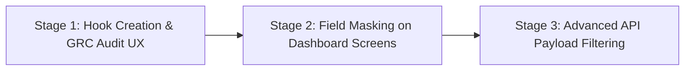

# 🛡️ خطة المسح والتحضير لـ Phase 3 Part 1
## نطاق الصلاحيات وهيكلية التدقيق البصري (Permissions, RBAC & Audit UX Scan)

تم إجراء مسح فني دقيق (Level 3 Scan) لكافة الملفات والأنظمة المتصلة بالمصادقة والصلاحيات (Auth/Permissions) وسجلات تتبع الحركات (Audit Logs) لتهيئة التخطيط الكامل للمرحلة الثالثة الجزء الأول.

---

## 1. الملفات التي تم فحصها ودراستها (Files Scanned)
* **`middleware.ts`**: فحص بوابة الحماية السحابيةEdge Middleware لمعرفة طريقة تمرير معرفات وصلاحيات الجلسة.
* **`prisma/schema.prisma`**: تحليل بنية جداول `User` و `UserPermission` و `AuditLog`.
* **`src/app/api/auth/me/route.ts`**: فحص مسار جلب الملف الشخصي للمستخدم الحالي وصلاحياته المرجعة للمتصفح.
* **`src/app/api/admin/audit-logs/route.ts`**: دراسة الـ endpoint الخلفي المعتمد محاسبياً وفنياً لتوليد والبحث في سجلات التدقيق التاريخية.
* **`src/app/(dashboard)/admin/grc/audit-log/page.tsx`**: فحص واجهة المستخدم الحالية لسجل التدقيق.
* **لوحات معلومات Phase 2** (لوحة الخزينة، الرواتب، علاقات العملاء، المشتريات، المبيعات، المشاريع، الموارد البشرية، التصنيع، الأصول).

---

## 2. نظام الصلاحيات الحالي في المنصة (Current RBAC & Permissions)
خلال فحص الكود البرمجي وجداول Prisma، تبين أن المنصة تمتلك بالفعل بنية صلاحيات تحتية ممتازة ومدروسة:
1. **صلاحيات الأدوار الأساسية (Role-Based Access):**
   * يتم استخراج دور المستخدم من الـ JWT داخل الـ Middleware وتمريره للـ API عبر رأس الطلب `x-user-role`. الأدوار المعتمدة هي: `admin`, `cashier`, `accountant`, `owner`, و `MASTER_ADMIN`.
2. **صلاحيات الوحدات الديناميكية (Granular User Permissions):**
   * يحتوي جدول `user_permissions` (الممثل بـ `UserPermission` في Prisma) على رقابة وصول شديدة التفصيل لكل مستخدم على مستوى الوحدة (`module`) والوظيفة:
     * `canView` (إمكانية العرض)
     * `canAdd` (إمكانية الإضافة)
     * `canEdit` (إمكانية التعديل)
     * `canDelete` (إمكانية الحذف)
     * `canPrint` (إمكانية الطباعة)
   * يتم إرجاع هذه المصفوفة بالكامل كـ `permissionsMap` تلقائياً عبر استدعاء `/api/auth/me` من المتصفح.

---

## 3. حالة نظام سجلات التدقيق الحالي (AuditLog Status)
* **هل يوجد نظام AuditLog جاهز؟**
  * **نعم، جاهز ومكتمل فائق الفاعلية في الخلفية.**
  * يحتوي جدول `audit_logs` في Prisma على دعم كامل لـ: `entityType` (نوع المستند)، `entityId` (معرف الحركة)، `oldData` و `newData` (القيم قبل وبعد التعديل بصيغة JSON لسهولة التدقيق والـ CDC)، والمسار `route` وعنوان الـ `ipAddress` ونوع المتصفح `userAgent`.
  * الـ API endpoint `/api/admin/audit-logs` مكتمل ويدعم التصفح (Pagination) والبحث بحسب التاريخ والنوع والحركة، ومحمي ومقيد فقط لمدير النظام `MASTER_ADMIN` أو المالك `owner`.
  * **الفجوة البرمجية (The Gap):** واجهة المستخدم الحالية في المتصفح `/admin/grc/audit-log` هي مجرد صفحة ثابتة (Placeholder) لا تعرض الجداول أو تجلب البيانات حقيقةً من الـ API الجاهز.

---

## 4. قائمة الحقول والمؤشرات الحساسة المقترحة للحجب (Field-Level Visibility Grid)

نقترح حجب أو تشفير أو استبدال الحقول والمؤشرات التحليلية التالية داخل لوحات التحكم للمستخدمين الذين لا يمتلكون الصلاحيات التشغيلية المناسبة (مثل الكاشير أو كاتب المشتريات):

| لوحة التحكم (Dashboard) | الحقول/المؤشرات الحساسة (Sensitive Fields) | الدور المسموح له بالعرض فقط | الإجراء المقترح عند غياب الصلاحية |
| :--- | :--- | :--- | :--- |
| **الخزينة (Treasury)** | `netBalance` (صافي الأرصدة), `totalIn` (المقبوضات), `totalOut` (المدفوعات) | Admin, Accountant, Owner | إخفاء البطاقات المالية بالكامل أو استبدال القيم بـ `***` |
| **مسيرات الرواتب (Payroll)** | `totalSalaries` (إجمالي الرواتب), حقول الرواتب الفردية للموظفين | Admin, Accountant (HR Manager), Owner | حجب جدول الرواتب وعرض رسالة "غير مصرح" |
| **الموارد البشرية (HR)** | إحصاءات الموظفين ومعدلات التوطين وغرامات مدد وقوى | Admin, HR Manager, Owner | حصرها لمديري الموارد البشرية وإخفاؤها عن المحاسبين الماليين |
| **المشتريات (Procurement)** | إجمالي نفقات الشراء السنوية وقيم فواتير الموردين المستحقة | Admin, Buyer Manager, Owner | حجب مخطط النفقات التحليلي وإظهار المعاملات التشغيلية فقط |
| **المبيعات (Sales)** | مخطط إجمالي المبيعات، ومعدلات الأرباح الفورية، ومبيعات الأقاليم | Admin, Sales Manager, Owner | إخفاء مؤشر الأرباح الإجمالي وتمكين الكاشير من رؤية مبيعاته هو فقط |
| **الأصول الثابتة (Fixed Assets)** | إجمالي القيمة الدفترية للأصول، وقيم الإهلاك المتراكم | Admin, Accountant, Owner | حظر عرض القيم الإجمالية واستبدالها بمؤشر نسبة سلامة الأصول |
| **علاقات العملاء (CRM)** | `expectedRevenueTotal` (إجمالي إيراد الصفقات) وقيم صفقات المبيعات | Admin, CRM Manager, Owner | حجب الإيرادات المتوقعة وعرض عدد الصفقات المفتوحة فقط كمؤشر عددي |
| **المشاريع (Projects)** | انحرافات الميزانية (Budget Variance) والتكاليف الفعلية ومؤشرات الـ EVM | Admin, Project Manager, Owner | عرض التقدم الزمني ونسبة الإنجاز وحجب المؤشرات المالية للمشروع |

---

## 5. خطة التنفيذ الآمنة على مراحل (Implementation Plan)

لتفادي إحداث أي خلل في لوحات التحكم المستقرة بنسبة 100%، نقترح التنفيذ على **3 مراحل آمنة ومنضبطة**:



### 📋 المرحلة 1: إنشاء خطاف الصلاحيات الموحد وبناء شاشة التدقيق البصري (i18n UI-only)
* **المطلوب:**
  1. إنشاء خطاف (React Hook) مخصص ونظيف اسمه `useUserPermissions` يقوم باستدعاء `/api/auth/me` لمرة واحدة وتوفير دالة فحص آمنة `hasPermission(module, action)`.
  2. بناء واجهة مستخدم تفاعلية وجذابة في صفحة سجل التدقيق `/admin/grc/audit-log` تقوم بجلب البيانات من API سجل التدقيق القائم وتنسيقها في جدول تفاعلي يدعم البحث والتصفية.

### 🛡️ المرحلة 2: تطبيق حجب الحقول البصري (Field Masking on UI)
* **المطلوب:**
  * تطبيق خطاف الصلاحيات في لوحات تحكم المرحلة الثانية المستهدفة.
  * تغليف الحقول والمؤشرات التحليلية الحساسة المحددة بأقنعة حماية بصرية، على سبيل المثال:
    ```tsx
    {hasPermission('treasury', 'canView') ? fmt(data.netBalance) : '•••••• SAR'}
    ```

### 🔒 المرحلة 3: تصفية استجابات الـ API الخلفية (Advanced Backend Filtering)
* **المطلوب:**
  * التأكد من أن الـ APIs الخلفية للتقارير واللوحات لا ترجع البيانات الحساسة من الأساس في الاستجابة (Payload) للمستخدمين الذين يفتقرون للصلاحية، لضمان أعلى مستويات الأمان السيبراني.

---

## 6. مخاطر التنفيذ وطريقة تلافيها (Risks & Mitigations)

1. **مخاطر تضارب الـ Client Hydration في Next.js:**
   * *الخطر:* حدوث اختلاف بين محتوى الصفحة المولد على السيرفر ومحتوى العميل بسبب تأخر جلب صلاحيات المستخدم.
   * *التلافي:* عرض حالة تحميل هيكلية (Skeleton/Loading State) أو قيم افتراضية مشفرة `••••••` لحين اكتمال التحقق من الصلاحيات بالمتصفح.
2. **مخاطر كسر الأكواد بسبب القيم الفارغة (Null Pointer Exceptions):**
   * *الخطر:* تعطل الصفحة بالكامل في حال غياب مصفوفة الصلاحيات `permissionsMap` لبعض المستخدمين الجدد.
   * *التلافي:* استخدام التقييم الآمن والافتراضات الصارمة: `user.permissionsMap?.[module]?.canView ?? false`.

---

## 7. أوامر التحقق البرمجية المطلوبة (Verification Strategy)
* بعد دمج الباتش في المراحل القادمة، سيتم التحقق عبر:
  1. `npm run typecheck; echo "TYPECHECK_EXIT_CODE=$LastExitCode"`
  2. `npx prisma validate; echo "PRISMA_EXIT_CODE=$LastExitCode"`
  3. `npm run build; echo "BUILD_EXIT_CODE=$LastExitCode"`

---

## 8. التوصية الاستراتيجية للبدء (Final Recommendation)

> [!TIP]
> **التوصية المهنية الصارمة:** البدء بـ **تنفيذ واجهات الـ UI-only والخطاف الموحد أولاً (UI & Hook-Level First)**.
> 
> **الأسباب الفنية:**
> 1. الـ APIs الحالية (مثل `/api/auth/me` و `/api/admin/audit-logs`) مكتملة ومؤمنة تماماً بالخلفية وجاهزة للاستهلاك الفوري.
> 2. البدء ببناء المكون الموحد `useUserPermissions` وبناء شاشة جدول سجل التدقيق في المتصفح سيحقق فائدة تشغيلية بصرية فورية وسريعة دون الاضطرار لتعديل أي منطق خلفي أو قواعد بيانات في هذه الخطوة الأولى، مما يحافظ على ثبات كود البناء بنسبة 100%.

---
بانتظار موافقتك الصريحة والنهائية على هذه الخطة المتكاملة للشروع في التنفيذ التدريجي والآمن!
