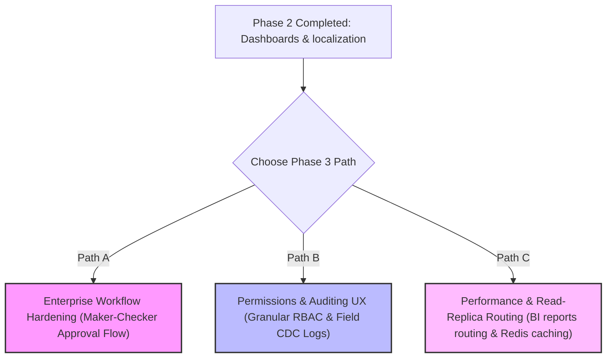

# 🗺️ تقرير التخطيط ومسارات المرحلة الثالثة (Phase 3 SCAN & PLAN)
## نظام Nama Invest ERP الموحد

تم إعداد هذا التقرير بعد استطلاع دقيق وقراءة متأنية لهيكلية المجلدات، وسجل الالتزامات المستقر للفرع الرئيسي، وبنية قاعدة البيانات وملفات الـ AI Brain. يهدف التقرير لتحديد خيارات المسارات المستقبلية وتوفير توصية واضحة ونطاق صارم للمرحلة الثالثة (Phase 3).

---

## 1. فحص المستودع وحالة التغييرات الحالية (Git Audit Trail)

* **آخر التزام مستقر ومرفوع (Commit Hash):**
  `7d79c112 fix(ui): polish treasury and inventory dashboard localization`
* **حالة الـ Git status:** نظيفة تماماً ومطابقة للمستودع البعيد (`Everything up-to-date` / `Clean working tree`).
* **نتائج التحقق الفني:** نجاح كامل لجميع فحوصات `Typecheck` و `Prisma validate` و `Production Build` بنسبة 100% وبكود خروج `0`.

---

## 2. النطاق المنطقي المقترح للمرحلة الثالثة (Phase 3 Scope)

بعد الانتهاء التام من بناء لوحات التحكم الفنية ولوحات مراقبة المبيعات والمشتريات وتذاكر الدعم والإنتاج وجلسات POS، وتوطين الواجهات وعولمتها بالكامل، انتقل النظام من مرحلة "بناء الواجهات التفاعلية" إلى مرحلة "التمكين المؤسسي وتأمين البيانات وتوسيع نطاق الأمان والتحكم".

نقترح **3 مسارات استراتيجية** للمرحلة الثالثة تفصل كالتالي:

---

## 3. مسارات المرحلة الثالثة المقترحة بالتفصيل (Proposed Paths)

### 🎯 المسار (أ): تقوية مسارات العمل والاعتمادات المؤسسية (Enterprise Approval & Workflow Hardening)
* **الهدف:** الانتقال بالنظام من مرحلة الحفظ الفوري إلى مرحلة الحوكمة الرقابية المزدوجة (Maker-Checker Principle). تطبيق شروط اعتماد معقدة للمعاملات ذات القيم العالية (أوامر الشراء، قيود اليومية اليدوية الضخمة، مسيرات الرواتب) بحيث لا ترحل مالياً إلا بعد موافقة سلسلة الاعتمادات المعتمدة.
* **الدومينات والملفات المتوقع لمسها:**
  - `src/app/api/approvals/...` (خوادم منطق الاعتمادات)
  - `src/lib/financials/runFinancialTx.ts` (حقن شروط فحص حالة الاعتماد قبل ترحيل القيود)
  - `src/app/(dashboard)/settings/approvals/page.tsx` (شاشة تهيئة سلاسل الاعتماد)
* **مستوى المخاطر:** **متوسط - مرتفع (Medium-High)**. يتطلب حذراً شديداً لعدم إدخال أي "طرق مسدودة" (Deadlocks) تعطل العمليات المالية والقيود المحاسبية للمستأجرين.
* **هل يحتاج تعديل منطق الأعمال (Business Logic)؟** نعم، بكثافة عالية (التحقق من حالة الموافقة قبل إطلاق العمليات الترحيلية).
* **هل يحتاج تعديل Prisma Schema؟** نعم (لإضافة جداول `ApprovalWorkflow`, `ApprovalStep`, `ApprovalRequest`).
* **أوامر التحقق المطلوبة:** 
  `npm run test:financial`, `npm run typecheck`, `npm run build`

---

### 🛡️ المسار (ب): الصلاحيات والتدقيق والرقابة الميدانية (Permissions, RBAC & Granular Audit UX)
* **الهدف:** تعزيز امتثال النظام لمعايير المؤسسات الكبرى عبر بناء نظام صلاحيات حاد ودقيق يصل لمستوى الحقول (Field-Level Permissions) كحظر رؤية حقول الرواتب للموظفين العاديين، مع تفعيل سجل التغييرات التاريخية التفصيلي للحقول (Field CDC Audit Trail) لمعرفة القيمة القديمة والقيمة الجديدة لكل حقل ومن قام بتغييرها.
* **الدومينات والملفات المتوقع لمسها:**
  - `src/middleware.ts` (تطوير رقابة الوصول والـ RBAC)
  - `src/app/api/admin/audit-logs/...` (مسارات استبيان سجلات التغيير)
  - `src/components/AuditTrail.tsx` (واجهة عرض سجل تتبع الحقول)
* **مستوى المخاطر:** **منخفض - متوسط (Low-Medium)**. أغلب التعديلات إضافية وتشغيلية ولا تؤثر في صحة العمليات المالية الخلفية، مما يجعلها مساراً آمناً جداً.
* **هل يحتاج تعديل منطق الأعمال (Business Logic)؟** نعم، ولكن بشكل خارجي (تنقية مخرجات الـ API بناءً على صلاحيات المستخدم، وتسجيل أحداث التغيير).
* **هل يحتاج تعديل Prisma Schema؟** نعم بشكل بسيط جداً أو استخدام جداول التدقيق الحالية دون تغيير البنية المالي الأساسية.
* **أوامر التحقق المطلوبة:**
  `npm run typecheck`, `npm run test:integration`, `npm run build`

---

### ⚡ المسار (ج): رفع الكفاءة والسرعة وفصل العمليات الثقيلة (Performance Optimization & Read-Replica Routing)
* **الهدف:** حماية قاعدة البيانات الأساسية (OLTP) من الانهيار تحت ضغط التقارير والاستعلامات التحليلية الكبرى، عبر توجيه كافة استدعاءات التقارير `/api/reports/**` إلى سيرفر قاعدة بيانات للقراءة فقط (Read-Replica Router)، بالتوازي مع تفعيل كاش الخبير (Redis Caching) لإعدادات المستأجرين والتسعير ومعدلات الضرائب لتحقيق سرعة استجابة فائقة تحت 10ms.
* **الدومينات والملفات المتوقع لمسها:**
  - `src/lib/db.ts` / `src/lib/prisma.ts` (لإضافة موجه الاتصالات الذكي).
  - `src/app/api/reports/**` (تعديل استعلامات التقارير الثقيلة).
  - `src/lib/cache/redis.ts` (إعداد منطق الكاش وفك الكاش الفوري عند التعديل).
* **مستوى المخاطر:** **مرتفع (High)**. أي تأخر في تزامن قاعدة البيانات الاحتياطية (Replication Lag) قد يعرض العميل لبيانات قديمة للحظات، ويحتاج معمارية ذكية تضمن قراءة العميل لبياناته المكتوبة فوراً (Read-Your-Own-Writes).
* **هل يحتاج تعديل منطق الأعمال (Business Logic)؟** نعم (منطق إعداد واستبعاد كاش Redis وتوجيه مسارات الاتصال).
* **هل يحتاج تعديل Prisma Schema؟** لا نهائياً.
* **أوامر التحقق المطلوبة:**
  `npm run typecheck`, `npm run build`, `npm run test:integration`

---

## 4. التوصية الاستراتيجية النهائية (Strategic Recommendation)

> [!IMPORTANT]
> **التوصية الحاسمة:** البدء الفوري بـ **المسار (ب) الصلاحيات والتدقيق والرقابة الميدانية (Permissions, RBAC & Granular Audit UX)** كخطوة أولى في المرحلة الثالثة.
> 
> **الأسباب والدوافع الفنية:**
> 1. **الآثار الأمنية المباشرة:** نحن نعمل في نظام ERP متعدد المستأجرين (Multi-tenant) فائق الحساسية، والتحقق البصري المتقدم في الأقسام السابقة يبرز أهمية حجب بعض الحقول والمؤشرات التحليلية الحرجة (مثل أرباح الشركات شريكة العمل والرواتب والملاءة النقدية بالخزينة) عن صغار الموظفين والكاشيرات، وتخصيصها للإداريين فقط.
> 2. **مستوى الأمان التشغيلي العالي (Low-Risk - High Value):** هذا المسار لا يمس صلب منطق الترحيل المحاسبي أو الضريبي الفعلي، مما يجعله آمناً تماماً وبمنأى عن التسبب في أي تراجع تشغيلي مالي أو محاسبي، ولكنه في المقابل يضفي حماية ورقابة حديدية على النظام.
> 3. **استكمال تجربة الـ Visual QA المتميزة:** يتلاقى هذا التوجه بشكل ممتاز مع متطلبات الرقابة الميدانية والتدقيق الداخلي (Audit Trail) للمنشآت المتوسطة والكبيرة وهي الفئة المستهدفة لمنصة Nama Invest ERP.

---
**تاريخ التوثيق الفني للتخطيط:** 2026-05-27  
**الفريق الأمني والتقني للتخطيط:** Nama Invest AI-Architecture & Governance Board
