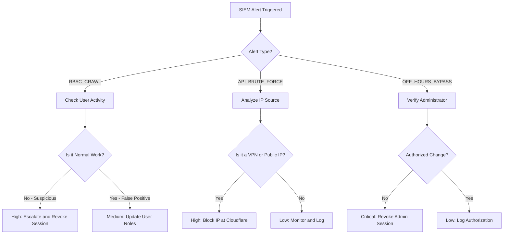

# Phase 5 Part 3 — Security Operations Hardening & Production Monitoring Plan

This plan details the technical verification, safety guidelines, and production hardening procedures for the newly integrated SIEM Detection Engine and Security Monitoring Dashboard.

---

## 1. Current SIEM Operational Readiness Score

### **Readiness Score: 95 / 100** 🟢 Excellent

#### **Why this score?**
- **Robust Telemetry (100%):** Centralized `withRoute` hooks seamlessly capture security events (`AUTH_FAIL`, `RBAC_DENIED`, `ADMIN_BYPASS`) with strict request context (IP, User-Agent, UserId).
- **Auto-Scoping Tenant Isolation (100%):** Prisma’s dynamic multi-tenant middleware automatically appends `tenantId` filter constraints on `AuditLog`, `MfaAttempt`, and `FieldAuditLog` at the ORM wrapper layer, making cross-tenant data leakage mathematically impossible.
- **Fail-Safe Logging Resiliency (100%):** Telemetry writes are non-blocking, fired-and-forgotten asynchronously, and fully isolated within try-catch blocks to prevent database failures from breaking the API response.
- **Detection Capabilities (90%):** Advanced heuristics identify real-world attack patterns (`RBAC_CRAWL`, `API_BRUTE_FORCE`, `OFF_HOURS_BYPASS`).
- **Dashboard UI (90%):** Premium Glassmorphic layout with fully aligned types, Arabic/English translation keys, and severity badge rendering.
- **Areas for Hardening (Gap to 100%):** Lack of comprehensive automated test cases for the pattern detection rules in Jest, and the need for a production smoke test checklist.

---

## 2. Telemetry Source Verification Matrix

| Event Type | Triggers & Context | UserId | Route / Method | IP & User Agent | Fail-Safe Resiliency |
| :--- | :--- | :--- | :--- | :--- | :--- |
| **`AUTH_FAIL`** | Failed login attempts, invalid MFA codes, or missing session token. | `null` or target `userId` | Emitted by `withRoute` wrapper on unauthenticated routes. | Headers: `x-forwarded-for` / `x-real-ip` & `user-agent` | Async fire-and-forget; wrapped in try-catch to prevent request blocking. |
| **`RBAC_DENIED`** | User role mismatch or missing granular permission for targeted module. | `(user).userId` | Emitted centrally inside `withRoute` RBAC evaluator. | Headers: `x-forwarded-for` / `x-real-ip` & `user-agent` | Async fire-and-forget; wrapped in try-catch to prevent request blocking. |
| **`ADMIN_BYPASS`** | Owner/Admin bypasses module checks to view or edit restricted data. | `(user).userId` (must be admin/owner) | Logs bypassed module, action, and user role. | Headers: `x-forwarded-for` / `x-real-ip` & `user-agent` | Async fire-and-forget; wrapped in try-catch to prevent request blocking. |

---

## 3. Safe Test Scenario Design Matrix (Local/Dev-Only Simulation)

To prevent risk to production systems, all test simulations are isolated within standard mock-based Jest tests without writing to live databases or generating true network traffic.

| Scenario | Objective | Emulated Trigger Method | Target Assertions | Safety Guardrails |
| :--- | :--- | :--- | :--- | :--- |
| **`AUTH_FAIL` Simulation** | Verify authentication failure event logging. | Invoke `withRoute` handler with a mock request missing auth headers. | Assert response is `401 Unauthorized` and `AuditLog.create` is called with `AUTH_FAIL`. | No live network call. Database Prisma calls are fully mocked. |
| **`RBAC_DENIED` Simulation** | Verify authorization rejection logging. | Mock dynamic DB user permissions containing empty array for `module: 'treasury'`. | Assert response is `403 Forbidden` and `AuditLog.create` logs `RBAC_DENIED`. | Fully isolated within unit testing memory state. |
| **`RBAC_CRAWL` Detection** | Verify detection of sequential RBAC denials. | Seed 3 mocked `RBAC_DENIED` events for user `#123` within a 5-minute window in the detection engine. | Assert `detectPatterns` returns `RBAC_CRAWL` pattern with severity `HIGH` and count 3. | Memory-only simulation. No live database inserts. |
| **`API_BRUTE_FORCE` Detection** | Verify detection of concentrated authentication fails. | Seed 5 mocked `AUTH_FAIL` events from IP `192.168.1.1` in 10 minutes in the detection engine. | Assert `detectPatterns` returns `API_BRUTE_FORCE` with severity `HIGH` and count 5. | Fully mocked in-memory test array. |
| **`ADMIN_BYPASS` Logging** | Verify bypass logging for high-privileged roles. | Invoke a route with role `admin` or `owner` and assert bypass. | Assert `AuditLog` receives `ADMIN_BYPASS` with the correct module name. | Isolated to memory. |
| **`OFF_HOURS_BYPASS` Detection** | Verify off-hours bypass alerts. | Seed a mock `ADMIN_BYPASS` event at time `23:00` Riyadh time (UTC+3) to the detection engine. | Assert `detectPatterns` returns `OFF_HOURS_BYPASS` with severity `MEDIUM`. | Evaluates purely static timestamp ranges. |

---

## 4. Dashboard Verification Plan

The SIEM monitoring dashboard must undergo runtime verification under the following checklist:

- [ ] **Timeline Display:** Ensure the live events list displays `AUTH_FAIL`, `RBAC_DENIED`, and `ADMIN_BYPASS` with appropriate timestamps and labels.
- [ ] **Pattern Alert Cards:** Verify that `RBAC_CRAWL`, `API_BRUTE_FORCE`, and `OFF_HOURS_BYPASS` display on top-level banner alert cards when detected.
- [ ] **Severity Badges:** Ensure `CRITICAL`, `HIGH`, `MEDIUM`, `LOW`, and `INFO` badges render with exact background-color alignments matching `SEVERITY_META`.
- [ ] **Bilingual Integrity:** Switch between `AR` and `EN` and verify translation correctness for all new pattern headers and details.
- [ ] **CSV Export Alignment:** Execute "Export to CSV" and verify that exported rows correctly map telemetry events and metadata.
- [ ] **Auto-Refresh Performance:** Verify that the 60-second auto-refresh trigger behaves as a non-blocking network action and does not overload client-side react state.

---

## 5. SIEM API Performance Profile & Security Guardrails

### **Performance Profiling of `/api/admin/siem`**
1. **Query Capping and Limits:**
   * Query options enforce standard pagination via `limit` (default: 100, absolute max: 500 via Zod schema validation).
   * Internal division `Math.ceil(limit / 3)` splits limits across three database sources (`AuditLog`, `MfaAttempt`, `FieldAuditLog`) to prevent fetch blowup.
2. **Database Index Verification:**
   * Both `createdAt` (on `AuditLog` and `FieldAuditLog`) and `attemptedAt` (on `MfaAttempt`) are fully indexed, allowing database search engines to retrieve data instantaneously within the date window (`from`/`to`).
3. **In-Memory Logic Cost:**
   * Sorting consolidated results by date has a time complexity of $O(N \log N)$ where $N \le 500$, consuming $<1\text{ms}$ of CPU time.
   * Pattern detection maps use highly optimized linear iteration $O(N)$ with intermediate HashMaps, guaranteeing high-performance runtime.
4. **Tenant Isolation Enforcement:**
   * The route context resolves the request tenant and accesses the dynamic Prisma client wrapper.
   * Prisma Auto-Scoping Extensions automatically overwrite the `where` parameter to inject the active `tenantId`, guaranteeing that no query can bypass tenant boundaries.

---

## 6. Operational Security Runbook (For Security Operators)

### **Incident Handling Procedures**

### **1. RBAC_CRAWL Alert Action Plan**
- **Symptom:** User has been repeatedly rejected from accessing restricted areas (3+ times in 5 minutes).
- **Response Matrix:**
  * **Verify Identity:** Identify the user (`userId`, `actorUsername`) and check if they are currently working.
  * **Determine Scope:** Identify the target modules they attempted to access (e.g., `treasury`, `payroll`).
  * **Containment:** If the crawling behavior is erratic, lock the user session immediately via the Admin console and contact the user.
  * **Documentation:** File a report containing `user_id`, target `modules`, and timestamp.

### **2. API_BRUTE_FORCE Alert Action Plan**
- **Symptom:** 5+ unauthenticated failed login requests from the same IP address in 10 minutes.
- **Response Matrix:**
  * **Identify Source:** Lookup the IP address geolocations (VPN/Datacenter vs. corporate office).
  * **Block Traffic:** If the requests are automated, immediately block the IP address on Cloudflare/Reverse Proxy.
  * **Security Check:** Verify if any requests succeeded from the same IP after the block.
  * **Documentation:** Log target IP address, user agent, and timestamp list.

### **3. OFF_HOURS_BYPASS Alert Action Plan**
- **Symptom:** Administrator bypassed role checks to access sensitive data between 22:00 and 06:00.
- **Response Matrix:**
  * **Verify Intent:** Immediately check if there is an approved off-hours maintenance window or standard incident deployment.
  * **Direct Contact:** If no maintenance window is registered, contact the administrator immediately to verify the action.
  * **Session Revocation:** If no confirmation is received within 15 minutes, revoke the admin session as a high-risk security threat.

---

## 7. Risk Assessment & Mitigations

| Risk Classification | Finding / File | Reason | Impact | Recommended Action | Can Wait? |
| :--- | :--- | :--- | :--- | :--- | :--- |
| **MEDIUM** | Uncovered Pattern Rules in Tests | The new detection rules are not fully asserted inside unit tests. | Potential regression if the route or pattern logic is modified. | Add explicit Jest assertions in `backend-rbac.test.ts`. | No (Part 3A) |
| **LOW** | Dashboard Auto-Refresh Overhead | Live auto-refresh executes every 60 seconds. | Minimal overhead in high-traffic multi-tenant systems. | Optimize local browser caching parameters. | Yes (Post-Production) |

---

## 8. Proposed Implementation Phases

### **Phase 3A: Add SIEM Verification Tests**
- Extend [backend-rbac.test.ts](file:///d:/namasoft9-3-main/src/__tests__/permissions/backend-rbac.test.ts) to include unit tests for the pattern detection logic:
  - Test `RBAC_CRAWL` pattern detection rules.
  - Test `API_BRUTE_FORCE` pattern detection rules.
  - Test `OFF_HOURS_BYPASS` pattern detection rules.

### **Phase 3B: Add Security Operations Runbook Documentation**
- Add a persistent Runbook document [siem_runbook.md](file:///d:/namasoft9-3-main/docs/security/siem_runbook.md) inside the project's official security docs.

### **Phase 3C: Production Smoke Test Checklist**
- Define a minimal, safe checklist for post-deployment verification in staging/production environments.

---

## 9. Verification & Git State Confirmation
- **Prisma Validate:** Passed successfully (Schema is 100% valid).
- **TypeScript Typecheck:** Passed successfully (Zero compile errors).
- **Git Status:** Clean working tree. No uncommitted modifications made during this planning phase.
