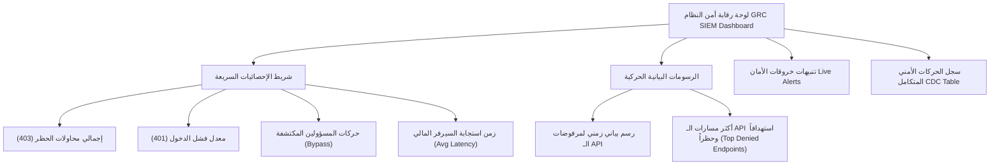

# خطة المراقبة التشغيلية ولوحة تدقيق الأمان (Phase 5 — Operational Monitoring & RBAC Audit Dashboard)

تهدف هذه الخطة إلى وضع تصور معماري متكامل لتأسيس طبقة مراقبة أمنية تشغيلية live لرصد وتحليل ومكافحة التهديدات ومحاولات الولوج غير المصرح بها (401/403)، وتتبع استخدام صلاحيات التخطي للمسؤولين (Admin/Owner Bypass) في نظام **Nama Invest ERP**.

---

## 1. قنوات تسجيل السجلات الحالية (Current Logging Capabilities)

بعد فحص الكود البرمجي للمشروع، تبين أن النظام يمتلك بنيتين أساسيتين للمراقبة والتدقيق:
1. **المسجل الهيكلي الموحد ([logger.ts](file:///d:/namasoft9-3-main/src/lib/logger.ts)):** مسجل متوافق مع مكتبة Pino يقوم بطباعة السجلات بصيغة JSON مهيكلة إلى الـ Standard Out، ويتم التقاطها تلقائياً وحفظها في خادم الإنتاج بواسطة PM2 ضمن مجلد السجلات المخصص لعمليات التشغيل (`~/.pm2/logs/`).
2. **نظام مراقبة الأمان والـ SIEM المركزي ([siem/route.ts](file:///d:/namasoft9-3-main/src/app/api/admin/siem/route.ts)):** معالج موحد يجمع أحداث الأمان من مصادر متعددة (`AuditLog`, `MfaAttempt`, `FieldAuditLog`) ويكتشف أنماط التهديد البرمجية مثل محاولات Brute Force، Privilege Escalation، Mass Export، و Off-Hours Access.

---

## 2. تحليل الفجوات الأمنية (Security Gap Analysis)

> [!WARNING]
> **الفجوة الأولى: عدم حفظ محاولات الولوج المرفوضة (401/403)**
> معالج الحماية المركزي `withRoute` يقوم بحظر طلبات الـ API غير المصرح بها مباشرة وإرجاع كود `401` أو `403` كاستجابة HTTP سريعة، **لكنه لا يقوم بكتابة أي سجل أمني أو إدراج حركة داخل جدول الـ `AuditLog` في قاعدة البيانات**، مما يجعل محاولات اختراق الـ APIs الحساسة غير مرئية تماماً للـ GRC Dashboard أو للـ SIEM.

> [!IMPORTANT]
> **الفجوة الثانية: تخطي المسؤولين دون أثر (Admin/Owner Bypass is Unlogged)**
> يمر الـ `admin` والـ `owner` من الفحوصات الأمنية الحركية (Module-level permissions) دون كتابة أي أثر أو سجل تدقيق، مما يحول دون إمكانية الكشف عن اختراق حسابات الإدارة العليا أو مراقبة التعديلات الحساسة التي يجريها المسؤولون.

---

## 3. الهيكلية البرمجية المقترحة للأحداث (Recommended Security Event Structure)

نقترح إدراج حركات أمنية مهيكلة داخل جدول `AuditLog` مباشرة عند الحظر، كالتالي:

### أ. حدث الرفض للمستخدم غير المصادق (401 Unauthorized)
```json
{
  "tenantId": "n11",
  "userId": null,
  "action": "AUTH_FAIL",
  "entityType": "SecurityEvent",
  "entityId": "AUTH_ANONYMOUS",
  "route": "/api/payroll",
  "metadata": {
    "ipAddress": "46.4.188.170",
    "userAgent": "Mozilla/5.0 ...",
    "reason": "Token missing or invalid",
    "method": "POST"
  }
}
```

### ب. حدث الرفض للمستخدم غير المصرح له (403 Forbidden)
```json
{
  "tenantId": "n11",
  "userId": 123,
  "action": "RBAC_DENIED",
  "entityType": "SecurityEvent",
  "entityId": "RBAC_VIOLATION",
  "route": "/api/treasury/cash-position",
  "metadata": {
    "requiredModule": "treasury",
    "requiredPermission": "view",
    "userRole": "cashier",
    "ipAddress": "46.4.188.170",
    "method": "GET"
  }
}
```

### ج. حدث تتبع تخطي الصلاحيات للمسؤول (Admin/Owner Bypass Log)
```json
{
  "tenantId": "n11",
  "userId": 999,
  "action": "ADMIN_BYPASS",
  "entityType": "SecurityEvent",
  "entityId": "BYPASS_VERIFIED",
  "route": "/api/settings/roles",
  "metadata": {
    "bypassedModule": "settings",
    "bypassedPermission": "edit",
    "userRole": "admin",
    "method": "POST"
  }
}
```

---

## 4. قواعد الكشف المقترحة للـ SIEM (Proposed SIEM Threat Detection Rules)

سنقوم بإدراج وتوسيع قواعد الكشف التلقائي في محرك الـ SIEM الحالي لرصد الأنماط التالية:
1. **الرصد المكثف لمرفوضات الـ RBAC (RBAC Denials Burst):** رصد حدوث 3 مرفوضات `RBAC_DENIED` لنفس المستخدم في أقل من 5 دقائق (مؤشر قوي على محاولة الزحف واكتشاف الثغرات).
2. **محاولات الاختراق من حسابات متعددة لنفس الـ IP (Mass IP Auth Failures):** رصد حدوث 5 محاولات `AUTH_FAIL` من نفس الـ IP لعناوين مستخدمين متعددين في أقل من 10 دقائق (مؤشر Brute force هجومي).
3. **تتبع نشاط المسؤولين خارج ساعات العمل (Off-Hours Admin Bypass):** إطلاق تنبيه من الدرجة الأولى (High) at رصد حدث `ADMIN_BYPASS` للمسؤولين بين الساعة 10 مساءً و 6 صباحاً.

---

## 5. تصميم لوحة رقابة الأمان والتدقيق (Dashboard Layout Mockup)

تصميم واجهة لوحة تحكم أمنية أفقية بريميوم بخصائص Visual Glassmorphic تعطي انطباعاً راقياً لمراقبة التدقيق الأمني في النظام:



### واجهة الـ UI المقترحة:
* **Visual Theme:** SLEEK DARK MODE (فحمي غامق، نيون أزرق لـ Info، فوشي لـ Critical، وزمردي لـ Safe).
* **Glassmorphism:** لوحات تحكم عائمة بتأثيرات شبه شفافة وحواف منحنية ناعمة ومحاطة بحدود نيون دقيقة جداً.
* **Timeline Feed:** تغذية فورية للمرفوضات الأمنية مع إمكانية الضغط السريع لمشاهدة تفاصيل الطلب وحظر عنوان الـ IP مباشرة بضغطة زر للمسؤول الأمني.

---

## 6. خطة التنفيذ المقسمة (Implementation Phases)

### المرحلة الأولى: توسيع الحماية في `withRoute` (Scan & Log)
تحديث معالج `withRoute` لإطلاق الأحداث الأمنية بشكل غير متزامن (`logAuditEvent` مع معالجة الأخطاء محلياً لتجنب حظر العمليات الحقيقية في حال فشل قاعدة البيانات) عند حدوث أي حظر أمني أو تجاوز صلاحية للمسؤولين.

### المرحلة الثانية: دمج التنبيهات في الـ SIEM (Alert Engine Integration)
تحديث معالج الأمان المركزي `/api/admin/siem` لتجميع أحداث `AUTH_FAIL` و `RBAC_DENIED` و `ADMIN_BYPASS` من جدول الـ AuditLog، وتشغيل قواعد الكشف الخمسة تلقائياً لإصدار التنبيهات الأمنية المصنفة.

### المرحلة الثالثة: تطوير واجهة لوحة تحكم الأمان (Dashboard Visual UI)
تطوير واجهة مستخدم أمنية متكاملة تحت الرابط `/admin/grc/security-siem` مدمجة بالكامل مع نظام الألوان الفخم، توفر للمسؤول الأمني والمالك رؤية كاملة لحركة البيانات وسجل محاولات الاختراق، مع خيارات تصفية دقيقة جداً.

---

## 7. حالة مستودع Git والتأكيد الأمني (Git Status & Safety Check)

### أ. حالة Git الحالية (`git status`):
```bash
?? tmp/phase-3-scan-plan.md
?? tmp/phase-5-rbac-operational-monitoring-plan.md
```
*(تم إنشاء ملف التخطيط الحالي بنجاح في مسار الـ `tmp` وهو مهمل ضمن قائمة التجاهل الخاصة بـ Git).*

### ب. إقرار السلامة البرمجية (Safety Confirmation):
* **تعديلات الكود البرمجي المنجزة:** **لا يوجد** (تم الالتزام بالكامل بالمسار المخطط له وقراءة الكود فقط دون إدخال أي تعديل).
* **حالة بيئة السيرفر الإنتاجية:** **مستقرة وتعمل بكامل كفاءتها** (لم يتم تشغيل أي أوامر تدميرية أو إعادة تشغيل لعمليات PM2).
